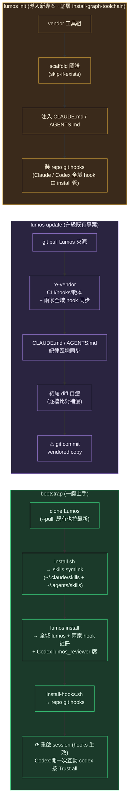
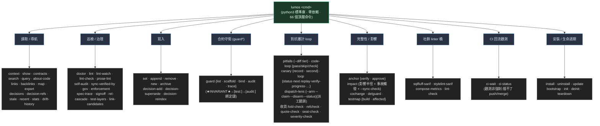
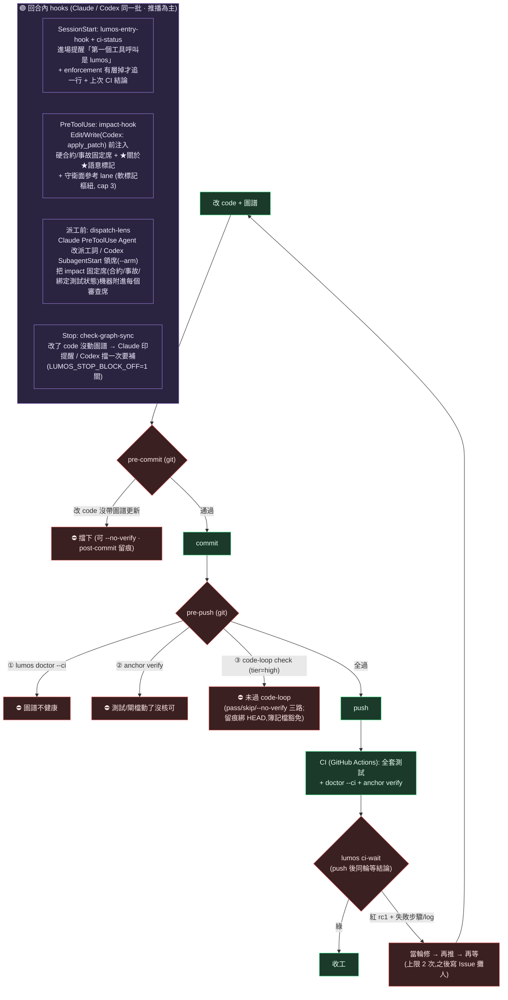

# Lumos 架構圖

> 「圖譜即合約」工具組的**唯一源 → 分發 → 消費端**模型:所有東西只在一個 repo 維護(唯一源),裝到兩種地方生效——整台機器共用的(給 AI 的操作手冊),和複製進每個專案的(指令與檢查程式)。一張圖看懂什麼住哪、用哪個指令裝、為什麼非這樣分不可。

## 1. 全景:唯一源 → 兩種 scope → 消費端

```mermaid
flowchart TB
    subgraph SRC["🟢 Lumos repo (唯一源 · 公開 EnzoHsieh-Android/Lumos · ~/harness/lumos-toolchain)"]
        direction TB
        CLI["scripts/lumos<br/>(python3 標準庫單檔 CLI)"]
        TEST["scripts/test_lumos.py"]
        GHOOKS["scripts/hooks/<br/>git: pre-commit / post-commit / pre-push"]
        CHOOKS["scripts/hooks/claude/<br/>SessionStart (進場提示 + enforcement 掉層才報 + CI 狀態) · 改檔前 (impact 波及注入) · 派工前 (dispatch-lens 鏡頭:合約/事故固定席附進審查席) · 收工 Stop (改了 code 沒動圖譜:Claude 提醒 / Codex 擋一次)<br/>同一批檔兩家共用,Codex 以 --harness codex 註冊;PostToolUse 腐化偵測 2026-08-21 撤除(空殼)"]
        INST["安裝器<br/>get.sh · get.ps1 · install.sh<br/>install-hooks.sh · install-graph-toolchain.sh · merge-claude-settings.py"]
        TPL["scripts/templates/graph-discipline.md<br/>(圖譜先行紀律範本)"]
        RENAME["scripts/graph-rename.sh · fetch-notesmd.sh<br/>(notesmd move 封印)"]
        SKILLS["skills/<br/>lumos-project-notes · core-knowledge<br/>design-loop · code-loop · pitfalls-gapfill"]
        GOV["governance/ + docs/.*-log.jsonl<br/>審計卷證 review-reports (席報告 / 凍結快照 / intake) · replay (判定閉包,週跑回放)<br/>anchor-baseline · eval/lens-utilization (鏡頭利用率重算)<br/>帳:canary-log(處置帳) · governance-log · ci-log · escape-log"]
        PROBE["scripts/scenario_probe.py<br/>(情境探針:量 Claude / Codex 會不會自己先敲 lumos;--runner codex · --stop-block)"]
    end

    subgraph USER["① user-scope (每台機器一份)"]
        direction TB
        USKILL["~/.claude/skills/* 與 ~/.agents/skills/*<br/>(symlink → Lumos repo;後者給 Codex 讀)"]
        UCHOOK["~/.claude/hooks/ + settings.json<br/>~/.codex/hooks/ + hooks.json<br/>(同一批 hook 腳本,兩家各一份註冊)"]
        UBIN["~/.local/bin/lumos<br/>(全域指令 symlink)"]
        UAGENT["$CODEX_HOME/agents/lumos_reviewer.toml<br/>(Codex 自訂審查席,0.153.2 起選得中)"]
    end

    subgraph PROJ["② project-scope (每個專案 vendor 一份)"]
        direction TB
        PCLI["scripts/lumos (vendored copy)"]
        PHOOK["scripts/hooks/ + core.hooksPath"]
        PCLAUDE["CLAUDE.md + AGENTS.md<br/>(同一 sentinel 紀律段,Claude / Codex 各一份)"]
        PCFG[".lumos/config.json · lint.json<br/>(選配:ci 區塊給 ci-wait、linter 宣告給 pitfalls)"]
        PGRAPH["docs/&lt;slug&gt;-knowledge/<br/>(圖譜資料 · 各專案自己的)"]
    end

    CONSUMER["消費端專案<br/>(你的專案 / MyApp 等)<br/>= vendored consumer"]

    SKILLS -. "install.sh (symlink)" .-> USKILL
    CHOOKS -. "install-hooks.sh --force" .-> UCHOOK
    CLI -. "lumos install" .-> UBIN
    CLI -. "lumos install (Codex 在場才寫)" .-> UAGENT

    CLI ==> |"install-graph-toolchain<br/>/ lumos update (vendor)"| PCLI
    GHOOKS ==> |vendor| PHOOK
    TPL ==> |"sentinel 注入"| PCLAUDE
    INST ==> |"scaffold (skip-if-exists)"| PGRAPH

    PCLI --- CONSUMER
    PHOOK --- CONSUMER
    PCLAUDE --- CONSUMER
    PGRAPH --- CONSUMER
    PCFG --- CONSUMER

    classDef src fill:#1b3a2a,stroke:#3ddc84,color:#e8fff0
    classDef user fill:#2a2440,stroke:#9a7bd6,color:#f0ecff
    classDef proj fill:#3a2a1b,stroke:#dcab3d,color:#fff5e0
    class SRC,CLI,TEST,GHOOKS,CHOOKS,INST,TPL,RENAME,SKILLS,GOV,PROBE src
    class USER,USKILL,UCHOOK,UBIN,UAGENT user
    class PROJ,PCLI,PHOOK,PCLAUDE,PCFG,PGRAPH,CONSUMER proj
```

**為什麼分兩種 scope(生效範圍)**:CI 只會抓你的專案 repo、git hook 也是一個 repo 一份——所以指令和檢查程式**必須複製進每個專案**(術語叫 vendor)。skills 是純方法論文件,整台機器用捷徑(symlink)共用一份就好,不複製——複製了反而各專案的副本會各自過期。

## 2. 安裝 / 生命週期指令做了什麼

```mermaid
flowchart LR
    subgraph BOOT["bootstrap (一鍵上手)"]
        direction TB
        B1["clone Lumos<br/>(--pull: 既有也拉最新)"] --> B2["install.sh<br/>→ skills symlink<br/>(~/.claude/skills + ~/.agents/skills)"]
        B2 --> B3["lumos install<br/>→ 全域 lumos + 兩家 hook 註冊<br/>+ Codex lumos_reviewer 席"]
        B3 --> B4["install-hooks.sh<br/>→ repo git hooks"]
        B4 --> B5["⟳ 重啟 session (hooks 生效)<br/>Codex:開一次互動 codex 按 Trust all"]
    end

    subgraph UPD["lumos update (升級既有專案)"]
        direction TB
        U1["git pull Lumos 來源"] --> U2["re-vendor<br/>CLI/hooks/範本<br/>+ 兩家全域 hook 同步"]
        U2 --> U3["CLAUDE.md / AGENTS.md<br/>紀律區塊同步"]
        U3 --> U4["結尾 diff 自癒<br/>(逐檔比對補漏)"]
        U4 --> U5["⚠ git commit<br/>vendored copy"]
    end

    subgraph NEW["lumos init (導入新專案 · 底層 install-graph-toolchain)"]
        direction TB
        N1["vendor 工具組"] --> N2["scaffold 圖譜<br/>(skip-if-exists)"]
        N2 --> N3["注入 CLAUDE.md / AGENTS.md"]
        N3 --> N4["裝 repo git hooks<br/>(Claude / Codex 全域 hook 由 install 管)"]
    end

    classDef boot fill:#1b3a2a,stroke:#3ddc84,color:#e8fff0
    classDef upd fill:#2a2440,stroke:#9a7bd6,color:#f0ecff
    classDef new fill:#3a2a1b,stroke:#dcab3d,color:#fff5e0
    class BOOT,B1,B2,B3,B4,B5 boot
    class UPD,U1,U2,U3,U4,U5 upd
    class NEW,N1,N2,N3,N4 new
```

## 3. CLI 子命令家族 (66 個頂層命令)

```mermaid
flowchart TB
    ROOT["lumos &lt;cmd&gt;<br/>(python3 標準庫 · 零依賴 · 66 個頂層命令)"]

    ROOT --> READ["讀取 / 導航"]
    ROOT --> HEALTH["巡檢 / 治理"]
    ROOT --> WRITE["寫入"]
    ROOT --> GUARD["合約守衛 (guard*)"]
    ROOT --> LOOP["對抗審計 loop"]
    ROOT --> INTEG["完整性 / 影響"]
    ROOT --> SARIF["社群 linter 橋"]
    ROOT --> CI["CI 回流觀測"]
    ROOT --> LIFE["安裝 / 生命週期"]

    READ --> R["context · show · contracts · search · query · about-code<br/>links · backlinks · map · export<br/>decisions · decision-refs · stale · recent · stats · drift-history"]
    HEALTH --> H["doctor · lint · lint-watch · lint-check · prose-lint<br/>self-audit · sync-verified-by · gov · enforcement<br/>spec-trace · signoff · rel-cascade · test-layers · link-candidates"]
    CI --> C["ci-wait · ci-status<br/>(觀測非強制:擋不了 push/merge)"]
    WRITE --> W["set · append · remove · new · archive<br/>decision-add · decision-supersede · decision-reindex"]
    GUARD --> G["guard {list · scaffold · bind · audit · trace}<br/>(★INVARIANT★→[test:]→[audit:] 綁定鏈)"]
    LOOP --> LP["pitfalls (--diff tier) · code-loop {pass/skip/check}<br/>canary {record · second} · loop {status·next·replay·verify-progress·…}<br/>dispatch-lens {--arm·--claim·--disarm·--status}(派工鏡頭)<br/>收貨:fold-check · refcheck · quote-check · seat-check · severity-check"]
    INTEG --> I["anchor {verify · approve}<br/>impact (影響半徑 + 事故觸發 + --sync-check)<br/>cochange · delguard · testmap {build · affected}"]
    SARIF --> ST["sqlfluff-sarif · stylelint-sarif<br/>compose-metrics · lint-check"]
    LIFE --> L["install · uninstall · update<br/>bootstrap · init · deinit · teardown"]

    classDef root fill:#1b3a2a,stroke:#3ddc84,color:#e8fff0
    classDef cat fill:#2a3142,stroke:#5a9bd6,color:#e0f0ff
    classDef leaf fill:#222,stroke:#666,color:#ddd
    class ROOT root
    class READ,HEALTH,WRITE,GUARD,LOOP,INTEG,SARIF,CI,LIFE cat
    class R,H,W,G,LP,I,ST,C,L leaf
```

> `guard`/`anchor`/`canary`/`loop`/`code-loop` 各帶子命令(如 `anchor verify`);上面共 66 個頂層命令,權威清單以 `lumos --help` 為準(**分類小計刻意不寫**:只有總數有機械守衛,寫了沒守的數字就是新漂移面)。

## 4. 強制力管線 (圖譜不腐爛的機制)

五段接力:「回合內推播 → 提交把關 → 推送硬閘 → CI → 結果拉回當輪修」。回合內,系統在四個時點主動推:進場提醒先查圖譜、改檔前把「你要改的檔會波及哪些筆記」推到眼前、派審查員前把牽連的合約/事故附進派工詞、收工時點名改了 code 沒動的筆記(Codex 側會擋一次);硬的關卡擋在提交與推送兩個點;推上去之後 `lumos ci-wait` 把雲端測試結論拉回同一輪工作裡修(這段要專案在 `.lumos/config.json` 宣告 `ci` 區塊才啟用)。

> ⚠ **第五段是觀測不是強制**:`ci-wait` 只負責把雲端結論拉回來讓你當輪修,**擋不了 push 也擋不了 merge**;查不到結果時一律放行不誤擋。要做到「紅燈進不了主幹」,得在 GitHub 開分支保護(required check)——那是平台設定,本工具不碰。前四段才是硬閘。

```mermaid
flowchart TB
    subgraph BEFORE["🟣 回合內 hooks (Claude / Codex 同一批 · 推播為主)"]
        ENTRY["SessionStart: lumos-entry-hook + ci-status<br/>進場提醒「第一個工具呼叫是 lumos」<br/>+ enforcement 有層掉才追一行 + 上次 CI 結論"]
        PRE["PreToolUse: impact-hook<br/>Edit/Write(Codex: apply_patch) 前注入<br/>硬合約/事故固定席 + ★關於★語意標記<br/>+ 守衛面參考 lane (軟標記樞紐, cap 3)"]
        LENS["派工前: dispatch-lens<br/>Claude PreToolUse Agent 改派工詞 / Codex SubagentStart 領席(--arm)<br/>把 impact 固定席(合約/事故/綁定測試狀態)機器附進每個審查席"]
        STOPH["Stop: check-graph-sync<br/>改了 code 沒動圖譜 → Claude 印提醒 / Codex 擋一次要補<br/>(LUMOS_STOP_BLOCK_OFF=1 關)"]
    end

    EDIT["改 code + 圖譜"] --> PC{"pre-commit (git)"}
    PC -->|"改 code 沒帶圖譜更新"| BLOCK["⛔ 擋下 (可 --no-verify · post-commit 留痕)"]
    PC -->|通過| COMMIT["commit"]

    COMMIT --> PUSH{"pre-push (git)"}
    PUSH -->|"① lumos doctor --ci"| PB1["⛔ 圖譜不健康"]
    PUSH -->|"② anchor verify"| PB2["⛔ 測試/閘檔動了沒核可"]
    PUSH -->|"③ code-loop check (tier=high)"| PB3["⛔ 未過 code-loop<br/>(pass/skip/--no-verify 三路;留痕綁 HEAD,簿記檔豁免)"]
    PUSH -->|全過| PASS["push"]
    PASS --> CI["CI (GitHub Actions): 全套測試<br/>+ doctor --ci + anchor verify"]
    CI --> WAIT{"lumos ci-wait<br/>(push 後同輪等結論)"}
    WAIT -->|綠| DONE["收工"]
    WAIT -->|"紅 rc1 + 失敗步驟/log"| FIX["當輪修 → 再推 → 再等<br/>(上限 2 次,之後寫 Issue 攤人)"]
    FIX --> EDIT

    classDef gate fill:#3a2020,stroke:#dc5b5b,color:#ffe8e8
    classDef ok fill:#1b3a2a,stroke:#3ddc84,color:#e8fff0
    classDef push fill:#2a2440,stroke:#9a7bd6,color:#f0ecff
    class PC,PUSH,BLOCK,PB1,PB2,PB3 gate
    class COMMIT,PASS,CI,EDIT,DONE ok
    class WAIT,FIX gate
    class BEFORE,ENTRY,PRE,LENS,STOPH push
```

> **地板不是萬能裁判**:動手前的推播可以被無視、git 關卡可以用 `--no-verify` 繞過(後果自負、會留痕)。這套機制守得住「忘了/隨手漏」,守不住「刻意繞+不誠實」——那一層永遠留給人。

## 5. 審計迴圈基建:圖譜 ⇄ loop 的良性循環

白話:上面四節講「怎麼裝、有哪些指令、哪裡會擋」,這一節講**為什麼審查會越審越準**。圖譜節點(合約、事故、決策、驗證)是每一輪審查的籌碼——派審查員時機器把相關節點附進派工詞,審查員不用自己找;審完折進設計的東西再寫回節點,變成下一輪的籌碼。節點是下一輪的**輸入**,不是產出物(Enzo 2026-08-25 裁定陳述,單源 `docs/lumos-toolchain-knowledge/Systems/開發工作流總覽.md`)。2026-08-26 到 09-05 落地的三塊基建把這句話從口號變成機械路徑:①**派工鏡頭注入**(dispatch-lens v1.0→v1.2:固定席逐條附、合約行帶綁定測試狀態、0 篇時附 code 層備援段;Claude 走 PreToolUse 改派工詞,Codex 走 SubagentStart 領席)②**收貨→處置→凍結**(quote/ref/seat 三道機械收貨、intake 守衛、處置閘、嚴重度綁定寫側硬擋、判定凍結與週跑回放)③**量得到**(鏡頭利用率 recount、逃逸帳、skill-doctor 成本基線、情境探針量紀律命中率)。Claude Code 與 Codex CLI 走同一條路(`Systems/codex-harness`)。

```mermaid
flowchart LR
    NODES["📚 圖譜節點<br/>合約 ★INVARIANT★ · 事故 · 決策 · 驗證<br/>(loop 的籌碼,也是 loop 的產出)"]
    NEXT["lumos loop next<br/>分級 · 輪次 · 席位編制<br/>首輪印「主題既有節點」(入口栓)"]
    LENS["派工鏡頭 dispatch-lens<br/>impact 固定席機器附進每席派工詞<br/>(合約行帶綁定測試狀態;0 篇→code 層備援段)<br/>Claude:改派工詞 / Codex:--arm 領席"]
    SEATS["審查席<br/>同門 sonnet ×N(各鏡頭 + 立場)<br/>+ 架構對齊 + 外家 Codex(finder / 否決)<br/>+ spec-conformance"]
    INTAKE["收貨三道 + intake 守衛<br/>quote-check(引句錨回凍結快照) · refcheck(file:line 存在)<br/>· seat-check(材料都碰了) · preflight-4 宣告行"]
    FOLD["折入真檔<br/>每條 finding 有去向:折掉 / 附理由放行<br/>fold-check · 鏡像核對 · 辯方 refute(Codex)"]
    LEDGER["記帳 canary record(處置帳)<br/>各席一筆 + 一筆 carrier 帶 findings/folded/accepted 集<br/>嚴重度綁定寫側硬擋 · --finding-kind 記在修什麼"]
    GATE{"處置閘 loop status --disposal<br/>全處置 ∧ 留痕可重算 ∧ 引句全錨<br/>(code 迴圈 ≥major 必折;roster 對帳只轉述)"}
    FREEZE["凍結 loop replay --freeze<br/>判定閉包 verdict.json<br/>週跑回放:規則改了,舊案會不會翻"]
    PASS["code-loop pass 留痕<br/>綁 HEAD sha(簿記檔豁免);pre-push / CI 認"]
    OBS["觀測帳<br/>gov 統計 · lens-utilization recount(鏡頭有沒被用)<br/>escape 逃逸帳 · skill-doctor 成本基線"]
    AUTO["自主迭代 loop(每日)<br/>選 gap → 設計 → 走同一條路 → 停在等人放行"]
    PROBE["情境探針 scenario_probe<br/>量「AI 會不會自己先敲 lumos」<br/>Claude / Codex 同題對照"]

    NODES --> NEXT --> LENS --> SEATS --> INTAKE --> FOLD --> LEDGER --> GATE
    GATE -->|"⛔ 沒過(上限 3 輪,到頂攤人)"| NEXT
    GATE -->|"✅ 過"| FREEZE --> PASS
    FOLD ==>|"Verification · decision-add · 合約候選"| NODES
    LEDGER --> OBS
    OBS -.->|"數字回頭改編制 / 鏡頭"| NEXT
    AUTO -.->|"用同一條路"| NEXT
    PROBE -.->|"驗紀律有沒有被吃進去"| NODES

    classDef gnode fill:#1b3a2a,stroke:#3ddc84,color:#e8fff0
    classDef loop fill:#2a2440,stroke:#9a7bd6,color:#f0ecff
    classDef gate fill:#3a2020,stroke:#dc5b5b,color:#ffe8e8
    classDef obs fill:#3a2a1b,stroke:#dcab3d,color:#fff5e0
    class NODES gnode
    class NEXT,LENS,SEATS,INTAKE,FOLD,LEDGER,FREEZE,PASS,AUTO loop
    class GATE gate
    class OBS,PROBE obs
```

> **天花板要講清楚**:這條路證的是「這份設計 / 這批改動在審查員眼裡沒有明顯漏洞,而且每個發現都有交代」,不證它正確;行為層正確性歸測試真跑綠、真機驗證與人拍板。鏡頭附上去了不等於被讀了(利用率 recount 就是量這個);Codex 的派工訊息 hook 讀不到、hook 要人按一次信任,是平台限制不是工具缺陷(見 `Systems/codex-harness`)。細節單源:設計審 `skills/lumos-design-loop`、代碼審 `skills/lumos-code-loop`、鏡頭 `Projects/派工鏡頭注入_計劃`、收斂記帳 `Systems/loop-convergence-recording`、處置閘 `Systems/convergence-evidence-gate`。

---

> **接手圖譜是空的舊專案?** 工具組附「節點還原」七步 SOP(從 code 和 git 把脈絡還原成節點,惰性生長不攤平)——白話版見 [README §6](README.md),操作全文在 `skills/lumos-project-notes` 的 reference。
