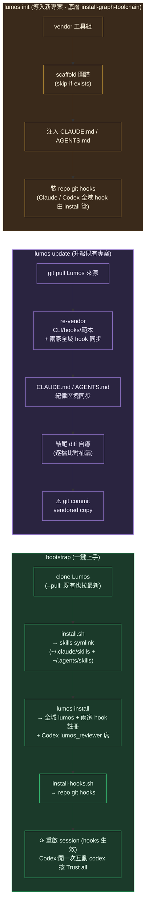
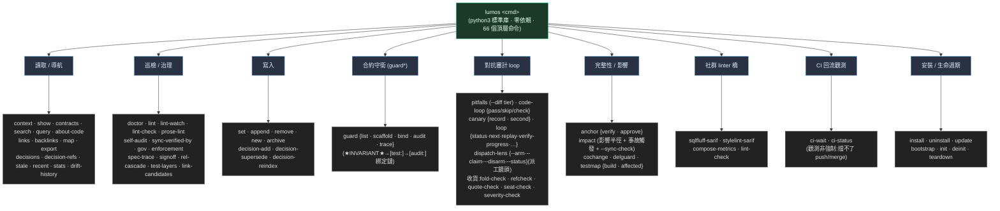
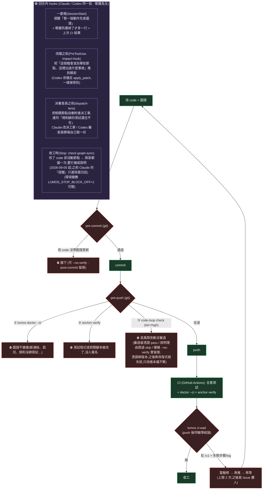
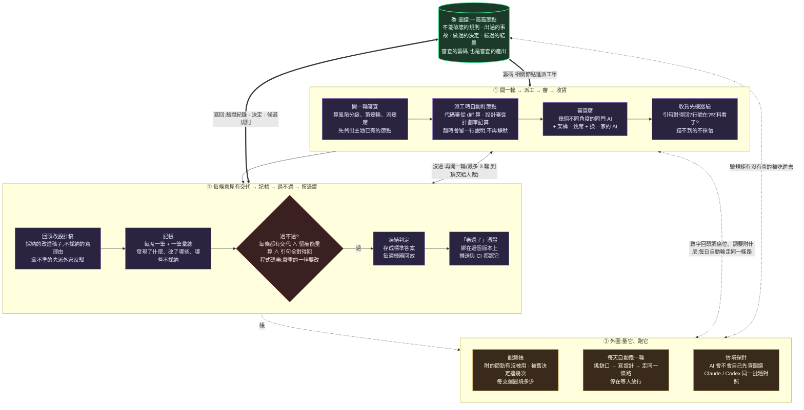

# Lumos 架構圖

> 「圖譜即合約」工具組的**唯一源 → 分發 → 消費端**模型:所有東西只在一個 repo 維護(唯一源),裝到兩種地方生效——整台機器共用的(給 AI 的操作手冊),和複製進每個專案的(指令與檢查程式)。一張圖看懂什麼住哪、用哪個指令裝、為什麼非這樣分不可。

## 1. 全景:唯一源 → 兩種 scope → 消費端

```mermaid
flowchart TB
    subgraph SRC["🟢 Lumos repo (唯一源 · 公開 EnzoHsieh-Android/Lumos · ~/harness/lumos-toolchain)"]
        direction TB
        CLI["scripts/lumos<br/>(python3 標準庫單檔 CLI)"]
        TEST["scripts/test_lumos.py"]
        GHOOKS["scripts/hooks/<br/>git: pre-commit / post-commit / pre-push"]
        CHOOKS["scripts/hooks/claude/<br/>四個時點的自動提醒:進場(先查圖譜、哪層防護掉了、上次 CI 結果) · 改檔前(這個檔會波及哪些節點) · 派審查員前(把相關節點附進派工單) · 收工(改了 code 沒動節點:兩家都擋一次要補)<br/>同一批檔兩家共用;改檔後的腐化偵測 2026-08-21 撤除"]
        INST["安裝器<br/>get.sh · get.ps1 · install.sh<br/>install-hooks.sh · install-graph-toolchain.sh · merge-claude-settings.py"]
        TPL["scripts/templates/graph-discipline.md<br/>(圖譜先行紀律範本)"]
        RENAME["scripts/graph-rename.sh · fetch-notesmd.sh<br/>(notesmd move 封印)"]
        SKILLS["skills/<br/>lumos-project-notes · core-knowledge<br/>design-loop · code-loop · pitfalls-gapfill"]
        GOV["governance/ + docs/.*-log.jsonl<br/>審查留下的證據:審查員報告、當時審的快照、凍結的判定(每週回放)<br/>驗證器的指紋基線 · 附給審查員的節點有沒被用到的重算<br/>帳本:每輪審查怎麼處置 · 治理事件 · CI 結果 · 被舊決定擋下的次數"]
        PROBE["scripts/scenario_probe.py<br/>(情境探針:給 AI 出題,量它會不會自己先查圖譜;Claude / Codex 都能測)"]
    end

    subgraph USER["① user-scope (每台機器一份)"]
        direction TB
        USKILL["~/.claude/skills/* 與 ~/.agents/skills/*<br/>(symlink → Lumos repo;後者給 Codex 讀)"]
        UCHOOK["~/.claude/hooks/ + settings.json<br/>~/.codex/hooks/ + hooks.json<br/>(同一批 hook 腳本,兩家各一份註冊)"]
        UBIN["~/.local/bin/lumos<br/>(全域指令 symlink)"]
        UAGENT["$CODEX_HOME/agents/lumos_reviewer.toml<br/>(給 Codex 用的「審查員」身分設定)"]
    end

    subgraph PROJ["② project-scope (每個專案 vendor 一份)"]
        direction TB
        PCLI["scripts/lumos (vendored copy)"]
        PHOOK["scripts/hooks/ + core.hooksPath"]
        PCLAUDE["CLAUDE.md + AGENTS.md<br/>(同一 sentinel 紀律段,Claude / Codex 各一份)"]
        PCFG[".lumos/config.json · lint.json<br/>(選配:告訴工具去哪看 CI 結果、專案用哪個 linter)"]
        PGRAPH["docs/&lt;slug&gt;-knowledge/<br/>(圖譜資料 · 各專案自己的)"]
    end

    CONSUMER["消費端專案<br/>(你的專案 / MyApp 等)<br/>= vendored consumer"]

    SKILLS -. "install.sh (symlink)" .-> USKILL
    CHOOKS -. "install-hooks.sh --force" .-> UCHOOK
    CLI -. "lumos install" .-> UBIN
    CLI -. "lumos install (Codex 在場才寫)" .-> UAGENT

    CLI ==> |"install-graph-toolchain<br/>/ lumos update (vendor)"| PCLI
    GHOOKS ==> |vendor| PHOOK
    TPL ==> |"sentinel 注入"| PCLAUDE
    INST ==> |"scaffold (skip-if-exists)"| PGRAPH

    PCLI --- CONSUMER
    PHOOK --- CONSUMER
    PCLAUDE --- CONSUMER
    PGRAPH --- CONSUMER
    PCFG --- CONSUMER

    classDef src fill:#1b3a2a,stroke:#3ddc84,color:#e8fff0
    classDef user fill:#2a2440,stroke:#9a7bd6,color:#f0ecff
    classDef proj fill:#3a2a1b,stroke:#dcab3d,color:#fff5e0
    class SRC,CLI,TEST,GHOOKS,CHOOKS,INST,TPL,RENAME,SKILLS,GOV,PROBE src
    class USER,USKILL,UCHOOK,UBIN,UAGENT user
    class PROJ,PCLI,PHOOK,PCLAUDE,PCFG,PGRAPH,CONSUMER proj
```

**為什麼分兩種 scope(生效範圍)**:CI 只會抓你的專案 repo、git hook 也是一個 repo 一份——所以指令和檢查程式**必須複製進每個專案**(術語叫 vendor)。skills 是純方法論文件,整台機器用捷徑(symlink)共用一份就好,不複製——複製了反而各專案的副本會各自過期。

## 2. 安裝 / 生命週期指令做了什麼

```mermaid
flowchart LR
    subgraph BOOT["bootstrap (一鍵上手)"]
        direction TB
        B1["clone Lumos<br/>(--pull: 既有也拉最新)"] --> B2["install.sh<br/>→ skills symlink<br/>(~/.claude/skills + ~/.agents/skills)"]
        B2 --> B3["lumos install<br/>→ 全域 lumos + 兩家 hook 註冊<br/>+ Codex lumos_reviewer 席"]
        B3 --> B4["install-hooks.sh<br/>→ repo git hooks"]
        B4 --> B5["⟳ 重啟 session (hooks 生效)<br/>Codex:開一次互動 codex 按 Trust all"]
    end

    subgraph UPD["lumos update (升級既有專案)"]
        direction TB
        U1["git pull Lumos 來源"] --> U2["re-vendor<br/>CLI/hooks/範本<br/>+ 兩家全域 hook 同步"]
        U2 --> U3["CLAUDE.md / AGENTS.md<br/>紀律區塊同步"]
        U3 --> U4["結尾 diff 自癒<br/>(逐檔比對補漏)"]
        U4 --> U5["⚠ git commit<br/>vendored copy"]
    end

    subgraph NEW["lumos init (導入新專案 · 底層 install-graph-toolchain)"]
        direction TB
        N1["vendor 工具組"] --> N2["scaffold 圖譜<br/>(skip-if-exists)"]
        N2 --> N3["注入 CLAUDE.md / AGENTS.md"]
        N3 --> N4["裝 repo git hooks<br/>(Claude / Codex 全域 hook 由 install 管)"]
    end

    classDef boot fill:#1b3a2a,stroke:#3ddc84,color:#e8fff0
    classDef upd fill:#2a2440,stroke:#9a7bd6,color:#f0ecff
    classDef new fill:#3a2a1b,stroke:#dcab3d,color:#fff5e0
    class BOOT,B1,B2,B3,B4,B5 boot
    class UPD,U1,U2,U3,U4,U5 upd
    class NEW,N1,N2,N3,N4 new
```

## 3. CLI 子命令家族 (66 個頂層命令)

```mermaid
flowchart TB
    ROOT["lumos &lt;cmd&gt;<br/>(python3 標準庫 · 零依賴 · 66 個頂層命令)"]

    ROOT --> READ["讀取 / 導航"]
    ROOT --> HEALTH["巡檢 / 治理"]
    ROOT --> WRITE["寫入"]
    ROOT --> GUARD["合約守衛 (guard*)"]
    ROOT --> LOOP["對抗審計 loop"]
    ROOT --> INTEG["完整性 / 影響"]
    ROOT --> SARIF["社群 linter 橋"]
    ROOT --> CI["CI 回流觀測"]
    ROOT --> LIFE["安裝 / 生命週期"]

    READ --> R["context · show · contracts · search · query · about-code<br/>links · backlinks · map · export<br/>decisions · decision-refs · stale · recent · stats · drift-history"]
    HEALTH --> H["doctor · lint · lint-watch · lint-check · prose-lint<br/>self-audit · sync-verified-by · gov · enforcement<br/>spec-trace · signoff · rel-cascade · test-layers · link-candidates"]
    CI --> C["ci-wait · ci-status<br/>(觀測非強制:擋不了 push/merge)"]
    WRITE --> W["set · append · remove · new · archive<br/>decision-add · decision-supersede · decision-reindex"]
    GUARD --> G["guard {list · scaffold · bind · audit · trace}<br/>(★INVARIANT★→[test:]→[audit:] 綁定鏈)"]
    LOOP --> LP["pitfalls (--diff tier) · code-loop {pass/skip/check}<br/>canary {record · second} · loop {status·next·replay·verify-progress·…}<br/>dispatch-lens {--arm·--claim·--disarm·--status}(派工鏡頭)<br/>收貨:fold-check · refcheck · quote-check · seat-check · severity-check"]
    INTEG --> I["anchor {verify · approve}<br/>impact (影響半徑 + 事故觸發 + --sync-check)<br/>cochange · delguard · testmap {build · affected}"]
    SARIF --> ST["sqlfluff-sarif · stylelint-sarif<br/>compose-metrics · lint-check"]
    LIFE --> L["install · uninstall · update<br/>bootstrap · init · deinit · teardown"]

    classDef root fill:#1b3a2a,stroke:#3ddc84,color:#e8fff0
    classDef cat fill:#2a3142,stroke:#5a9bd6,color:#e0f0ff
    classDef leaf fill:#222,stroke:#666,color:#ddd
    class ROOT root
    class READ,HEALTH,WRITE,GUARD,LOOP,INTEG,SARIF,CI,LIFE cat
    class R,H,W,G,LP,I,ST,C,L leaf
```

> `guard`/`anchor`/`canary`/`loop`/`code-loop` 各帶子命令(如 `anchor verify`);上面共 66 個頂層命令,權威清單以 `lumos --help` 為準(**分類小計刻意不寫**:只有總數有機械守衛,寫了沒守的數字就是新漂移面)。

## 4. 強制力管線 (圖譜不腐爛的機制)

五段接力:「回合內推播 → 提交把關 → 推送硬閘 → CI → 結果拉回當輪修」。回合內,系統在四個時點主動推:進場提醒先查圖譜、改檔前把「你要改的檔會波及哪些筆記」推到眼前、派審查員前把牽連的合約/事故附進派工詞、收工時點名改了 code 沒動的筆記(Codex 側會擋一次);硬的關卡擋在提交與推送兩個點;推上去之後 `lumos ci-wait` 把雲端測試結論拉回同一輪工作裡修(這段要專案在 `.lumos/config.json` 宣告 `ci` 區塊才啟用)。

> ⚠ **第五段是觀測不是強制**:`ci-wait` 只負責把雲端結論拉回來讓你當輪修,**擋不了 push 也擋不了 merge**;查不到結果時一律放行不誤擋。要做到「紅燈進不了主幹」,得在 GitHub 開分支保護(required check)——那是平台設定,本工具不碰。前四段才是硬閘。

```mermaid
flowchart TB
    subgraph BEFORE["🟣 回合內 hooks (Claude / Codex 同一批 · 推播為主)"]
        ENTRY["一進場(SessionStart)<br/>提醒「第一個動作先查圖譜」<br/>+ 哪層防護掉了才多一行 + 上次 CI 結果"]
        PRE["改檔之前(PreToolUse: impact-hook)<br/>把「這個檔會波及哪些節點、這裡出過什麼事故」推到眼前<br/>(Codex 改檔走 apply_patch,一樣接得到)"]
        LENS["派審查員之前(dispatch-lens)<br/>把相關節點自動附進派工單,連同「規則綁的測試還在不在」<br/>Claude:改派工單 / Codex:審查員開場自己領一份"]
        STOPH["收工時(Stop: check-graph-sync)<br/>改了 code 卻沒動節點 → 兩家都擋一次,要它補或說明<br/>(2026-09-05 起;之前 Claude 的『提醒』只進除錯日誌)<br/>(環境變數 LUMOS_STOP_BLOCK_OFF=1 可關)"]
    end

    EDIT["改 code + 圖譜"] --> PC{"pre-commit (git)"}
    PC -->|"改 code 沒帶圖譜更新"| BLOCK["⛔ 擋下 (可 --no-verify · post-commit 留痕)"]
    PC -->|通過| COMMIT["commit"]

    COMMIT --> PUSH{"pre-push (git)"}
    PUSH -->|"① lumos doctor --ci"| PB1["⛔ 圖譜不健康(斷連結、孤兒、規則沒綁測試…)"]
    PUSH -->|"② anchor verify"| PB2["⛔ 測試程式或把關腳本被改了,沒人簽名"]
    PUSH -->|"③ code-loop check (tier=high)"| PB3["⛔ 高風險改動沒審過<br/>(審過留憑證 pass / 說明理由跳過 skip / 硬繞 --no-verify 會留痕;<br/>憑證綁版本,之後再改程式就失效,只改帳本檔不算)"]
    PUSH -->|全過| PASS["push"]
    PASS --> CI["CI (GitHub Actions): 全套測試<br/>+ doctor --ci + anchor verify"]
    CI --> WAIT{"lumos ci-wait<br/>(push 後同輪等結論)"}
    WAIT -->|綠| DONE["收工"]
    WAIT -->|"紅 rc1 + 失敗步驟/log"| FIX["當輪修 → 再推 → 再等<br/>(上限 2 次,之後寫 Issue 攤人)"]
    FIX --> EDIT

    classDef gate fill:#3a2020,stroke:#dc5b5b,color:#ffe8e8
    classDef ok fill:#1b3a2a,stroke:#3ddc84,color:#e8fff0
    classDef push fill:#2a2440,stroke:#9a7bd6,color:#f0ecff
    class PC,PUSH,BLOCK,PB1,PB2,PB3 gate
    class COMMIT,PASS,CI,EDIT,DONE ok
    class WAIT,FIX gate
    class BEFORE,ENTRY,PRE,LENS,STOPH push
```

> **地板不是萬能裁判**:動手前的推播可以被無視、git 關卡可以用 `--no-verify` 繞過(後果自負、會留痕)。這套機制守得住「忘了/隨手漏」,守不住「刻意繞+不誠實」——那一層永遠留給人。

## 5. 審查怎麼越審越準:圖譜 ⇄ 審查的良性循環

白話:前四節講「怎麼裝、有哪些指令、哪裡會擋」,這一節講**為什麼審查會越審越準**。圖譜裡的每篇節點(不能破壞的規則、出過的事故、做過的決定、驗過的結果)是每一輪審查的籌碼:派審查員的那一刻,機器把跟這次改動有關的節點附進派工單,審查員不用自己翻、也翻不漏;審完採納進設計的東西再寫回節點,變成下一輪的籌碼。**節點是下一輪的輸入,不是最後的產出物**(Enzo 2026-08-25 裁定;單源 `docs/lumos-toolchain-knowledge/Systems/開發工作流總覽.md`)。

2026-08-26 到 09-05 落地的三塊東西,把這句話從口號變成真的有東西在跑:

- **派工時自動附節點**(機制名 dispatch-lens):把跟這次改動直接相關、帶規則或出過事故的節點,連同「這條規則綁的測試現在還在不在」,一起附進每個審查員的派工單。Claude Code 是在派人那一刻改派工單;Codex CLI 讀不到派工單,改成審查員一開場自己領一份。
- **收貨要驗、每條意見要有去向、判定要凍結**:審查員交回來的每條意見,先機器驗三件事——引的句子對得回原文嗎、講的行號存在嗎、該看的材料看了嗎——錨不到的不採信。每條意見要嘛採納、回頭改設計稿,要嘛寫下理由不採納;一輪裡每條都有交代才算過關。過關的判定凍結成標準答案,每週機器回放,規則改了看舊案會不會翻。
- **量得到**:附上去的節點有沒有真的被審查員用到(利用率重算)、迴圈中被舊決定擋下幾次(逃逸帳)、每支迴圈燒多少(skill-doctor 成本基線)、AI 會不會自己先查圖譜(情境探針)。

Claude Code 與 Codex CLI 走同一條路(細節與平台限制:`docs/lumos-toolchain-knowledge/Systems/codex-harness.md`)。

```mermaid
flowchart TB
    NODES[("📚 圖譜:一篇篇節點<br/>不能破壞的規則 · 出過的事故 · 做過的決定 · 驗過的結果<br/>審查的籌碼,也是審查的產出")]

    subgraph R1["① 開一輪 → 派工 → 審 → 收貨"]
        direction LR
        NEXT["開一輪審查<br/>算風險分級、第幾輪、派幾席<br/>先列出主題已有的節點"] --> LENS["派工時自動附節點<br/>代碼審從 diff 算 · 設計審從計劃筆記算<br/>超時會留一行說明,不再靜默"] --> SEATS["審查席<br/>幾個不同角度的同門 AI<br/>+ 架構一致席 + 換一家的 AI"] --> INTAKE["收貨先機器驗<br/>引句對得回?行號在?材料看了?<br/>錨不到的不採信"]
    end

    subgraph R2["② 每條意見有交代 → 記帳 → 過不過 → 留憑證"]
        direction LR
        FOLD["回頭改設計稿<br/>採納的改進稿子,不採納的寫理由<br/>拿不準的先派外家反駁"] --> LEDGER["記帳<br/>每席一筆 + 一筆彙總<br/>發現了什麼、改了哪些、哪些不採納"] --> GATE{"過不過?<br/>每條都有交代 ∧ 留痕能重算 ∧ 引句全對得回<br/>程式碼審:嚴重的一律要改"} -->|過| FREEZE["凍結判定<br/>存成標準答案<br/>每週機器回放"] --> PASS["「審過了」憑證<br/>綁在這個版本上<br/>推送與 CI 都認它"]
    end

    subgraph R3["③ 外圍:量它、跑它"]
        direction LR
        OBS["觀測帳<br/>附的節點有沒被用 · 被舊決定擋幾次<br/>每支迴圈燒多少"] ~~~ AUTO["每天自動跑一輪<br/>挑缺口 → 寫設計 → 走同一條路<br/>停在等人放行"] ~~~ PROBE["情境探針<br/>AI 會不會自己先查圖譜<br/>Claude / Codex 同一批題對照"]
    end

    NODES ==>|"籌碼:相關節點進派工單"| R1
    R1 --> R2
    R2 -.->|"帳"| R3
    NODES <==>|"寫回:驗證紀錄 · 決定 · 候選規則"| R2
    R1 <-->|"沒過:再開一輪(最多 3 輪,到頂交給人裁)"| R2
    R1 <-.->|"數字回頭調席位、調要附什麼;每日自動輪走同一條路"| R3
    NODES <-.->|"驗規矩有沒有真的被吃進去"| R3

    classDef gnode fill:#1b3a2a,stroke:#3ddc84,stroke-width:2px,color:#e8fff0
    classDef step fill:#2a2440,stroke:#9a7bd6,color:#f0ecff
    classDef gate fill:#3a2020,stroke:#dc5b5b,color:#ffe8e8
    classDef obs fill:#3a2a1b,stroke:#dcab3d,color:#fff5e0
    class NODES gnode
    class NEXT,LENS,SEATS,INTAKE,FOLD,LEDGER,FREEZE,PASS step
    class GATE gate
    class OBS,AUTO,PROBE obs
```

> **天花板要講清楚**:這條路證明的是「在審查員眼裡沒有明顯漏洞,而且每條意見都有交代」,不證明設計或程式是對的;對不對要靠測試真的跑綠、真機驗證、最後由人拍板。節點附上去了不等於被讀了(利用率重算就是在量這個)。Codex 的派工單 hook 讀不到、hook 要人按一次信任,是平台的限制不是工具的缺陷。細節單源:設計審 `skills/lumos-design-loop`、程式碼審 `skills/lumos-code-loop`、派工附節點 `docs/lumos-toolchain-knowledge/Projects/派工鏡頭注入_計劃.md`、記帳與過不過 `docs/lumos-toolchain-knowledge/Systems/loop-convergence-recording.md`、`docs/lumos-toolchain-knowledge/Systems/convergence-evidence-gate.md`。

---

> **接手圖譜是空的舊專案?** 工具組附「節點還原」七步 SOP(從 code 和 git 把脈絡還原成節點,惰性生長不攤平)——白話版見 [README §6](README.md),操作全文在 `skills/lumos-project-notes` 的 reference。
