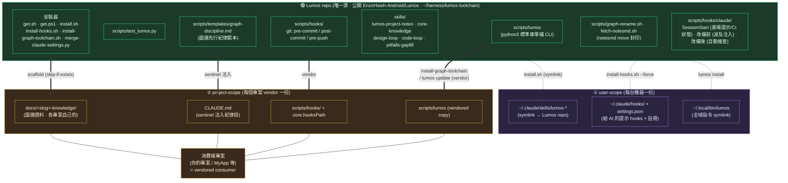
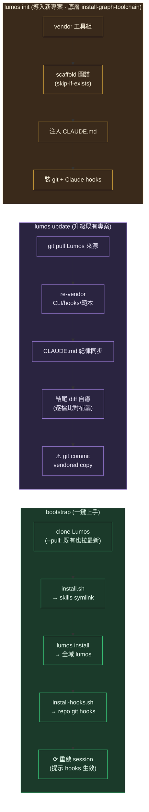
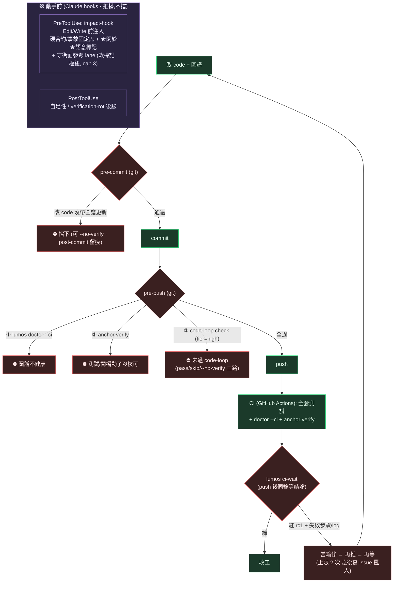

# Lumos 架構圖

> 「圖譜即合約」工具組的**唯一源 → 分發 → 消費端**模型:所有東西只在一個 repo 維護(唯一源),裝到兩種地方生效——整台機器共用的(給 AI 的操作手冊),和複製進每個專案的(指令與檢查程式)。一張圖看懂什麼住哪、用哪個指令裝、為什麼非這樣分不可。

## 1. 全景:唯一源 → 兩種 scope → 消費端

```mermaid
flowchart TB
    subgraph SRC["🟢 Lumos repo (唯一源 · 公開 EnzoHsieh-Android/Lumos · ~/harness/lumos-toolchain)"]
        direction TB
        CLI["scripts/lumos<br/>(python3 標準庫單檔 CLI)"]
        TEST["scripts/test_lumos.py"]
        GHOOKS["scripts/hooks/<br/>git: pre-commit / post-commit / pre-push"]
        CHOOKS["scripts/hooks/claude/<br/>SessionStart (進場提示/CI 狀態) · 改檔前 (波及注入) · 改檔後 (自動複查)"]
        INST["安裝器<br/>get.sh · get.ps1 · install.sh<br/>install-hooks.sh · install-graph-toolchain.sh · merge-claude-settings.py"]
        TPL["scripts/templates/graph-discipline.md<br/>(圖譜先行紀律範本)"]
        RENAME["scripts/graph-rename.sh · fetch-notesmd.sh<br/>(notesmd move 封印)"]
        SKILLS["skills/<br/>lumos-project-notes · core-knowledge<br/>design-loop · code-loop · pitfalls-gapfill"]
    end

    subgraph USER["① user-scope (每台機器一份)"]
        direction TB
        USKILL["~/.claude/skills/lumos-*<br/>(symlink → Lumos repo)"]
        UCHOOK["~/.claude/hooks/ + settings.json<br/>(給 AI 的提示 hooks + 註冊)"]
        UBIN["~/.local/bin/lumos<br/>(全域指令 symlink)"]
    end

    subgraph PROJ["② project-scope (每個專案 vendor 一份)"]
        direction TB
        PCLI["scripts/lumos (vendored copy)"]
        PHOOK["scripts/hooks/ + core.hooksPath"]
        PCLAUDE["CLAUDE.md<br/>(sentinel 注入紀律段)"]
        PGRAPH["docs/&lt;slug&gt;-knowledge/<br/>(圖譜資料 · 各專案自己的)"]
    end

    CONSUMER["消費端專案<br/>(你的專案 / MyApp 等)<br/>= vendored consumer"]

    SKILLS -. "install.sh (symlink)" .-> USKILL
    CHOOKS -. "install-hooks.sh --force" .-> UCHOOK
    CLI -. "lumos install" .-> UBIN

    CLI ==> |"install-graph-toolchain<br/>/ lumos update (vendor)"| PCLI
    GHOOKS ==> |vendor| PHOOK
    TPL ==> |"sentinel 注入"| PCLAUDE
    INST ==> |"scaffold (skip-if-exists)"| PGRAPH

    PCLI --- CONSUMER
    PHOOK --- CONSUMER
    PCLAUDE --- CONSUMER
    PGRAPH --- CONSUMER

    classDef src fill:#1b3a2a,stroke:#3ddc84,color:#e8fff0
    classDef user fill:#2a2440,stroke:#9a7bd6,color:#f0ecff
    classDef proj fill:#3a2a1b,stroke:#dcab3d,color:#fff5e0
    class SRC,CLI,TEST,GHOOKS,CHOOKS,INST,TPL,RENAME,SKILLS src
    class USER,USKILL,UCHOOK,UBIN user
    class PROJ,PCLI,PHOOK,PCLAUDE,PGRAPH,CONSUMER proj
```

**為什麼分兩種 scope(生效範圍)**:CI 只會抓你的專案 repo、git hook 也是一個 repo 一份——所以指令和檢查程式**必須複製進每個專案**(術語叫 vendor)。skills 是純方法論文件,整台機器用捷徑(symlink)共用一份就好,不複製——複製了反而各專案的副本會各自過期。

## 2. 安裝 / 生命週期指令做了什麼

```mermaid
flowchart LR
    subgraph BOOT["bootstrap (一鍵上手)"]
        direction TB
        B1["clone Lumos<br/>(--pull: 既有也拉最新)"] --> B2["install.sh<br/>→ skills symlink"]
        B2 --> B3["lumos install<br/>→ 全域 lumos"]
        B3 --> B4["install-hooks.sh<br/>→ repo git hooks"]
        B4 --> B5["⟳ 重啟 session<br/>(提示 hooks 生效)"]
    end

    subgraph UPD["lumos update (升級既有專案)"]
        direction TB
        U1["git pull Lumos 來源"] --> U2["re-vendor<br/>CLI/hooks/範本"]
        U2 --> U3["CLAUDE.md 紀律同步"]
        U3 --> U4["結尾 diff 自癒<br/>(逐檔比對補漏)"]
        U4 --> U5["⚠ git commit<br/>vendored copy"]
    end

    subgraph NEW["lumos init (導入新專案 · 底層 install-graph-toolchain)"]
        direction TB
        N1["vendor 工具組"] --> N2["scaffold 圖譜<br/>(skip-if-exists)"]
        N2 --> N3["注入 CLAUDE.md"]
        N3 --> N4["裝 git + Claude hooks"]
    end

    classDef boot fill:#1b3a2a,stroke:#3ddc84,color:#e8fff0
    classDef upd fill:#2a2440,stroke:#9a7bd6,color:#f0ecff
    classDef new fill:#3a2a1b,stroke:#dcab3d,color:#fff5e0
    class BOOT,B1,B2,B3,B4,B5 boot
    class UPD,U1,U2,U3,U4,U5 upd
    class NEW,N1,N2,N3,N4 new
```

## 3. CLI 子命令家族 (63 個頂層命令)

```mermaid
flowchart TB
    ROOT["lumos &lt;cmd&gt;<br/>(python3 標準庫 · 零依賴 · 63 個頂層命令)"]

    ROOT --> READ["讀取 / 導航"]
    ROOT --> HEALTH["巡檢 / 治理"]
    ROOT --> WRITE["寫入"]
    ROOT --> GUARD["合約守衛 (guard*)"]
    ROOT --> LOOP["對抗審計 loop"]
    ROOT --> INTEG["完整性 / 影響"]
    ROOT --> SARIF["社群 linter 橋"]
    ROOT --> CI["CI 回流觀測"]
    ROOT --> LIFE["安裝 / 生命週期"]

    READ --> R["context · show · contracts · search<br/>links · backlinks · map · export<br/>decisions · stale · recent · stats · drift-history"]
    HEALTH --> H["doctor · lint · lint-watch · lint-check<br/>self-audit · sync-verified-by · gov<br/>spec-trace · signoff · rel-cascade · test-layers"]
    CI --> C["ci-wait · ci-status<br/>(觀測非強制:擋不了 push/merge)"]
    WRITE --> W["set · append · remove · new · archive<br/>decision-add · decision-supersede · decision-reindex"]
    GUARD --> G["guard {list · scaffold · bind · audit · trace}<br/>(★INVARIANT★→[test:]→[audit:] 綁定鏈)"]
    LOOP --> LP["pitfalls (--diff tier) · code-loop {pass/skip/check}<br/>canary {record · second} · loop {status·next·compress·verify-progress·capture-counts}<br/>fold-check · refcheck"]
    INTEG --> I["anchor {verify · approve}<br/>impact (影響半徑 + 事故觸發)<br/>cochange · testmap {build · affected}"]
    SARIF --> ST["sqlfluff-sarif · stylelint-sarif<br/>compose-metrics · lint-check"]
    LIFE --> L["install · uninstall · update<br/>bootstrap · init · deinit · teardown"]

    classDef root fill:#1b3a2a,stroke:#3ddc84,color:#e8fff0
    classDef cat fill:#2a3142,stroke:#5a9bd6,color:#e0f0ff
    classDef leaf fill:#222,stroke:#666,color:#ddd
    class ROOT root
    class READ,HEALTH,WRITE,GUARD,LOOP,INTEG,SARIF,CI,LIFE cat
    class R,H,W,G,LP,I,ST,C,L leaf
```

> `guard`/`anchor`/`canary`/`loop`/`code-loop` 各帶子命令(如 `anchor verify`);上面共 63 個頂層命令,權威清單以 `lumos --help` 為準(**分類小計刻意不寫**:只有總數有機械守衛,寫了沒守的數字就是新漂移面)。

## 4. 強制力管線 (圖譜不腐爛的機制)

五段接力:「動手前推播 → 提交把關 → 推送硬閘 → CI → 結果拉回當輪修」。動手前,系統主動把「你要改的檔會波及哪些筆記」推到眼前;硬的關卡擋在提交與推送兩個點;推上去之後 `lumos ci-wait` 把雲端測試結論拉回同一輪工作裡修(這段要專案在 `.lumos/config.json` 宣告 `ci` 區塊才啟用)。

> ⚠ **第五段是觀測不是強制**:`ci-wait` 只負責把雲端結論拉回來讓你當輪修,**擋不了 push 也擋不了 merge**;查不到結果時一律放行不誤擋。要做到「紅燈進不了主幹」,得在 GitHub 開分支保護(required check)——那是平台設定,本工具不碰。前四段才是硬閘。

```mermaid
flowchart TB
    subgraph BEFORE["🟣 動手前 (Claude hooks · 推播,不擋)"]
        PRE["PreToolUse: impact-hook<br/>Edit/Write 前注入<br/>硬合約/事故固定席 + ★關於★語意標記<br/>+ 守衛面參考 lane (軟標記樞紐, cap 3)"]
        POSTT["PostToolUse<br/>自足性 / verification-rot 後驗"]
    end

    EDIT["改 code + 圖譜"] --> PC{"pre-commit (git)"}
    PC -->|"改 code 沒帶圖譜更新"| BLOCK["⛔ 擋下 (可 --no-verify · post-commit 留痕)"]
    PC -->|通過| COMMIT["commit"]

    COMMIT --> PUSH{"pre-push (git)"}
    PUSH -->|"① lumos doctor --ci"| PB1["⛔ 圖譜不健康"]
    PUSH -->|"② anchor verify"| PB2["⛔ 測試/閘檔動了沒核可"]
    PUSH -->|"③ code-loop check (tier=high)"| PB3["⛔ 未過 code-loop<br/>(pass/skip/--no-verify 三路)"]
    PUSH -->|全過| PASS["push"]
    PASS --> CI["CI (GitHub Actions): 全套測試<br/>+ doctor --ci + anchor verify"]
    CI --> WAIT{"lumos ci-wait<br/>(push 後同輪等結論)"}
    WAIT -->|綠| DONE["收工"]
    WAIT -->|"紅 rc1 + 失敗步驟/log"| FIX["當輪修 → 再推 → 再等<br/>(上限 2 次,之後寫 Issue 攤人)"]
    FIX --> EDIT

    classDef gate fill:#3a2020,stroke:#dc5b5b,color:#ffe8e8
    classDef ok fill:#1b3a2a,stroke:#3ddc84,color:#e8fff0
    classDef push fill:#2a2440,stroke:#9a7bd6,color:#f0ecff
    class PC,PUSH,BLOCK,PB1,PB2,PB3 gate
    class COMMIT,PASS,CI,EDIT,DONE ok
    class WAIT,FIX gate
    class BEFORE,PRE,POSTT push
```

> **地板不是萬能裁判**:動手前的推播可以被無視、git 關卡可以用 `--no-verify` 繞過(後果自負、會留痕)。這套機制守得住「忘了/隨手漏」,守不住「刻意繞+不誠實」——那一層永遠留給人。

---

> **接手圖譜是空的舊專案?** 工具組附「節點還原」七步 SOP(從 code 和 git 把脈絡還原成節點,惰性生長不攤平)——白話版見 [README §6](README.md),操作全文在 `skills/lumos-project-notes` 的 reference。
