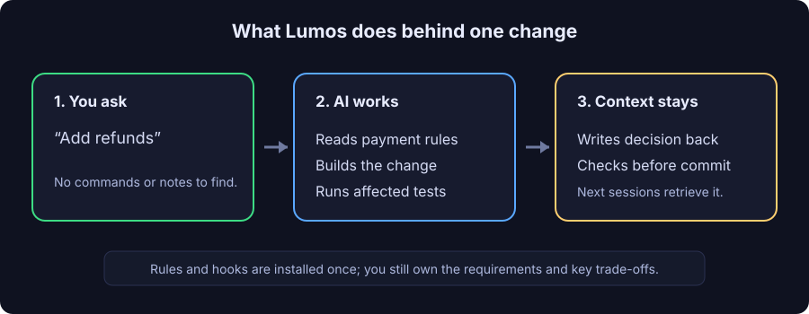
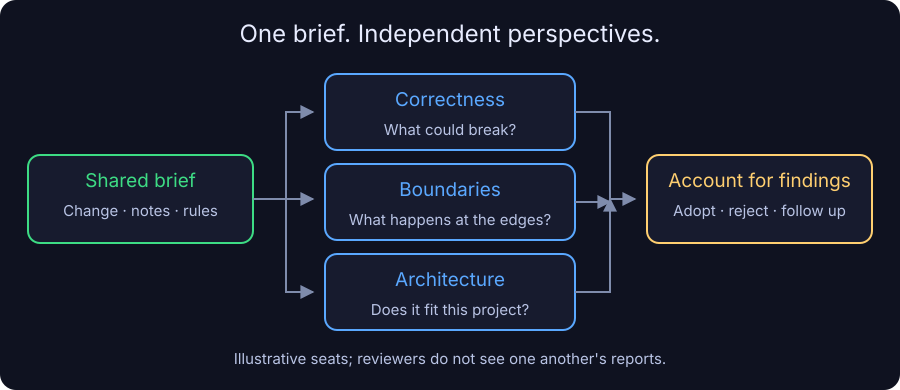
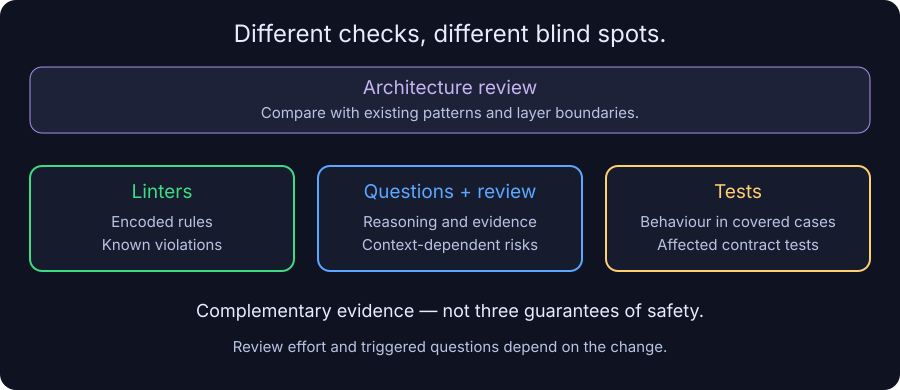
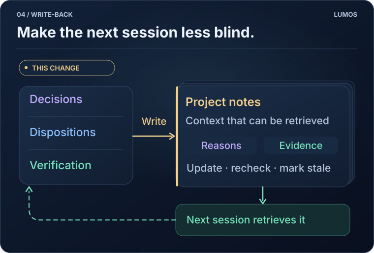
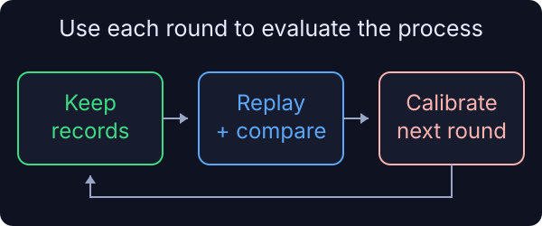

<p align="center">
  <picture>
    <source media="(prefers-color-scheme: dark)" srcset="assets/lumos-logo-dark.png">
    
  </picture>
</p>

# Lumos

[繁體中文](README.md) · **English**

**Lumos is an engineering governance toolkit for natural-language-driven development.**

You describe goals, clarify constraints, and make trade-offs in conversation. Within the scope you authorize, the AI carries out the development workflow—from retrieving context and implementing changes to testing, committing, and pushing.

Lumos connects rules and checks to that workflow. When a requirement is unmet, the AI receives the reason for the block, addresses it or asks you to decide, and records decisions and verification results for future work. A change leaves more than code: it also leaves the reasoning, its impact, and how it was checked.

Each change moves through four stations: **Notes → Dispatch → Review → Write-back**. Around that loop, evals use the accumulated records to check and calibrate the process.

[Who it's for](#who-this-is-for) · [Install](#getting-it-installed) · [First use](#your-first-time-through) · [How it works](#how-it-works) · [Limits and scope](#scope) · [Documentation](#going-deeper)

<p align="center">
  <a href="assets/map-en.svg">
    
  </a>
</p>

## Who this is for

Lumos is most useful when you rely heavily on AI for development and need to maintain a project across people or sessions. Changes involving payments, inventory, permissions, or data migrations need more than working code: they need clear boundaries, preserved behaviour, and an understanding of downstream effects.

It connects work that is otherwise easy to scatter across tools and conversations:

| Question during development | What Lumos provides |
| --- | --- |
| Why was this designed this way? Which rules must hold? | Searchable decisions, boundaries, and contract notes |
| Who should review this change, and what should they check? | Relevant context, separate review perspectives, and risk tiers |
| What supports the claim that this was verified? | Bound contract tests, verification records, and gates |
| Can the next session pick up where this one stopped? | Decisions, review dispositions, and results written back to the graph |

**There is an adoption cost.** Maintaining notes, running checks, and using multiple reviewers consume time and tokens. A disposable prototype or a mostly hand-written project with little handoff may not need the whole workflow. Using Lumos does not mean turning every small edit into a design project.

## Getting it installed

The toolkit combines a Markdown knowledge graph, a CLI, AI working instructions, and enforcement checks for Claude Code or Codex. You describe the goal and make trade-offs; the AI follows the workflow to retrieve context, implement, and write back. Business decisions and risk acceptance remain human responsibilities.

### 1. Check your environment

You need **Git, Python 3.9+**, and Claude Code or Codex. Installation adds more than a CLI: it installs shared tools and skills, and project initialization adds a knowledge graph, AI instructions, and hooks. See [onboarding](ONBOARDING.md) for the scope of those changes.

### 2. Run the installer

Run this from the project you want to onboard:

```bash
curl -fsSL https://raw.githubusercontent.com/EnzoHsieh-Android/Lumos/release/get.sh | bash
```

When the script asks whether to initialize the current directory, check the directory before answering `y`. Pressing Enter skips initialization. You can also download and inspect the script before running it.

### 3. Restart and check

After installation, **start a new AI session**, then check the wiring:

```bash
lumos enforcement
```

This reports whether checks are installed, registered, and connected. **It does not establish that their judgements are correct.** Information unavailable locally, such as platform trust settings, is reported as unknown and needs separate confirmation.

For Windows, existing Lumos projects, offline installation, and removal, see [onboarding](ONBOARDING.md).

## Your first time through

Start with a small change that is easy to verify. For example, tell the AI:

> Add refunds to the existing payment flow. First check the project notes and identify rules that must hold, affected areas, and how to verify the change. Confirm the approach before implementing it, then write back the decisions and verification results.

This illustrates the workflow; it is not a complete refund specification. If eligibility, amounts, or permissions are unclear, the AI should ask you.

<p align="center">
  <a href="assets/first-change-en.svg">
    
  </a>
  <br>
  <sub>Workflow illustration, not a recorded test result. Actual steps depend on project rules and change risk.</sub>
</p>

You do not need to memorize the CLI. Installed instructions tell the AI when to query and write back. Once you authorize a commit or push, the AI also executes the Git operation, while Lumos hooks and checks provide feedback at the relevant stages.

For example, if the AI attempts a commit after changing code without updating notes, the commit check blocks it and returns the reason. The AI should read that result, update the relevant context or handle a no-note-change exception according to project rules, then retry. The block becomes feedback within the workflow, not just a warning for a person to read. Trade-offs or risks it cannot resolve still come back to you.

At the end, look for three things: **what changed, what was actually verified, and which decisions or limitations were recorded**. A test that was not run should not be reported as passing.

## How it works

<a id="notes"></a>

### ① Notes

retrieve the context the change needs.

<p align="center">
  <a href="assets/graph-demo-en.svg">
    
  </a>
</p>

The knowledge graph is a set of linked Markdown notes that can be versioned with the project. It records design reasoning, module boundaries, important rules, incident lessons, and the conditions under which something was verified.

Every source file needs one note that owns it, and the tool blocks a commit that adds a file nobody owns. When you change that file, its owning note is pushed to the front — but only if the note's own text actually mentions the file; listing it in a field is not enough. The restriction exists to stop a note from growing into "one note for everything": a note that names ten modules' files gets pushed for any of the ten, so it keeps growing and nobody wants to read it.

The shop example connects plans, modules, important rules, and their verification records.

The AI can search by question or look up notes associated with a changed file, retrieving material relevant to the task. **Registered links are not a complete dependency analysis**: the graph provides leads that still need checking against code and actual behaviour.

Important rules can be marked as contracts and bound to tests. That makes a “must not change” claim traceable, but passing tests establish only the scenarios they cover. Whether a rule still fits the business is not a tool-only decision.

[See note structure and impact-query illustrations](docs/mental-model.md#9-visual-reference)

<a id="dispatch"></a>

### ② Dispatch

equip reviewers without removing independent judgement.

<p align="center">
  <a href="assets/dispatch-overview-en.svg">
    
  </a>
</p>

Dispatch packages the change, related notes, and important rules for reviewers with different perspectives. Seats cannot see one another's reports, reducing the opportunity to copy conclusions. Agreement still does not guarantee correctness.

At intake, citations are checked and findings are recorded as adopted, rejected, or awaiting action. The point is not simply to ask more AIs: each finding needs a basis and a disposition.

[See the full dispatch, intake, and disposal-gate flow](docs/mental-model.md#7-reading-the-detailed-diagrams)

<a id="review"></a>

### ③ Review

check architecture, known problems, and actual behaviour separately.

<p align="center">
  <a href="assets/review-overview-en.svg">
    
  </a>
</p>

Review covers more than bugs. An architecture seat compares the change with existing code at the same layer, looking for a second competing approach or calls that bypass established boundaries—not merely differences in personal style.

Linters cover encoded rules; stack questions and reviewers challenge context-dependent reasoning. Tests execute the affected contracts' bound tests. Together, they provide complementary evidence.

Pre-push code review is risk-tiered; small changes do not all trigger the same review effort. Gates can require answers and evidence to exist, but format checks alone cannot establish that an answer is correct.

#### Five layers of quality control

No human or AI can guarantee a zero defect rate. Following the Swiss cheese model, Lumos layers risk tiering, multi-seat review, disposition gates, external rules, and tests proven to fail. Every layer has blind spots, but a problem must pass through all of them to escape. The external-rules layer blocks only findings new to the change, so an existing codebase is not buried by its backlog when it adopts the gate.

<p align="center">
  <a href="assets/swiss-cheese-en.svg">
    
  </a>
</p>

Two ledgers sit outside the layers: the intercept ledger helps observe precision, while the escape ledger helps observe recall. Escaped defects are attributed and, where possible, converted into mechanical rules or tests so the same class of problem is less likely to escape again. This reduces and exposes risk; it does not promise zero defects.

[Zoom in on how the review step itself is layered, plus stack triggers and push gates](docs/mental-model.md#7-reading-the-detailed-diagrams)

<a id="write-back"></a>

### ④ Write-back

turn this change's results into the next change's input.

<p align="center">
  <a href="assets/writeback-overview-en.svg">
    
  </a>
</p>

After a change, the AI writes design trade-offs, review dispositions, verification results, and unresolved work into the relevant notes. The next session can retrieve the reasoning and constraints instead of reconstructing everything from code.

More notes are not automatically better. Decisions can expire and tests have assumptions. Records need updating, re-verification, or stale markers as the system changes.

Write-back also has to land in the right place. The tool checks whether what you wrote went into the owning note of each file you actually changed, and blocks it when it went somewhere else. Otherwise the explanations slowly pile into a handful of large notes that nobody ends up reading.

[Explore write-back in the full loop](docs/mental-model.md#6-what-the-review-loop-actually-runs)

<details>
<summary>See the growth of Lumos's own knowledge graph</summary>

<p align="center">
  
  <br>
  <sub>440 notes and 1,572 links at recording time. This illustrates scale; it is not a reading guide or evidence of improved quality.</sub>
</p>

</details>

<a id="evals"></a>

### Outer loop: evals

**The outer loop: evaluate the process itself, so changes can be compared.**

<p align="center">
  <a href="assets/evals-overview-en.svg">
    
  </a>
</p>

Evals are evaluations. Lumos records review seats, findings, and dispositions, freezes accepted gate verdicts as replay references, and uses weekly replay to check whether rule changes alter earlier outcomes. Retrieval has a separate set of human-labelled questions for comparing algorithm changes.

These records support calibration; they do not guarantee that review quality improves with every round. [Explore the machinery](docs/mental-model.md#6-what-the-review-loop-actually-runs)

## Why plain language

Natural-language-driven development means more than asking AI to generate a piece of code: conversation drives the whole development workflow. It connects two parts of Lumos: **conversation captures reasoning; execution receives feedback.**

Requirements, alternatives, and rejected approaches can become reusable context when they are expressed in conversation. Having the AI execute tool operations also lets it read check results and address incomplete work. If the AI receives only the finished code, Lumos cannot reconstruct trade-offs that were never expressed or recorded.

This does not mean engineers no longer need to understand code, or that writing code by hand has no value. You still need to assess requirements, architecture, deployment, and verification. Lumos aims to reduce repeated context-setting and after-the-fact record keeping.

## Why this exists

I believe AI will take on more implementation work. But a model that writes better code does not automatically preserve every project trade-off, or keep rules, documentation, and tests aligned.

I want context to live outside the model, with its maintenance connected to development. The foundation of the next generation of software development is not just code generation: it is also evidence behind changes, traceable decisions, and systems that the next person can maintain.

Lumos is my implementation of that idea.

## Supported languages

Most of Lumos does not care what your project is written in—the notes, dispatch, review, and write-back loop is language-agnostic. Only four things are bound to a stack: **finding your tests** (so contracts can bind to them), **the performance questions worth asking for that stack**, **the coding-conventions skill**, and **which linters to reach for**. The table below is the current state of those four.

| Language / platform | Test discovery | Performance questions | Conventions skill | Linter picks | Used on a real project |
|---|---|---|---|---|---|
| Kotlin / Android | ✅ | ✅ 7 | ✅ | ✅ | ✅ |
| C# / .NET | ✅ | ✅ 5 | ✅ | ✅ | ✅ |
| Vue / front-end TypeScript | ✅ | ✅ 5 | ✅ | ✅ | ✅ |
| SQL | — | ✅ 4 | — | ✅ | ✅ |
| Python | ✅ | ✅ 5 | ✅ | ✅ | ⏳ in progress |
| Java / JVM | ✅ | ✅ 7 | ✅ | ⚠️ not run yet | ❌ |
| Swift / iOS | ✅ | ✅ 6 | ✅ | ⚠️ not run yet | ❌ |
| Node.js backend | ✅ | ✅ 5 | ✅ | ⚠️ not run yet | ❌ |
| Flutter / Dart | ✅ | — | — | ✅ | ⚠️ surveyed only |

**Read the last column.** The ❌ rows were filled in to the same design and tested against synthetic samples, but **no real project has used them yet**—whether the trigger words fire accurately and whether the convention rules hold is still unmeasured. ⚠️ means two different things: in the linter column, those picks came from official documentation and were never installed and run here; in the last column, Dart means a real project was surveyed but never actually onboarded.

**Languages not listed still work**—you just get none of those four things. The graph, the review loops, and the commit and push gates all behave the same; you fill in how your tests are found and pick your own linters.

(Separately: running Lumos itself needs Python 3.9+. That is unrelated to what your project is written in.)

## Scope

Lumos supplies the reusable toolkit: the notes CLI, working instructions, checks, Git hooks, and cross-project stack conventions. Business knowledge, framework choices, and release procedures belong to each project.

It **does not guarantee quality or safety, or replace engineering judgement**:

- The graph can be incomplete or stale. Resolve conflicts against code, tests, and actual operation.
- AI reviewers can miss problems. An answer or a record is not proof that its contents are correct.
- Effective enforcement depends on installation, platform settings, and CI wiring—not just a healthy local report.
- Business trade-offs, irreversible actions, and risk acceptance still need human confirmation.

## Going deeper

- **How does each check work?** [The mental model and the machinery](docs/mental-model.md)
- **Installing or taking over an existing setup?** [Onboarding](ONBOARDING.md) (Chinese)
- **No notes in the existing project?** [Taking over a project](docs/taking-over.md)
- **Looking up an operation?** [Command reference](docs/command-reference.md)
- **Internal design or a comparison with SDD?** [Architecture](ARCHITECTURE.md) · [SDD and Lumos](SDD-vs-Lumos.en.md)
- **The full methodology?** [Overview](docs/methodology/圖譜即合約-全景圖.md) · [Public explanation](docs/methodology/圖譜即合約-對外論述.md) · [Design and evolution](docs/methodology/圖譜即合約.md) (Chinese)

## Licence

[MIT](LICENSE), covering the Lumos toolkit files, including tools copied into your project.

Your notes are yours. Lumos claims no rights over them.
