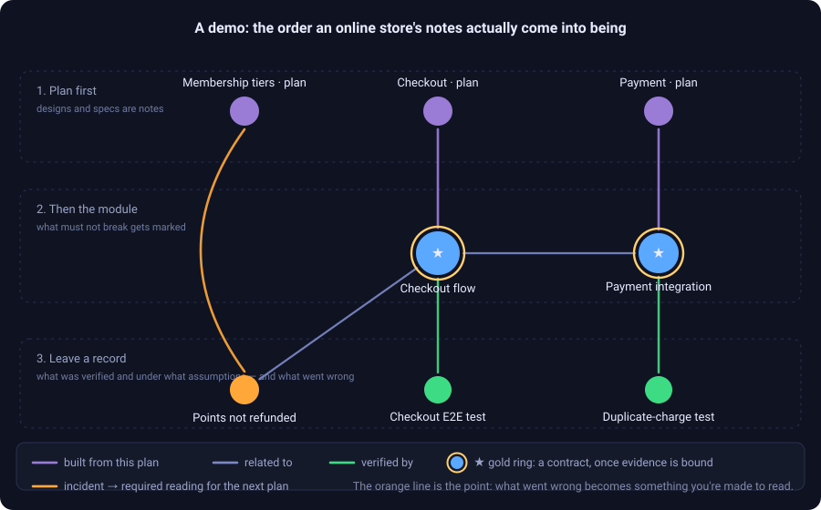
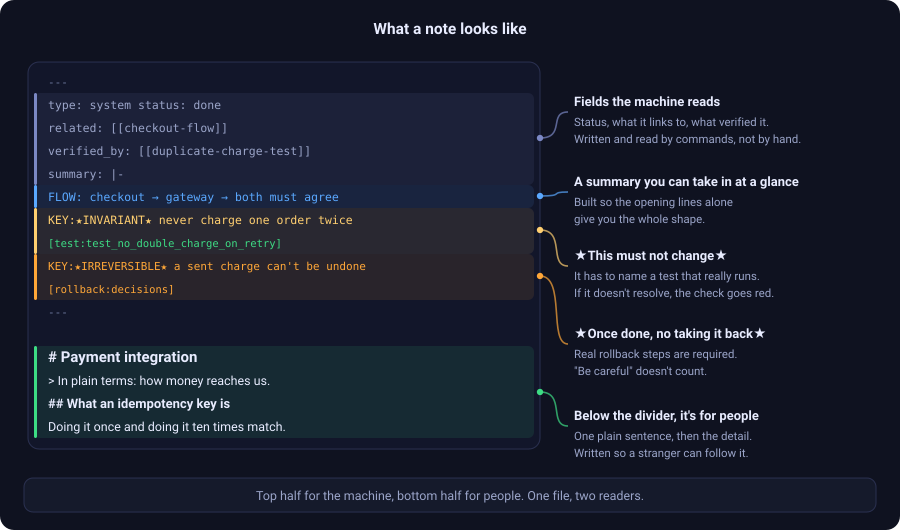
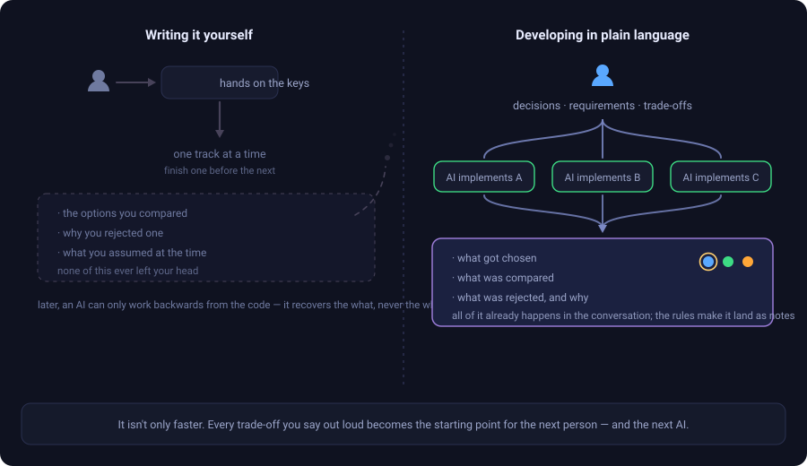
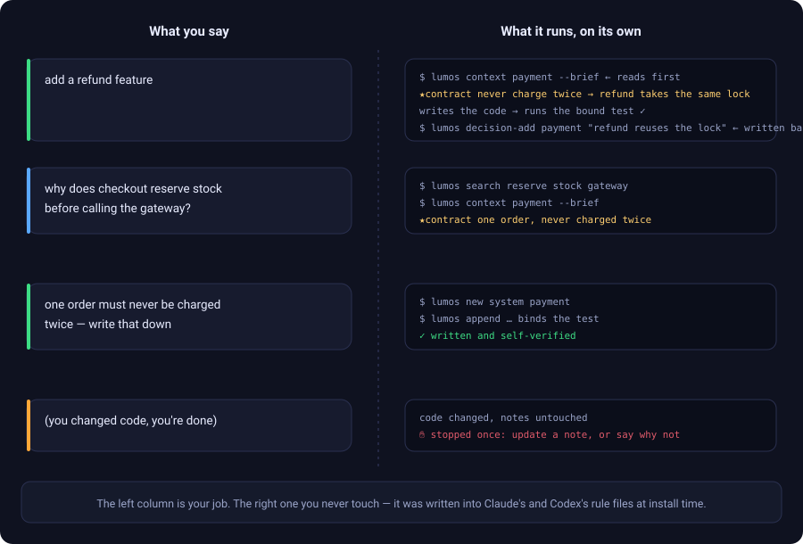
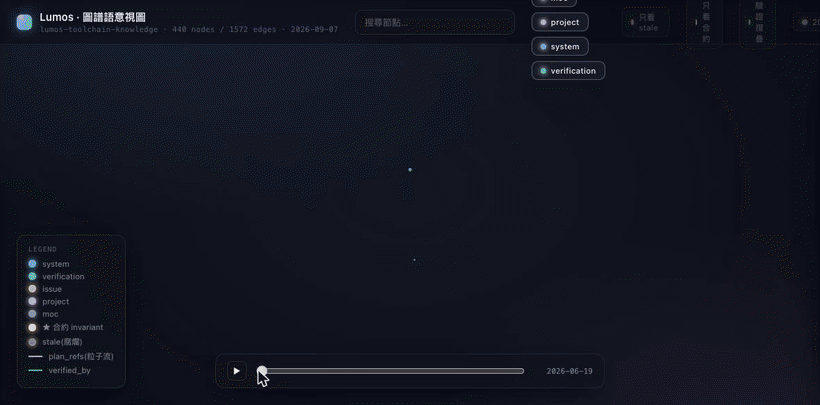
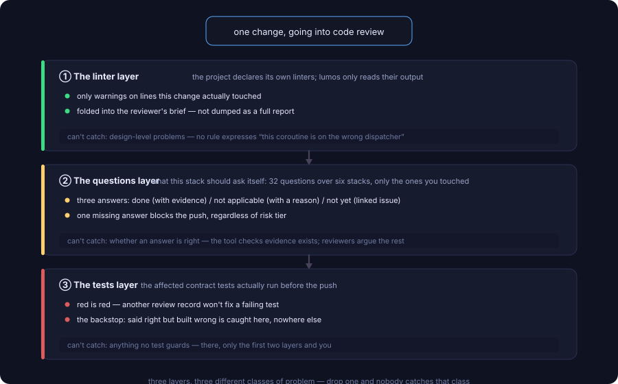
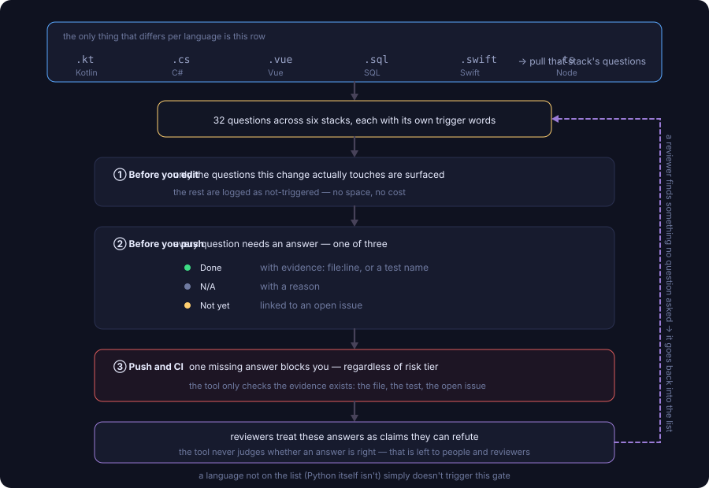

<p align="center">
  <picture>
    <source media="(prefers-color-scheme: dark)" srcset="assets/lumos-logo-dark.png">
    
  </picture>
</p>

# Lumos

[繁體中文](README.md) · **English**

> That module you had an AI write three months ago? You need to change it today.
> You don't remember why it was built that way. The AI can't reach it either — open a new session and everything you said last time is gone.

<p align="center">
  
</p>

In that conversation, everything was there: the approaches you compared, why you rejected the others, the one rule you agreed must never break. **When it shipped, only the code survived.**

That isn't anyone's memory failing. **Code, as a medium, simply cannot hold those things.** Open a file and it tells you exactly one thing — what it looks like right now. On these five, it has nothing to say:

- **Why** this approach — what was compared, what was rejected.
- **Where this part ends**, and who gets hit if you change it.
- Which behaviours are **promises nobody may break**, and which just happen to be that way and are safe to refactor.
- Whether this was **ever verified**, and under what assumptions.
- Whether you can **take it back** if you get it wrong.

Those five used to live in a senior engineer's head. While they were around you could just ask; when they left, it left with them.

**What Lumos does is simple: it writes those five things into a set of interlinked Markdown notes that live in the same project as the code, then uses git checks — small programs that run when you commit or push — to close off the "changed the code, didn't touch the notes" path.** Not writing has to be more annoying than writing; otherwise nobody writes.

> **The easiest thing to misread: the one being blocked isn't you — it's the AI.**
> It writes the code and the notes. It hits this check when it commits, reads the message, goes back and writes the note, and commits again — **those messages are written for it to read.**
> So "blocking" isn't friction; it's a **control signal**: **the rule is there for the AI to hit.** Hitting it makes it comply, with nobody in the loop. What you do is the requirements and the judgement calls.

Here's roughly what that grows into — an online store, where a plan comes first, then the module, then a record of what was done:

<p align="center">
  
</p>

Two details: **the gold ring (a rule that must not change) only grows once a verification record links to it** — claiming isn't enough; and **the orange line runs backwards** — an incident gets pulled into the next plan as required reading.

**You don't hand-write these notes, and you don't memorise commands.** You develop the way you already do — installing injects "when to look something up, when to write it back" into Claude Code's and Codex's rule files.

---

**Understand it** &nbsp;[What's in a note](#whats-in-a-note) · [How this differs from Obsidian](#how-this-differs-from-obsidian)<br>
**Is it for you** &nbsp;[Who this is for](#who-this-is-for) · [Why plain language](#why-plain-language)<br>
**Use it** &nbsp;[Getting it installed](#getting-it-installed) · [Your first time through](#your-first-time-through)<br>
**Beyond that** &nbsp;[The loop that gets sharper](#the-loop-that-gets-sharper) · [Code review has three layers](#code-review-here-has-three-layers) · [Why this exists](#why-this-exists) · [Scope](#scope) · [Going deeper](#going-deeper) · [Licence](#licence)

---

## What's in a note

<p align="center">
  
</p>

Those two starred markers are the heart of the whole thing — **a heavy claim can't just be asserted; evidence has to hang off it**, and if it doesn't resolve, the health check goes red.

So "what rules can't be touched in this project" isn't a question you ask a person — **one command answers it**, usually one the AI runs (see the [command reference](docs/command-reference.md)).

---

## How this differs from Obsidian

**No conflict.** These are ordinary Markdown files — open them in Obsidian if you like; install no notes app at all and everything still works.

The difference is one line: **Obsidian is for people to browse. Lumos is for an AI to query.**

| What you did | Notes app | Lumos |
|---|---|---|
| An AI wants a module's backstory | Pour the files in and let it dig | **One query back: ranked, compressed** (this project's notes run to 2.67M characters — they don't fit) |
| You want to know who a file change hits | No such concept | **Reverse lookup from the code**, including which notes carry rules that must not break |
| You write "this rule must not change" | Saved. Fine. | **Name the test guarding it**, or the health check goes red |
| You changed code and didn't touch the notes | Nobody notices | **Stopped at commit** |

**The primary reader of these notes isn't a human — it's the next session's AI.** They're built to be queried, not read.

<p align="center">
  
</p>

---

## Who this is for

**A fit if:**

- The project needs to live longer than a few months, and someone else (or another AI) will pick it up.
- You lean heavily on AI to write code and don't read every line yourself.
- There are places where a mistake really hurts: payments, inventory, permissions, data migrations.

**Not a fit if:**

- **You still write most of the code by hand, or your token budget is tight.** The whole premise is that context settles out of conversations with an AI — talk to no one, and there's nothing to keep. The review loops burn tokens of their own, too.
- You'll finish it in two weeks and throw it away.
- It's a small solo tool you read every day and hold entirely in your head.

**The cost, stated upfront:** this makes every commit take longer. What you buy is not having to do archaeology three months later. **If the project won't live three months, it doesn't pay for itself.**

---

## Why plain language

That first "not a fit" — still writing most of the code by hand — comes down to this.

<p align="center">
  
</p>

Writing it yourself means three things happen at once: **one track at a time**; **a later AI can only work backwards from the code** (where the *why* was never written); and **the most valuable part never existed anywhere** — what you compared and why you rejected it never left your head.

Develop in plain language and all three invert: you handle decisions and trade-offs, implementation runs on several tracks, and **the trade-offs already happen in the conversation** — the rules make them settle into notes.

**And the gap only widens** — the stronger models get, the worse the return on doing it by hand. The full argument is in [the mental model](docs/mental-model.md).

---

## Getting it installed

### Adding it to a new project

Run this from inside your project directory:

```bash
curl -fsSL https://raw.githubusercontent.com/EnzoHsieh-Android/Lumos/release/get.sh | bash
```

It asks "turn this directory into a lumos project? [y/N]" — press `y`.

- **The default is N**, so if you're standing in the wrong directory (your dotfiles, say), Enter skips it. No accidental installs.
- Don't want to pipe a remote script blind? `curl -fsSL <url> -o get.sh`, read it, then run it.
- Non-interactive environments like CI: append `-s -- --init` to create it without asking.

### Did it install?

```bash
lumos enforcement
```

It lists each layer of protection and whether it's **wired up** — note that it checks the wiring, not whether the judgement is right. All-green means the checks are registered, files are present, versions match. The Codex lines stop at "registered; can't tell locally whether it runs" — that's a platform limit, not a fault.

> Taking over a project that already uses Lumos, native PowerShell on Windows, offline installs, partial installs, and why there are two layers — all in [Onboarding detail](ONBOARDING.md).

---

## Your first time through

**You won't have to memorise a single command.** Open a Claude Code or Codex conversation and talk the way you normally would:

<p align="center">
  
</p>

Those three lines on the left are your whole job. The commands on the right **you never touch and never memorise** — installing writes "what to look up, and when" into Claude Code's `CLAUDE.md` and Codex's `AGENTS.md`, and wires up five checks that fire on their own (session-start reminder, pushing affected notes before an edit, attaching relevant notes when reviewers are dispatched, the wrap-up check, CI status).

When you go to commit with the notes untouched, this is what you get:

```console
$ git commit -m "adjust checkout logic"

Blocked: this commit changes code, but not one word of the notes.
Code records what things look like now; notes record why they're that way. Change only
one side and the next person (or the next session's AI) will read new code with old reasons.

Pick one:
   1. Update the notes that need it, add them to the commit, commit again.
   2. This genuinely needs no note change (typo, formatting, a comment) →
      git commit --no-verify
      Skipping is recorded. It isn't a quiet pass.
```

**That block is the whole product.** Everything else exists to make it not annoying.

**Two questions this always gets, in one line each:** (1) "So I write the code *and* the notes?" — **the AI writes both, and the AI is what gets blocked**; that message is printed for it. (2) "It blocks me for one button?" — the commit gate **always stops you once** (the AI decides: write the note, or add the flag, no justification), but **the pre-push code review is risk-tiered and a small change doesn't trigger it at all**.
The detail, and the actual skip rate, are in [the mental model](docs/mental-model.md).

---

## The loop that gets sharper

**This is where Lumos parts ways with "a really well-written document".** A document is at its most accurate the day it is finished, and only decays from there. This runs the other way: every round, the material gets a little sharper.

<p align="center">
  
</p>

The four stages run in order, and the last one is the point: **what gets accounted for is written back into the graph, and becomes the next round's material.**

**Notes aren't the final output; they're the next round's input.** Round one might hand a reviewer three notes; round five hands them eight — and all eight earned their place in earlier rounds; nobody threw them in from memory.

Same reviewers, same time budget. **The only thing that changed is the quality of what they were handed.**

<p align="center">
  
  <br>
  <sub>Lumos's own notes over three months (440 notes and 1,572 links when recorded; 457 today). Recorded from the actual tool, not drawn.</sub>
</p>

### The dispatch step is a DAG

"Attach the relevant notes to the reviewers" sounds simple. What actually happens is **one brief fanning out to several seats, then converging back to a single verdict**.

<p align="center">
  
</p>

The one worth reading: **the useful part of the brief isn't "which notes are relevant" — it's the state of the test bound to each rule.** The ones bound to nothing no gate covers; a person is all that reads them. Seats work independently because **"several seats agreed" only counts as evidence if they didn't copy each other.**

> **Honestly:** what a machine holds is *form*. Whether a rule still matches the business — only a person can answer that. Don't read "has evidence attached" as "safe".

---

## Code review here has three layers

**First, the worry everyone actually has: will the AI write junk, or wreck the architecture I already have?**

Every review round carries one seat that looks at nothing else. **It doesn't hunt bugs and it doesn't judge taste — it decides one thing: is this written the way this project already writes things?** And its yardstick **isn't industry best practice — it's the three most similar existing files in the same folder**, pulled automatically. Those files *are* "how this project does it".

**Only two things count as severe: introducing a second way of doing something, or calling across a layer.** The reason is blunt: **everyone who touches it later has to guess between two conventions.** Inconsistent naming is minor; pure taste isn't reported at all.

> Put the other way round: **"the better way" is not automatically the right way here.** A prettier approach that matches nothing else in the project is a maintenance debt.

The three layers below look at the code itself:

Before code goes up, three different things look at it. **They catch three different classes of problem — drop one and nobody catches that class.**

<p align="center">
  
</p>

**1. The linter layer** — the project declares which linters to run; Lumos only reads their output, filters to the lines this change touched, and **folds it into the reviewer's brief**. It can't catch design-level problems: no rule expresses "this coroutine is on the wrong dispatcher".

**2. The questions layer** — each stack carries a list of performance questions it should ask itself (32 across six stacks), and **only the ones you actually touched surface**. Before the push each needs an answer: done (with evidence) / not applicable (with a reason) / not yet (linked issue). It can't judge whether an answer is right — **the tool checks the evidence exists; reviewers argue the rest.**

**3. The tests layer** — the affected contract tests actually run. **This is the backstop**: said right but built wrong is caught here and nowhere else. It can't catch anything no test guards.

<p align="center">
  
</p>

**A language that isn't on the list (Python itself isn't) doesn't trigger the second layer.** The full "what the tool checks and doesn't" table, and how each language plugs in, are in [the mental model](docs/mental-model.md).

> **Honestly: the second layer stops "couldn't be bothered to answer". It does not stop "answered carelessly".** It catches the laziest kind of lie — the rest is on the review seats, and finally on the tests.

---

## Why this exists

Fully autonomous development is coming. **But the context won't follow on its own** — why the faster-looking approach was rejected, which incident bought the rule that's in place now: an AI can't reach any of it. A new session can't see the last one; stay in one long enough and the earliest part gets pushed out of the window. **Those are questions of what it can reach, not how clever it is — a stronger model doesn't make them go away.**

**So the context has to live outside the model. But writing it down isn't enough** — if it doesn't move with the code, three months later it describes a three-month-old world, **which is worse than nothing, because the next person will believe it.** Every "let's document things properly" dies here: not that nobody wrote anything, **but that nothing forced it to keep up.**

So I'm convinced of this: **the foundation of the next generation of software development won't just be models that write better code — it will be the engineering discipline that keeps the context and won't let it rot.** Something that **grows with the work**, not a system written once that starts rotting that day.

Lumos is my answer to that.

---

## Scope

Lumos ships **general-purpose tooling only**: the notes CLI, the checks and git hooks, and the cross-project convention manuals for particular tech stacks (kotlin / vue / csharp / swift / node — `ls skills/` is the source of truth; they aren't tied to any one project, so they live here).

What doesn't come in: your business notes, release scripts, framework choices that only one project makes.

---

## Going deeper

- **[The mental model and the machinery](docs/mental-model.md)** — how the three evidence chains work, what each check blocks, and the half a tool can't prove.
- **[Command reference](docs/command-reference.md)** — you won't need these day to day, but they're here.
- **[Taking over a project with no notes](docs/taking-over.md)** — reconstructing an old system's context into notes.
- [Onboarding detail](ONBOARDING.md) · [Architecture](ARCHITECTURE.md) · [Coming from SDD](SDD-vs-Lumos.en.md)
- Long-form methodology (Chinese, shortest first): [The whole picture](docs/methodology/圖譜即合約-全景圖.md) (every check on one page) · [Written for outside readers](docs/methodology/圖譜即合約-對外論述.md) (the plain-language full version) · [The graph is the contract](docs/methodology/圖譜即合約.md) (the internal design record, with its history — longest)

---

## Licence

[MIT](LICENSE), covering the toolchain's own files, including the ones copied into your project.

**The notes you write are yours.** Lumos claims no rights over them.
