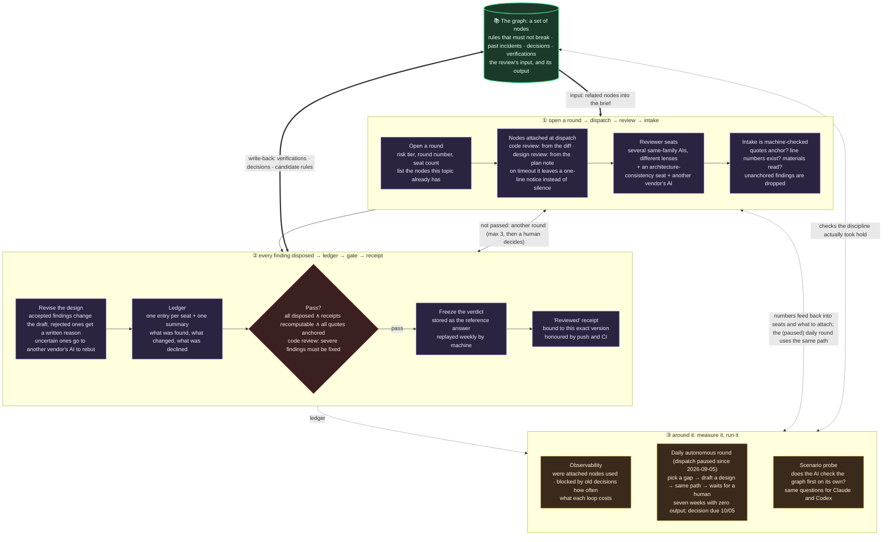

# Lumos

[繁體中文](README.md) · **English**

> **Lumos — lifting the lid on all-AI development, lighting the way to the right requirements.**
>
> (The Lumos charm: it shines two ways. On the **code** — surfacing the hidden whys, decisions, and hard contracts; and on the **requirements** — forcing understanding through conversations you can't skip. Lumos doesn't make your requirements right for you; it lights the path so you can walk it right.)

---

## 0. The one-minute version

In the era where AI writes most of the code, the expensive part isn't "can it be written" — it's "**does anyone still understand this system**".

Lumos gives a project a **knowledge graph** to carry along: a set of interlinked Markdown notes recording exactly what code can't say for itself — **why** it was designed this way, **where** you must not touch, and **whether it's been verified**. Then it uses git hooks (small check programs that run automatically at commit/push time) to block the path of "changed the code but didn't update the notes" — making *not* writing back more annoying than writing back.

- For **humans**: a living map when you inherit an unfamiliar project, instead of reverse-guessing from tens of thousands of lines.
- For **AI**: read the graph before touching anything (know which walls are load-bearing), and get pushed by the rules to write the "why" back afterwards. The whole workflow is designed around [Claude Code](https://claude.com/claude-code) as the default agent; the CLI itself is pure python and runs anywhere.

---

## 1. What problem does it solve

Code only tells you "this is what it looks like now". It cannot tell you:

- **Why** this design (what was compared, what was rejected).
- Where the **boundaries** are (how far this module's responsibility goes).
- Which behaviors are **contracts** (change them = something else breaks) and which are **accidental** (refactor freely).
- Whether it's been **verified**, and under what assumptions.
- Whether an action is **reversible**, and how to back out if it goes wrong.

Traditionally this knowledge lives in veterans' heads and leaves when they do; the AI era is worse — every AI session is a newcomer. Lumos stores it as a graph and keeps it fresh with tooling.

(The note format is Obsidian-compatible, but **you don't need Obsidian installed**; the toolchain reads and writes on its own.)

---

## 2. Core idea: the graph is the contract

Four sentences:

1. **The graph is the source of truth for *intent*.** "Why it was done, what the rules are" — the graph wins. But "what it actually does right now" belongs to tests and production — when the two disagree, don't auto-trust the graph; find out which side is wrong and file an incident note.
2. **Read before you touch.** The first move on an existing system is querying the graph (`lumos search`), not grep. The graph hands you boundaries and landmines first; code is for confirming details.
3. **Write back before you leave.** Record decisions and verification results while you're still the *witness* — don't leave archaeology to whoever comes next.
4. **Enforce at commit time.** All three rules above rot if left to willpower. So pre-commit (the check before each commit) hard-blocks "code changed, graph untouched"; `lumos doctor` regularly verifies the whole graph's consistency.

---

## 3. Quick start

### 3a. The project already uses Lumos (you're joining)

```bash
git clone <your-project> && cd <your-project>
python3 scripts/lumos bootstrap     # one shot: installs Lumos itself, skills, global CLI, hooks
```

Then **restart your Claude Code session** (some prompts load at session start).

### 3b. Introducing Lumos to a new project (one command)

Run inside your project directory:

```bash
cd <your-project>
curl -fsSL https://raw.githubusercontent.com/EnzoHsieh-Android/Lumos/main/get.sh | bash
# It asks "make <path> a lumos project? [y/N]" → press y; then restart your Claude Code session
```

- The prompt **defaults to N**: standing in a directory you don't want instrumented (e.g. dotfiles), just press Enter and nothing happens.
- Don't like piping remote scripts? `curl -fsSL <url> -o get.sh`, review, then run.
- Non-interactive/CI: append `-s -- --init` to skip the confirmation.

<details><summary>Windows (native PowerShell)</summary>

Prereqs: Git for Windows, python on PATH, Claude Code.

```powershell
irm https://raw.githubusercontent.com/EnzoHsieh-Android/Lumos/main/get.ps1 | iex
# Restart the Claude Code session; if lumos isn't found, add %USERPROFILE%\.local\bin to PATH
cd <your-project>; lumos init
```
</details>

<details><summary>Granular install / offline (advanced)</summary>

**Works with both Claude Code and Codex CLI** (since 2026-09; details and known limits in the graph node `Systems/codex-harness`):

- **One install, both harnesses**: a single `lumos install` wires skills, hook registrations and the discipline block into both (Claude: `~/.claude` + `CLAUDE.md`; Codex: `~/.codex/hooks.json`, `~/.agents/skills`, `AGENTS.md`, custom reviewer seat `lumos_reviewer`). Codex hooks only run after you open an interactive `codex` once and pick "Trust all" (trust binds to the command line, so later hook updates from lumos need no re-approval); `lumos enforcement` shows every layer's state.
- **Same hooks, same end-of-turn behaviour**: when code changed but no node did, the turn is blocked once and the model is asked to write the node or say in one line why not — once per session, on both harnesses (before 2026-09-05 the Claude side only wrote to a debug log nobody saw). Switch off with `LUMOS_STOP_BLOCK_OFF=1`.
- **Codex as loop orchestrator**: first round `lumos loop next <id> --orchestrator codex`; right before dispatching reviewers run `lumos dispatch-lens --arm <base>..HEAD --seats N` (Codex hooks cannot read the dispatch message, so each subagent claims a seat on start), then `--disarm`; name the reviewer seat `lumos_reviewer` (selectable from Codex 0.153.2).
- **Measurable**: the scenario probe `scripts/scenario_probe.py --runner codex` runs the same question set against Codex; `--stop-block off` is the control arm for the end-of-turn block.
- **An old gap fixed on the way**: the end-of-turn check used to recognise code only by file extension, so extension-less entry points like this repo's `scripts/lumos` were never flagged; files whose first line is a shebang now count as code, on both harnesses.

Project layer only: `lumos init` (graph folder name defaults to the project name, `--name` to customize; an existing graph is **never overwritten**; `--no-hooks` builds the graph without installing checks). Machine layer only: `lumos install`. Manual offline:

```bash
git clone https://github.com/EnzoHsieh-Android/Lumos ~/harness/lumos-toolchain
cd ~/harness/lumos-toolchain && ./install.sh
python3 scripts/lumos install
scripts/install-graph-toolchain.sh --target <project-path> --slug <name>
```
</details>

### Why two layers, "machine" and "project"?

- **Project layer**: CI only checks out your project repo, and git hooks are per-repo — so the check tools must be **copied into every project** (a.k.a. vendored). Refresh with `lumos update`.
- **Machine layer**: the operating manuals for the AI (skills) are **shared machine-wide**, linked (symlinked) into Claude Code's directory — one `git pull` on the Lumos clone updates them for every project at once.

---

## 4. Mental model: what's in the graph

### A node = one note, in five flavors

| Type | Records |
|---|---|
| `system` | A module: how the flow runs, what it depends on, what its contracts are |
| `verification` | One test/audit record (under what assumptions, when to re-verify) |
| `issue` | A finding / incident |
| `project` | A plan / design |
| `moc` | A map page (Map of Content — the graph's table of contents) |

### Summary lines: grasp a module at a glance

Each note opens with a few prefixed summary lines: `FLOW:` (the flow) `KEY:` (key facts) `DEP:` (dependencies) `TEST:` (test status) `DECISION:` (decisions) — designed so that **reading just the header tells you the whole story**.

### The three "chains": how Lumos differs from a plain wiki

A plain wiki's weakness: whoever writes it has the final word, and nobody notices when it's wrong. Lumos chains three kinds of load-bearing claims to evidence — no evidence, no pass:

**The contract chain** — is this really a rule?
```
KEY:★INVARIANT★ <business contract; changing it = breakage> [test:method_name] [audit:model/date]
```
- `★INVARIANT★` (read: "this line is a contract") **must** be bound to a real, existing test (`[test:]`) — a bare claim gets blocked by `doctor`.
- It must also pass an **independent audit** (`[audit:]`): a clean AI with no conversational context judges "is this really a contract? is the test circular?" — the author doesn't referee their own claim.
- Not sure it's a contract? **Don't mark it.** Never reverse-engineer "this is probably a rule" from code.
- There's also `★DEBT★` for "known-accidental behavior, safe to change".

**The reversibility chain** — can we undo this?
```
KEY:★IRREVERSIBLE★ <can't take back: e.g. a prod DB migration> [rollback:decisions]
KEY:★CHECKPOINT★   <hard to recover: e.g. deploying to a test box>
```
Mark something irreversible and you **must** write down the actual rollback steps (real SQL, real compensation flow) — `doctor` checks. Unmarked = reversible, go ahead.

**The honesty ceiling** (important): the tooling proves *form* — the test exists, the rollback is written, an independent agent reviewed it. Whether the rule still matches today's business, or the rollback actually runs — only humans can answer. Don't confuse "evidence attached" with "absolutely safe".

### Write through commands, don't hand-edit headers

The structured fields at the top of a note (status, links, decisions) go through `lumos set` / `append` / `decision-add` — the commands format correctly and self-verify after writing. The classic hand-edit trap: cramming multiple links onto one line, which spawns "ghost nodes".

---

## 5. Day-to-day flow

```
Enter  ── lumos search <keyword> → lumos context <node> → lumos contracts <node>   (read the graph before touching)
Design ── write it as a plan note; before implementation run design-loop (a few uninformed AI reviewers pick it apart)
Build  ── change code; hooks push "which notes this touches, which incidents fired here" right at you
Wrap   ── code changed but no node did? the Stop hook blocks once and asks you to write or explain (both harnesses)
Write  ── lumos set / append / decision-add to record decisions, verifications, contracts
Check  ── lumos lint <node> (quick single-note check) → lumos doctor (whole-graph health)
Review ── lumos pitfalls --diff rates the risk of this change; high risk goes through code-loop (adversarial code review)
Commit ── pre-commit blocks "code without graph"; pre-push runs the full battery again
```

Enforcement, soft to hard:

| Layer | What it does | Blocking? |
|---|---|---|
| impact push | Before you edit, tells you which notes are affected | Advisory only |
| Stop hook at end of turn | Code changed, no node touched → blocked once, asked to write or explain | Both harnesses: once per session (`LUMOS_STOP_BLOCK_OFF=1` disables) |
| `lumos lint` | Quick single-note check | Early warning |
| `lumos doctor` | Whole-graph health (orphans, broken links, naked contracts, missing rollbacks) | Blocks in `--ci` mode |
| `code-loop` | High-risk change without code review | Hard-blocks at push |
| pre-push | Health + integrity + review receipts, three-in-one | Hard block |

### Why reviews get sharper over time: the graph ⇄ review virtuous cycle

Every node in the graph (rules that must not break, past incidents, decisions, verifications) is the input to the next review: when reviewers are dispatched, the machine attaches the related nodes to their brief, so they don't have to dig; whatever the review folds into the design is written back as nodes, which feed the next round. **Nodes are the next round's input, not a final artifact.** Every finding must be disposed (accepted → the draft changes; declined → a written reason), a round passes only when all are; passed verdicts are frozen and replayed weekly. Claude Code and Codex CLI follow the same path.



Lumos leans heavily on fail-open (proceed when the environment is incomplete, with CI as backstop): a broken governance tool never blocks the whole team, but the side effect is **you can't tell how many layers are actually guarding you right now**. `lumos enforcement` checks each layer above and prints a one-line "N of M active" — remote settings it can't probe locally (GitHub required checks) are honestly listed as unknown, not faked as present.

---

## 6. Inheriting an old project (Brownfield restoration)

You've inherited a project that's **already running but has an empty graph** (your own month of vibe coding, or the company's legacy system). Lumos's answer is *not* auto-generating docs for the whole repo (that's unchecked synthetic narrative — confidently wrong), but the **node-restoration SOP** — seven steps, any tech stack:

1. **Lazy growth**: don't backfill everything at once. Query first — **if a note exists, use it; if it's ragged, patch it; only produce one if there's none**. The graph grows along whatever actually gets touched.
2. **Understand before touching**: anchor from observable behavior (screen text / logs / error codes) back to code → trace the data flow to find "who else shares this" (that's your load-bearing wall) → recover the "why" from git history (when blame hits a squashed commit, go read the PR thread).
3. **Every sentence carries provenance**: claims backed by code/git evidence get tagged with it; inferences are honestly tagged "speculation"; dead ends are tagged "lost" — with mechanical checks in place; no making up stories from the current state.
4. **The exit runs a cross-examination**: two mutually-blind AIs — one reads only the notes and lists their verifiable claims, the other reads only the code and judges each claim true/false. Only then is restoration done.
5. **Typical trigger = right before adding a feature**: restore the surrounding area first, then build the feature on top of the nodes — the shared-surface list and contract candidates become the new feature's guardrails, so you don't wreck the architecture or reinvent wheels.

Full procedure: `reference.md` in `skills/lumos-project-notes`, section "Node restoration (brownfield cold start)"; cheat sheet `commands/09-節點還原.md`; design history in `docs/lumos-toolchain-knowledge/Projects/節點還原SOP_計劃.md`.

---

## 7. Command reference

One zero-dependency python CLI, **66 top-level commands**; the **authoritative list is `lumos --help`** — below are the everyday ones.

**Reading the graph**
```bash
lumos search <keyword>            # full-text search, relevance-ranked (for Chinese: put spaces between concepts)
lumos context <node> [--brief]    # this node + neighbors, compressed; contracts surfaced on top
lumos contracts [<node>]          # contract ledger: which ★INVARIANT★s, bound to which tests
lumos decisions <node>            # decisions made here, and whether any were overturned
lumos impact --file <file>        # which notes a change to this file affects, which incidents fired here
lumos map <node> · links · backlinks · recent · stats
```

**Writing the graph** (all self-verify after writing)
```bash
lumos new system|issue|project|verification <name>   # scaffold a new note
lumos set <node> <field> <value>                     # single-value fields (status etc.)
lumos append <node> related|verified_by|... "[[X]]"  # add links, one per call
lumos decision-add <node> "<content>" --decided DATE # record a decision
```

**Contracts & verification**
```bash
lumos guard list [--unbound]     # contracts not yet bound to tests
lumos guard scaffold / bind / audit    # test stub → binding → independent audit (full flow in skills)
lumos guard kill <node>          # kill-verification: really break it in a sandbox, watch the test go red
lumos signoff <node> --note ".." # business sign-off receipt (the half the tooling can't answer)
```

**Review loops & risk**
```bash
lumos pitfalls --diff <range>    # risk-rate a batch of changes (standard/high)
lumos code-loop check|pass|skip  # review receipts for high-risk changes (pre-push checks them)
lumos loop status <id> ...       # design/code review loop convergence (details in skills)
lumos testmap affected --diff .. # suggested tests for a diff (advisory)
lumos anchor verify|approve      # tamper-evidence fingerprints for test/gate files
lumos ci-wait / ci-status        # wait for CI result after push / check the last one
```

**Health & governance**
```bash
lumos lint <node>                # quick single-note check
lumos doctor [--ci]              # whole-graph health (--ci blocks)
lumos gov [<node>]               # local ledger: who got stopped by which gate (read-only, never uploaded)
lumos spec-trace <plan-node>     # which clauses of a plan are still unclaimed by verifications
```

**Install lifecycle** (install ↔ uninstall symmetric)
```bash
lumos bootstrap                  # install everything    ↔  lumos teardown   # remove everything (graph always kept)
lumos install                    # machine layer only    ↔  lumos uninstall
lumos init [--no-hooks]          # project layer only    ↔  lumos deinit [--keep-graph] [--dry-run]
lumos update                     # refresh this project's vendored toolchain
```

> Which layer to remove: whole machine = `teardown`; just this repo = `deinit`; just the global CLI = `uninstall`. `teardown` always keeps the graph files; `deinit` asks first and supports `--dry-run`.

---

## 8. The governance ledger (`lumos gov`)

Every gate hit and every bypass lands in a local ledger (not in git, never uploaded). `lumos gov` reads it back:

```bash
lumos gov                # timeline of all gate events
lumos gov OrderService   # which gates stopped this node, hard block vs reminder
```

It's for **development visibility** (what keeps ringing = what needs attention), not a compliance artifact.

---

## 9. Updating

- **Skills + global CLI**: `git pull` on the Lumos clone (symlinked, takes effect immediately).
- **A project's vendored toolchain + discipline block**: run `lumos update` inside that project. Graph data is never touched.

---

## 10. Design principles

- **Zero dependencies**: pure python stdlib; runs straight in CI, installs nothing.
- **Don't over-govern**: chain only load-bearing claims; keep soft things soft; no ceremony without matching value.
- **The honesty ceiling**: the tooling proves form, not business correctness; where it can't speak, it says so.
- **The maker doesn't referee** (maker ≠ checker): judgments without a ground truth go to an uninformed independent AI, not the author.

---

## 11. Cost and limits (where reality lags the idea)

Added 2026-09-05 after checking every README claim against the code, ledgers and measurements. Each line says what the mechanism can and cannot do, with numbers where we have them.

- **"Blocks code without a node" means "without touching any node at all".** Any note in the commit passes; whether it was the right note is only a one-line nudge (`lumos impact --sync-check`). It decides "is this code" by extension plus a first-line shebang; from May to September, 26 commits touching only the extension-less main CLI `scripts/lumos` slipped through until the shebang check landed on 2026-09-05.
- **The "reviewed" receipt is self-issued.** `lumos code-loop pass` does not verify that a review happened or that the ledger has that round; `anchor approve` is likewise a signed note. Both catch "forgot", not "went through the motions" — that layer is always a human.
- **Nodes attached to reviewer briefs are mostly not opened.** Our own first measurement: 0 of 16 single-node attachments were read, 0–1 of 11 code-file cases; only the 11-plus-node attachments were used about half the time. The reviewer-seat variant is not measured yet (2026-10-03).
- **"Every finding disposed" checks bookkeeping, not content.** Finding ids are typed by the orchestrator; the gate only checks that folded + declined equals the full set, not that the document actually improved.
- **The end-of-turn block fires once and for one condition.** Code changed, no node touched, once per session; a one-line "no note needed" counts as disposed and is not verified. Before 2026-09-05 the Claude side did not even have that — its "soft reminder" went to a debug log nobody sees.
- **Money.** One high-risk code review (code-loop) costs about 190k tokens; 9.3M over seven days. One design review about 50k. The daily autonomous design loop burned 210–330 USD per week for seven weeks and produced 0 approvable designs; dispatch is paused since 2026-09-05 (`LUMOS_AUTOLOOP_OFF=0` re-enables), decision due 2026-10-05.
- **The node-attaching dispatch hook times out on long branches.** Computing which nodes a change touches takes 25–57 s for branches of 10+ commits, past its 45 s budget, so it attaches nothing; before 2026-09-05 it did so silently (21 of 39 dispatches that day), now it leaves a one-line notice in the brief and asks you to warm the cache first. Design reviews used to rely on hand-pasting (14 of 209 briefs actually had it); since 2026-09-05 the hook derives the lens from the plan note.
- **The linter bridge, Compose metrics and SARIF converters currently have no consumers.** This repo has no linter wired; the two external projects tried them once in early July. The commands exist and run, but nobody runs them. `testmap` was built once and fell 614 commits behind; it is rebuilt daily since 2026-09-05.
- **`lumos enforcement` saying "active" means registered, file present, version current** — not that the layer has an effect; it cannot see whether the five Codex hooks were ever trusted.

---

## Scope & further reading

Lumos only holds the **generic graph toolchain**. Project-specific things (business graph content, release scripts, tech-stack skills) don't live here.

- Onboarding details: [ONBOARDING.md](ONBOARDING.md)
- Architecture overview: [ARCHITECTURE.md](ARCHITECTURE.md)
- vs. SDD (spec-driven development): [SDD-vs-Lumos.md](SDD-vs-Lumos.md)
