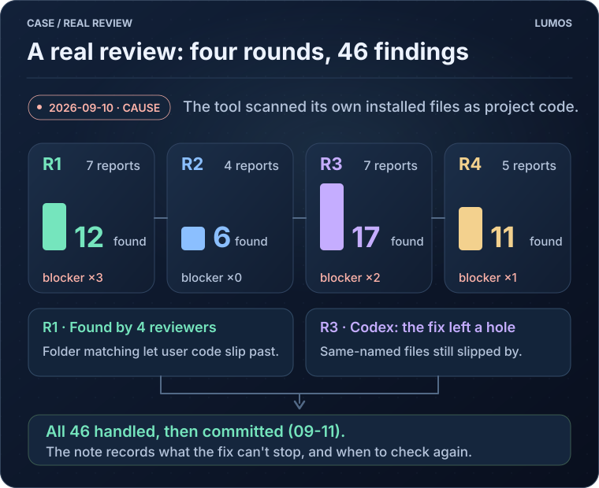

<p align="center">
  <picture>
    <source media="(prefers-color-scheme: dark)" srcset="assets/lumos-logo-dark.png">
    
  </picture>
</p>

# Lumos

[繁體中文](README.md) · **English**

[](https://github.com/EnzoHsieh-Android/Lumos/actions/workflows/ci.yml)

**When AI writes your code, have it record the reasoning too.**

Writing code through a conversation with AI is fast, but the AI does not keep a record for the project. The trade-offs you discussed and the options you rejected are gone when you start a new conversation. A rule like "an order must never be refunded twice" cannot be seen in the code. And when the AI says the tests passed, there is no way to check afterward which tests it ran.

Lumos fills that gap. It works alongside Claude Code or Codex and requires the AI to record the reason for each code change, the rules it must preserve, and how the change was verified. These Markdown notes live in the same repo as the code. At commit and push time, Git hooks check what can be checked automatically, such as whether the notes were updated. Think of it as ADRs (architecture decision records), CODEOWNERS, and pre-commit connected together, with the AI as the subject of the checks.

The toolset is small: a single-file Python command-line tool that uses only the standard library, a set of Git hooks, AI working instructions in CLAUDE.md / AGENTS.md, and the project notes.

## What it looks like

Suppose the AI changes the refund logic and commits without writing any notes. It receives this message (an excerpt of real output, translated from the tool's Chinese):

```text
$ git commit -m "feat: check whether an order was already refunded"

Blocked: this commit changes code, but not a single knowledge note was touched.
…
Code changed in this commit (1):
   • src/payment.py
…
Pick one of two paths:
   1. Update the notes that should change, add them to the commit, and commit again.
   2. This really needs no note change (typo, formatting, comments, work in progress) → skip this check:
        git commit --no-verify -m '<message>'
      Skipping is recorded; it is not a silent pass.
```

That message is for the AI to read. Its working instructions require it to update the notes and commit again. If no note update is needed, such as for a typo fix, it can skip the check, but the skip is recorded. Your role is mainly to make business trade-offs and decide whether to accept a given risk.

## How it works

<p align="center">
  <a href="assets/map-en.svg">
    
  </a>
</p>

1. **Read the code, add context**: The AI reads the code first. When it edits a file, the tool provides related notes with reasoning the code cannot reveal. If a note describes behavior that disagrees with the code, the code takes precedence. Questions the code cannot answer, such as deployment state or business constraints, need to be checked at the source or put to a person.
2. **Assign AI reviewers based on risk**: See the next section.
3. **Every finding needs an outcome**: Fix the problem, explain why it will not be fixed, or show evidence that it is not a problem. Nothing passes until every finding has been addressed.
4. **Update the notes**: Record the trade-offs and verification method in the note responsible for documenting the file, so the next person or AI working there can find them.

The outer loop checks the process itself. In Lumos's own repo, every case that has completed review and has a design spec keeps a pass/fail verdict. Each week, cases are rerun under the same version of the rules to confirm that they still get the same verdict. When there are too many to run in time, a rotating sample is used. If a verdict changes, a rule change broke something and needs fixing.

## Connecting plans, features, and verification

The project calls its linked notes a “graph” and each note a “node.” Notes cover plans, feature descriptions, verification records, and incidents. The fictional online shop below starts with plans for checkout and payment integration, then implements the features and records the results of checkout end-to-end tests and duplicate-payment stress tests. Important rules are marked as protected, shown by gold rings, only after they are linked to verification records. If canceling an order fails to refund points, the incident is linked back to the affected checkout flow. A points-refund fix is then planned and implemented, followed by a points-refund regression test.

<p align="center">
  <a href="assets/graph-demo-en.svg">
    
  </a>
</p>

## How code review works

<p align="center">
  <a href="assets/risk-review-en.svg">
    
  </a>
</p>

- **Assess the risk first**: Before a push, the tool scans newly added code using fixed rules to find patterns that tend to cause problems.
- **Then choose how many AI reviewers to assign**: Ordinary changes get one or two reviewers. High-risk changes get at least 7 per round, each examining one aspect: 5 look for problems, 1 checks consistency with the existing architecture, and 1 checks security. If a finalized design spec exists, 1 more checks the change against it.
- **High-risk changes cannot be pushed until review is complete**: Before the push, the review outcome must be recorded as passed or skipped, with a written reason for skipping. Otherwise, the Git hook blocks the push.

Review is only one layer. Risk classification, multiple AI reviewers, rules for allowing changes through, external rules (linters), and tests all have gaps. Layering them makes it harder for a problem to get through every check. This is the Swiss cheese model.

<p align="center">
  <a href="assets/swiss-cheese-en.svg">
    
  </a>
</p>

## Where humans come in

By default, Lumos does not require a person to read every diff line by line. Multiple AIs and automated checks do that work, while people make the following judgment calls.

- People decide on requirements, trade-offs, whether to accept risks, and irreversible operations.
- A high-risk review runs for at most 3 rounds. If it still has not passed, the process stops and a person takes over; the AI does not declare a pass on its own. This is a working rule: the tool only warns when the limit is reached.
- A person must sign off on whether a rule still fits the business and record that decision. Tests cannot establish this.
- Each round's review reports and outcomes stay in the repo, where people can spot-check them at any time.

## A real example

Lumos copies its own code and hooks into users’ projects. Including those files in the risk scan caused a small project’s first push to be falsely rated high-risk. The first fix skipped the entire tool directory, but four reviewers independently noticed in round 1 that this would also skip user code stored there. The next fix matched exact filenames. In round 3, reviewers found that this still skipped user files with the same names and tool files that had been modified. The final fix records content fingerprints (hashes) at installation and skips a file only when its filename is on the list and its content matches. This prevents accidental omissions, but someone who also changes the list can deliberately bypass it. The [original review reports (in Chinese)](governance/review-reports/code-工具自裝檔不算消費專案/) are in the repo.

<p align="center">
  <a href="assets/case-review-en.svg">
    
  </a>
</p>

## How notes are kept from going stale (drift)

When code changes but a note still describes the old behavior, it can mislead an AI that reads it. I deliberately planted incorrect notes in a synthetic project, and the smaller model, Haiku 4.5, dropped from 20/25 correct answers to 12/25. Lumos therefore addresses the problem at three points: when writing notes, at commit time, and before a push.

The first check starts with what goes into a note. Fields, defaults, and flows that can be read from the code should not be copied into notes; notes are for reasons the code cannot reveal. The tool can only catch two fixed patterns here: newly added code line references and current-state descriptions, such as deployment settings, that do not cite a source. Both are blocked at commit time. The rest still depends on working rules and review.

Some sentences are especially likely to go stale. Say a note reads “there is no refund page yet.” Once the refund page is built, the sentence is wrong, and nobody remembers to come back and fix it. When such a sentence is added, the tool suggests turning it into a one-line “revisit condition” that says when the sentence should be checked again, for example “when the refund page’s file appears.” If the writer follows that advice, the push that adds that file is blocked, and the pre-push check points at the sentence. It must be updated to describe the current state, or kept with a stated reason, before the push can go through. The suggestion itself does not block the commit.

At commit time, the second check looks for notes maintained alongside the code. It blocks code changes that update no notes, as well as new source files with no note assigned to document them. Before a push, the third check looks for outdated statements in the notes. If a function was deleted or a file renamed but a note still mentions the old name or path, it only warns. The following cases block the push: a rule’s test is already in place but the note still says “test to be added”; a linked note has been deleted; or one of the revisit conditions described above has been met. Code changes without a note update and broken note links always block; projects can set the other blocking checks to warn instead.

<p align="center"><a href="assets/drift-guard-en.svg"></a></p>

How much do these checks catch? In another project using Lumos, we found 20 genuinely stale passages and checked each one with the tools. The checks caught 7 cases of existing drift (35%). Had these checks been in place before the original pushes, they could have caught about 13.5, or roughly two-thirds. One case was only half covered, so it counts as half. Some changes still slip through: a feature is added while a note still says it does not exist, or a value changes while its name stays the same. The first case now gets a reminder when such a sentence is newly written, but sentences already in the notes are not rescanned. We have not finished measuring how many findings are false alarms.

Once problems are found, some can be fixed by the tool. `lumos drift fix` can handle five kinds of status mismatch by type, such as a plan that has been wrapped up while its verification record is still marked pending. For one of those types, it only lists the evidence; a person still has to fill in the details. Outdated wording in notes also still has to be rewritten by a person.

The second check has a straightforward limit: it can tell whether a note was updated, but not whether the updated content is correct. In that same project, we sampled 55 current-state statements. Of the 54 we could assess, 22 were already stale. That is why the first check was added later, to address what gets written in the first place. Whether the notes are actually correct still comes down to review and people.

<details>
<summary>More: review data and skip records</summary>

- **Do multiple reviewers help?** In 85 multi-reviewer rounds on Lumos itself (2026-07 to 08), 531 of 822 problems (64.6%) were caught by only one reviewer, showing that different reviewers notice different problems. This is only descriptive data: it cannot predict the effect of adding or removing one reviewer. The number of reviewers who caught each problem was entered manually by the AI responsible for assigning reviews and collecting the reports.
- **Were the findings real problems?** As of 2026-09-30, only 58 of 6,195 findings (0.9%) were judged not to need action. That judgment was also made by AI, though.
- **Were skipped checks justified?** The "change code, update notes" check was skipped 84 times across about 2,070 commits in Lumos’s own repo. Claude and Codex each independently examined every skip. Both agreed that 8 changed behavior without recording why; 17 changed only test files. Most of the rest were commits made partway through work on a feature branch, with notes added later. [Per-skip judgments](governance/eval/readme-bypass-judge/)
- **What about larger models?** Opus 5 scored 25/25 in all four groups of the experiment above and wasn't misled, but with notes each run took 2 to 5 times as long.
- **Did notes actually help?** Another 80 runs tested rules the code can't reveal: with code only, 0 of 5 correct; with notes, 8 of 15. One synthetic project with questions I designed, so it supports the direction rather than settling it.
- **What it cannot stop**: Some auxiliary checks let changes through when the checks themselves fail, so a tool failure does not stall development. Skipping checks at commit time is recorded. Skipping push checks with `--no-verify` leaves no local record; CI only reruns the checks on pushes to main or pull requests.
- Raw records you can check: [blocks and passes](docs/.governance-log.jsonl), [skips](docs/.bypass-log.jsonl), [review reports](governance/review-reports/).

</details>

## Install and limits

You need Git, Python 3.14+, and Claude Code or Codex. Run this from the project directory where you want to use Lumos:

```bash
curl -fsSL https://raw.githubusercontent.com/EnzoHsieh-Android/Lumos/release/get.sh | bash
```

When the script asks whether to initialize the current directory, confirm that it is the right one before entering `y`. After installation, restart the AI session and run `lumos enforcement` to confirm that all checks are connected. For Windows, offline installation, and removal, see the [onboarding guide](ONBOARDING.md) (Chinese).

<details>
<summary>Projects already on an older Lumos: moving to Python 3.14</summary>

- After updating, commits and pushes are blocked on machines without 3.14, with install instructions (macOS: `brew install python@3.14` or `uv python install 3.14`). If `python3` points to an older version, lumos finds 3.14 and re-runs itself.
- Set your CI's `actions/setup-python` to 3.14.
- Once 3.14 is installed, run `lumos install` once so the Claude/Codex hooks use it too.
- This changes the Codex hook command lines, so Codex may ask you to re-approve them in an interactive session. Codex's trust state cannot be read locally; confirm with `lumos enforcement` plus one real trigger.

</details>

Lumos does not guarantee quality or security, and it does not replace engineering judgment. Notes can go stale, AI reviews can miss problems, and having a record does not mean its content is correct. Business trade-offs, irreversible operations, and whether to accept a risk still require a person’s decision.

Further reading: [Mental model](docs/mental-model.md) · [Taking over a project](docs/taking-over.md) · [Command reference](docs/command-reference.md) · [Architecture](ARCHITECTURE.md) · [SDD and Lumos](SDD-vs-Lumos.en.md) · [Methodology](docs/methodology/圖譜即合約.md) (Chinese)

License: [MIT](LICENSE). Your notes belong to you; Lumos claims no rights over them.
