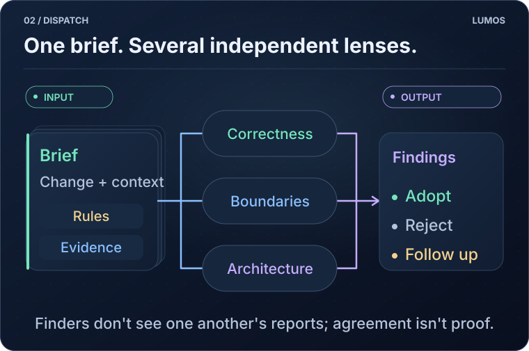
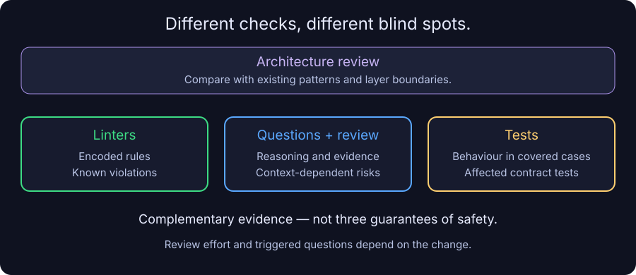
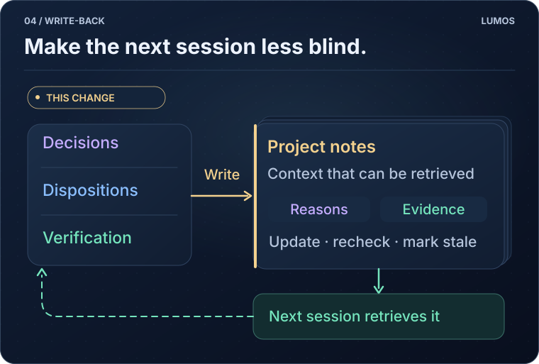

<p align="center">
  <picture>
    <source media="(prefers-color-scheme: dark)" srcset="assets/lumos-logo-dark.png">
    
  </picture>
</p>

# Lumos

[繁體中文](README.md) · **English**

[](https://github.com/EnzoHsieh-Android/Lumos/actions/workflows/ci.yml)

**When an AI writes your code, make it leave the "why" behind too.**

Lumos is a development toolkit for Claude Code and Codex. You describe what you want in conversation, and the AI reads the code, changes it, runs the tests, and commits. Lumos asks the AI to write down, alongside each change, why it was made, which rules must not break, and how it was verified, and at Git commit and push time it checks the parts that can be checked mechanically, such as whether any note was touched.

It is made of four parts: a single-file Python command-line tool (standard library only), a set of Git hooks, working instructions for the AI written into CLAUDE.md / AGENTS.md at install time, and a set of Markdown notes kept in the same repo as the code and linked to each other.

## Why it exists

AI writes code quickly, but it does not remember anything on the project's behalf. The trade-offs discussed in one conversation, and the options that were rejected, are gone the next time a conversation starts. A rule like "an order must never be refunded twice" is invisible in code that only shows what happens today, not which behaviour is off-limits. And when the AI says the tests passed, there is no way to check afterwards which ones actually ran.

Traditionally these gaps are filled by practices like ADRs (architecture decision records), CODEOWNERS, and pre-commit, plus human discipline. Lumos wires those ideas together, except that the one being checked is the AI: change code without touching any note and the commit is blocked; skipping has to be done explicitly, and it is recorded.

## What it looks like

Suppose the AI changes the refund logic and commits without writing any note. It receives this message (real output, trimmed and translated from the tool's Chinese):

```text
$ git commit -m "feat: check whether an order was already refunded"

Blocked: this commit changes code, but not a single knowledge note was touched.
…
Code changed in this commit (1):
   • src/payment.py
…
Pick one of two paths:
   1. Update the notes that should change, add them to the commit, and commit again.
   2. This really needs no note change (typo, formatting, comments, work in progress) → skip this check:
        git commit --no-verify -m '<message>'
      Skipping is recorded; it is not a silent pass.
```

The reader of that message is the AI, not you. Its working instructions tell it to add the note and commit again; if no note is really needed (say, a typo fix), it can skip, and the skip is recorded. You only step in for business trade-offs or decisions about accepting a risk.

## What a change goes through

<p align="center">
  <a href="assets/map-en.svg">
    
  </a>
</p>

**① Read the code, add context.** The AI reads the code first to understand how things are now; when it edits a source file, the tool usually also pushes the notes related to that file in front of it (sometimes it skips, for example if the tool itself fails). Notes only add what the code cannot show: why something was designed this way, what was tried and failed, which rules must never break. Anything the code itself can answer stays out of the notes, because a copy only goes stale before the code does; when the two disagree, the code wins.

**② Dispatch.** Before a push, the tool scans the newly added code with fixed matching rules for patterns that tend to cause trouble, such as database writes outside a transaction or HTTP calls without a timeout, and rates the risk from that. For ordinary changes the instructions call for just one or two reviewers; a high-risk change gets up to 9 AI conversations per round, each looking from one angle: 4 on general problems (correctness, concurrency and resources, edges and inputs, consistency with existing rules and notes), 1 on consistency with the existing architecture, 1 on security, 1 more against the design spec when a finalized one exists, and finally 2 deliberately given to another vendor's model (Codex when Claude is orchestrating), so they don't all share the same blind spots. The problem-finders don't see each other's reports; the other vendor's refuter waits until the reports are in and argues against the serious findings.

**③ Review & resolve.** Every finding is recorded as accepted, rejected, or pending. At push time only high-risk changes are checked: they must first leave a review outcome, passed or skipped with a written reason; ordinary changes are not blocked for lacking a review record.

**④ Write back.** When the work is done, the AI writes the trade-offs, the review outcome, and how it was verified back into the note that owns the file, so the next AI to touch this code can find them.

The outer loop checks the process itself. In Lumos's own repo, cases that completed review and have a design spec are stored with their verdicts and re-run weekly under the same version of the verdict rules (sampling in rotation when there are many), to confirm the same input still gets the same result; when the verdict rules change version, old cases are marked stale and re-stored after a person confirms.

It matters which parts are enforced and which are only asked for. Common things the Git hooks block include: a code change with no note touched at all, a new source file with no assigned note, a high-risk push with no review outcome, and new linter warnings introduced by this change (in projects with a linter configured), plus a few more such as note formatting and failing tests for affected rules. Whether the AI consulted the notes, and whether what it wrote back is any good, are instructions to the AI: the tool can confirm something was done, not whether it was done well. A project can also switch most checks to warn-only; tests, docs, third-party and generated files, and paths the project config excludes, don't need an owning note.

<details>
<summary>Details and diagrams for each step</summary>

<a id="notes"></a>

**Notes**

<p align="center">
  <a href="assets/graph-demo-en.svg">
    
  </a>
</p>

- When a note really must describe current state that isn't in source (deployment settings, actual database values, production observations), that line has to name its source; a newly written current-state line in a note's structured summary without one is blocked at commit.
- When a note and the code disagree, the code wins by default; only sourced records such as decision and verification records can say the code is wrong.
- An important rule can be tied to a test that checks it. Unlike an ordinary test, when related code changes the tool finds it automatically and runs it before the push: a failure blocks a high-risk push and is only a warning on a low-risk one.

<a id="dispatch"></a>

**Dispatching the review**

<p align="center">
  <a href="assets/dispatch-overview-en.svg">
    
  </a>
</p>

- Problem-finding reviewers are not given each other's reports, to reduce echoing; but the tool cannot control what an external AI conversation actually reads, and later rounds carry the previous round's outcomes.

<a id="review"></a>

**Review**

<p align="center">
  <a href="assets/review-overview-en.svg">
    
  </a>
</p>

- Risk is judged with regular expressions over the newly added lines: fast and language-agnostic, but it can misjudge.
- Whenever a review is dispatched, at any risk level, it includes an "architecture consistency" reviewer: it uses existing code in the same layer as the standard and only flags "introducing a second way of doing something" and "calling across layers", not style.
- Design plans are tiered too. The first question is "if this goes wrong, is rolling back to the previous version enough?" Plans touching money, outbound sends, irreversible data, or the checks themselves get a design review before any code is written; for the rest, every acceptance clause needs evidence, usually a test that fails now and passes once the work is done.
- Linters only block warnings introduced by this change, so an older project isn't buried under its backlog when it adopts Lumos. Every layer has holes; stacked, it is harder for a problem to get through all of them (the Swiss cheese model).

<p align="center">
  <a href="assets/swiss-cheese-en.svg">
    
  </a>
</p>

<a id="write-back"></a>

**Write-back**

<p align="center">
  <a href="assets/writeback-overview-en.svg">
    
  </a>
</p>

- Explanations must go into the note that owns the file; writing them into a note that doesn't own it is blocked.

<a id="evals"></a>

**Checking the process itself**

<p align="center">
  <a href="assets/evals-overview-en.svg">
    
  </a>
</p>

- Only cases that completed review and have a design spec get their verdicts stored; they are re-run weekly under the same version of the verdict rules (sampling in rotation when there are many), to confirm results don't change; when the verdict rules change version, old cases are marked stale and re-stored after a person confirms.

**What it can't stop**: some checks only look at what this change touched (for example the risk scan and new linter warnings); some auxiliary checks let the change through if they fail themselves, so a tool failure doesn't stall development; skipping the "change code, touch notes" check at commit time is recorded, but skipping the push checks with `--no-verify` leaves no local record, and CI only reruns them on pushes to main or pull requests.

</details>

## A real example

On 2026-09-10, the first small Vue project to adopt Lumos ran into a problem on day one: the tool scanned the files it had installed into the project as if they were the project's own code, so the small project's very first push was rated high-risk. The change fixing this was itself rated high-risk, so it had to go through review.

<p align="center">
  <a href="assets/case-review-en.svg">
    
  </a>
</p>

The first round opened 7 AI reviewers (the cap is 9; this time 5 Claude and 2 Codex), and 4 of them independently found the same most serious problem: the fix identified "the tool's files" by directory name, so a user's own code in the same directory would also be skipped and escape review entirely. In the third round, after that was fixed, Codex pointed out the new fix still had a hole, with reproduction steps. Its finding opened like this (translated excerpt):

```text
### F20 Exact file name not proven to be installed; a same-named project hook escapes the high-risk scan
severity: blocker
```

In other words: any user code that happens to share a tool file's name would be mistaken for the tool's and skip the risk scan. So the fix changed to recording a content fingerprint of every tool file at install time (a hash computed from the file's content, which stops matching as soon as the content changes), and skipping a file only if its content matches. Across four rounds there were 46 findings, all dealt with before the commit (09-11).

What went back into the notes was not just the fix but also what it cannot prevent: the fingerprint list lives in the project, so someone who edits it along with a tool file still gets through; it guards against accidents, not deliberate bypass. The note also sets a check-back date (2027-03-10): look for anyone having changed a tool file and the list together, and if so, compare against the toolchain source instead.

Every round's [original review reports](governance/review-reports/code-工具自裝檔不算消費專案/) and [that note](docs/lumos-toolchain-knowledge/Issues/健檢技術棧那段撞到多平台設定就整支中斷.md) are in the repo (in Chinese).

## Does it help?

**Wrong notes mislead the AI, so notes only hold what the code can't show.** In 2026-09 I ran a controlled experiment on a synthetic project, planting wrong notes on purpose, 25 runs per group:

| Condition | Haiku 4.5 (Anthropic's smaller model) correct |
| --- | --- |
| Code only | 20/25 |
| Code + wrong notes | 12/25 |
| Same wrong notes, but "defer to the code" marked next to the wrong line | 20/25 |

The larger Opus 5 scored 25/25 in all four groups and was not misled, but with notes each run took 2 to 5 times as long and used 1 to 3 times the tokens. Another batch of 80 runs tested "rules the code cannot reveal": on the question "large refunds need manual approval", the AI with code only got it right 0 out of 5 times, and the groups with notes 8 out of 15. The experiment used one synthetic project with questions I designed myself, so it supports the direction rather than settling it; but Lumos's current rule, "code first, notes second", was changed because of these results.

**Different reviewers see different things.** In 85 multi-reviewer rounds on Lumos itself (2026-07 to 08), 531 of 822 distinct problems (64.6%) were reported by only one reviewer; the same problem is often caught by just one, which is why only high-risk changes get the full panel. This is a descriptive statistic (the number of reviewers that caught each problem was entered by hand, round by round, by the orchestrating AI) and can't be used to predict how much one more or one fewer reviewer would change. Were those problems real? As of 2026-09-30, of all 6,195 findings only 58 (0.9%) were judged not to need action; the rest were all taken up for handling. That judgement, though, was also made by AI, not by manual sampling.

**When the check was skipped, was it justified?** The "change code, touch notes" check was skipped 84 times across about 2,070 commits in Lumos's own repo. I had Claude and Codex review every one independently: both agreed 8 of them changed behaviour without recording why; 17 only changed test files, which this check blocks by design but where skipping is reasonable; most of the rest were mid-way commits on a feature branch whose notes were added later on the same branch, and the two reviewers disagreed on whether that counts as justified. How often the check blocks wrongly can't be computed yet, because blocks that were not skipped were never logged.

**Where it's used.** Besides Lumos itself (about 2,300 commits, about 1,400 test functions), I have used it for about two months on two production projects at work: a C#/.NET + Vue backend and a Kotlin Android app. A with-and-without comparison on a real project hasn't been done.

Lumos's own numbers above can be checked: the [block and pass log](docs/.governance-log.jsonl), the [skip log](docs/.bypass-log.jsonl), [the two AIs' judgement of every skip](governance/eval/readme-bypass-judge/), and [every review round's reports](governance/review-reports/) are in the repo. Usage on the work projects is my own account.

## Common questions

**Isn't this over-engineering?** For a throwaway prototype or a small project nobody will take over, yes, and I wouldn't use it there. It is designed for projects that live long, change hands between people or AI conversations, and have rules that must not break (payments, permissions, data migrations); review weight follows risk, and ordinary changes don't require a review to push.

**Won't the AI just write a throwaway note to get past the check?** It can: the "change code, touch notes" check only asks whether a note was touched. In another project using Lumos, I sampled 55 higher-risk current-state statements from the notes; of the 54 that could be judged, 22 were already out of date. That led to another check: a newly written current-state line in a note's structured summary must name its source, or it is blocked. That only catches fixed patterns; whether the content is right still depends on review and people.

**AI writes it and AI reviews it: isn't that just grading its own homework?** That concern is valid. What I can do is mix two vendors' models in review, have one of them argue against the rest, and keep a record of every finding and how it was handled, so a person can check afterwards; the requirements and trade-offs are my decisions. But that is not the same as someone re-checking every review conclusion, and there is no real-project comparison yet showing the final code got better.

**Can the AI quietly edit the tests that check it?** The automatically run hooks and tests have content fingerprints; on a normal push, a changed one is blocked until the change is approved and recorded. `--no-verify` bypasses this local check, but CI verifies it again on pushes to main or pull requests; editing the fingerprints too still leaves a visible difference in the version history.

**What does it cost?** The commit check takes about 3 seconds each time (measured on a small demo project; method in [this plan note](docs/lumos-toolchain-knowledge/Projects/README面試官十分鐘_計劃.md), in Chinese); with notes the AI reads more, and in the experiment tokens went up 1 to 3 times; a high-risk review opens several AI conversations, so cost grows with the number of reviewers and depends on the models used.

**What did you do yourself? Why is the main program one 38,000-line file?** This repo was itself developed through conversation: the requirements and design trade-offs are my decisions, most of the code is written by AI (about 88% of commits are co-signed by Claude). Precisely because most of the code is AI-written, tests matter more: there are about 1,400 test functions, CI reruns them on pushes to main (docs-only changes run only the docs-related subset), and the badge at the top shows the current state. The single file is a deliberate postponement: in 2026-07 an external review suggested splitting it into modules, but the tamper-check fingerprints, the tests, and the copy installed into other projects are all tied to file paths, and with one maintainer the risk of splitting outweighed the benefit. It waits for a second maintainer.

## Install and limits

You need Git, Python 3.14+, and Claude Code or Codex. From the project you want to onboard, run:

```bash
curl -fsSL https://raw.githubusercontent.com/EnzoHsieh-Android/Lumos/release/get.sh | bash
```

When the script asks whether to initialize the current directory, check it's the right one before answering `y`. After installing, restart the AI session and run `lumos enforcement` to confirm the checks are wired up. For Windows, offline installation, and removal, see [onboarding](ONBOARDING.md) (Chinese).

<details>
<summary>Projects already on an older Lumos: moving to Python 3.14</summary>

- After updating, commits and pushes are blocked on machines without 3.14, with install instructions (macOS: `brew install python@3.14` or `uv python install 3.14`). If `python3` points to an older version, lumos finds 3.14 and re-runs itself.
- Set your CI's `actions/setup-python` to 3.14.
- Once 3.14 is installed, run `lumos install` once so the Claude/Codex hooks use it too.
- This changes the Codex hook command lines, so Codex may ask you to re-approve them in an interactive session. Codex's trust state cannot be read locally; confirm with `lumos enforcement` plus one real trigger.

</details>

Lumos does not guarantee quality or security, and it does not replace engineering judgement: notes can go stale, AI review can miss things, and a record does not make the content correct. Business trade-offs, irreversible operations, and whether to accept a risk still need a person to decide.

Further reading: [Mental model](docs/mental-model.md) · [Taking over a project](docs/taking-over.md) · [Command reference](docs/command-reference.md) · [Architecture](ARCHITECTURE.md) · [SDD and Lumos](SDD-vs-Lumos.en.md) · [Methodology](docs/methodology/圖譜即合約.md) (Chinese)

Licence: [MIT](LICENSE). Your notes are yours; Lumos claims no rights over them.
