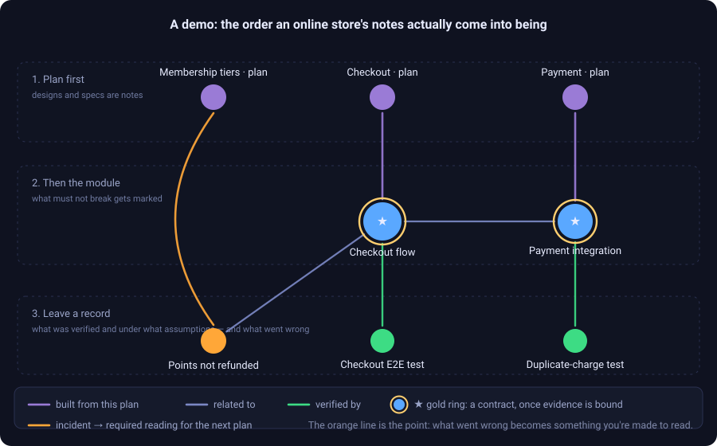
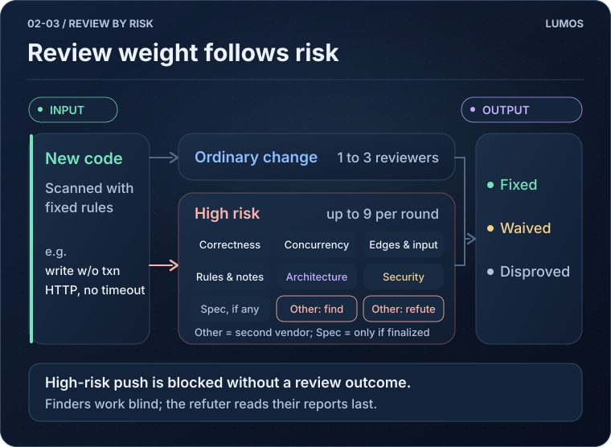
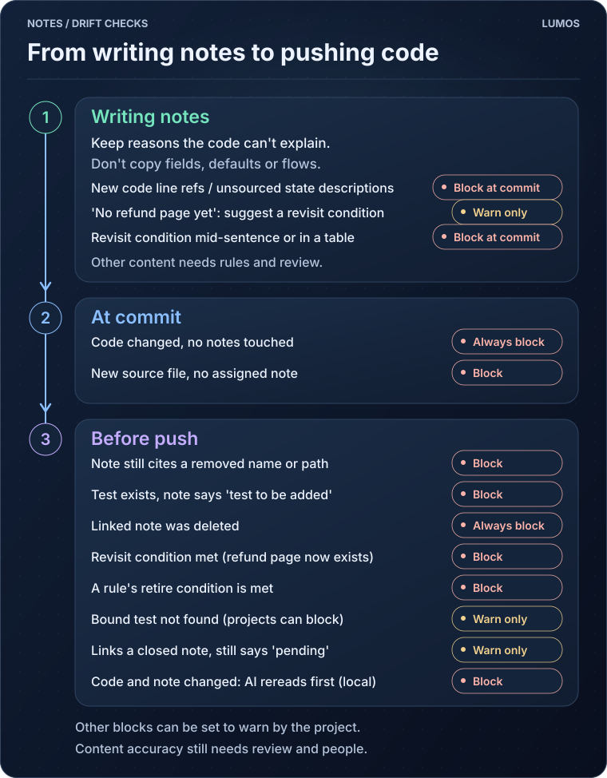
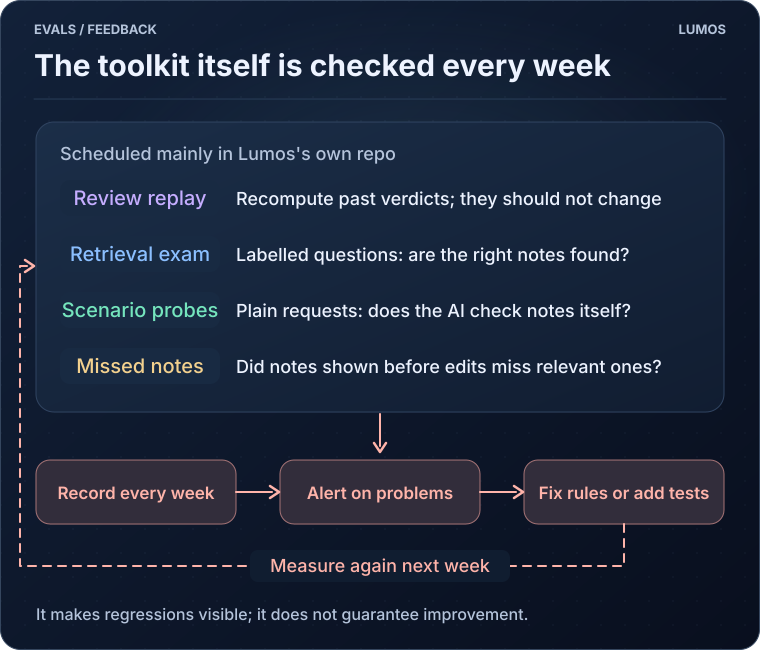

<p align="center">
  <picture>
    <source media="(prefers-color-scheme: dark)" srcset="assets/lumos-logo-dark.png">
    
  </picture>
</p>

# Lumos

[繁體中文](README.md) · **English**

[](https://github.com/EnzoHsieh-Android/Lumos/actions/workflows/ci.yml)

**When AI writes your code, have it record the reasoning too.**

Lumos is built for natural-language development: you describe what you need, and AI proposes and implements a solution, without being tied to one programming language. It adds a layer of control and records—a harness—to address five problems: opaque work, lost context, stale notes, hard-to-verify results, and increasingly messy architecture. The goal is to keep people in control without reading every diff line by line, so they can delegate more development to AI and advance several projects at once.

Coding through conversation is fast, but trade-offs and rejected options stay in that conversation. Reopen it, and the context is there. Three months later, when someone edits the same file, nobody remembers which conversation it was; teammates and other AI tools cannot see it either. Code may check that "an order must never be refunded twice" without explaining why the check must stay. AI says the tests passed, but afterward you cannot tell which ones it ran.

Lumos keeps that context in the project. With Claude Code or Codex, it requires AI to record each code change's reasons, rules to preserve, and verification method in Markdown notes. Versioned alongside the code, the notes are available to anyone using any tool. At commit and push time, Git hooks check what can be automated, such as whether notes were updated. Think of ADRs (architecture decision records), CODEOWNERS, and pre-commit combined to check AI's work. For code quality, Lumos uses each language's existing linters and community rules, blocking only new warnings before a push. It assigns AI reviewers by risk to examine changes from several angles and confirms that tests ran and can catch problems.

The toolset is small: a single-file Python CLI using only the standard library, Git hooks, AI working instructions in CLAUDE.md / AGENTS.md, and project notes.

## What it looks like

If AI changes the refund logic and commits without writing notes, it receives this message (real output, excerpted and translated from Chinese):

```text
$ git commit -m "feat: check whether an order was already refunded"

Blocked: this commit changes code, but not a single knowledge note was touched.
…
Code changed in this commit (1):
   • src/payment.py
…
Pick one of two paths:
   1. Update the notes that should change, add them to the commit, and commit again.
   2. This really needs no note change (typo, formatting, comments, work in progress) → skip this check:
        git commit --no-verify -m '<message>'
      Skipping is recorded; it is not a silent pass.
```

The message is for AI: its instructions require it to update the notes and retry. If no update is needed, such as for a typo fix, it can skip the check, but the skip is recorded. You mainly decide business trade-offs and whether to accept a risk.

## How it works

<p align="center">
  <a href="assets/map-en.svg">
    
  </a>
</p>

1. **Read the code, add context**: AI reads the code first. When it edits a file, the tool supplies related notes with reasons the code cannot reveal. For descriptions of code behavior, code takes precedence over conflicting notes. For deployment state, business constraints, and other questions code cannot answer, verify or ask a person.
2. **Assign AI reviewers based on risk**: See "How code review works" below.
3. **Every finding needs an outcome**: Fix it, explain why it will not be fixed, or disprove it with evidence. All findings must be addressed to pass.
4. **Update the notes**: Record trade-offs and verification methods in the note responsible for that file, ready for the next change.

The outer loop checks the process itself; see "How the toolkit keeps improving (evals)" below.

## Connecting plans, features, and verification

Linked notes form a “graph”; each note is a “node” covering a plan, feature description, verification record, or incident. The fictional shop below shows the sequence: plan checkout and payment integration, build the features, then record results from checkout end-to-end tests and duplicate-payment stress tests. Important rules become protected (gold rings) only after linking to verification records. If canceling an order fails to refund points, the incident links back to checkout, followed by a repair plan, a fix, and a regression test.

<p align="center">
  <a href="assets/graph-demo-en.svg">
    
  </a>
</p>

## How code review works

<p align="center">
  <a href="assets/risk-review-en.svg">
    
  </a>
</p>

- **Assess risk first**: Before a push, fixed rules scan newly added code for patterns prone to problems.
- **Choose how many AI reviewers to assign**: Ordinary changes get 1 to 2; high-risk changes get at least 7 per round: 5 look for problems, 1 checks architectural consistency, and 1 checks security. A finalized design spec adds 1 reviewer to check against it.
- **High-risk changes need a review outcome to push**: Record a pass or a skip with a written reason before pushing; otherwise, the Git hook blocks the push.

Review is one layer. Risk classification, AI review, approval rules, external rules (linters), and tests each have gaps. Stacking them makes it harder for a problem to pass through them all: the Swiss cheese model.

<p align="center">
  <a href="assets/swiss-cheese-en.svg">
    
  </a>
</p>

## Where humans come in

By default, Lumos leaves line-by-line diff review to AI and automated checks. People handle these decisions:

- Requirements, trade-offs, risk acceptance, and irreversible operations.
- High-risk review runs for at most 3 rounds. If it still has not passed, a person takes over; AI cannot declare a pass itself. This is a working rule—the tool only warns at the limit.
- Whether rules still fit the business requires human sign-off and a record; tests cannot establish this.
- Each round's review reports and outcomes stay in the repo for spot-checking at any time.

## How notes are kept from going stale (drift)

Notes that describe old code can mislead AI. When I planted incorrect notes in a synthetic project, the smaller model, Haiku 4.5, dropped from 20/25 correct answers to 12/25. Lumos therefore checks at three points: writing notes, committing, and pushing.

**First check: write only what code cannot reveal.** Fields, defaults, and flows that the code already shows are not copied into notes. The tool blocks only two fixed patterns at commit time: new code line references and current-state descriptions (such as deployment settings) without a source. The rest relies on working rules and review.

Some sentences go stale easily: “there is no refund page yet” becomes wrong once the page exists, but nobody returns to fix it. When such a sentence is added, the tool suggests a one-line “revisit condition” stating when to check again, such as “when the refund page's file appears.” If the writer follows that advice, the push adding that file is blocked and the check points to the sentence. Update it or give a reason to keep it before pushing. The suggestion itself does not block commits.

**Second check: update notes when committing code.** Code changes without any note updates, or new source files without an assigned note, block the commit.

**Third check: find outdated statements before pushing.** Deleted functions or renamed files still mentioned by their old names or paths only trigger warnings. Pushes are blocked if a rule's test exists but its note still says “test to be added,” a linked note was deleted, or a revisit condition is met. Code changes without note updates and broken note links always block; projects can set other blocking checks to warn instead.

One more pre-push check only warns. When a push changes both the code and the note that manages it, the note often just gets a new paragraph while older sentences go unread: the code moves from three variables to four, yet the note still says three. Literal matching can't catch this, so the tool reminds you to give the change and the whole note to AI, which points out the lines that are no longer true.

<p align="center"><a href="assets/drift-guard-en.svg"></a></p>

## How the toolkit keeps improving (evals)

You cannot rely on gut feeling alone to tell whether a rule change broke something or the AI is following the rules. Lumos runs four evaluations (evals), each once a week:

- **Review replay**: Reviewed cases store a pass/fail verdict. The current judging code recomputes it (no new AI review); a mismatch is flagged so someone can check whether a rule change broke something.
- **Retrieval exam**: Uses questions with human-labelled answers to check whether the tool finds the notes it needs.
- **Scenario probes**: Gives the AI plain-language requests to carry out in an isolated copy of the repo, checking whether it looks up notes and uses the right commands on its own.
- **Missed notes**: Checks whether the notes shown before an edit omit any that should be read.

<p align="center">
  <a href="assets/evals-overview-en.svg">
    
  </a>
</p>

Results are recorded weekly, and regressions or failed checks alert a person. Fixes become new rules or tests, checked again the next week. Major changes in direction start with a controlled experiment: the principle "read the code first; notes only add context" was adopted only after such an experiment.

These evals run only in Lumos's own repo. They ensure regressions are visible, but do not guarantee that every change is an improvement.

## Install and limits

You need Git, Python 3.14+, and Claude Code or Codex. Run this in the project directory:

```bash
curl -fsSL https://raw.githubusercontent.com/EnzoHsieh-Android/Lumos/release/get.sh | bash
```

When asked to initialize the current directory, check that it is correct before entering `y`. After installation, start a new AI session and run `lumos enforcement` to confirm all checks are connected. For Windows, offline installation, and removal, see the [onboarding guide](ONBOARDING.md) (Chinese).

<details>
<summary>Projects already on an older Lumos: moving to Python 3.14</summary>

- After updating, commits and pushes are blocked on machines without 3.14, with install instructions (macOS: `brew install python@3.14` or `uv python install 3.14`). If `python3` points to an older version, lumos finds 3.14 and re-runs itself.
- Set your CI's `actions/setup-python` to 3.14.
- Once 3.14 is installed, run `lumos install` once so the Claude/Codex hooks use it too.
- This changes the Codex hook command lines, so Codex may ask you to re-approve them in an interactive session. Codex's trust state cannot be read locally; confirm with `lumos enforcement` plus one real trigger.

</details>

Lumos guarantees neither quality nor security and does not replace engineering judgment: notes can go stale, AI reviews can miss problems, and records do not prove correctness. People still decide business trade-offs, irreversible operations, and risk acceptance.

Further reading: [Mental model](docs/mental-model.md) · [Taking over a project](docs/taking-over.md) · [Command reference](docs/command-reference.md) · [Architecture](ARCHITECTURE.md) · [SDD and Lumos](SDD-vs-Lumos.en.md) · [Methodology](docs/methodology/圖譜即合約.md) (Chinese)

License: [MIT](LICENSE). Your notes belong to you; Lumos claims no rights over them.
