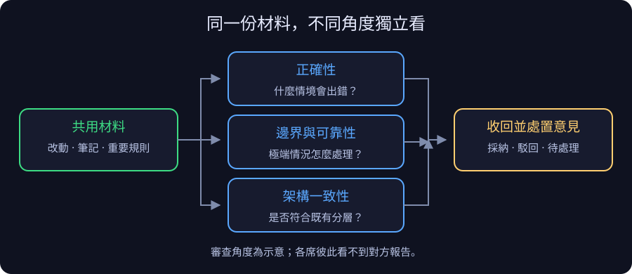
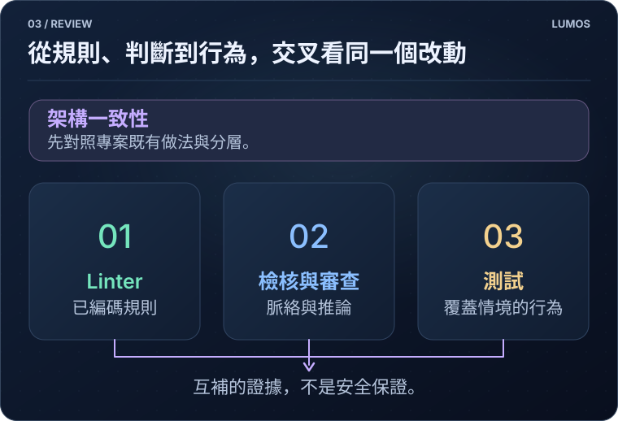
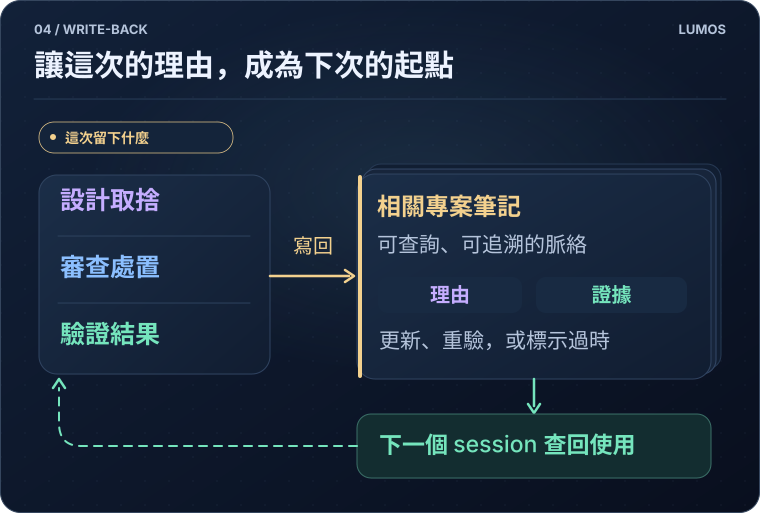
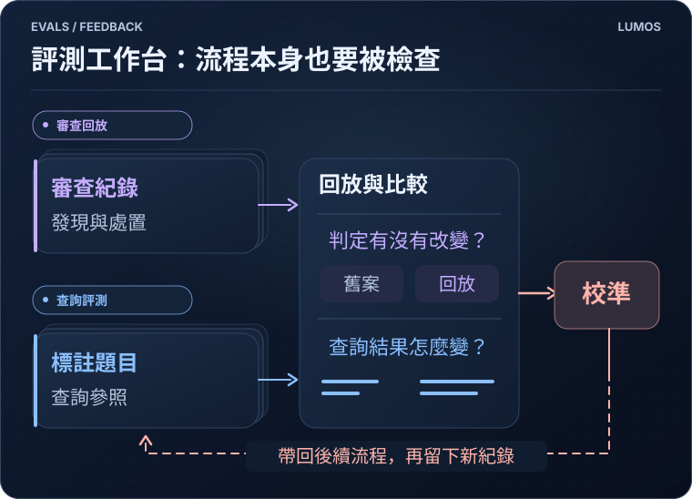

<p align="center">
  <picture>
    <source media="(prefers-color-scheme: dark)" srcset="assets/lumos-logo-dark.png">
    
  </picture>
</p>

# Lumos

**繁體中文** · [English](README.en.md)

**Lumos 是一套為自然語言開發設計的工程治理工具。**

你透過對話提出需求、釐清限制與決定取捨，AI 則在授權範圍內承接從查詢脈絡、實作、測試，到提交與推送的開發流程。

Lumos 把規則與檢查接進這個流程：未滿足條件時，AI 能收到阻擋原因、補正或回報需要你決定的事項，並將決策與驗證結果留給下一次開發。留下來的不只是程式碼，還有「為什麼這樣做、影響了什麼、如何確認」。

一次改動繞過四站：**圖譜 → 派工 → 審查 → 寫回**。外圈的 evals 利用留下的紀錄，檢查與校準這套流程。

[適合誰](#適合誰--不適合誰) · [安裝](#裝起來) · [第一次使用](#你的第一次) · [如何運作](#如何運作) · [限制與範圍](#邊界) · [詳細文件](#想更深入)

<p align="center">
  <a href="assets/map-zh.svg">
    
  </a>
</p>

## 適合誰 / 不適合誰

當你大量使用 AI 開發，而且專案需要長期維護、跨人員或跨 session 接手，Lumos 最有機會派上用場。尤其是金流、庫存、權限、資料遷移這類改動：知道「能不能跑」之外，還需要知道哪些行為不能變、改動會牽連哪裡。

它把幾件容易分散的工程工作接起來：

| 開發時的問題 | Lumos 提供的機制 |
| --- | --- |
| 為什麼這樣設計？哪些規則要保留？ | 可查詢的決策、邊界與合約筆記 |
| 這次改動要找誰看、看什麼？ | 相關脈絡整理、分工審查與風險分級 |
| 說「驗過了」有什麼依據？ | 合約測試綁定、驗證紀錄與檢查閘 |
| 下一次開發還能接得上嗎？ | 將決策、審查處置與驗證結果寫回圖譜 |

**導入有成本。** 維護筆記、執行檢查與多席審查都會消耗時間和 token。一次性原型、主要由人手寫且少有交接的專案，可能不需要整套流程；也不必為了使用 Lumos，把每個小改動都擴大成設計案。

## 裝起來

它由 Markdown 知識圖譜、CLI、AI 工作指引與檢查機制組成，搭配 Claude Code 或 Codex 使用。日常由你提出需求、決定取捨，AI 依指引查詢、實作與寫回；需要判斷業務規則或接受風險時，仍由人決定。

### 1. 確認環境

需要 **Git、Python 3.9+**，以及 Claude Code 或 Codex。安裝不只增加一個 CLI：也會安裝共用工具與 skills，並在初始化專案時加入知識圖譜、AI 指引與 hooks。若想先了解變更範圍，請看 [上手細節](ONBOARDING.md)。

### 2. 執行安裝

在要導入的專案目錄執行：

```bash
curl -fsSL https://raw.githubusercontent.com/EnzoHsieh-Android/Lumos/release/get.sh | bash
```

腳本詢問是否將目前目錄初始化為 Lumos 專案時，確認目錄正確再輸入 `y`；直接按 Enter 會跳過初始化。也可以先下載並檢查腳本，再執行。

### 3. 重開 session 並檢查

安裝完成後，**重新開啟 AI session**，再檢查接線狀態：

```bash
lumos enforcement
```

這個指令確認檢查是否已安裝、註冊與接上，**不代表它們的判斷一定正確**。平台信任設定等本機讀不到的資訊，會列為未知，需要另外確認。

Windows、接手已導入的專案、離線安裝與移除方式，見 [上手細節](ONBOARDING.md)。

## 你的第一次

先選一個範圍小、容易驗證的需求。例如對 AI 說：

> 幫我在現有付款流程加入退款功能。先查相關筆記，列出不能破壞的規則、影響範圍和驗證方式；確認方案後再實作，完成時把決策與驗證結果寫回。

這是用來說明流程的例子，不是退款功能的完整規格。遇到退款資格、金額或權限不明確，AI 應先向你確認。

<p align="center">
  <a href="assets/first-change-zh.svg">
    
  </a>
  <br>
  <sub>流程示意，不是實機測試結果；實際步驟依專案規則與改動風險而定。</sub>
</p>

你不需要先背完 CLI。安裝的工作指引告訴 AI 何時查詢、何時寫回；在你授權提交或推送後，Git 操作也由 AI 執行，Lumos 的 hooks 與檢查在對應階段提供回饋。

例如，AI 執行提交時，如果「程式碼變了、筆記卻沒更新」，提交檢查會阻擋並回傳原因。AI 讀取這個結果後，應補上相關脈絡，或依專案規則處理不需要更新筆記的例外，再重試。阻擋因此成為工作流程的回饋，不只是留給人看的警告；遇到無法自行處理的取捨或風險，仍要回報給你決定。

完成後，請看三件事：**改了什麼、實際驗了什麼、留下哪些決策或限制**。沒有執行的測試，不應被寫成通過。

## 如何運作

<a id="圖譜"></a>

### ① 圖譜

把需要的脈絡找回來。

<p align="center">
  <a href="assets/graph-demo-zh.svg">
    
  </a>
</p>

知識圖譜是一組互相連結、可隨專案版本管理的 Markdown 筆記。它記錄的不只是功能說明，還包括設計理由、模組邊界、重要規則、事故教訓與驗證前提。

上圖以商店為例，將計劃、模組、重要規則與驗證紀錄連在一起。

AI 可以從問題查詢筆記，也能從修改的檔案反查相關筆記，取回與本次任務有關的內容。**已登記的關聯不是完整依賴分析**；圖譜提供線索，仍須對照程式碼與實際行為。

每支程式檔都要有一篇「管它的」筆記，工具在提交前會擋掉沒有歸屬的新檔。改那支檔時，管它的那篇會被優先推出來——前提是那篇的內文真的寫到這支檔，只在欄位登記不算。這道限制是為了避免筆記長成「一篇包全部」：一篇同時寫了十個模組的檔名，改其中任何一個都會推它，於是它越寫越長、越來越難用。

重要規則可以標成「合約」並綁定測試。這讓「不能改」有可追查的依據，但測試通過只證明所覆蓋的情境；規則是否仍符合業務，不能只靠工具決定。

[看筆記結構與影響查詢圖解](docs/心智模型.md#九圖解補充)

<a id="派工"></a>

### ② 派工

讓審查員拿到材料，也保留獨立判斷。

<p align="center">
  <a href="assets/dispatch-overview-zh.svg">
    
  </a>
</p>

派工會整理本次改動、相關筆記與重要規則，交給不同角度的審查席。各席彼此看不到對方的報告，降低互相沿用結論的機會；但多席一致不等於一定正確。

報告收回後，檢查引用能否對上，並逐條記錄採納、駁回或待處理的結果。重點不是多找幾個 AI，而是讓每項意見有依據、有處置。

[看完整派工、收報告與處置閘流程](docs/心智模型.md#七三張詳細圖怎麼讀)

<a id="審查"></a>

### ③ 審查

分開檢查架構、已知問題與實際行為。

<p align="center">
  <a href="assets/review-overview-zh.svg">
    
  </a>
</p>

除了找 bug，審查也關注改動是否符合專案既有架構。架構席以同層既有程式碼作為參照，檢查是否引入並存的第二套做法、或跨越原有分層，而不是只按個人偏好評風格。

Linter 處理已編碼規則；技術棧檢核題與審查席挑戰脈絡相關的判斷；測試則執行受影響合約綁定的案例，提供互補的證據。

推送前的代碼審依風險分級觸發，不是每次小修改都跑同樣規模。檢查閘能要求答案與證據存在，卻不能單靠格式判定答案正確。

若專案宣告了 linter，推送前另有一道不分風險分級的檢查：把 linter 對「改動前」與「現在」各跑一次，只有這次新增的告警才擋，既有問題不計。誤報以留痕方式放行，工具不可用時自動放行並記帳。

[看三層檢查的分工、技術棧觸發條件與推送閘](docs/心智模型.md#七三張詳細圖怎麼讀)

<a id="寫回"></a>

### ④ 寫回

讓這次工作的結果成為下次的輸入。

<p align="center">
  <a href="assets/writeback-overview-zh.svg">
    
  </a>
</p>

完成改動後，AI 將設計取捨、審查處置、驗證結果與未解事項寫回相關筆記。下一個 session 不必只從程式碼反推，也能查到當時的理由與限制。

寫回不是累積越多越好。舊決策可能失效，測試也有成立前提；資料需要隨改動更新、重驗或標示過時，才能持續有用。

寫回也要落在對的地方。工具會檢查「這次寫的說明，是不是寫進了改到那幾支檔各自的歸屬筆記」——寫錯篇會被擋下。否則說明會慢慢集中到少數幾篇大筆記裡，而那幾篇最後誰都不想讀。

[看完整循環中的寫回機制](docs/心智模型.md#六審查迴圈實際跑什麼)

<details>
<summary>看看 Lumos 自己的圖譜成長紀錄</summary>

<p align="center">
  
  <br>
  <sub>錄製當下為 440 篇筆記、1,572 條連結。此圖用來呈現規模，不作為逐字閱讀或品質提升的證明。</sub>
</p>

</details>

<a id="evals"></a>

### 外圈：evals

**外圈：檢查流程本身，讓改進有可比較的依據。**

<p align="center">
  <a href="assets/evals-overview-zh.svg">
    
  </a>
</p>

evals 指評測。Lumos 留下審查席、發現與處置的紀錄，將過閘判定凍結成回放參照，並以每週回放檢查規則變動是否改變舊案結果。查詢機制另有人工標註的題目，供演算法調整時比較。

這些紀錄用來校準後續流程；它們不是「審查品質必然逐輪提升」的保證。[詳細機制](docs/心智模型.md#六審查迴圈實際跑什麼)

## 為什麼是自然語言開發

這裡的自然語言開發，不只是請 AI 產生一段程式碼，而是透過對話驅動整個開發流程。它讓 Lumos 的兩個部分接得起來：**對話留下理由，執行收到回饋。**

需求、方案比較與被否決的做法在對話中被說明，才有機會保存為脈絡；AI 同時承接工具操作，才能讀到檢查結果並繼續補正。若只交給 AI 最後的程式碼，先前未說明或記錄的取捨，Lumos 無法自行還原。

這不是說工程師不必懂程式，或手寫開發沒有價值。你仍需要判斷需求、架構、部署與驗證是否合理；Lumos 想減少的是重複交代背景與追補紀錄的負擔。

## 為什麼做這個

我相信，AI 會承擔越來越多實作工作。但更會寫程式的模型，不會自動替專案保留所有取捨，也不會讓規則、文件與測試永遠同步。

所以我想把脈絡放在模型外面，並把維護它的動作接進開發流程。下一代軟體開發的基石，不只是產生程式碼的能力，也包含讓改動有依據、讓決策可追查、讓後來的人能繼續維護的工程治理。

Lumos 是我對這件事的實作。

## 支援的語言

Lumos 大部分功能不看你的專案用什麼語言寫——圖譜、派工、審查、寫回這一圈是語言無關的。真正綁語言的只有四件事：**掃得到你的測試**（合約才綁得上）、**這個技術棧該問的效能題**、**寫碼慣例 skill**、**推薦哪些 linter**。下表是這四件事目前的狀態。

| 語言／平台 | 測試掃描 | 效能追問 | 慣例 skill | linter 推薦 | 真專案用過 |
|---|---|---|---|---|---|
| Kotlin / Android | ✅ | ✅ 7 題 | ✅ | ✅ | ✅ |
| C# / .NET | ✅ | ✅ 5 題 | ✅ | ✅ | ✅ |
| Vue / 前端 TypeScript | ✅ | ✅ 5 題 | ✅ | ✅ | ✅ |
| SQL | — | ✅ 4 題 | — | ✅ | ✅ |
| Python | ✅ | ✅ 5 題 | ✅ | ✅ | ⏳ 建置中 |
| Java / JVM | ✅ | ✅ 7 題 | ✅ | ⚠️ 未實跑 | ❌ |
| Swift / iOS | ✅ | ✅ 6 題 | ✅ | ⚠️ 未實跑 | ❌ |
| Node.js 後端 | ✅ | ✅ 5 題 | ✅ | ⚠️ 未實跑 | ❌ |
| Flutter / Dart | ✅ | — | — | ✅ | ⚠️ 只做過接入調研 |

**最後一欄要看**：打 ❌ 的是照設計補齊、在合成樣本上測過，但**還沒有任何真專案用過**——觸發字準不準、慣例條款對不對，都還沒有真實資料。⚠️ 有兩種意思：linter 那欄是「只查過官方文件、沒實際裝起來跑過」；最後一欄的 Dart 是「看過一個真專案、但沒有真的接進去用」。

**沒列在表上的語言照樣可以用**，只是上面那四件事沒有內容：圖譜、審查迴圈、提交推送的閘都照常運作，你得自己填測試怎麼掃、自己挑 linter。

（另外：跑 Lumos 這支工具本身需要 Python 3.9+，這跟你的專案用什麼語言無關。）

## 邊界

Lumos 提供通用工具鏈：筆記 CLI、工作指引、檢查、Git hooks，以及跨專案的技術棧慣例。各專案的業務知識、框架選型與發版流程，仍屬於各自的專案。

它**不是品質或安全保證，也不取代工程判斷**：

- 圖譜可能不完整或過時，衝突時要對照程式碼、測試與實際運作。
- AI 審查可能漏判；有回答、有紀錄，不代表內容正確。
- 有效防護取決於實際安裝、平台設定與 CI 接線，不能只看本機顯示正常。
- 涉及業務取捨、不可逆操作與風險接受，仍需人確認。

## 想更深入

- **想理解每道檢查如何運作？** [心智模型與機制](docs/心智模型.md)
- **準備安裝或接手既有設定？** [上手細節](ONBOARDING.md)
- **舊專案還沒有筆記？** [接手舊專案](docs/接手舊專案.md)
- **需要查某個操作？** [指令參考](docs/指令參考.md)
- **想看內部設計或與 SDD 比較？** [架構全景](ARCHITECTURE.md) · [SDD 與 Lumos](SDD-vs-Lumos.md)
- **想讀完整方法論？** [全景圖](docs/methodology/圖譜即合約-全景圖.md) · [對外論述](docs/methodology/圖譜即合約-對外論述.md) · [設計與演進](docs/methodology/圖譜即合約.md)

## 授權

[MIT](LICENSE)，涵蓋 Lumos 工具鏈的檔案，包含複製進專案的工具。

你寫的筆記是你的，Lumos 不主張任何權利。
