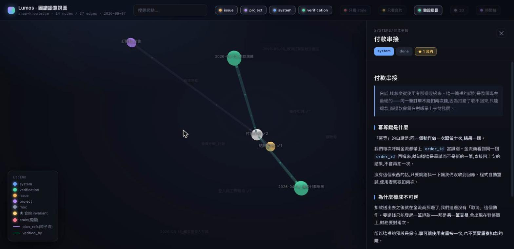

<p align="center">
  
</p>

# Lumos

**繁體中文** · [English](README.en.md)

> 你三個月前叫 AI 寫的那個模組，今天要改。
> 你不記得當初為什麼那樣寫；AI 也不記得——它每次開場都是新人。
>
> **Lumos 讓專案多帶一本筆記，專門記程式碼說不出口的事，再用檢查逼大家真的去寫。**

<p align="center">
  
</p>

---

## 這是什麼

程式碼只告訴你「現在長這樣」。它說不出來的有五件事：

- 當初**為什麼**選這個做法，比較過什麼、否決了什麼。
- 這塊管到**哪裡為止**，動了會波及誰。
- 哪些行為是**說好不能變的**，哪些只是剛好長這樣、可以放心重構。
- 這件事**驗證過沒有**，在什麼前提下才算數。
- 搞砸了**收不收得回來**。

以前這些事活在資深工程師的腦子裡，人一走就沒了。AI 時代更慘——AI 每個對話都是新人，上次跟它講過的話，這次不算數。

Lumos 把這五件事寫成一疊互相連結的 Markdown 筆記，然後用 git 的檢查（提交、推送時自動跑的小程式）擋住「改了程式碼卻不更新筆記」這條路。**讓不寫比寫還麻煩，這樣才寫得下去。**

上面那張圖有兩件事值得停一下看：

- **金環（合約）不是一開始就在的。** 藍色的功能模組先素著出現，等綠色的驗證紀錄連上去，金環和星號才長出來——**這條規則就是這樣：宣稱「不能改」不算數，綁到真的證據才算。**
- **橘色那條線是回頭的。** 出過的事故不會躺在角落生灰，它會被連進下一份計劃，變成動筆前的必讀。

**這些筆記不用你手寫，也不用你背指令。** 你就照平常跟 AI 對話的方式做開發——查東西、改東西、做決定。安裝時已經把「什麼時候該查、什麼時候該寫回」注入 Claude Code 和 Codex 的規則檔，**對話過程沉澱下來的脈絡，會被規則逼著留在筆記上。**

---

## 一篇筆記裡有什麼

<p align="center">
  
  <br>
  <sub>點開「付款串接」那篇。左邊亮起來的是跟它有關的其它筆記，右邊是內容。</sub>
</p>

每篇筆記的開頭是幾行「掃一眼就懂」的摘要。真的打開來長這樣：

```
FLOW:結帳送出 → 帶 order_id 呼叫金流商 → 對方回結果 → 之後再收一次確認 → 兩邊對得上才算成交
KEY:★INVARIANT★ 同一筆訂單絕對不能被扣兩次款 [test:test_no_double_charge_on_retry]
KEY:★IRREVERSIBLE★ 已經送到金流商的扣款收不回來，只能走退款 [rollback:decisions]
```

那兩個星號記號是整套東西的核心：

- **★INVARIANT★＝這條不能改，改了別的地方會壞。**
  這種重話不能只用嘴講。旁邊那個 `[test:...]` 必須指到一支**真的存在、真的會跑**的測試——指不到，健檢直接紅。
- **★IRREVERSIBLE★＝做了收不回來。**
  標了就必須寫下真的回退步驟（真的指令、真的補償流程），不能寫「小心一點」。

所以「這個專案有哪些不能碰的規則」不用問人也不用翻——一行指令就有答案（日常是 AI 幫你敲的）：

```console
$ lumos contracts

# Systems/付款串接.md
  ★INVARIANT★ 同一筆訂單絕對不能被扣兩次款——重送、重試、webhook 重複進來都算
      ↳ 綁的測試: test_no_double_charge_on_retry
# Systems/庫存扣減.md
  ★INVARIANT★ 任何情況下庫存都不能變成負數——超賣一件都不行
      ↳ 綁的測試: test_stock_never_goes_negative
# Systems/購物車.md
  ★DEBT★ 購物車存在 Redis 沒有落地資料庫,Redis 一重開就空了。已知,現在可接受,要改隨時可以改

合約 4 條(改了就是破壞性變更) | 技術債 2 條(可以改)
```

最後一行的分別很重要：**哪些是規則、哪些只是「目前剛好這樣」，寫清楚，重構的人就不用猜。**

---

## 那這不就是 Obsidian 嗎？

**筆記格式跟 Obsidian 相容，你想用 Obsidian 打開它完全沒問題**，也不需要為了 Lumos 裝任何筆記軟體。我們不打算取代它。

一句話講完差別：**Obsidian 是給人瀏覽的，Lumos 是給 AI 查的。**

一般筆記軟體不會擋你，也不會幫你找。Lumos 加的是這些：

| | 一般筆記軟體 | Lumos |
|---|---|---|
| **AI 要用它** | 把檔案倒進 context，自己撈 | **下一行指令，拿回排序過、壓縮過的答案** |
| **從程式碼反查** | 沒有這個概念 | **給一個原始碼檔，回哪幾篇筆記受影響、哪幾篇帶合約** |
| 你寫「這條規則不能改」 | 存檔，沒事 | 要你指出哪支測試在守它。指不出來，健檢紅 |
| 你改了程式碼、沒動筆記 | 沒人知道 | `git commit` 當下被擋住，要你補或說一句為什麼不用 |
| **當初為什麼這樣決定** | 散在正文裡，自己翻 | **決策是獨立欄位：編號、日期、理由、後來翻案了沒** |
| **筆記過期了** | 沒人知道，繼續信 | **驗證紀錄要寫回頭條件，到期會被唸出來** |

### 最關鍵的一條：查，不是把整疊倒進去

一個 AI 拿到 Obsidian 的筆記庫，能做的只有把檔案讀進 context。**這個 repo 的筆記全文是 261 萬字元**——塞不進去；就算塞得進去，重點也會被稀釋成一片雜訊。

261 萬字元長這樣：

<p align="center">
  
  <br>
  <sub>Lumos 自己的筆記，三個月長出來的樣子：440 篇、1572 條連結。這張是產品畫面直接錄的，不是畫的。</sub>
</p>

所以 Lumos 的做法是讓它**下查詢**。問「這個模組的邊界在哪」，回來是這樣：

```console
$ lumos context Systems/付款串接 --brief     # 回 783 字元,那篇全文是 1,812
提醒:這篇有「動了會壞」的合約,動手前一定要看:
  ★INVARIANT★ 同一筆訂單絕對不能被扣兩次款 [test:test_no_double_charge_on_retry]
```

**合約永遠釘在最上面**，因為那是最不能漏看的。差別不是「比較快」，是**塞不塞得下**。

還有兩種查法是 Obsidian 給不了的：

```console
$ lumos impact --file payment/gateway.py    # 我要改這支,會波及誰?

── 直接關聯 (2) ──
  ⚠合約 Systems/付款串接.md ★IRREVERSIBLE★  (body-inline-code)
  ⚠合約 Systems/結帳流程.md ★INVARIANT★  (body-inline-code)
── 間接關聯 (12) ──
  hop1  Verification/2026-04-15_重複付款壓測.md  backlink ← via related ← Systems/付款串接.md
  hop1  Issues/2026-05-06_取消訂單點數沒退回.md  backlink ← via related ← Systems/結帳流程.md
```

```console
$ lumos query --tag status/doing            # 哪些東西還沒收掉?

Projects/訂閱制_計劃.md [doing]
Systems/推播通知.md [doing]

2 節點命中
```

第一種是**從程式碼反查筆記**——給一個檔名，回「哪幾篇受影響、哪幾篇帶著不能破的合約、間接那些又是經由誰連過來的」。

第二種是**標籤化的結構查詢**，不是全文搜尋。標籤分家族（`type/` `status/`，你要加 `priority/` `scope/` 也行），可以再疊「只看還沒收的」「只看連到某篇的」，切法照你自己的分類走。

這疊筆記的主要讀者不是人，是**下一個 session 的 AI**。所以它寫成「沒有脈絡的人也讀得懂」，而且**設計成可以被查詢，不是被閱讀**。

---

## 主打的循環：它會越跑越準

這是 Lumos 跟「一本寫得很好的文件」真正的分野。文件會過期；這套東西每跑一輪，手上的材料就更準一點。

<p align="center">
  
</p>

**一輪是這樣走的：**

1. **要送審的東西進來**（一份設計稿，或一批要推的程式碼）。
2. **機器從圖譜裡算出「跟這次有關的那幾篇」，直接附在派工單上。** 審查員不用自己翻，也不會漏掉三個月前那次事故的教訓。
3. **派給幾個不知道前因後果的 AI 各審各的。** 寫的人不能自己當裁判——這是整套設計的一條硬規矩。
4. **每一條意見都要有交代**：採納的就改稿，不採納的要寫理由。全部有交代才放行。
5. **交代的結果寫回圖譜**，變成下一輪的材料。

第五步是關鍵。**筆記不是最後的產出物，是下一輪的輸入。** 所以第一輪審查員手上可能只有三篇，跑到第五輪會有八篇，而且那八篇都是前幾輪真的被採納過的東西——不是有人憑印象丟進去的。

一句話：**同一批 AI、同樣的時間，差別只在手上的材料越來越準。**

> **老實話：** 機器擋得住的是形式——測試存不存在、回退有沒有寫、有沒有找人獨立審過、每條意見有沒有交代。
> 「這條規則今天還符不符合業務」「那個回退步驟真的跑得動嗎」——只有人能答。別把「有掛證據」當成「絕對安全」。

---

## 適合誰 / 不適合誰

**適合：**

- 專案要活超過幾個月，而且會有別人（或別的 AI）接手。
- 大量用 AI 寫程式，你自己不會逐行讀完。
- 系統裡有「動到就會出事」的地方：金流、庫存、權限、資料遷移。

**不適合：**

- 兩週寫完就丟的東西。
- 一個人的小工具，你自己每天都在讀，全部記在腦子裡。
- 你要的只是一個漂亮的筆記 app——那 Obsidian 就夠了，真的。

**代價講在前面：** 這套會讓每次提交多花時間。它換到的是三個月後不用重新考古。**專案活不到三個月，就不划算。**

---

## 裝起來

### 專案已經在用 Lumos（接手的人）

```bash
git clone <你的專案> && cd <你的專案>
python3 scripts/lumos bootstrap
```

一行搞定：Lumos 本體、給 AI 看的操作手冊、全域指令、git 檢查，全部裝好。裝完**重啟 Claude Code 或 Codex 的對話**（有些提示是開場時載入的）。

### 全新專案要導入

站在你的專案目錄裡跑：

```bash
curl -fsSL https://raw.githubusercontent.com/EnzoHsieh-Android/Lumos/release/get.sh | bash
```

它會問「要把這個目錄建成 lumos 專案嗎？[y/N]」，按 `y`。

- **預設是 N**，所以站錯目錄（例如你的 dotfiles）按 Enter 就跳過，不會誤裝。
- 不想盲跑遠端腳本？先 `curl -fsSL <網址> -o get.sh` 抓下來看過再執行。
- CI 這種沒有人在旁邊的環境：結尾加 `-s -- --init` 直接建、不問。

### 裝好了嗎

```bash
lumos enforcement
```

它列出每一層防護「有沒有裝上、接上」——**注意它查的是接線，不是判得對不對**。全綠代表檢查程式註冊了、檔案在、版本對。Codex 那幾行會停在「已註冊，要不要跑本機讀不到」，那是平台限制、不是壞掉。

<details><summary>Windows（原生 PowerShell）</summary>

前置：Git for Windows、python 在 PATH、Claude Code。

```powershell
irm https://raw.githubusercontent.com/EnzoHsieh-Android/Lumos/release/get.ps1 | iex
# 重啟對話;若找不到 lumos,把 %USERPROFILE%\.local\bin 加進 PATH
cd <你的專案>; lumos init
```
</details>

<details><summary>只裝一半 / 離線裝 / 為什麼分兩層</summary>

**分兩層的原因**：
- **專案層**——CI 只看得到你的專案 repo，git 檢查也是一個 repo 一份，所以檢查工具必須**複製一份進每個專案**。更新用 `lumos update`。
- **機器層**——給 AI 看的操作手冊是**整台機器共用一份**，用捷徑連到 Claude Code / Codex 的目錄。對 Lumos 目錄 `git pull` 一次，所有專案同時吃到新版。

只建專案層 `lumos init`（`--no-hooks` 只建筆記資料夾不裝檢查；既有筆記**絕不覆寫**）。只裝機器層 `lumos install`。手動離線：

```bash
git clone --branch release https://github.com/EnzoHsieh-Android/Lumos ~/harness/lumos-toolchain
cd ~/harness/lumos-toolchain && ./install.sh
python3 scripts/lumos install
scripts/install-graph-toolchain.sh --target <專案路徑> --slug <名稱>
```

`release` 是對外線，只有維護者會把它往前推。要跟開發線就把 `--branch release` 拿掉。

**Claude Code 和 Codex CLI 都支援**，同一次安裝接兩家，行為一致。細節在[心智模型與機制](docs/心智模型.md)。
</details>

---

## 你的第一次

**裝完之後，你不用背任何指令。** 開一個 Claude Code 或 Codex 的對話，像平常一樣講話就好——下面三件事會自己發生。

**① 問它一個「為什麼」**

> 你：結帳這塊為什麼要先預扣庫存、再呼叫金流？

它不會直接去翻程式碼。安裝時寫進規則檔的紀律會讓它**先查筆記**，把邊界和合約撈出來，再拿程式碼印證細節。你會看到它回答時帶著「這條是合約、綁著哪支測試」這種東西——那是從筆記讀來的，不是它猜的。

它在背後看到的，長這樣：

```console
# Systems/付款串接.md
type:system | status:done | created:2026-03-25 | updated:2026-06-10
提醒:這篇有「動了會壞」的合約,動手前一定要看:
  ★INVARIANT★ 同一筆訂單絕對不能被扣兩次款 [test:test_no_double_charge_on_retry]
summary:
  FLOW:結帳送出 → 帶 order_id 呼叫金流商 → 對方回結果 → 再收一次確認 → 兩邊對得上才算成交
verified_by: [[Verification/2026-04-15_重複付款壓測]], [[Verification/2026-06-10_退款演練]]
→ 連出 (3):
  • Systems/結帳流程.md [done]
  • Verification/2026-04-15_重複付款壓測.md [done]
← 連入 (4):
  • Projects/訂閱制_計劃.md [doing]
```

**合約放在最上面，因為那是最不能漏看的。**

**② 叫它記一件事**

> 你：同一筆訂單不能扣兩次款，這條記下來，守它的測試是 `test_no_double_charge_on_retry`

它會自己建節點、寫成摘要行、把測試綁上去、跑完自驗。你不用知道欄位怎麼填、標記長什麼樣、檔案該放哪個資料夾。

**③ 改一段程式碼，然後收工**

改了程式碼、筆記一個字沒動的話，**收工那一刻會被擋一次**，要它補筆記或說一句為什麼不用。真的要提交時，還會再擋一次：

```console
$ git commit -m "調整結帳邏輯"

擋下:這次 commit 改了程式碼,但知識筆記一個字都沒動。
程式碼記的是「現在長怎樣」,筆記記的是「為什麼這樣做」——只改其中一邊,
下一個人(或下一個 session 的 AI)就會拿舊的理由去理解新的程式碼。

兩條路選一條:
   1. 把該改的筆記改一改,加進 commit,再提交一次。
   2. 這次真的不需要動筆記(改錯字、排版、註解)→ git commit --no-verify
      跳過會留下紀錄,不是偷偷放行。
```

**這一擋就是整套東西的本體。** 其他都是為了讓這一擋不討人厭而長出來的。

> **那這份說明裡那些 `lumos <指令>` 是什麼？**
>
> 是 AI 在背後敲的，不是要你背的。安裝時已經把「什麼情況該查什麼」寫進 Claude Code 的 `CLAUDE.md` 和 Codex 的 `AGENTS.md`，另外掛了五個自動觸發的檢查：開場提醒、改檔前把會波及的筆記推到它眼前、派審查員時自動附相關筆記、收工檢查、CI 狀態。
>
> **你想自己敲當然可以**（[指令參考](docs/指令參考.md)），但日常用不到。這份說明貼指令輸出，是為了讓你看見它到底讀了什麼、擋了什麼——**看不見的治理等於沒有治理。**

---

## 為什麼做這個

我相信全自動開發的時代有一天會來。

但**AI 不會憑空知道一個專案的業務經驗，也不會知道那些決斷是怎麼走過來的。** 為什麼當初否決了看起來更快的那個做法、哪一次事故換來現在這條規則、哪個數字是人拍板的而不是算出來的——這些都不在程式碼裡。它們一直活在人的腦子裡，人走了就沒了；而 AI 每個對話都是新人。

模型會一直變強。但再強的模型，面對一個沒有脈絡的專案，一樣是新人。

所以我深信：**下一代軟體開發的基石，不會只是更會寫程式的模型，而是把脈絡留下來的工程治理。**

Lumos 是我對這件事的答案。

---

## 想更深入

- **[心智模型與機制](docs/心智模型.md)** — 筆記分哪幾種、三種「掛證據」的鏈怎麼運作、幾道檢查各擋什麼，以及這套東西做不到的事。
- **[指令參考](docs/指令參考.md)** — 日常會用到的指令。權威清單以 `lumos --help` 為準。
- **[接手一個沒有筆記的舊專案](docs/接手舊專案.md)** — 公司的舊系統、自己 vibe 一個月的東西，怎麼把脈絡還原成筆記。
- [上手細節](ONBOARDING.md) · [架構全景](ARCHITECTURE.md) · [跟規格驅動開發（SDD）差在哪](SDD-vs-Lumos.md)
- 方法論長文：[圖譜即合約](docs/methodology/圖譜即合約.md) · [全景圖](docs/methodology/圖譜即合約-全景圖.md) · [講給外部讀者的版本](docs/methodology/圖譜即合約-對外論述.md)

---

## 邊界

Lumos 只放**通用的工具組**：筆記的指令列工具、各種檢查與 git hook，以及跨專案通用的技術棧慣例手冊（kotlin / vue / csharp 那幾份——它們不綁任何一個專案，所以住在這裡）。

各專案自己的東西不進來：業務筆記內容、發版腳本、只有那個專案在用的框架選型。

---

## 授權

[MIT](LICENSE)。

**工具鏈自己的檔案適用這份條款**，包含被複製進你專案的那幾支（主程式與 hooks，每支檔頭都帶授權標示，主程式帶全文）。

**工具寫進你專案的東西是你的**——設定檔裡的紀律區塊、你寫的筆記，Lumos 不主張任何權利。第三方元件的聲明列在 LICENSE 尾段。
