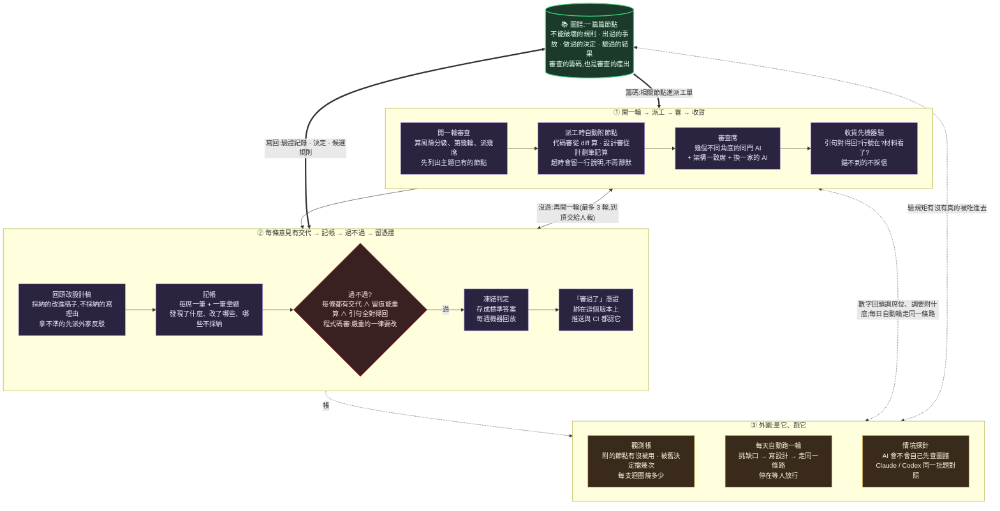

# Lumos

**繁體中文** · [English](README.en.md)

> **Lumos —— 揭開全 AI 開發的黑箱,照亮通往正確需求的路。**
>
> (路摸思:點亮咒。一邊照「程式碼」——把藏起來的為什麼、決策、硬合約照出來;一邊照「需求」——用繞不過的對話逼出理解,讓人走對路。Lumos 不替你把需求變對,它把路照亮、讓你自己走對。)

---

## 0. 一分鐘搞懂

AI 寫大部分 code 的時代,最貴的不是「寫得出來」,是「**還有沒有人懂這個系統**」。

Lumos 讓專案多帶一本**知識圖譜**——一疊互相連結的 Markdown 筆記,專記 code 自己說不出的事:**為什麼**這樣設計、**哪裡**不能亂動、**驗證過沒有**。然後用 git hooks(提交/推送時自動執行的檢查程式)把「改了 code 卻不更新筆記」這條路堵住——讓「不寫回」比「寫回」更麻煩。

- 給**人**:接手陌生專案時有一張活地圖,不用從幾萬行 code 逆向猜。
- 給 **AI**:動手前先讀圖譜(知道哪面是承重牆),做完被規則逼著把「為什麼」寫回去。整套流程以 [Claude Code](https://claude.com/claude-code) 為預設的執行代理設計;指令本體純 python、哪裡都能跑。

---

## 1. 解決什麼問題

Code 只告訴你「現在長這樣」。它說不出:

- **為什麼**是這個設計(當初比較過什麼、否決了什麼)。
- **邊界**在哪(這個模組管到哪為止)。
- 哪些行為是**合約**(改了=別的東西會壞)、哪些只是**剛好長這樣**(可以放心重構)。
- 有沒有**驗證過**、在什麼前提下才成立。
- 這個動作**可不可逆**、搞砸了怎麼收回。

這些知識傳統上活在老鳥腦裡,人一走就沒了;AI 時代更慘——AI 每個 session 都是新人。Lumos 把它們存成圖譜,用工具保鮮。

(筆記格式與 Obsidian 相容,但**不需要裝 Obsidian**;工具鏈自己就能讀寫。)

---

## 2. 核心理念:圖譜即合約

四句話講完:

1. **圖譜是「意圖」的真相來源。** 「當初為什麼、規則是什麼」以圖譜為準。但「現在實際跑成什麼樣」的權威是測試和生產環境——兩邊打架時不是自動信圖譜,而是查清哪邊錯了、記一筆事故。
2. **先讀再動。** 要動既有系統,第一個動作是查圖譜(`lumos search`),不是 grep。圖譜先給你邊界和地雷,code 拿來印證細節。
3. **退場寫回。** 做完當場把決策、驗證結果寫回圖譜——趁你還是「目擊者」的時候寫,別留給日後的人當考古學家。
4. **提交時強制。** 上面三條靠自覺都會爛。所以 pre-commit(提交前檢查)硬擋「改 code 沒動圖譜」;`lumos doctor` 定期驗整張圖的一致性。

---

## 3. 快速上手

### 3a. 專案已經在用 Lumos(接手的人)

```bash
git clone <你的專案> && cd <你的專案>
python3 scripts/lumos bootstrap     # 一鍵:自動裝好 Lumos 本體、skills、全域指令、hooks
```

然後**重啟 Claude Code session**(有些提示是在 session 開頭載入的)。

### 3b. 全新專案要導入(一條指令)

站在你的專案目錄裡跑:

```bash
cd <你的專案>
curl -fsSL https://raw.githubusercontent.com/EnzoHsieh-Android/Lumos/main/get.sh | bash
# 它會問「要把 <路徑> 建成 lumos 專案嗎? [y/N]」→ 按 y;然後重啟 Claude Code session
```

- 問句**預設是 N**:站在不想導入的目錄(例如 dotfiles)按 Enter 就跳過,不會誤裝。
- 不想盲跑遠端腳本?先 `curl -fsSL <網址> -o get.sh` 下載審閱再執行。
- CI 等非互動環境:結尾加 `-s -- --init` 免確認直接建。

<details><summary>Windows(原生 PowerShell)</summary>

前置:Git for Windows、python 在 PATH、Claude Code。

```powershell
irm https://raw.githubusercontent.com/EnzoHsieh-Android/Lumos/main/get.ps1 | iex
# 重啟 Claude Code session;若找不到 lumos,把 %USERPROFILE%\.local\bin 加進 PATH
cd <你的專案>; lumos init
```
</details>

<details><summary>顆粒安裝/離線(進階)</summary>

**Claude Code 與 Codex CLI 都支援**(2026-09 起;細節與界線見圖譜 `Systems/codex-harness`):

- **裝一次接兩家**:同一次 `lumos install` 把 skills、hook 註冊、紀律區塊接到兩家(Claude:`~/.claude`+`CLAUDE.md`;Codex:`~/.codex/hooks.json`、`~/.agents/skills`、`AGENTS.md`、自訂審查席 `lumos_reviewer`)。Codex 的 hook 要你開一次互動 `codex` 按「Trust all」才會跑(信任綁的是命令列,之後 lumos 更新 hook 內容不用重按);`lumos enforcement` 看得到各層狀態。
- **同一批 hook、同一種收工行為**:改了程式碼卻沒動節點時,收工會被擋一次、要它補節點或說一句為什麼不用,同一個 session 只擋一次,兩家一樣(Claude 側原本只印到沒人看得到的除錯日誌,2026-09-05 起改成一樣擋)。要關:環境變數 `LUMOS_STOP_BLOCK_OFF=1`。
- **用 Codex 當編排者跑迴圈**:首輪 `lumos loop next <編號> --orchestrator codex`;派審查員前一刻 `lumos dispatch-lens --arm <base>..HEAD --seats N`(Codex 的派工訊息 hook 讀不到,改由子代理開場自己領一席),派完 `--disarm`;審查席點名 `lumos_reviewer`(Codex 0.153.2 起選得中)。
- **量得到**:情境探針 `scripts/scenario_probe.py --runner codex` 對 Codex 跑同一批題;`--stop-block off` 是收工擋停的對照組。
- **順帶修的一個老洞**:收工檢查以前只認副檔名,像本 repo 的 `scripts/lumos` 這種沒副檔名的主程式從來沒被提醒過;現在首行是 shebang 的檔也算程式碼,兩家都受惠。

只建專案層:`lumos init`(圖譜資料夾名稱預設取專案名,`--name` 自訂;既有圖譜**絕不覆寫**;`--no-hooks` 只建圖譜不裝檢查)。只裝機器層:`lumos install`。手動離線:

```bash
git clone https://github.com/EnzoHsieh-Android/Lumos ~/harness/lumos-toolchain
cd ~/harness/lumos-toolchain && ./install.sh
python3 scripts/lumos install
scripts/install-graph-toolchain.sh --target <專案路徑> --slug <名稱>
```
</details>

### 為什麼分「機器層」和「專案層」兩層?

- **專案層**:CI 只會抓你的專案 repo、git hooks 也是一個 repo 一份——所以檢查工具必須**複製一份進每個專案**(term: vendor)。更新用 `lumos update`。
- **機器層**:給 AI 看的操作手冊(skills)是**整台機器共用一份**,用捷徑(symlink)連到 Claude Code 的目錄——對 Lumos 目錄 `git pull` 一次,所有專案同時吃到新版。

---

## 4. 心智模型:圖譜裡有什麼

### 節點=一篇筆記,分五種

| 型別 | 記什麼 |
|---|---|
| `system` | 一個模組:流程怎麼跑、依賴誰、有什麼合約 |
| `verification` | 一次測試/審計的紀錄(在什麼前提下驗的、何時該重驗) |
| `issue` | 一個發現/事故 |
| `project` | 一個計劃/設計 |
| `moc` | 導覽頁(Map of Content,圖譜的目錄) |

### 摘要行:掃一眼就懂一個模組

每篇筆記開頭有幾行帶前綴的摘要:`FLOW:`(流程)`KEY:`(關鍵事實)`DEP:`(依賴誰)`TEST:`(測試狀態)`DECISION:`(決策)——設計目的是**只讀開頭就能掌握全貌**,不用讀完整篇。

### 三條「鏈」:Lumos 跟一般 wiki 差在哪

一般 wiki 的問題:寫的人說了算,錯了沒人知道。Lumos 給三種載重宣稱掛上「不掛證據就過不了關」的鏈:

**合約鏈**——這是不是真規則?
```
KEY:★INVARIANT★ <業務合約;改了=會壞> [test:測試方法名] [audit:模型/日期]
```
- `★INVARIANT★`(不變量,唸作「這條是合約」)**必須**綁一個真實存在的測試(`[test:]`)——空口宣稱,`doctor` 會擋。
- 還要過一次**獨立審計**(`[audit:]`):派一個不知道前因後果的乾淨 AI 判「這真的是合約嗎?測試是不是在自己騙自己?」——寫的人不能自己當裁判。
- 拿不準是不是合約?**就不要標**。嚴禁看著 code 反推「這應該是規則吧」。
- 另有 `★DEBT★` 標「已知只是剛好長這樣,可以改」。

**可逆性鏈**——搞砸了收得回來嗎?
```
KEY:★IRREVERSIBLE★ <收不回:例如正式環境的資料庫遷移> [rollback:decisions]
KEY:★CHECKPOINT★   <改了難救:例如部署到測試機>
```
標了「不可逆」就**必須**寫下回退步驟(真的 SQL、真的補償流程),`doctor` 會查。沒標=可逆,放手改。

**誠實天花板**(重要):工具能證明的是「測試存在、回退有寫、獨立審過」這些**形式**;「規則今天還符不符合業務、回退真的跑得動嗎」只有人能答。別把「有掛證據」當「絕對安全」。

### 寫入請走指令,別手改開頭欄位

筆記開頭的結構化欄位(狀態、連結、決策)一律用 `lumos set` / `append` / `decision-add` 寫——指令會自動排版+寫完自驗。手改最常見的坑:多個連結擠在同一行,會長出「幽靈節點」。

---

## 5. 日常怎麼用

```
進場 ── lumos search <關鍵字> → lumos context <節點> → lumos contracts <節點>   (動手前先讀圖譜)
設計 ── 寫成計劃筆記,進實作前跑 design-loop(派幾個不知情的 AI 審稿挑洞)
動工 ── 改 code;改到檔案時 hook 自動把「會波及哪些筆記、踩過什麼雷」推到你眼前
收工 ── 改了 code 沒動節點,Stop hook 擋一次要你補或說明(兩家一樣,同 session 只一次)
寫回 ── lumos set / append / decision-add 記決策、驗證、合約
自驗 ── lumos lint <節點>(單篇快檢)→ lumos doctor(全圖健檢)
終審 ── lumos pitfalls --diff 算這批改動的風險級;高風險走 code-loop(對抗式代碼審)
提交 ── pre-commit 擋「改 code 沒帶圖譜」;pre-push 再跑全套把關
```

強制力從軟到硬:

| 層 | 做什麼 | 擋不擋 |
|---|---|---|
| impact 推播 | 改 code 前告訴你會波及哪些筆記 | 只提醒 |
| 收工 Stop hook | 這一輪改了 code、節點沒動就擋一次,要補或說明 | 兩家都擋一次(同 session 只一次;`LUMOS_STOP_BLOCK_OFF=1` 關) |
| `lumos lint` | 單篇筆記快檢 | 提前預警 |
| `lumos doctor` | 全圖健檢(孤兒、斷連、裸合約、缺回退) | `--ci` 模式會擋 |
| `code-loop` | 高風險改動沒過代碼審 | push 時硬擋 |
| pre-push | 健檢+完整性驗證+代碼審留痕,三合一 | 硬擋 |

### 審查為什麼會越審越準:圖譜 ⇄ 審查的良性循環

白話:圖譜裡的每篇節點(不能破壞的規則、出過的事故、做過的決定、驗過的結果)是每一輪審查的籌碼——派審查員時機器把相關節點附進派工單,審查員不用自己翻;審完採納進設計的東西再寫回節點,變成下一輪的籌碼。**節點是下一輪的輸入,不是最後的產出物。** 每條審查意見都要有交代(採納就改稿、不採納要寫理由),一輪全部有交代才過關;過關的判定凍結起來每週回放。Claude Code 與 Codex CLI 走同一條路。



這套大量用 fail-open(環境不全就先放行、CI 當後盾),好處是治理工具一壞不會全公司卡住;副作用是**你看不出現在到底有幾層真的在守**。`lumos enforcement` 把上面各層現況查一遍、印一行「幾層生效」——本機測不到的遠端設定(GitHub required check)誠實列 unknown,不假裝有。

---

## 6. 接手舊專案(Brownfield 還原)

接手一個**已經在跑、但圖譜是空的**專案(自己 vibe 一個月的、或公司的舊系統)怎麼辦?Lumos 的答案不是把整個 repo 攤平自動生文件(那種產出沒人查核過,錯得很自信),而是**節點還原 SOP**——七步、任何技術棧:

1. **惰性生長**:節點不一次補完。進場先查——**有就照著用;殘缺就補;沒有才產一篇**。圖譜沿著實際被動過的地方慢慢長。
2. **先看懂再動手**:從看得到的行為(畫面文字/log/錯誤碼)反查到 code → 追資料流圈出「誰還共用它」(那就是承重牆)→ 從 git 歷史還原「為什麼」(blame 追到被壓平的 commit,就去讀 PR 討論串)。
3. **每句話標出處**:有 code/git 證據的標證據;推論老實標「推測」;查不到標「佚失」——有機械檢查把關,嚴禁看著現狀編故事。
4. **出口必過交叉查核**:兩個互不知情的 AI,一個只讀筆記列出裡面的可驗證主張、一個只讀 code 逐條判真假,對完才算還原完成。
5. **典型用法=加新功能之前**:先還原會碰到的關聯面,新功能踩在節點上開發——共用面清單和合約候選直接變成新功能的護欄,不破壞架構、不重造輪子。

操作全文:`skills/lumos-project-notes` 的 `reference.md`〈節點還原(brownfield 冷啟動)〉;快查表 `commands/09-節點還原.md`;設計脈絡與審計史 `docs/lumos-toolchain-knowledge/Projects/節點還原SOP_計劃.md`。

---

## 7. 指令參考

工具是一支零依賴 python 指令,66 個頂層命令;**權威清單以 `lumos --help` 為準**,這裡列日常會用到的。

**讀圖譜**
```bash
lumos search <關鍵字>             # 全文搜尋,相關性排序(中文概念之間記得加空白)
lumos context <節點> [--brief]    # 這個節點+鄰居的壓縮視圖,合約放最上面
lumos contracts [<節點>]          # 合約總表:哪些 ★INVARIANT★、綁了什麼測試
lumos decisions <節點>            # 這裡做過哪些決策、翻案了沒
lumos impact --file <檔>          # 改這個檔會波及哪些筆記、踩過什麼雷
lumos map <節點> · links · backlinks · recent · stats   # 鄰域樹/連結/近況
```

**寫圖譜**(都會寫完自驗)
```bash
lumos new system|issue|project|verification <名稱>   # 建新筆記骨架
lumos set <節點> <欄位> <值>                          # 改狀態等單值欄位
lumos append <節點> related|verified_by|... "[[X]]"   # 加連結(一次一項)
lumos decision-add <節點> "<內容>" --decided 日期      # 記決策
```

**合約與驗證**
```bash
lumos guard list [--unbound]     # 哪些合約還沒綁測試
lumos guard scaffold / bind / audit    # 產測試骨架 → 綁定 → 獨立審計(完整流程見 skills)
lumos guard kill <節點>          # 殺傷力驗證:沙盒裡真的弄壞它,看測試會不會翻紅
lumos signoff <節點> --note ".." # 業務簽核留痕(「規則還符不符合業務」那半,工具答不了)
```

**審查迴圈與風險**
```bash
lumos pitfalls --diff <範圍>     # 算這批改動的風險級(standard/high)
lumos code-loop check|pass|skip  # 高風險改動的代碼審留痕(pre-push 會查)
lumos loop status <編號> ...     # 設計/代碼審迴圈的收斂判定(細節見 skills)
lumos testmap affected --diff .. # 依改動推薦該跑哪些測試(建議性質)
lumos anchor verify|approve      # 測試/檢查檔的防篡改指紋
lumos ci-wait / ci-status        # push 後等 CI 結果 / 查上次結果
```

**體檢與治理**
```bash
lumos lint <節點>                # 單篇快檢
lumos doctor [--ci]              # 全圖健檢(--ci 會擋)
lumos gov [<節點>]               # 本機流水帳:誰被哪道關卡攔過(唯讀,不上傳)
lumos spec-trace <計劃節點>       # 計劃裡的條款,哪些還沒被驗證紀錄認領
```

**安裝生命週期**(裝↔卸對稱)
```bash
lumos bootstrap                  # 一鍵全裝          ↔  lumos teardown   # 一鍵全拆(圖譜永遠保留)
lumos install                    # 只裝機器層        ↔  lumos uninstall
lumos init [--no-hooks]          # 只建專案層        ↔  lumos deinit [--keep-graph] [--dry-run]
lumos update                     # 刷新本專案內的工具組
```

> 拆哪層記這句:整台機器一次拆=`teardown`;只拆這個 repo=`deinit`;只移全域指令=`uninstall`。teardown 永遠保留圖譜文件;deinit 預設互動確認、可 `--dry-run` 先預演。

---

## 8. 治理事件帳(`lumos gov`)

每道關卡攔了誰、誰繞過了什麼,都落在本機的流水帳裡(不進 git、不上傳)。`lumos gov` 一次讀給你看:

```bash
lumos gov                # 全部關卡事件的時間軸
lumos gov OrderService   # 這個節點被哪幾道關攔過、硬擋還是提醒
```

用途是**開發時的可見性**(哪裡一直在響=哪裡該處理),不是稽核合規文件。

---

## 9. 更新方式

- **skills+全域指令**:對 Lumos 目錄 `git pull` 即可(捷徑連結,即時生效)。
- **某個專案內的工具組+紀律區塊**:在那個專案跑 `lumos update`。圖譜資料不會被動到。

---

## 10. 設計原則

- **零依賴**:純 python 標準庫,CI 直接跑,不帶任何套件。
- **別治理過頭**:只給載重的宣稱掛鏈;軟提醒維持軟;不疊沒有對等價值的儀式。
- **誠實的天花板**:工具證形式,不證業務正確;講不出的就明說講不出。
- **寫的人不能自己當裁判**(maker ≠ checker):沒有標準答案的判斷,交給不知情的獨立 AI。

---

## 11. 成本與界線(理想跟現實的距離)

2026-09-05 拿 README 逐條對回程式碼、帳本、量測後補的一節。每條寫「能做到什麼、做不到什麼、有數字的給數字」。

- **「改 code 沒帶節點就擋」擋的是「一個字都沒動」。** 隨便帶一篇節點就過,動對篇不對篇只有一行提醒(`lumos impact --sync-check`)。另外它判「什麼算程式碼」看副檔名加首行 shebang;五月到九月有 26 個只改主程式 `scripts/lumos` 的 commit 因為沒副檔名而漏過,2026-09-05 才補上。
- **「審過了」的憑證是自己開的。** `lumos code-loop pass` 不驗證有沒有真的開過審查、帳本上有沒有那一輪;`anchor approve` 也是簽名留痕而已。這兩道擋的是「忘了」,擋不住「敷衍」——那一層永遠是人。
- **派工時附的節點,審查員大多沒打開。** 自己量出來的第一份報表:附 1 篇節點的 16 次裡 0 次被讀,程式碼檔相關的 11 次裡 0 到 1 次;只有一次附 11 篇以上的那種才有一半被碰。給審查席那一版還沒量(2026-10-03)。
- **「每條意見都有交代才過關」驗的是帳目自洽,不是內容。** 意見編號是編排者自己取的,機器只查「折的加不採納的等於全部」,查不了「真的改進文件了沒」。
- **收工擋停只擋一次,而且只擋一種情況。** 改了程式碼、節點一個字沒動,同一個 session 擋一次;模型回一句「不用寫」就算交代,工具不驗那句對不對。在 2026-09-05 之前 Claude 側連這一次都沒有——舊的「軟提醒」印在只有除錯日誌看得到的地方。
- **錢。** 高風險程式碼審(code-loop)一次約 19 萬 token,七天量到 930 萬;設計審一次約 5 萬。每天自動跑的設計迴圈連續七週每週燒 210 到 330 美元、產出 0 份可放行的設計,2026-09-05 起暫停派工(`LUMOS_AUTOLOOP_OFF=0` 可開回),2026-10-05 決定去留。
- **派工時附節點的 hook 會超時放空。** 算「這批改動牽連哪些節點」在 10 個 commit 以上要 25 到 57 秒,超過它的 45 秒預算就什麼都不附;2026-09-05 之前是靜默放空(當天 39 次派工 21 次沒附),之後會在派工單尾端留一行說明,並建議派工前先算一次暖快取。設計審那邊原本靠人手貼、209 份派工詞只有 14 份貼了,2026-09-05 起改成 hook 從計劃筆記算。
- **linter 橋、Compose 效能量表、SARIF 轉換目前沒有消費端在用。** 本 repo 沒接 linter,兩個外部專案 7 月初示範過一次後沒再用;這些指令存在、能跑,但沒人在跑。testmap 建過一次後落後了 614 個 commit,2026-09-05 起改成每天重建。
- **`lumos enforcement` 說「生效」= 有註冊、檔案在、版本對**,不代表那層有效果;Codex 那五支 hook 有沒有按過信任它測不到。

---

## 邊界與延伸閱讀

Lumos 只放**通用的圖譜工具組**。各專案自己的東西(業務圖譜內容、發版腳本、技術棧 skill)不進這裡。

- 上手細節:[ONBOARDING.md](ONBOARDING.md)
- 架構全景:[ARCHITECTURE.md](ARCHITECTURE.md)
- 與 SDD(規格驅動開發)的差異:[SDD-vs-Lumos.md](SDD-vs-Lumos.md)
