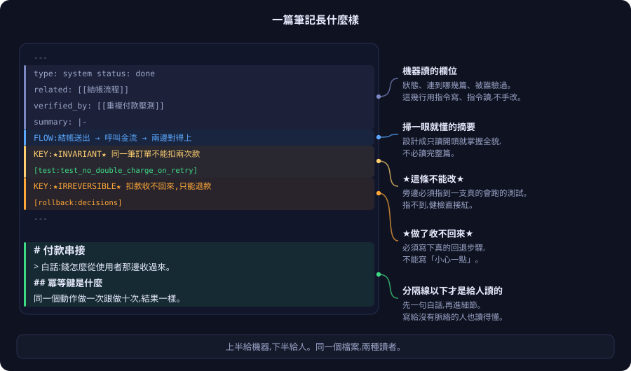
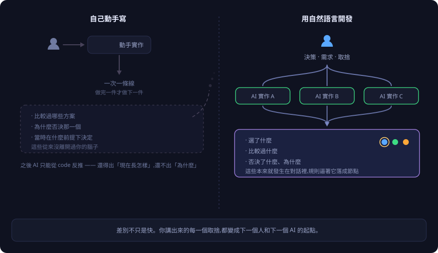
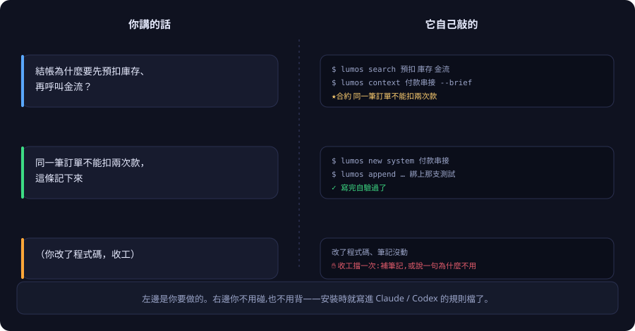
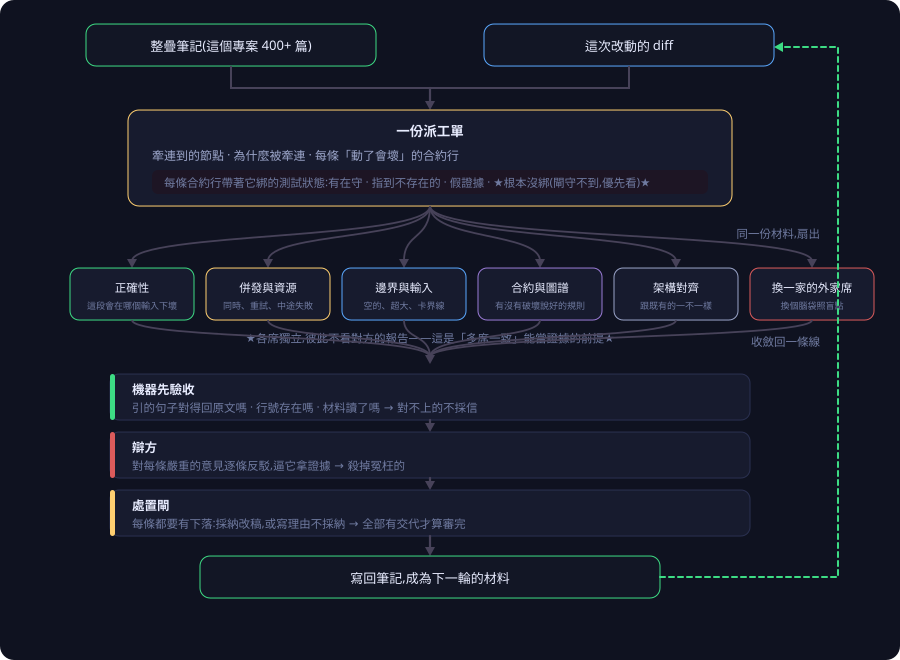
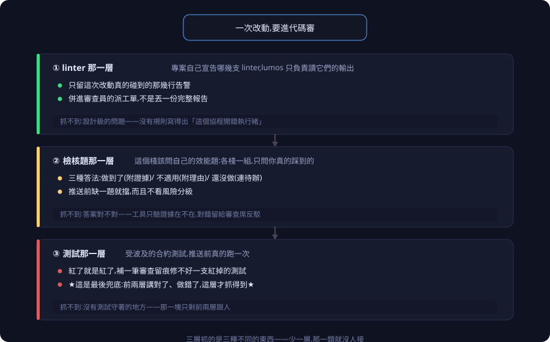
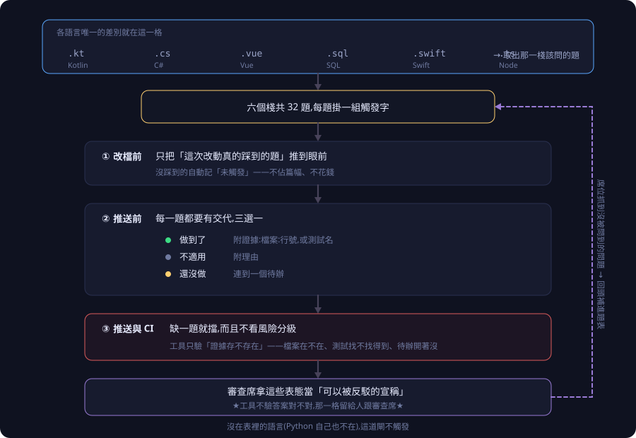

<p align="center">
  <picture>
    <source media="(prefers-color-scheme: dark)" srcset="assets/lumos-logo-dark.png">
    
  </picture>
</p>

# Lumos

**繁體中文** · [English](README.en.md)

> 你三個月前叫 AI 寫的那個模組，今天要改。
> 你不記得當初為什麼那樣寫；AI 也拿不到——新開一個對話，上次講過的東西都不在了。

<p align="center">
  
</p>

那場對話裡，比較過的方案、否決的理由、講好不能破的規則，全都在。**交付的時候，只有程式碼留下來。**

這不是誰記性不好，**是程式碼本來就存不住那些事**。它只說得出「現在長這樣」；下面這五件，一句都答不出來：

- 當初**為什麼**選這個做法，比較過什麼、否決了什麼。
- 這塊管到**哪裡為止**，動了會波及誰。
- 哪些行為是**說好不能變的**，哪些只是剛好長這樣、可以放心重構。
- 這件事**驗證過沒有**，在什麼前提下才算數。
- 搞砸了**收不收得回來**。

以前這些活在資深工程師的腦子裡，人一走就跟著走了。

**Lumos 把這五件事寫成一疊互相連結的 Markdown 筆記，跟程式碼住在同一個專案裡**，再用 git 的檢查（提交、推送時自動跑）擋住「改了程式碼卻不更新筆記」這條路。**讓不寫比寫還麻煩，這樣才寫得下去。**

> **最容易誤會的一點：被擋的不是你，是 AI。**
> 程式跟筆記都是 AI 寫的。它提交時撞上這道檢查、讀到訊息，就自己回去補筆記再提交一次——**那些訊息本來就是寫給它讀的**。
> 所以「擋」不是摩擦，是**控制訊號**：**規則是拿來讓 AI 撞到的**，撞到就會照著解，你不用介入。你做的是需求跟關鍵決策。

實際跑起來大概是這個樣子。下面是一個線上商店：先有計劃，才長出功能，做完留下紀錄。

<p align="center">
  
</p>

圖上兩個細節：**金環（不能改的規則）要等驗證紀錄連上去才長出來**，宣稱不算數；**橘色那條線是回頭的**，出過的事故會被下一份計劃拉進來當必讀。

**你不用手寫這些筆記，也不用背指令。** 照平常跟 AI 對話的方式做開發就好——安裝時已經把「什麼時候該查、什麼時候該寫回」寫進 Claude Code 和 Codex 的規則檔了。

---

**先了解** &nbsp;&nbsp;[一篇筆記裡有什麼](#一篇筆記裡有什麼) · [跟 Obsidian 差在哪](#跟-obsidian-差在哪)<br>
**適合你嗎** &nbsp;[適合誰 / 不適合誰](#適合誰--不適合誰) · [為什麼是自然語言開發](#為什麼是自然語言開發)<br>
**要動手** &nbsp;&nbsp;[裝起來](#裝起來) · [你的第一次](#你的第一次)<br>
**再往下** &nbsp;&nbsp;[越跑越準的循環](#越跑越準的循環) · [代碼審這一關有三層](#代碼審這一關有三層) · [為什麼做這個](#為什麼做這個) · [邊界](#邊界) · [想更深入](#想更深入) · [授權](#授權)

---

## 一篇筆記裡有什麼

<p align="center">
  
</p>

那兩個星號記號是整套東西的核心——**「這裡不能改」這種話不能只用嘴講，旁邊必須掛著證據**；掛不上，健檢直接紅。

「這個專案有哪些不能碰的規則」因此不用問人也不用翻——**一行指令就有答案**（日常是 AI 幫你敲的，指令長相見 [指令參考](docs/指令參考.md)）。

---

## 跟 Obsidian 差在哪

**不衝突。** 這些就是普通的 Markdown 檔，你想用 Obsidian 打開完全沒問題；不裝任何筆記軟體也一樣跑。

差別只有一句：**Obsidian 是給人瀏覽的，Lumos 是給 AI 查的。**

**這疊筆記的主要讀者不是人，是下一個 session 的 AI**——所以它是設計來被查的，不是被讀的。

<p align="center">
  
</p>

---

## 適合誰 / 不適合誰

**適合：**

- 專案要活超過幾個月，而且會有別人（或別的 AI）接手。
- 大量用 AI 寫程式，你自己不會逐行讀完。
- 系統裡有「動到就會出事」的地方：金流、庫存、權限、資料遷移。

**不適合：**

- **程式主要還是你自己手寫，或者可支配的 token 不夠。** 這套的前提是脈絡從對話裡沉澱下來——你不跟 AI 講，就沒有東西可以留；而審查迴圈本身也要燒 token。
- 兩週寫完就丟的東西。
- 一個人的小工具，你自己每天都在讀，全部記在腦子裡。

**代價講在前面：** 這套會讓每次提交多花一點時間，換來的是三個月後不用重新考古。**專案活不到三個月，就不划算。**

---

## 為什麼是自然語言開發

上面那條「程式主要還是你自己手寫就不適合」，理由在這裡。

<p align="center">
  
</p>

你自己動手寫，會同時發生三件事：**一次只能一條線**、**之後的 AI 只能從程式碼反推**（那裡本來就沒有「為什麼」）、**最貴的那塊根本沒出現過**——你比較過哪些方案、為什麼否決，從來沒離開你的腦子。

改用自然語言開發，這三件事同時反過來：你負責決策與取捨，實作可以同時開好幾條；而**取捨本來就發生在對話裡**，規則會逼著它落成節點。

**這個差距只會越拉越大**——模型越強，你自己動手就越不划算。完整論證在 [心智模型與機制](docs/心智模型.md)。

---

## 裝起來

### 全新專案要導入

站在你的專案目錄裡跑：

```bash
curl -fsSL https://raw.githubusercontent.com/EnzoHsieh-Android/Lumos/release/get.sh | bash
```

它會問「要把這個目錄建成 lumos 專案嗎？[y/N]」，按 `y`。

- **預設是 N**，所以站錯目錄（例如你的 dotfiles）按 Enter 就跳過，不會誤裝。
- 不想盲跑遠端腳本？先 `curl -fsSL <網址> -o get.sh` 抓下來看過再執行。
- CI 這種沒有人在旁邊的環境：指令結尾加上 `-s -- --init`，直接建、不問。

### 裝好了嗎

```bash
lumos enforcement
```

它列出每一層防護「有沒有裝上、接上」——**注意它查的是接線，不是判得對不對**。全綠代表檢查程式註冊了、檔案在、版本對。Codex 那幾行會停在「已註冊，要不要跑本機讀不到」，那是平台限制、不是壞掉。


> 接手已經在用 Lumos 的專案、Windows 原生 PowerShell、離線安裝、只裝一半、為什麼分兩層——都在 [上手細節](ONBOARDING.md)。

---

## 你的第一次

裝完之後，開一個 Claude Code 或 Codex 的對話，像平常一樣講話就好：

<p align="center">
  
</p>

左邊那三句就是你要做的全部，右邊那些指令**你不用碰也不用背**。

安裝時已經把「什麼情況該查什麼」寫進 Claude Code 的 `CLAUDE.md` 和 Codex 的 `AGENTS.md`，另外掛了五個會自動觸發的檢查：開場提醒、改檔前推波及的筆記、派審查員時附相關筆記、收工檢查、CI 狀態。

真的要提交而筆記沒動時，會像這樣被擋下來：

```console
$ git commit -m "調整結帳邏輯"

擋下:這次 commit 改了程式碼,但知識筆記一個字都沒動。
程式碼記的是「現在長怎樣」,筆記記的是「為什麼這樣做」——只改其中一邊,
下一個人(或下一個 session 的 AI)就會拿舊的理由去理解新的程式碼。

兩條路選一條:
   1. 把該改的筆記改一改,加進 commit,再提交一次。
   2. 這次真的不需要動筆記(改錯字、排版、註解)→ git commit --no-verify
      跳過會留下紀錄,不是偷偷放行。
```

**這一擋就是整套東西的本體。** 其他都是為了讓這一擋不討人厭而長出來的。

**兩件常被問的，一句話答完：** ①「那不就程式要寫、筆記也要寫？」**兩邊都是 AI 寫的，被擋的也是 AI**，那段訊息是印給它看的。②「改一顆按鈕也擋？」提交這道**一律擋一次**（AI 自己判斷補或跳過，不用交代理由），但**推送前的代碼審會看風險分級，小改動根本不觸發**。
細節與實際繞過率在 [心智模型與機制](docs/心智模型.md)。

---

## 越跑越準的循環

**這是 Lumos 跟「一本寫得很好的文件」真正的分野。** 文件寫完那天最準，之後只會往下掉；這套東西相反，每跑一輪手上的材料就更準一點。

<p align="center">
  
</p>

四個階段照順序跑，關鍵在最後一步：**每條意見的處置結果會寫回圖譜，變成下一輪的材料。**

**筆記不是最後的產出物，是下一輪的輸入。** 第一輪審查員手上可能只有三篇，第五輪會有八篇——而且那八篇是前幾輪真的被採納過的，不是誰憑印象丟進去的。

同一批 AI、同樣的時間，**差別只在手上的材料越來越準**。

<p align="center">
  
  <br>
  <sub>Lumos 自己的筆記三個月長出來的樣子（錄製當下 440 篇、1572 條連結，現在 457 篇）。產品畫面直接錄的，不是畫的。</sub>
</p>

### 派工這一段，是一張 DAG

「把相關的節點附給審查員」講起來很簡單，實際是**一份材料扇出成好幾席、再收斂回一個判定**。

<p align="center">
  
</p>

最值得看的一點:**派工單裡真正有用的不是「哪幾篇相關」,是「這條規則綁的測試現在什麼狀態」**——沒綁的那種閘守不到,只剩人讀。各席獨立不互看,因為「多席一致」要能當證據,前提就是他們沒互相抄。

> **老實話：** 機器擋得住的是形式。「這條規則今天還符不符合業務」只有人能答——別把「有掛證據」當成「絕對安全」。

---

## 代碼審這一關有三層

一段程式碼要推上去之前，會被三種不同的東西看過。**它們抓的是三種不同的問題——少一層，那一類就沒人接。**

<p align="center">
  
</p>

**① linter 那一層**——專案自己宣告要跑哪幾支，Lumos 只讀輸出、過濾到這次碰到的行，**併進審查員的派工單**。抓不到設計級問題：沒有規則寫得出「這個協程開錯執行緒」。

**② 檢核題那一層**——每個技術棧一張「該問自己的效能題」（六棧共 32 題），**只問你真的踩到的**；推送前每題要有交代：做到了（附證據）／不適用（附理由）／還沒做（連待辦）。抓不到答案對不對——**工具只驗證據在不在，對錯留給審查席反駁。**

**③ 測試那一層**——受波及的合約測試真的跑一次。**這是最後兜底**：前兩層講對了、做錯了，只有這裡抓得到。抓不到沒有測試守著的地方。

<p align="center">
  
</p>

**沒在表裡的語言（Python 自己也不在），第二層就不觸發。** 工具驗什麼／不驗什麼的完整對照、以及各語言怎麼接，在 [心智模型與機制](docs/心智模型.md)。

> **老實話：第二層擋得住「懶得回答」，擋不住「隨便回答」。** 它抓的是最懶的那種謊——剩下的靠審查席，最後靠測試。

---

## 為什麼做這個

全自動開發的時代總有一天會到來。**但脈絡不會自己跟上**——為什麼否決了看起來更快的做法、哪次事故換來現在這條規則，AI 拿不到：新開的對話讀不到上次；同一個對話跑久了，最早那段也會被視窗擠掉。**那是「拿不拿得到」的問題，不是「聰不聰明」的問題，模型再強也不會消失。**

**所以要把脈絡寫在模型外面。但光是寫下來還不夠**——寫下來的東西如果不跟著開發走，三個月後它講的是三個月前的世界，**那比沒有更糟，因為下一個人會相信它**。所有「我們來好好寫文件」都死在這裡：不是沒人寫，**是寫完之後沒有任何東西逼它同步**。

所以我深信：**下一代軟體開發的基石，不會只是更會寫程式的模型，而是把脈絡留下來、而且逼它不准腐爛的工程治理**——一套跟著開發一起長的東西，**而不是只寫第一次、之後就開始腐壞的系統**。

Lumos 是我對這件事的答案。

---

## 邊界

Lumos 只放**通用的工具組**：筆記的指令列工具、各種檢查、git hook，以及跨專案通用的技術棧慣例手冊。

kotlin、vue、csharp 那幾份手冊不綁任何一個專案，所以住在這裡。

各專案自己的東西不進來：業務筆記內容、發版腳本、只有那個專案在用的框架選型。

---

## 想更深入

- **[心智模型與機制](docs/心智模型.md)** — 三條鏈怎麼運作、哪道檢查擋什麼，以及工具證不了的那一半。
- **[指令參考](docs/指令參考.md)** — 日常不用敲，需要的時候查得到。
- **[接手一個沒有筆記的舊專案](docs/接手舊專案.md)** — 怎麼把舊系統的脈絡還原成筆記。
- [上手細節](ONBOARDING.md) · [架構全景](ARCHITECTURE.md) · [從 SDD 過來的話](SDD-vs-Lumos.md)
- 方法論長文（由淺到深）：[全景圖](docs/methodology/圖譜即合約-全景圖.md)（一張圖看完所有檢查）· [對外論述](docs/methodology/圖譜即合約-對外論述.md)（白話完整版）· [圖譜即合約](docs/methodology/圖譜即合約.md)（內部設計檔案，含演進史，最長）

---

## 授權

[MIT](LICENSE)，涵蓋工具鏈自己的檔案，包含被複製進你專案的那幾支。

**你寫的筆記是你的**，Lumos 不主張任何權利。
