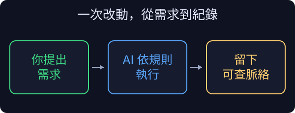

<p align="center">
  <picture>
    <source media="(prefers-color-scheme: dark)" srcset="assets/lumos-logo-dark.png">
    
  </picture>
</p>

# Lumos

**繁體中文** · [English](README.en.md)

**Lumos 是一套給 AI 開發用的工程治理工具。**

從理解需求、修改程式，到審查、驗證與交接，Lumos 把專案脈絡、重要規則和檢查流程接在一起，讓 AI 的改動不只留下程式碼，也留下「為什麼這樣做、影響了什麼、如何確認」。

它由 Markdown 知識圖譜、CLI、AI 工作指引與檢查機制組成，搭配 Claude Code 或 Codex 使用。日常由你提出需求、決定取捨，AI 依指引查詢、實作與寫回；需要判斷業務規則或接受風險時，仍由人決定。

一次改動繞過四站：**圖譜 → 派工 → 審查 → 寫回**。外圈的 evals 利用留下的紀錄，檢查與校準這套流程。

<p align="center">
  
</p>

[適合誰](#適合誰--不適合誰) · [安裝](#裝起來) · [第一次使用](#你的第一次) · [四站如何運作](#圖譜) · [限制與範圍](#邊界) · [詳細文件](#想更深入)

## 適合誰 / 不適合誰

當你大量使用 AI 開發，而且專案需要長期維護、跨人員或跨 session 接手，Lumos 最有機會派上用場。尤其是金流、庫存、權限、資料遷移這類改動：知道「能不能跑」之外，還需要知道哪些行為不能變、改動會牽連哪裡。

它把幾件容易分散的工程工作接起來：

| 開發時的問題 | Lumos 提供的機制 |
| --- | --- |
| 為什麼這樣設計？哪些規則要保留？ | 可查詢的決策、邊界與合約筆記 |
| 這次改動要找誰看、看什麼？ | 相關脈絡整理、分工審查與風險分級 |
| 說「驗過了」有什麼依據？ | 合約測試綁定、驗證紀錄與檢查閘 |
| 下一次開發還能接得上嗎？ | 將決策、審查處置與驗證結果寫回圖譜 |

**導入有成本。** 維護筆記、執行檢查與多席審查都會消耗時間和 token。一次性原型、主要由人手寫且少有交接的專案，可能不需要整套流程；也不必為了使用 Lumos，把每個小改動都擴大成設計案。

## 裝起來

需要 **Git、Python 3.9+**，以及 Claude Code 或 Codex。安裝不只增加一個 CLI：也會安裝共用工具與 skills，並在初始化專案時加入知識圖譜、AI 指引與 hooks。若想先了解變更範圍，請看 [上手細節](ONBOARDING.md)。

在要導入的專案目錄執行：

```bash
curl -fsSL https://raw.githubusercontent.com/EnzoHsieh-Android/Lumos/release/get.sh | bash
```

腳本詢問是否將目前目錄初始化為 Lumos 專案時，確認目錄正確再輸入 `y`；直接按 Enter 會跳過初始化。也可以先下載並檢查腳本，再執行。

安裝完成後，**重新開啟 AI session**，再檢查接線狀態：

```bash
lumos enforcement
```

這個指令確認檢查是否已安裝、註冊與接上，**不代表它們的判斷一定正確**。平台信任設定等本機讀不到的資訊，會列為未知，需要另外確認。

Windows、接手已導入的專案、離線安裝與移除方式，見 [上手細節](ONBOARDING.md)。

## 你的第一次

先選一個範圍小、容易驗證的需求。例如對 AI 說：

> 幫我在現有付款流程加入退款功能。先查相關筆記，列出不能破壞的規則、影響範圍和驗證方式；確認方案後再實作，完成時把決策與驗證結果寫回。

這是用來說明流程的例子，不是退款功能的完整規格。遇到退款資格、金額或權限不明確，AI 應先向你確認。

<p align="center">
  
  <br>
  <sub>流程示意，不是實機測試結果；實際步驟依專案規則與改動風險而定。</sub>
</p>

你不需要先背完 CLI。安裝的工作指引告訴 AI 何時查詢、何時寫回；hooks 在對應階段提醒或阻擋未完成的事項。

例如「程式碼變了、筆記卻沒更新」會觸發提交檢查。AI 需要補上相關脈絡，或依專案規則處理不需要更新筆記的例外。這是把待辦帶回工作流程的機制，**不是保證 AI 每次都能自行解決**；遇到取捨或風險仍需要你介入。

完成後，請看三件事：**改了什麼、實際驗了什麼、留下哪些決策或限制**。沒有執行的測試，不應被寫成通過。

## 圖譜

**第①站：把需要的脈絡找回來。**

知識圖譜是一組互相連結、可隨專案版本管理的 Markdown 筆記。它記錄的不只是功能說明，還包括設計理由、模組邊界、重要規則、事故教訓與驗證前提。

例如，一個商店專案可以把「退款計劃」連到「付款模組」、不得重複退款的規則，以及守住這條規則的測試：

<p align="center">
  
</p>

AI 可以從問題查詢筆記，也能從修改的檔案反查相關筆記，取回與本次任務有關的內容。**已登記的關聯不是完整依賴分析**；圖譜提供線索，仍須對照程式碼與實際行為。

重要規則可以標成「合約」並綁定測試。這讓「不能改」有可追查的依據，但測試通過只證明所覆蓋的情境；規則是否仍符合業務，不能只靠工具決定。

[看筆記結構與影響查詢圖解](docs/心智模型.md#九圖解補充)

## 派工

**第②站：讓審查員拿到材料，也保留獨立判斷。**

派工會整理本次改動、相關筆記與重要規則，交給不同角度的審查席。各席彼此看不到對方的報告，降低互相沿用結論的機會；但多席一致不等於一定正確。

報告收回後，檢查引用能否對上，並逐條記錄採納、駁回或待處理的結果。重點不是多找幾個 AI，而是讓每項意見有依據、有處置。

[看完整派工、收報告與處置閘流程](docs/心智模型.md#七三張詳細圖怎麼讀)

## 審查

**第③站：分開檢查架構、已知問題與實際行為。**

除了找 bug，審查也關注改動是否符合專案既有架構。架構席以同層既有程式碼作為參照，檢查是否引入並存的第二套做法、或跨越原有分層，而不是只按個人偏好評風格。

程式本身則由互補的檢查處理：

- **Linter**：檢查已編碼的規則與常見違例。
- **技術棧檢核題與審查席**：要求對相關效能、可靠性問題提出說明，再挑戰其依據。
- **測試**：執行受影響合約所綁定的測試，檢查實際行為。

推送前的代碼審依風險分級觸發，不是每次小修改都跑同樣規模。檢查閘能要求答案與證據存在，卻不能單靠格式判定答案正確。

[看三層檢查的分工、技術棧觸發條件與推送閘](docs/心智模型.md#七三張詳細圖怎麼讀)

## 寫回

**第④站：讓這次工作的結果成為下次的輸入。**

完成改動後，AI 將設計取捨、審查處置、驗證結果與未解事項寫回相關筆記。下一個 session 不必只從程式碼反推，也能查到當時的理由與限制。

寫回不是累積越多越好。舊決策可能失效，測試也有成立前提；資料需要隨改動更新、重驗或標示過時，才能持續有用。

<details>
<summary>看看 Lumos 自己的圖譜成長紀錄</summary>

<p align="center">
  
  <br>
  <sub>錄製當下為 440 篇筆記、1,572 條連結。此圖用來呈現規模，不作為逐字閱讀或品質提升的證明。</sub>
</p>

</details>

## evals

**外圈：檢查流程本身，讓改進有可比較的依據。**

evals 指評測。Lumos 留下審查席、發現與處置的紀錄，將過閘判定凍結成回放參照，並以每週回放檢查規則變動是否改變舊案結果。查詢機制另有人工標註的題目，供演算法調整時比較。

這些紀錄用來校準後續流程；它們不是「審查品質必然逐輪提升」的保證。[詳細機制](docs/心智模型.md#六審查迴圈實際跑什麼)

## 為什麼是自然語言開發

Lumos 的主要使用方式，是讓你在對話裡提出需求、說明限制、比較方案，再由 AI 執行。這些對話本身就包含值得保留的設計脈絡，工具把它們帶入可查詢、可驗證的工作流程。

這不是說工程師不必懂程式，或手寫開發沒有價值。你仍需要判斷需求、架構、部署與驗證是否合理；Lumos 想減少的是重複交代背景與追補紀錄的負擔。

## 為什麼做這個

我相信，AI 會承擔越來越多實作工作。但更會寫程式的模型，不會自動替專案保留所有取捨，也不會讓規則、文件與測試永遠同步。

所以我想把脈絡放在模型外面，並把維護它的動作接進開發流程。下一代軟體開發的基石，不只是產生程式碼的能力，也包含讓改動有依據、讓決策可追查、讓後來的人能繼續維護的工程治理。

Lumos 是我對這件事的實作。

## 邊界

Lumos 提供通用工具鏈：筆記 CLI、工作指引、檢查、Git hooks，以及跨專案的技術棧慣例。各專案的業務知識、框架選型與發版流程，仍屬於各自的專案。

它**不是品質或安全保證，也不取代工程判斷**：

- 圖譜可能不完整或過時，衝突時要對照程式碼、測試與實際運作。
- AI 審查可能漏判；有回答、有紀錄，不代表內容正確。
- 有效防護取決於實際安裝、平台設定與 CI 接線，不能只看本機顯示正常。
- 涉及業務取捨、不可逆操作與風險接受，仍需人確認。

## 想更深入

- **想理解每道檢查如何運作？** [心智模型與機制](docs/心智模型.md)
- **準備安裝或接手既有設定？** [上手細節](ONBOARDING.md)
- **舊專案還沒有筆記？** [接手舊專案](docs/接手舊專案.md)
- **需要查某個操作？** [指令參考](docs/指令參考.md)
- **想看內部設計或與 SDD 比較？** [架構全景](ARCHITECTURE.md) · [SDD 與 Lumos](SDD-vs-Lumos.md)
- **想讀完整方法論？** [全景圖](docs/methodology/圖譜即合約-全景圖.md) · [對外論述](docs/methodology/圖譜即合約-對外論述.md) · [設計與演進](docs/methodology/圖譜即合約.md)

## 授權

[MIT](LICENSE)，涵蓋 Lumos 工具鏈的檔案，包含複製進專案的工具。

你寫的筆記是你的，Lumos 不主張任何權利。
