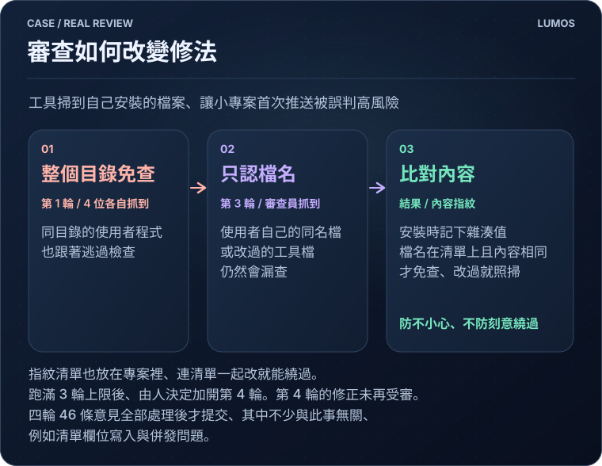

<p align="center">
  <picture>
    <source media="(prefers-color-scheme: dark)" srcset="assets/lumos-logo-dark.png">
    
  </picture>
</p>

# Lumos

**繁體中文** · [English](README.en.md)

[](https://github.com/EnzoHsieh-Android/Lumos/actions/workflows/ci.yml)

**讓 AI 寫程式時，把「為什麼這樣改」一起留下來。**

透過對話讓 AI 寫程式很快，但它不會替專案留下紀錄。討論過的取捨、否決過的方案，下次開新對話就不見了。「同一筆訂單不能退款兩次」這種規則，程式碼裡看不出來。AI 說測試都過了，事後也查不到它跑了哪些測試。

Lumos 補的就是這一塊。它搭配 Claude Code 或 Codex 使用，要求 AI 每次改程式都寫下修改理由、必須遵守的規則和驗證方式，存成 Markdown 筆記，與程式碼放在同一個 repo。提交和推送時，Git hooks 會檢查其中能自動判斷的部分，例如筆記有沒有跟著改。概念上，它像是把 ADR（架構決策紀錄）、CODEOWNERS 和 pre-commit 接在一起，只是檢查的對象是 AI。

整套工具很小：一個單檔的 Python 命令列工具（只用標準函式庫）、一組 Git hooks、一份寫進 CLAUDE.md／AGENTS.md 的 AI 工作守則，以及專案筆記。

## 用起來是什麼樣子

假設 AI 改了退款邏輯，卻沒寫任何筆記就提交，它會收到這段訊息（實機輸出，節錄）：

```text
$ git commit -m "feat: 退款前檢查是否已退過"

擋下:這次 commit 改了程式碼,但知識筆記一個字都沒動。
…
這次改到的程式碼(1 個):
   • src/payment.py
…
兩條路選一條:
   1. 把該改的筆記改一改,加進 commit,再提交一次。
   2. 這次真的不需要動筆記(改錯字、排版、註解、還在進行中的半成品)→ 跳過這道檢查:
        git commit --no-verify -m '<訊息>'
      跳過會留下紀錄,不是偷偷放行。
```

這段訊息是給 AI 讀的。工作守則要求它補上筆記再提交；如果確實不需要更新筆記（例如只改錯字），也可以跳過，但會留下紀錄。你主要負責業務上的取捨，以及決定要不要接受某個風險。

## 怎麼運作

<p align="center">
  <a href="assets/map-zh.svg">
    
  </a>
</p>

1. **讀程式碼，補上脈絡**：AI 先讀程式碼。修改檔案時，工具會提供相關筆記，補上程式碼看不出的理由。如果筆記描述的程式行為與程式碼不一致，就以程式碼為準；部署狀態、業務限制這類程式碼無法回答的問題，則要查證或問人。
2. **依風險派 AI 審查**：詳見下一節。
3. **每條意見都要有處理結果**：修正問題、說明不修的理由，或用證據證明問題不成立；全部處理完才能過關。
4. **寫回筆記**：把這次的取捨和驗證方式寫進負責記錄這支檔案的筆記，讓下次改到這裡的人或 AI 查得到。

外圈檢查的是流程本身。在 Lumos 自己的 repo 裡，每個完成審查且附有設計規格的案子，都會留下「過關或不過關」的結論。每週用同一版規則重跑，確認同樣的案子仍得到同樣的結論；案子多到跑不完時，就輪流抽一部分。結論變了，就代表規則被改壞了，要回頭調整。

## 從計劃到驗證，讓筆記一步步連起來

專案裡互相連結的筆記合稱「圖譜」，每篇筆記是一個「節點」，分為計劃、功能說明、驗證紀錄和事故。下圖以虛構的線上商店為例：先寫結帳流程與付款串接的計劃，再實作功能，留下結帳端對端測試與重複付款壓力測試的驗證紀錄。重要規則要連上驗證紀錄後，才會標示為受保護，也就是圖上的金環。若發生「取消訂單未退點」的事故，就把事故連回受影響的結帳流程，再建立退點修復計劃、修正功能，最後補上退點回歸測試。

<p align="center">
  <a href="assets/graph-demo-zh.svg">
    
  </a>
</p>

## 怎麼做 code review

<p align="center">
  <a href="assets/risk-review-zh.svg">
    
  </a>
</p>

- **先判斷風險**：推送前，工具會用固定規則掃描這次新增的程式碼，找出容易出問題的寫法。
- **再決定派幾個 AI 審查**：一般改動派 1 到 2 個；高風險改動每輪至少派 7 個，各自從一個角度檢查。其中 5 個找問題，1 個檢查是否與既有架構一致，1 個檢查資安；如果有定稿的設計規格，再加 1 個對照規格。
- **高風險改動沒審完不能推送**：推送前必須留下審查結果，記錄通過或跳過，跳過時須寫明理由，否則 Git hook 會擋下推送。

審查只是其中一層。風險分級、多個 AI 審查、放行規則、外部規則（linter）和測試，每一層都有漏洞。把這些層疊在一起，問題就比較難一路穿過所有檢查，這就是瑞士起司模型。

<p align="center">
  <a href="assets/swiss-cheese-zh.svg">
    
  </a>
</p>

## 人在哪裡

Lumos 預設不要求人逐行檢查每個 diff，而是交給多個 AI 和自動檢查工具；人負責以下判斷。

- 需求、取捨、是否接受風險，以及不可逆的操作，都由人決定。
- 高風險審查最多跑 3 輪；如果仍未通過，就停下來交給人決定，AI 不自行宣布通過（這是工作守則，工具只會在跑滿時提示）。
- 規則是否仍符合業務需求，要由人簽核並留下紀錄，因為測試無法證明這一點。
- 每輪的審查報告和處理結果都留在 repo，人隨時可以抽查。

## 一個真實的例子

Lumos 會把自己的程式和 hooks 複製到使用者的專案裡，但風險掃描也把這些檔案算進去，導致小專案首次推送時被誤判為高風險。最初的修正是略過整個工具目錄，但首輪 4 位審查員各自發現，這樣會漏查放在同一目錄裡的使用者程式。改成精確比對檔名後，第 3 輪又發現，使用者的同名檔案和修改過的工具檔案仍會漏查。最後的做法是在安裝時記下內容指紋（雜湊值），只有檔名在清單上且內容相同的檔案才免查。這能防止無意間的疏漏，但擋不住連清單一起修改的刻意繞過。[審查報告原文](governance/review-reports/code-工具自裝檔不算消費專案/)都留在 repo 裡。

<p align="center">
  <a href="assets/case-review-zh.svg">
    
  </a>
</p>

## 怎麼防止筆記過期（drift）

程式改了，筆記卻還在描述舊的行為，AI 讀到就可能被誤導。我在一個合成專案裡刻意放入錯誤筆記，較小的模型 Haiku 4.5 答對率就從 20/25 降到 12/25。Lumos 因此從寫筆記、提交到推送，設下三道關卡來處理這個問題。

第一道從筆記內容著手：程式碼查得到的欄位、預設值和流程，不再抄一份進筆記；筆記只寫程式碼看不出的理由。不過，工具只能攔下兩種有固定寫法的內容：新寫入的程式行號，以及未註明來源的現況描述，例如部署設定。這兩種會在提交時被擋下，其餘仍靠守則和審查。

另外，有一種句子特別容易過期。例如筆記寫「目前還沒有退款頁面」，等退款頁面做出來，這句就錯了，卻沒人會記得回來改。新寫這種句子時，工具會提醒把它改寫成一行「回頭條件」，寫明這句話什麼時候該回頭檢查，例如「退款頁面那支檔出現的時候」。照做的話，哪次推送新增了那支檔，推送前的檢查就會指出這句話並擋下推送；要把它改成現況，或寫明保留的理由，才能推送。新寫句子時的提醒本身不會擋下提交。

提交時，第二道會檢查筆記是否跟著維護。改了程式卻沒有更新任何筆記，或新增的程式檔沒有指定負責記錄的筆記，都會被擋下。推送前，第三道會找出筆記裡過時的說法：函式刪了、檔名改了，筆記卻還提到舊名稱或路徑，只會提醒。以下情況則會擋下推送：某條規則的測試已經上線，筆記卻還說「之後補測試」；連到的另一篇筆記已被刪除；或前面說的回頭條件已經成立。「改程式卻沒動筆記」和「連結斷掉」一定會擋，其他會擋下的檢查則可以由專案改成只提醒。

<p align="center"><a href="assets/drift-guard-zh.svg"></a></p>

這些檢查能抓到多少問題？在另一個使用 Lumos 的專案裡，我們找到 20 處確實過期的內容，再用工具逐一檢查。對於已經存在的筆記漂移，工具抓得到 7 處（35%）；如果當時推送前就有這些檢查，約可抓到 13.5 處，也就是約三分之二。其中一處只能抓到一半，所以算半處。仍會漏掉的情況包括：程式新增了功能，舊句子卻還說「沒有這功能」；或數值變了，名稱卻沒變。前一種現在會在新寫時被提醒，但已經寫進去的舊句子不會被回頭掃到。至於檢查結果中有多少是誤報，還沒量完。

抓到問題之後，有些可以交給工具修。`lumos drift fix` 可以依種類處理五種狀態不一致的問題，例如「計劃已經收尾，底下的驗證紀錄還標著待定」。其中一種只會列出證據，內容仍要人填寫。筆記裡的舊說法，也仍要人改寫。

第二道也有個直接的限制：它只能判斷筆記有沒有更新，無法判斷更新後的內容對不對。在同一個專案抽查的 55 句現況描述中，能判斷的 54 句裡有 22 句已經過時。這也是後來加上第一道檢查、從寫入內容著手的原因。筆記內容是否正確，最後還是要靠審查和人。

<details>
<summary>更多：審查數據與跳過紀錄</summary>

- **多個審查員有用嗎？** 在 Lumos 自己的 85 輪多人審查中（2026-07 到 08），822 個問題裡有 531 個（64.6%）只被一位審查員抓到，代表不同審查員看到的問題不一樣。這只是描述性統計，無法推算多派或少派一位會有多大差異；每個問題被幾位審查員抓到，是由負責分派審查、收回報告的 AI 手動填寫。
- **審查意見指出的都是真問題嗎？** 截至 2026-09-30，6,195 條審查意見中只有 58 條（0.9%）被判定不需處理。不過，做出這個判定的也是 AI。
- **被跳過的檢查有沒有正當理由？** 「改程式要動筆記」這道檢查，在 Lumos 自己約 2,070 個提交中被跳過 84 次。Claude 和 Codex 分別獨立檢視過每一次：兩者一致認為，其中 8 次改了行為卻沒記錄理由；17 次只改了測試檔；其餘多半是功能分支尚未完成時的提交，稍後才補上筆記。[逐筆判斷](governance/eval/readme-bypass-judge/)
- **較大的模型呢？** Opus 5 在上面的實驗四組都 25/25，不受錯筆記影響，但有筆記時耗時是 2 到 5 倍。
- **筆記有沒有幫上忙？** 另一批 80 場測「程式碼推不出來的規則」：只看程式碼的 AI 5 次都沒答對，有筆記的 15 次答對 8 次。實驗只有一個合成專案、題目是我設計的，只能說方向成立。
- **擋不住的情況**：有些輔助檢查本身出錯時會放行，避免工具故障卡住開發。提交時跳過檢查會留下紀錄；推送時用 `--no-verify` 跳過檢查，本機不會留下紀錄，只有推到 main 或開 PR 時，CI 才會重新執行檢查。
- 可核對的原始紀錄：[擋下與放行](docs/.governance-log.jsonl)、[跳過紀錄](docs/.bypass-log.jsonl)、[審查報告](governance/review-reports/)。

</details>

## 安裝與限制

需要 Git、Python 3.14 以上，以及 Claude Code 或 Codex。請在要導入 Lumos 的專案目錄執行：

```bash
curl -fsSL https://raw.githubusercontent.com/EnzoHsieh-Android/Lumos/release/get.sh | bash
```

腳本詢問是否初始化目前目錄時，請先確認目錄正確，再輸入 `y`。安裝後重新開一個 AI 對話，執行 `lumos enforcement`，確認各項檢查都已接上。Windows、離線安裝與移除方式，請見[上手細節](ONBOARDING.md)。

<details>
<summary>已經在用舊版的專案：升級到 Python 3.14 要做的事</summary>

- 更新後，沒有 3.14 的機器，提交與推送會被擋下並說明怎麼裝（macOS：`brew install python@3.14` 或 `uv python install 3.14`）。`python3` 指到舊版沒關係，lumos 會自己找 3.14 重跑。
- 專案 CI 要把 `actions/setup-python` 設成 3.14。
- 裝好之後跑一次 `lumos install`，讓 Claude／Codex 的 hooks 也改用 3.14。
- Codex 的 hook 指令因此改變，可能要再開一次互動式 codex 重新核可。本機讀不到 Codex 的信任狀態，請用 `lumos enforcement` 搭配實際觸發一次確認。

</details>

Lumos 不保證品質或安全，也不取代工程判斷。筆記可能過時，AI 審查可能漏判，有紀錄也不代表內容正確。業務取捨、不可逆的操作，以及是否承擔風險，仍要由人決定。

深入閱讀：[心智模型與機制](docs/心智模型.md) · [接手舊專案](docs/接手舊專案.md) · [指令參考](docs/指令參考.md) · [架構全景](ARCHITECTURE.md) · [SDD 與 Lumos](SDD-vs-Lumos.md) · [方法論](docs/methodology/圖譜即合約.md)

授權：[MIT](LICENSE)。你寫的筆記是你的，Lumos 不主張任何權利。
