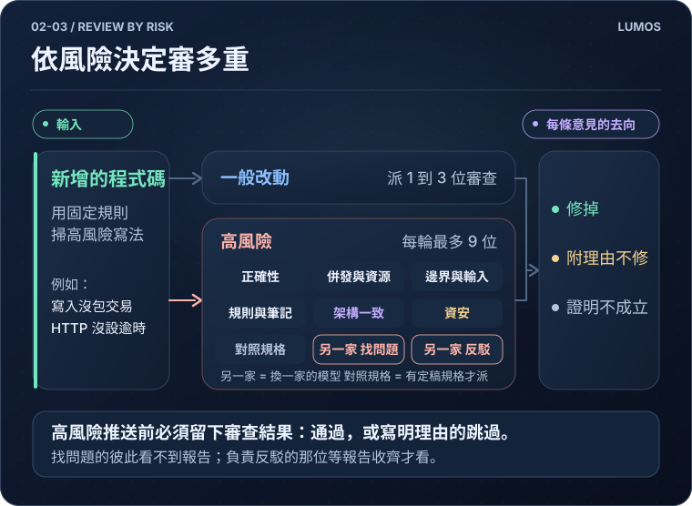
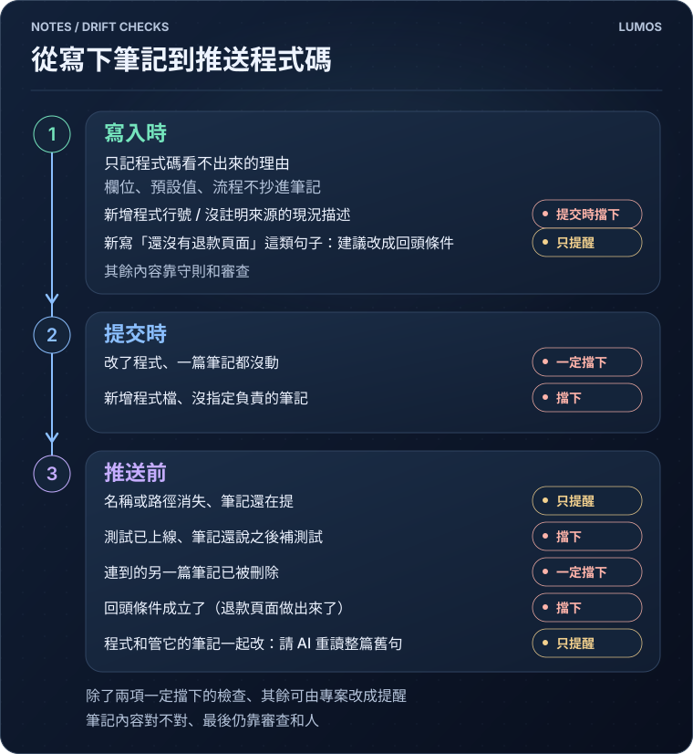

<p align="center">
  <picture>
    <source media="(prefers-color-scheme: dark)" srcset="assets/lumos-logo-dark.png">
    
  </picture>
</p>

# Lumos

**繁體中文** · [English](README.en.md)

[](https://github.com/EnzoHsieh-Android/Lumos/actions/workflows/ci.yml)

**讓 AI 寫程式時，把「為什麼這樣改」一起留下來。**

Lumos 主打用自然語言開發：你描述需求，AI 提出方案並實作，不綁定程式語言。它是套在 AI 開發外面的一層控制與紀錄機制（harness），處理五個問題：黑箱、記憶斷層、筆記過期、難以驗證，以及架構越改越亂。目標是人不必逐行看 diff 也掌握得住 AI，才能把更多開發交給 AI、同時推進多個專案。

舉例來說，透過對話寫程式很快，但討論過的取捨、否決過的方案都只留在那段對話裡。接回對話還找得回來；可是三個月後有人改到同一支檔，沒人記得是哪段對話，同事和別的 AI 工具也看不到。「同一筆訂單不能退款兩次」，程式碼裡頂多看得到一段檢查，看不出它為什麼不能拿掉。AI 說測試都過了，事後也查不到跑了哪些。

Lumos 把這些脈絡留在專案裡。它搭配 Claude Code 或 Codex，要求 AI 每次改程式都寫下理由、必須遵守的規則和驗證方式，存成 Markdown 筆記，跟程式碼一起進版控，換誰、換哪個工具都查得到。提交和推送時，Git hooks 會檢查能自動判斷的部分，例如筆記有沒有跟著改。概念上，它像把 ADR（架構決策紀錄）、CODEOWNERS 和 pre-commit 接在一起，檢查的對象換成 AI。程式碼品質則接上各語言現成的 linter 和社群規則，只擋新增的警告；再依風險派 AI 多角度審查，並確認測試真的跑過、真的抓得到問題。

整套工具很小：一支單檔的 Python 命令列工具（只用標準函式庫）、一組 Git hooks、一份寫進 CLAUDE.md／AGENTS.md 的 AI 工作守則，加上專案筆記。

## 用起來是什麼樣子

假設 AI 改了退款邏輯，卻沒寫任何筆記就提交，它會收到這段訊息（實機輸出，節錄）：

```text
$ git commit -m "feat: 退款前檢查是否已退過"

擋下:這次 commit 改了程式碼,但知識筆記一個字都沒動。
…
這次改到的程式碼(1 個):
   • src/payment.py
…
兩條路選一條:
   1. 把該改的筆記改一改,加進 commit,再提交一次。
   2. 這次真的不需要動筆記(改錯字、排版、註解、還在進行中的半成品)→ 跳過這道檢查:
        git commit --no-verify -m '<訊息>'
      跳過會留下紀錄,不是偷偷放行。
```

這段訊息是給 AI 讀的：守則要它補好筆記再提交；真的不需要（例如只改錯字）也能跳過，但會留下紀錄。你主要負責業務取捨，和要不要接受某個風險。

## 怎麼運作

<p align="center">
  <a href="assets/map-zh.svg">
    
  </a>
</p>

1. **讀程式碼，補上脈絡**：AI 先讀程式碼；改檔時，工具會送上相關筆記，補上程式碼看不出的理由。筆記講的程式行為跟程式碼對不上時，以程式碼為準；部署狀態、業務限制這類程式碼答不了的，要查證或問人。
2. **依風險派 AI 審查**：見下面「怎麼做 code review」。
3. **每條意見都要有結果**：修掉、說明不修的理由，或用證據證明不成立；全部處理完才過關。
4. **寫回筆記**：把這次的取捨和驗證方式寫進負責這支檔的筆記，下次改到這裡查得到。

外圈檢查的是流程本身。在 Lumos 自己的 repo 裡，每個審完且附有設計規格的案子，都會存下「過或不過」的結論；每週用現在的判定程式對存檔重算一次（不重新找 AI 審），案子太多就輪流抽。結論變了，代表後來改判定規則時改壞了東西，要回頭修。

## 從計劃到驗證，讓筆記一步步連起來

互相連結的筆記合稱「圖譜」，每篇是一個「節點」，分成計劃、功能說明、驗證紀錄和事故。下圖以虛構的線上商店為例：先寫結帳與付款串接的計劃，做出功能，再留下端對端測試和重複付款壓力測試的驗證紀錄；重要規則連上驗證紀錄後，才標成受保護（圖上的金環）。發生「取消訂單未退點」時，事故連回結帳流程，接著開修復計劃、修正功能、補上回歸測試。

<p align="center">
  <a href="assets/graph-demo-zh.svg">
    
  </a>
</p>

## 怎麼做 code review

<p align="center">
  <a href="assets/risk-review-zh.svg">
    
  </a>
</p>

- **先判風險**：推送前用固定規則掃這次新增的程式碼，找容易出事的寫法。
- **再決定派幾個 AI**：一般改動 1 到 2 個；高風險每輪至少 7 個，5 個找問題、1 個看架構一致、1 個看資安，有定稿的設計規格時再加 1 個對照規格。
- **高風險要有審查結果才能推**：推送前要留下審查結果（通過，或寫明理由的跳過），否則 Git hook 會擋下。

審查只是其中一層。風險分級、AI 審查、放行規則、外部規則（linter）和測試各有漏洞，疊在一起，問題就難一路穿過，這就是瑞士起司模型。

<p align="center">
  <a href="assets/swiss-cheese-zh.svg">
    
  </a>
</p>

## 人在哪裡

Lumos 預設不要求人逐行看 diff，交給 AI 和自動檢查；人負責這些判斷：

- 需求、取捨、要不要接受風險，以及不可逆的操作。
- 高風險審查最多 3 輪，還沒過就交給人，AI 不自行宣布通過（這是守則，工具只在跑滿時提示）。
- 規則還符不符合業務，要人簽核並留紀錄，這是測試證明不了的。
- 每輪的審查報告和處理結果都留在 repo，隨時可以抽查。

## 怎麼防止筆記過期（drift）

程式改了、筆記還在講舊的，AI 讀到就會被誤導：我在合成專案裡埋進錯誤筆記，較小的模型 Haiku 4.5 答對率從 20/25 掉到 12/25。Lumos 因此在寫筆記、提交、推送三個時間點各設一道關卡。

**第一道：只寫程式碼看不出的東西。** 程式碼查得到的欄位、預設值和流程不抄進筆記。工具能擋的只有兩種固定寫法：新寫的程式行號，以及沒註明來源的現況描述（例如部署設定），提交時擋下；其餘靠守則和審查。

還有一種句子特別容易過期：像「目前還沒有退款頁面」，頁面做出來這句就錯了，卻沒人會回來改。新寫這種句子時，工具會提醒把它改成一行「回頭條件」，寫明什麼時候該回頭檢查，例如「退款頁面那支檔出現時」。照做的話，那支檔出現的那次推送會被擋下，要把句子改成現況或寫明理由保留才推得出去。提醒本身不擋提交。

**第二道：提交時筆記有沒有跟著改。** 改了程式卻沒動任何筆記，或新增的程式檔沒指定負責的筆記，都會擋下。

**第三道：推送前找舊說法。** 函式刪了、檔名改了，筆記還在提舊名稱或路徑，只提醒；規則的測試已經上線、筆記還寫「之後補測試」，連到的筆記已被刪除，或回頭條件成立了，就擋下推送。「改程式沒動筆記」和「連結斷掉」一定擋，其他會擋的檢查可由專案改成只提醒。

<p align="center"><a href="assets/drift-guard-zh.svg"></a></p>

**抓得到多少？** 在另一個使用 Lumos 的專案裡，找到 20 處確實過期的內容，拿工具逐一檢查：已經存在的漂移抓到 7 處（35%）；如果當時推送前就有這些檢查，約可抓到 13.5 處，約三分之二（有一處只抓到一半，算半處）。仍會漏掉的有兩種：程式加了功能，舊句還說「沒有這功能」（新寫的這類句子現在會被提醒，但舊句不會回頭掃）；數值變了，名稱沒變。誤報比例還沒量完。

**抓到之後**：狀態對不上的五種漂移，例如「計劃已經收尾，驗證紀錄還標著待定」，可以用 `lumos drift fix` 依種類修，其中一種只列出證據、要人填。筆記裡的舊說法仍要人改。

**第二道的限制**：它只看筆記有沒有改，看不出改得對不對。同一個專案抽查 55 句現況描述，判斷得出來的 54 句裡有 22 句已經過時，所以後來才加上第一道、從寫的內容下手。筆記內容對不對，最後還是靠審查和人。

<details>
<summary>更多：審查數據與跳過紀錄</summary>

- **多個審查員有用嗎？** Lumos 自己 85 輪多人審查（2026-07 到 08）的 822 個問題裡，531 個（64.6%）只被一位審查員抓到，代表各自看到的不一樣。這只是描述性統計，推不出多派或少派一位差多少；每個問題被幾位抓到，是負責分派與收回審查的 AI 手動填寫的。
- **審查意見都是真問題嗎？** 截至 2026-09-30，6,195 條審查意見中只有 58 條（0.9%）被判定不需處理，但做這個判定的也是 AI。
- **跳過檢查有正當理由嗎？** 「改程式要動筆記」在 Lumos 自己約 2,070 個提交中被跳過 84 次。Claude 和 Codex 各自逐筆看過：一致認為 8 次改了行為卻沒寫理由，17 次只改了測試檔，其餘多半是功能分支做到一半、稍後補了筆記。[逐筆判斷](governance/eval/readme-bypass-judge/)
- **較大的模型呢？** Opus 5 在上面的實驗四組都 25/25，不受錯筆記影響，但有筆記時耗時是 2 到 5 倍。
- **筆記有幫上忙嗎？** 另一批 80 場實驗（四題、四組，每組每題 5 場）測「程式碼推不出來的規則」，真正考到這點的只有一題：只看程式碼的 5 場全錯，有筆記的三組 15 場答對 8 場；其他三題各組都接近滿分，看不出差別。只有一個合成專案、題目是我設計的，只能說方向成立。
- **擋不住的情況**：部分輔助檢查自己出錯時會放行，避免工具故障卡住開發。提交時跳過會留紀錄；推送時用 `--no-verify` 跳過，本機不留紀錄，要等推到 main 或開 PR 時 CI 重跑。
- 可核對的原始紀錄：[擋下與放行](docs/.governance-log.jsonl)、[跳過紀錄](docs/.bypass-log.jsonl)、[審查報告](governance/review-reports/)。

</details>

## 安裝與限制

需要 Git、Python 3.14 以上，以及 Claude Code 或 Codex。在要導入的專案目錄執行：

```bash
curl -fsSL https://raw.githubusercontent.com/EnzoHsieh-Android/Lumos/release/get.sh | bash
```

腳本問要不要初始化目前目錄時，確認目錄正確再輸入 `y`。裝完重開一個 AI 對話，執行 `lumos enforcement` 確認檢查都接上了。Windows、離線安裝與移除見[上手細節](ONBOARDING.md)。

<details>
<summary>已經在用舊版的專案：升級到 Python 3.14 要做的事</summary>

- 更新後，沒有 3.14 的機器，提交與推送會被擋下並說明怎麼裝（macOS：`brew install python@3.14` 或 `uv python install 3.14`）。`python3` 指到舊版沒關係，lumos 會自己找 3.14 重跑。
- 專案 CI 要把 `actions/setup-python` 設成 3.14。
- 裝好之後跑一次 `lumos install`，讓 Claude／Codex 的 hooks 也改用 3.14。
- Codex 的 hook 指令因此改變，可能要再開一次互動式 codex 重新核可。本機讀不到 Codex 的信任狀態，請用 `lumos enforcement` 搭配實際觸發一次確認。

</details>

Lumos 不保證品質或安全，也不取代工程判斷：筆記可能過時，AI 審查可能漏判，有紀錄不代表內容正確。業務取捨、不可逆的操作和要不要承擔風險，仍由人決定。

深入閱讀：[心智模型與機制](docs/心智模型.md) · [接手舊專案](docs/接手舊專案.md) · [指令參考](docs/指令參考.md) · [架構全景](ARCHITECTURE.md) · [SDD 與 Lumos](SDD-vs-Lumos.md) · [方法論](docs/methodology/圖譜即合約.md)

授權：[MIT](LICENSE)。你寫的筆記是你的，Lumos 不主張任何權利。
