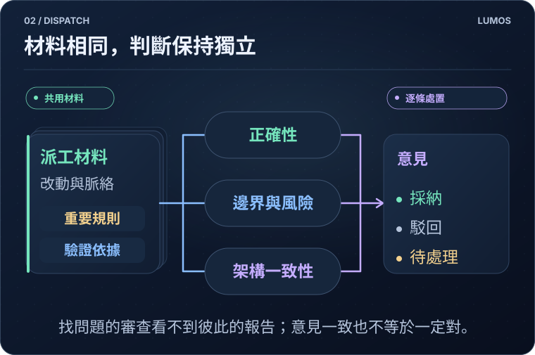
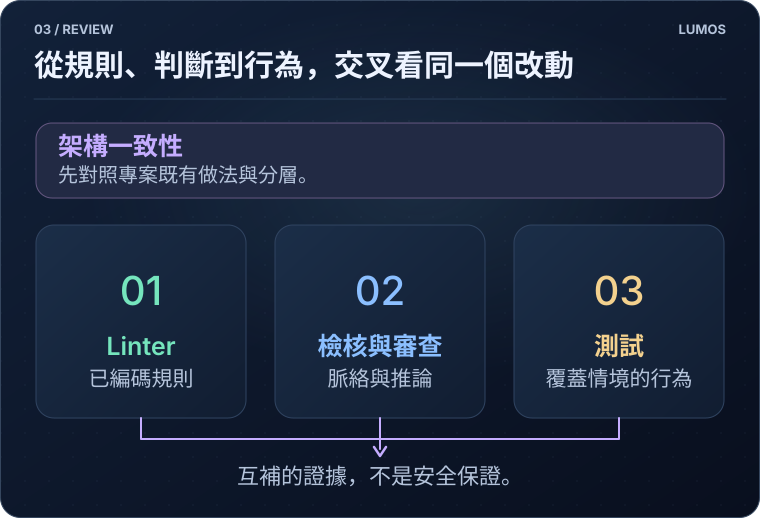
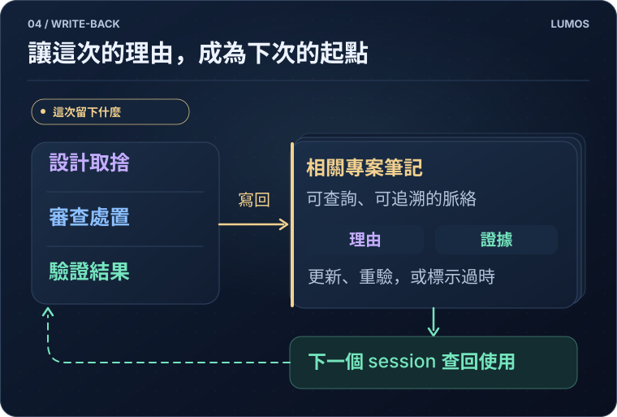
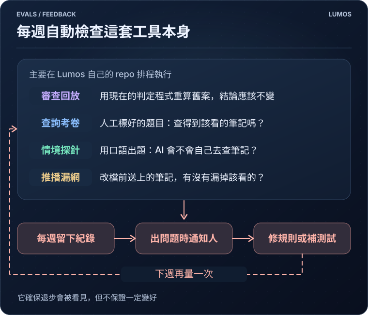

<p align="center">
  <picture>
    <source media="(prefers-color-scheme: dark)" srcset="assets/lumos-logo-dark.png">
    
  </picture>
</p>

# Lumos

**繁體中文** · [English](README.en.md)

[](https://github.com/EnzoHsieh-Android/Lumos/actions/workflows/ci.yml)

**讓 AI 寫程式時，把「為什麼這樣改」一起留下來。**

Lumos 是一套給 Claude Code 和 Codex 用的開發工具。你用對話交代需求，AI 負責讀程式、改程式、跑測試、提交；Lumos 則要求 AI 在改程式的同時寫下理由、不能改壞的規則和驗證方式，並在 Git 提交與推送時，檢查其中能機械判斷的部分，例如有沒有動到筆記。

它由四樣東西組成：一個單檔的 Python 命令列工具（只用標準函式庫）、一組 Git hooks、一份安裝時寫進 CLAUDE.md／AGENTS.md 的 AI 工作守則，以及一組跟程式碼放在同一個 repo、彼此互相連結的 Markdown 筆記。

## 為什麼需要它

AI 寫程式很快，但它不會替專案記事情。這一輪對話討論過的取捨、否決掉的方案，下一次重開對話就不見了；「同一筆訂單不能退款兩次」這種規則，程式碼只寫了現在怎麼做，沒寫哪些行為不准變；AI 說測試都過了，事後也查不到它到底跑了哪些。

傳統上，這些靠 ADR（架構決策紀錄）、CODEOWNERS、pre-commit 之類的做法和人的自律來補。Lumos 把這幾件事接在一起，只是這次被檢查的是 AI：改了程式卻沒動筆記，提交就會被擋下；真要跳過得明著跳，而且會留下紀錄。

## 用起來是什麼樣子

假設 AI 改了退款邏輯，卻沒寫任何筆記就提交，它會收到這段訊息（實機輸出，節錄）：

```text
$ git commit -m "feat: 退款前檢查是否已退過"

擋下:這次 commit 改了程式碼,但知識筆記一個字都沒動。
…
這次改到的程式碼(1 個):
   • src/payment.py
…
兩條路選一條:
   1. 把該改的筆記改一改,加進 commit,再提交一次。
   2. 這次真的不需要動筆記(改錯字、排版、註解、還在進行中的半成品)→ 跳過這道檢查:
        git commit --no-verify -m '<訊息>'
      跳過會留下紀錄,不是偷偷放行。
```

讀這段訊息的是 AI，不是你。工作守則要它把筆記補上再提交；真的不需要寫（例如只是改錯字），它可以跳過，但跳過會留下紀錄。你只需要在遇到業務取捨、或要不要接受某個風險時做決定。

## 一次改動會經過什麼

<p align="center">
  <a href="assets/map-zh.svg">
    
  </a>
</p>

**① 讀程式碼，補上脈絡。** AI 先讀程式碼弄懂現況；動手改一支程式檔時，工具通常會再把跟這支檔有關的筆記推給它看（也有略過的時候，例如工具本身出錯）。筆記只補程式碼看不出來的東西：當初為什麼這樣設計、試過什麼行不通、哪條規則絕對不能破。程式碼本身查得到的東西不抄進筆記，因為抄了只會比程式碼先過期；兩邊對不上時，以程式碼為準。

**② 分派審查。** 推送前，工具用固定的比對規則掃過這次新增的程式碼，找容易出事的寫法，例如資料庫寫入沒包在交易裡、HTTP 呼叫沒設逾時，據此判定風險高低。一般改動照守則只派一兩個審查；判成高風險的，每一輪最多開 9 個 AI 對話來審，各看一個角度：4 個看一般問題（正確性、併發與資源、邊界與輸入、跟既有規則和筆記是否一致），1 個看跟既有架構一不一致，1 個看資安，有定稿的設計規格時再加 1 個對照規格，最後 2 個刻意換成另一家的模型（Claude 主導時就用 Codex），避免大家有同一種盲點。找問題的那幾個彼此看不到對方的報告；另一家模型裡負責反駁的那一個，則是等報告收齊後，專門反駁其中的重大發現。

**③ 審查與處理。** 每條審查意見都要記下是採納、駁回還是待處理。推送時只檢查高風險的改動：推送前一定要留下審查結果，通過，或寫明理由的跳過；一般改動不會因為缺審查紀錄而被擋。

**④ 寫回筆記。** 做完之後，AI 把這次的取捨、審查結果和驗證方式寫回負責這支檔的筆記，下一次改到這裡的 AI 就查得到。

外圈那一層是檢查流程本身。在 Lumos 自己的 repo 上，走完審查、附有設計規格的案子會連同當時的判定一起存下來，每週用同一版判定規則重跑（案子多時輪流抽一部分），確認同樣的輸入還是得到同樣的結論；判定規則改版時，舊案會被標成過期，由人確認後重新存。

哪些是真的「擋」、哪些只是「要求」要分清楚。Git hooks 常見的擋下情況包括：改了程式卻完全沒動筆記、新的程式檔沒指定負責的筆記、高風險推送沒留下審查結果、這次改動新增了 linter 告警（有設定 linter 的專案），另外還有筆記格式、受影響的規則測試沒過等幾道。至於 AI 有沒有參考筆記、寫回的內容好不好，是寫給 AI 的守則，工具只能確認有沒有做，判斷不了做得對不對。專案也可以把多數檢查改成只提醒；測試、文件、第三方與自動產生的檔案，以及專案設定排除的路徑，不需要負責筆記。

<details>
<summary>各步驟的細節與圖解</summary>

<a id="圖譜"></a>

**筆記**

<p align="center">
  <a href="assets/graph-demo-zh.svg">
    
  </a>
</p>

- 真要寫原始碼裡沒有的現況（部署設定、資料庫實際值、生產觀測），同一行要標來源；筆記摘要裡用固定格式新寫的現況行沒標來源，提交時會擋。
- 筆記跟程式對不上時，預設以程式碼為準；只有決策紀錄、驗證紀錄這類有出處的東西，能反過來說程式錯了。
- 重要規則可以跟一支驗證它的測試綁在一起。跟一般測試的差別是：改到相關程式時，工具會自動找出這類測試在推送前跑，高風險推送紅了就擋，低風險只提醒。

<a id="派工"></a>

**分派審查**

<p align="center">
  <a href="assets/dispatch-overview-zh.svg">
    
  </a>
</p>

- 找問題的審查派工時不附彼此的報告，減少互相附和；但工具控制不了外部 AI 對話實際讀了什麼，後面幾輪也會帶上前一輪的處理結果。

<a id="審查"></a>

**審查**

<p align="center">
  <a href="assets/review-overview-zh.svg">
    
  </a>
</p>

- 風險判斷用正規表示式掃新增的程式行，快、跨語言，但會誤判。
- 只要有派審查，不論哪個風險等級，都會包含一個「架構一致性」審查：拿同層的既有程式當標準，只抓「引入第二套做法」和「跨層直接呼叫」，不評風格。
- 設計計劃也分級：先問「改壞了，退回上一版就夠嗎？」碰到金流、對外送出、資料不可逆或檢查機制本身，寫程式前先審設計；其他的每條驗收條款要有證據，通常是一支「現在會失敗、做完才會通過」的測試。
- linter 只擋這次新造成的告警，舊專案接上來不會被舊債淹沒。各層都有漏洞，疊起來比較難一路漏過去（瑞士起司模型）。

<p align="center">
  <a href="assets/swiss-cheese-zh.svg">
    
  </a>
</p>

<a id="寫回"></a>

**寫回**

<p align="center">
  <a href="assets/writeback-overview-zh.svg">
    
  </a>
</p>

- 說明要寫進負責那支檔的筆記，寫到不負責的筆記會擋。

<a id="evals"></a>

**檢查流程本身**

<p align="center">
  <a href="assets/evals-overview-zh.svg">
    
  </a>
</p>

- 只有走完審查、附有設計規格的案子會存下判定；每週用同一版判定規則重跑（案子多時輪流抽一部分），確認結果不變；判定規則改版時舊案標成過期，由人確認後重新存。

**擋不住的情況**：有些檢查只看這次改動的部分（例如風險掃描、新增的 linter 告警）；有些輔助檢查本身出錯時會放行，不讓工具故障卡住開發；提交時跳過「改程式要動筆記」會留紀錄，但推送時用 `--no-verify` 跳過，本機不留紀錄，只有推到 main 或開 PR 時 CI 會再跑一次。

</details>

## 一個真實的例子

2026-09-10，第一個小型 Vue 專案接上 Lumos 當天就出了問題：工具把自己裝進專案的檔案也當成專案的程式碼來掃，小專案第一次推送就被判成高風險。修這個問題的改動本身也被判成高風險，所以得先過審查。

<p align="center">
  <a href="assets/case-review-zh.svg">
    
  </a>
</p>

第一輪開了 7 個 AI 審查（上限是 9 個，這次派了 5 個 Claude、2 個 Codex），其中 4 個各自找到同一個最嚴重的問題：修法用目錄名稱判斷「這是工具的檔」，使用者自己放在同一個目錄的程式也會被放過，整個躲掉審查。修完後的第三輪，Codex 又指出新的修法還是有洞，並附上重現步驟。它的原文開頭是這樣（節錄）：

```text
### F20 精確檔名未證明已安裝，讓同名自有 hook 漏過高風險掃描
severity: blocker
```

意思是：使用者自己寫的程式只要跟工具的檔同名，就會被誤當成工具的檔、跳過風險掃描。於是改成在安裝時記下每支工具檔的內容指紋（用檔案內容算出的雜湊值，內容一變就對不上），內容對得上才跳過。四輪下來一共 46 條意見，全部處理完才提交（09-11）。

寫回筆記的不只是修法，還有這個方案防不了什麼：指紋清單本身放在專案裡，有人連清單一起改就繞得過，所以它防的是「不小心」，不是「刻意繞過」。筆記裡也訂了回頭檢查的日期（2027-03-10），到時候看有沒有人把工具檔和清單一起改過，有的話就改成跟工具原始碼比對。

每一輪的[審查報告原文](governance/review-reports/code-工具自裝檔不算消費專案/)和[那篇筆記](docs/lumos-toolchain-knowledge/Issues/健檢技術棧那段撞到多平台設定就整支中斷.md)都在 repo 裡。

## 有沒有用

**寫錯的筆記會誤導 AI，所以筆記只寫程式碼看不出來的東西。** 2026-09 我在一個合成的專案上做過受控實驗，刻意埋進寫錯的筆記，每組跑 25 場：

| 條件 | Haiku 4.5（Anthropic 較小的模型）答對 |
| --- | --- |
| 只看程式碼 | 20/25 |
| 程式碼＋寫錯的筆記 | 12/25 |
| 同樣有錯的筆記，但在錯的那句旁邊標「以程式碼為準」 | 20/25 |

較大的 Opus 5 四組都答對 25/25，不受錯筆記影響，但有筆記時每場耗時是原本的 2 到 5 倍、token 用量是 1 到 3 倍。另一批 80 場測「程式碼推不出來的規則」：「大額退費要人工核可」這題，只看程式碼的 AI 5 次都沒答對，有筆記的 15 次答對 8 次。這個實驗只有一個合成專案、題目是我自己設計的，只能說方向成立，還稱不上定論；但 Lumos 現在「程式碼為主、筆記為輔」的規則，就是看了這個結果才改的。

**不同的審查看到的東西不一樣。** 在 Lumos 自己 2026-07 到 08 的 85 輪多人審查裡，822 個不同的問題有 531 個（64.6%）只被一個審查回報，同一個問題常常只有一個人抓到，這是高風險改動才派滿的原因。這是描述性的統計（每個問題被幾個審查抓到，是負責統籌的 AI 逐輪手填的），不能直接推算多派或少派一個會差多少。這些問題是不是真的？截至 2026-09-30，全部 6,195 條審查意見裡只有 58 條（0.9%）被判定不用處理，其餘都列入處理；不過做這個判定的也是 AI，不是人工抽驗。

**被跳過的檢查，是不是都有正當理由？** 「改程式要動筆記」這道檢查，在 Lumos 自己約 2,070 個提交裡被跳過 84 次。我請 Claude 和 Codex 各自獨立看過每一次：兩邊一致認為「改了行為卻沒寫理由」的有 8 次；17 次只改了測試檔，這道檢查照設計會擋，但跳過說得通；其餘多半是功能分支做到一半的提交，同一條分支稍後有補上筆記，這類算不算正當，兩邊看法不同。至於檢查「擋錯」的比例，目前算不出來，因為沒被跳過的擋下並沒有記錄。

**用在哪裡。** 除了 Lumos 自己（約 2,300 個提交、約 1,400 個測試函式），我也在工作上的兩個正式專案用了約兩個月：一個 C#/.NET＋Vue 的後端、一個 Kotlin 的 Android App。「用與不用」在真實專案上的對照還沒做過。

上面 Lumos 自己的數字都能核對：[擋下與放行的紀錄](docs/.governance-log.jsonl)、[跳過紀錄](docs/.bypass-log.jsonl)、[兩個 AI 對每次跳過的判斷](governance/eval/readme-bypass-judge/)、[每一輪審查的報告](governance/review-reports/)都在 repo 裡。工作專案的使用情況則是我的自述。

## 常見追問

**這是不是過度工程？** 對一次性的原型或沒人接手的小專案是，那種情況我不建議用。它是為長期維護、會換人或換 AI 對話接手、而且有規則不能改壞的專案（金流、權限、資料遷移）設計的；審查強度也跟著風險走，一般改動推送時不強制審查。

**AI 會不會隨便寫一篇筆記應付？** 會，「改程式要動筆記」那道檢查只看有沒有動。在另一個接上 Lumos 的專案，我抽了 55 句風險較高的現況描述，能判斷的 54 句裡有 22 句已經過時；後來因此加了一道檢查：筆記摘要裡新寫的現況行要標來源，否則擋下。這只擋得住固定的寫法，內容對不對還是要靠審查和人。

**AI 寫、AI 審，會不會只是自己說自己好？** 這個疑慮是成立的。我能做的是讓審查刻意混用兩家模型、其中一個專門唱反調，並把每條意見和處理結果留下紀錄，讓人事後查得到；需求和取捨由我決定。但這不等於有人逐條複核過每一條審查結論，也還沒有真實專案上的對照能證明最後的程式碼變好了。

**AI 會不會偷改檢查自己的測試？** 自動執行的 hooks 和測試都記了內容指紋，正常推送時被改過就會擋下，要走「核可並留紀錄」才能過。用 `--no-verify` 可以繞過本機這道檢查，但推到 main 或開 PR 時 CI 會再驗一次；就算連指紋一起改，也會在版本紀錄裡留下看得到的差異。

**成本多少？** 提交檢查每次約 3 秒（在小型示範專案上量，量法記在[這份計劃筆記](docs/lumos-toolchain-knowledge/Projects/README面試官十分鐘_計劃.md)）；有筆記時 AI 要讀的東西變多，實驗裡 token 多了 1 到 3 倍；高風險審查要開多個 AI 對話，花費會隨審查數量增加，也看每個用的模型。

**你自己做了什麼？為什麼主程式是 3.8 萬行的單檔？** 這個 repo 本身就是用對話開發的：需求和設計上的取捨由我決定，程式碼大多由 AI 寫（約 88% 的提交有 Claude 共同署名）。正因為程式大多是 AI 寫的，測試就更重要：目前約 1,400 個測試函式，推到 main 時 CI 會重跑（只改文件時只跑文件相關的部分），狀態就是最上面那個徽章。單檔是刻意延後拆分：2026-07 一次外部審查建議拆模組，但防竄改的指紋、測試、以及複製進其他專案的那一份都跟檔案路徑綁在一起，一個人維護時拆檔的風險大於好處，等有第二位維護者再做。

## 安裝與限制

需要 Git、Python 3.14 以上，以及 Claude Code 或 Codex。在要導入的專案目錄執行：

```bash
curl -fsSL https://raw.githubusercontent.com/EnzoHsieh-Android/Lumos/release/get.sh | bash
```

腳本問要不要初始化目前目錄時，確認目錄正確再輸入 `y`。裝完重開 AI session，用 `lumos enforcement` 確認檢查都接上了。Windows、離線安裝與移除，見[上手細節](ONBOARDING.md)。

<details>
<summary>已經在用舊版的專案：升級到 Python 3.14 要做的事</summary>

- 更新後，沒有 3.14 的機器，提交與推送會被擋下並說明怎麼裝（macOS：`brew install python@3.14` 或 `uv python install 3.14`）。`python3` 指到舊版沒關係，lumos 會自己找 3.14 重跑。
- 專案 CI 要把 `actions/setup-python` 設成 3.14。
- 裝好之後跑一次 `lumos install`，讓 Claude／Codex 的 hooks 也改用 3.14。
- Codex 的 hook 指令因此改變，可能要再開一次互動式 codex 重新核可。本機讀不到 Codex 的信任狀態，請用 `lumos enforcement` 搭配實際觸發一次確認。

</details>

Lumos 不保證品質或安全，也不取代工程判斷：筆記可能過時，AI 審查可能漏判，有紀錄不代表內容正確；業務取捨、不可逆的操作和要不要承擔風險，仍然要人來決定。

深入閱讀：[心智模型與機制](docs/心智模型.md) · [接手舊專案](docs/接手舊專案.md) · [指令參考](docs/指令參考.md) · [架構全景](ARCHITECTURE.md) · [SDD 與 Lumos](SDD-vs-Lumos.md) · [方法論](docs/methodology/圖譜即合約.md)

授權：[MIT](LICENSE)。你寫的筆記是你的，Lumos 不主張任何權利。
