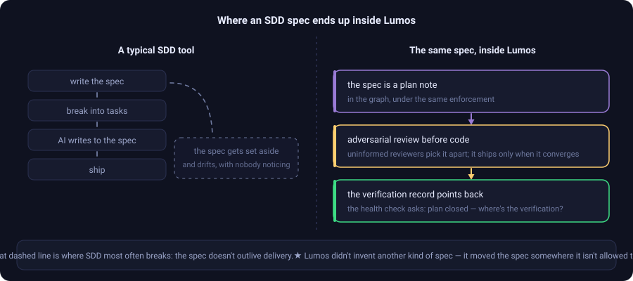

# Coming from SDD: where the spec ends up

[← back to the README](README.en.md) · [繁體中文](SDD-vs-Lumos.md)

If you're doing spec-driven development — write the spec, then have an AI build to it — the question you're probably asking is how Lumos relates to that.

**The short answer: Lumos has already absorbed SDD's front half.** You don't have to pick one.

  

---

## Where SDD actually breaks

It isn't that the spec was written badly. It's that **the spec doesn't outlive delivery**.

A spec is the blueprint you draw before work starts. Once the code exists and the thing ships, its job is over. The code keeps changing; the spec sits in `docs/specs/` or `openspec/` and doesn't — and **nothing tells you the two have drifted apart.**

Three months later someone opens that spec and reads a three-month-old world.

---

## Lumos didn't invent another kind of spec. It moved the spec somewhere it isn't allowed to rot.

**1. The spec *is* a plan note.**

Any design or plan — whether it came from brainstorming, writing-plans, OpenSpec or some other spec tool — **is written as `Projects/X_plan`**, living in the graph under the same enforcement as everything else. It doesn't sit off to the side in its own directory.

That's how the leak gets closed: the spec is inside the checked perimeter from day one.

**2. It passes an adversarial review before any code is written.**

The design gets reviewed first: several reviewers who weren't told the backstory pick it apart section by section, every finding's quote has to resolve against the original (machine intake — unanchored findings aren't accepted), a rebuttal seat kills false positives, and it only ships once the convergence gate passes.

**The spec is promoted from "a document" to "something that had to get through a gate".**

**3. Once it lands, the verification record points back at it.**

Verification records carry `plan_refs` back to the plan they came from. The health check asks: "this plan is closed — where's the verification that it landed?"

Spec → implementation → verification is pinned mechanically. Nobody has to remember.

---

## The real division of labour underneath

Stack the two together and the actual dividing line isn't "spec versus graph" — it's **what people are good at versus what machines are good at**:

- **People decide what *ought* to be true** — clarifying requirements, confirming them, and **continually re-confirming** that an already-confirmed requirement still holds in a world that keeps moving (especially the requirements whose code hasn't changed, so nothing rings a bell for them). That judgement is unbounded, can't be frozen, and is the part a person never gets to clock off from.
- **Machines make it true and keep it true** — the implementation, plus holding the boundaries: contracts bound to tests that really run, code changes that force a note update, irreversible actions that require a written rollback, high-risk changes that face an adversarial review before they can be pushed. That work is bounded, repetitive and easy to forget — exactly what should be mechanised.

**SDD states what ought to be true before work starts. Lumos holds it all the way through — and takes people out of the mechanical guarding, leaving only the judgement no machine can make.**

---

## The difference in one table

| | Spec-driven | Lumos |
|---|---|---|
| **When** | Spec written **before** work | Written back **as** each iteration happens |
| **Direction** | One way: spec → code | Both ways: change one, you're made to change the other |
| **The subject** | "What to build" | "Why it's this way, where the edges are, whether it's verified" |
| **Lifespan** | Usually expires on delivery | Enforced by commit and CI; not allowed to rot |
| **What sustains it** | Someone remembering to go back | You get stopped at commit + contracts bound to real tests |

---

> **The honest ceiling:** what a machine holds is *form* — the test exists, the rollback is written, an uninformed AI reviewed it, the adversarial loop converged. It cannot hold "does this rule still match the real business today".
>
> Every gate can be skipped with `--no-verify`, and every "independent review" is still an agent prompted by the same person. **It stops "forgot" and "let it slide". It does not stop "deliberately went around".**
