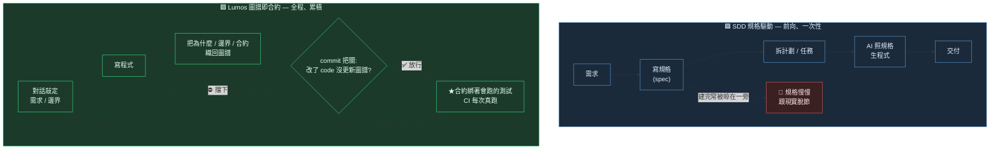

# SDD 規格驅動 vs Lumos 圖譜即合約

> 一句話:**SDD 把「要蓋什麼」講在開工前;Lumos 把「為什麼這樣蓋、哪裡不能拆」一路留下來,而且不准你偷偷拆。**

## 流程對比(這是 mermaid 最能表現的部分)

**看圖就懂的差別**:
- SDD 是**一條直線**:需求 → 規格 → 程式 → 交付。規格是「開工前的藍圖」,蓋完它的任務就結束了,容易被晾著、跟程式越差越遠。
- Lumos 是**一個回圈**:寫程式 → 把「為什麼」織回圖譜 → commit 時若沒織就擋你 → 合約還綁著測試每次 CI 真跑 → 下一輪繼續。它不是藍圖,是**全程跟著程式一起長大的記憶與合約**。

## 對照表(哲學差異,表格比圖清楚)

| | 🟦 SDD 規格驅動 | 🟩 Lumos 圖譜即合約 |
|---|---|---|
| **時機** | 動工**前**寫規格 | 每次迭代**當下**織回圖譜 |
| **方向** | 前向:規格 → 程式(單向) | 雙向:程式 ↔ 圖譜(改一邊逼你改另一邊) |
| **主角是什麼** | 規格 = 「**要做什麼**」 | 圖譜 = 「**為什麼這樣 / 邊界 / 合約 / 驗過沒**」 |
| **程式的角色** | 規格的產出物 | 「現在長這樣」的快照 |
| **壽命** | 常隨交付過期、被晾在一旁 | 持續被 commit / CI 強制,不准腐爛 |
| **靠什麼維持** | 靠人記得回去改規格 | commit 擋「改 code 沒更新圖譜」+ 合約綁測試真跑 |
| **解決的痛** | 開工前「需求講不清」 | 開工後「為什麼這樣」流失、合約被默默破壞 |

## 重點:兩者不打架

它們其實站在**不同時間點**:

- **SDD** 偏「**進場前**把需求對齊」——回答「我們到底要蓋什麼」。
- **Lumos** 偏「**全程**守住理解與合約」——回答「為什麼蓋成這樣、哪裡動了會出事」。

完全可以**同時用**:用 SDD 的精神把需求講清楚再動工,用 Lumos 把動工後累積的「為什麼 + 合約」一路釘住、不讓它隨時間流失。Lumos 補的正是「規格寫完之後,知識怎麼不腐爛」這一段。
