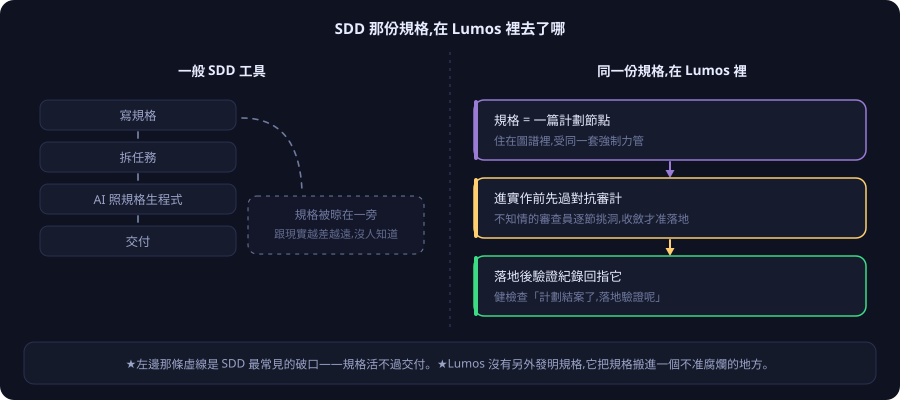

# 從 SDD 過來的話：規格去了哪

[← 回 README](README.md) · [English](SDD-vs-Lumos.en.md)

如果你在用規格驅動開發（SDD：先寫 spec，再讓 AI 照著生程式），你想問的大概是「那 Lumos 跟它是什麼關係」。

**先給答案：Lumos 已經把 SDD 的前向階段收進來了。** 你不需要在兩者之間選一個。

  

---

## SDD 真正的破口在哪

不是「規格寫得不夠好」。是**規格活不過交付**。

規格是開工前的藍圖，程式生出來、東西交付了，它的任務就結束了。之後程式一直改，規格躺在 `docs/specs/` 或 `openspec/` 裡不動——**沒有任何機制會告訴你這兩邊已經對不上。**

三個月後有人打開那份規格，讀到的是三個月前的世界。

---

## Lumos 沒有另外發明規格，它把規格搬到不准腐爛的地方

**① 規格就是一篇計劃節點。**

任何設計或計劃——不管來源是 brainstorming、writing-plans、OpenSpec 還是別的 spec 工具——**一律寫成 `Projects/X_計劃`**，住在圖譜裡，受同一套強制力管。不散落在 repo 的其他路徑。

破口就是這樣堵住的：規格從第一天就在被檢查的範圍內。

**② 進實作前先過對抗審計。**

寫程式之前先審設計：派幾個不知道前因後果的審查員逐節挑洞、每條發現的引句要能對回原文（機器收貨，錨不到的不採信）、辯方殺假陽性、收斂閘過了才准落地。

**規格從「一份文件」升級成「過了閘才放行的東西」。**

**③ 落地之後，驗證紀錄回指它。**

驗證紀錄帶著 `plan_refs` 指回它出自哪份計劃。健檢會問：「這份計劃結案了，對應的落地驗證呢？」

規格 → 實作 → 驗證這條線被機械釘住，不靠人記得。

---

## 底下那條真正的分工線

把兩者疊起來看，真正的分界不在「規格 vs 圖譜」，在**人跟機器誰比較擅長什麼**：

- **人決定「什麼該為真」** — 釐清需求、確認需求，並且對著一個會動的世界**持續重新確認**一條已確認的需求還成不成立（尤其那些程式一直沒動、沒有東西替它敲鐘的需求）。這是無界的判斷，無法固化，也是人下不了班的那部分。
- **機器讓它為真、並持續保持為真** — 實作，加上守邊界：合約綁測試真跑、改程式碼逼你更新筆記、不可逆動作先寫回退、高風險改動推送前過對抗式代碼審。這些是有界、重複、容易忘的事，正該機械化掉。

**SDD 把「什麼該為真」講在開工前。Lumos 把它一路守到底，並且把人從機械性的守衛工作裡放出來，只留下非人不可的那格判斷。**

---

## 兩張表講完差別

| | SDD 規格驅動 | Lumos 圖譜即合約 |
|---|---|---|
| **時機** | 動工**前**寫規格 | 每次迭代**當下**寫回 |
| **方向** | 單向：規格 → 程式 | 雙向：改一邊逼你改另一邊 |
| **主角** | 「要做什麼」 | 「為什麼這樣、邊界在哪、驗過沒」 |
| **壽命** | 常隨交付過期 | 被提交與 CI 強制，不准腐爛 |
| **靠什麼維持** | 靠人記得回去改 | 提交時擋你 + 合約綁測試真跑 |

---

> **誠實天花板：** 機器守的是**形式**——測試存在、回退有寫、乾淨的 AI 審過、對抗迴圈收斂。它守不掉「這條規則今天還符不符合真實業務」。
>
> 每一道閘都可以用 `--no-verify` 繞過，每個「獨立審計」仍然是同一個人下的 prompt。**它擋得掉「忘了」和「隨手漏」，擋不掉「刻意繞」。**
