# Lumos 架構圖

> 「圖譜即合約」工具組的**唯一源 → 分發 → 消費端**模型。一張圖看懂:什麼東西住在哪、用哪個指令裝到哪、為什麼非這樣分不可。

## 1. 全景:唯一源 → 兩種 scope → 消費端

**為什麼分兩種 scope**:CI 只 checkout 專案 repo(要能跑 `scripts/lumos doctor`)、git hook 是 per-repo —— 所以 CLI/hooks **必須 vendor 進各專案**。skills 是純方法論文件,user-scope symlink 共用一份就好,不必 vendor(否則各專案副本會漂移)。

## 2. 安裝 / 生命週期指令做了什麼

## 3. CLI 子命令家族 (22)

## 4. 強制力管線 (圖譜不腐爛的機制)

