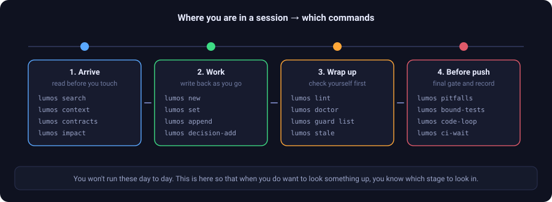

# Command reference

[← back to the README](../README.en.md) · [繁體中文](指令參考.md)

> **First, one thing: you won't run these day to day.**
>
> The way you use Lumos is **plain conversation** — you talk to Claude Code or Codex the way you normally would, and it decides when to look something up and when to write it back. Installing injects this routing table into `CLAUDE.md` / `AGENTS.md` and wires up five checks that fire on their own.
>
> This page exists for two reasons only: **so you can look something up when you want to, and so you can see what the AI is doing behind the scenes.**

<p align="center">
  
</p>

A zero-dependency Python command, 67 top-level subcommands. **`lumos --help` is authoritative**; this page lists the ones you'll actually meet.

---

## 1. Arrive: read before you touch

```bash
lumos search <words>             # full-text search, ranked by relevance
lumos context <node> [--brief]   # this note plus its neighbours, contracts pinned on top
lumos contracts [<node>]         # every contract: what must not change, and its bound test
lumos impact --file <file>       # which notes this file touches, and what bit people before
```

> **Searching CJK: put spaces between concepts.**
> `lumos search "void refund points"` ✅
> A whole sentence gets matched as one phrase and will almost always return nothing.

**Zero results doesn't mean it isn't recorded.** Look at the per-word coverage line to see which word scored zero, try a synonym, and after three tries ask a person.

The rest of the reading commands:

```bash
lumos decisions <node>           # decisions made here, and whether any were overturned
lumos map <node>                 # the neighbourhood tree
lumos links / backlinks / recent / stats
lumos query --tag <family/value> [--active] [--linked <node>]
lumos stale --candidate --match <words>   # which verifications are due for a re-check
```

---

## 2. Work: write back as you go

```bash
lumos new system|issue|project|verification <name>   # scaffold a new note
lumos set <node> <field> <value>                     # single-value fields, like status
lumos append <node> related|verified_by|... "[[X]]"  # add a link (one at a time)
lumos decision-add <node> "<content>" --decided DATE # record a decision
```

**Every one of these verifies its own write.** Don't hand-edit the structured fields at the top — the classic trap is several links on one line, which grows a "ghost node".

Contracts and verification:

```bash
lumos guard list [--unbound]     # which contracts still have no test bound
lumos guard scaffold / bind / audit    # scaffold a test → bind it → independent review
lumos guard kill <node>          # break it for real in a sandbox and check the test goes red
lumos signoff <node> --note ".." # a human sign-off, for the half a tool can't answer
lumos spec-trace <plan node>     # which clauses in the plan no verification has claimed yet
```

---

## 3. Wrap up: check yourself first

```bash
lumos lint <node>                # quick check on one note
lumos doctor [--ci]              # health check across every note (--ci blocks)
lumos enforcement                # is each layer of protection wired up (wiring, not judgement)
lumos gov [<node>]               # local ledger: who got stopped by which gate
```

**The governance ledger**: which gate stopped whom, and who bypassed what, all lands in a **local** ledger — never committed, never uploaded.

```bash
lumos gov                # timeline of every gate event
lumos gov OrderService   # which gates stopped this node, and whether hard or soft
```

It's for **visibility while you develop** — wherever it keeps going off is where something needs attention. It isn't a compliance artefact.

---

## 4. Before you push: the final gate

```bash
lumos pitfalls --diff <range>    # risk tier for this change (standard / high)
lumos bound-tests --diff <range> # actually run the tests bound to the contracts you touched
                                 # red here means fix the test, not add a review record
lumos code-loop check|pass|skip  # review record for high-risk changes (checked on push)
lumos loop status <id>           # convergence verdict for a design or code review loop
lumos testmap affected --diff .. # suggests which tests to run for this change
lumos anchor verify|approve      # tamper fingerprints for test and check files
lumos ci-wait / ci-status        # wait for CI after a push / check the last result
```

Use `lumos ci-wait` rather than `gh run list` — the result has to land in the governance ledger.

---

## Install and uninstall: one for one

```bash
lumos bootstrap   # install everything     ↔  lumos teardown   # remove everything
lumos install     # machine layer only     ↔  lumos uninstall
lumos init        # project layer only     ↔  lumos deinit [--keep-graph] [--dry-run]
lumos update      # refresh the toolkit inside this project
```

**Which layer to remove:** the whole machine at once is `teardown`; just this repo is `deinit`; just the global command is `uninstall`.

**Your notes always survive.** `teardown` never touches note files; `deinit` confirms interactively by default and takes `--dry-run` for a rehearsal.

**Updating**: the manual the AI reads and the global command are symlinks — `git pull` in the Lumos directory and they're live immediately. The toolkit inside a given project updates with `lumos update` there; your note data is never touched.
