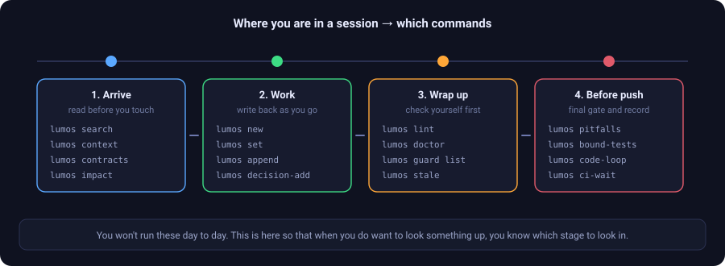

# Command reference

[← back to the README](../README.en.md) · [繁體中文](指令參考.md)

> **First, one thing: you won't run these day to day.**
>
> The way you use Lumos is **plain conversation** — you talk to Claude Code or Codex the way you normally would, and it decides when to look something up and when to write it back. Installing injects this routing table into `CLAUDE.md` / `AGENTS.md` and wires up five checks that fire on their own.
>
> This page exists for two reasons only: **so you can look something up when you want to, and so you can see what the AI is doing behind the scenes.**

<p align="center">
  
</p>

A zero-dependency Python command with more than eighty top-level subcommands. **`lumos --help` is authoritative**; this page lists the ones you'll actually meet.

---

## 1. Arrive: read before you touch

```bash
lumos search <words>             # full-text search, ranked by relevance
lumos context <node> [--brief]   # this note plus its neighbours, contracts pinned on top
lumos contracts [<node>]         # every contract: what must not change, and its bound test
lumos impact --file <file>       # which notes this file touches, and what bit people before
```

> **Searching CJK: put spaces between concepts.**
> `lumos search "void refund points"` ✅
> A whole sentence gets matched as one phrase and will almost always return nothing.

**Zero results doesn't mean it isn't recorded.** Look at the per-word coverage line to see which word scored zero, try a synonym, and after three tries ask a person.

The rest of the reading commands:

```bash
lumos decisions <node>           # decisions made here, and whether any were overturned
lumos map <node>                 # the neighbourhood tree
lumos links / backlinks / recent / stats
lumos query --tag <family/value> [--active] [--linked <node>]
lumos stale --candidate --match <words>   # which verifications are due for a re-check
```

---

## 2. Work: write back as you go

```bash
lumos new system|issue|project|verification <name>   # scaffold a new note
lumos set <node> <field> <value>                     # single-value fields, like status
lumos append <node> related|verified_by|... "[[X]]"  # add a link (one at a time)
lumos decision-add <node> "<content>" --decided DATE # record a decision
lumos summary-line <node> "<old fragment>" "<new fragment>"   # change one summary line without hand-editing the header fields
```

**Every one of these verifies its own write.** Don't hand-edit the structured fields at the top — the classic trap is several links on one line, which grows a "ghost node".

Contracts and verification:

```bash
lumos guard list [--unbound]     # which contracts still have no test bound
lumos guard scaffold / bind / audit    # scaffold a test → bind it → independent review
lumos guard kill <node>          # break it for real in a sandbox and check the test goes red
lumos signoff <node> --note ".." # a human sign-off, for the half a tool can't answer
lumos spec-trace <plan node>     # per clause: bound to a test / manual / untagged / dangling (legacy claim column kept for reference)
lumos spec-gate <plan node>      # run this once a design is written: clause grammar, bindings, rollback section (blocks); runs the bound tests once: for low-risk plans red/green is a pass condition (blocks if unmet), high-risk only prints; red contract tests of dependent features always block
```

Test quality (read-only scans and evidence collection; it does not judge business answers):

```bash
lumos test-quality capabilities                 # which languages and evidence formats are actually supported
lumos test-quality scan <test file or dir> [--json]   # find suspicious patterns such as self-comparison or re-implementing the code; zero candidates does not mean the tests are useful
lumos test-quality capture …                    # explicitly run a trusted local test runner and save JUnit plus source snapshots (no sandbox)
lumos test-quality check <baseline> <fault> <restored> --target <class::test>   # verify three capture receipts: baseline green, target assertion red on the fault, green again after restoring
```

---

## 3. Wrap up: check yourself first

```bash
lumos lint <node>                # quick check on one note
lumos doctor [--ci]              # health check across every note (--ci blocks)
lumos enforcement                # is each layer of protection wired up (wiring, not judgement)
lumos gov [<node>]               # local ledger: who got stopped by which gate
lumos updated-sync --stale [--dry-run]   # when doctor says the updated date lags, set it to today in one go (preview with --dry-run)
lumos events [--session <id>]    # what recent Claude sessions did (event ledger, read-only)
```

Notes out of step with current state (drift):

```bash
lumos drift scan [--json]        # health-check the whole graph for sentences out of step with current state; produces a to-fix list (no blocking, no ledger)
lumos drift fix <node> <line> --kind <kind> [--dry-run]   # fix one item from the scan list with the tool (c1–c6, count); commit it together with the fix ledger
lumos drift fix <issue> <line> --kind c2 --close --status <closed value> --reason "…"   # close an issue; blocked first if the summary still has an undecided decision or unhandled revisit conditions
lumos drift ack <node> <line> --kind <kind> --reason "…"  # record that a line stays as is (counts once committed); --kind reread for rule lines flagged by the reread
```

**These only list, they don't block; deal with them when you see them:**

```bash
lumos set <node> revalidate_when …    # changing when to re-verify: lists sentences in other notes that link here and mention it, with the new list
lumos set <issue> status <closed>     # lists summary decision lines still undecided and unhandled revisit conditions (only drift fix --kind c2 --close blocks)
lumos note-shape --staged             # the check the pre-commit hook runs; also reminds: split a line binding several tests; tag count sentences; don't point to list items as "item N"
```

**`lumos doctor` also lists**: sentences pointing to a revisit condition another note no longer has; its retirement candidates also cover plans bound only to `[manual:]` clauses.

**When dispatching reviewers**: when the impact range can't be computed, such as a session opened in another project or commits in the range missing here, Claude's dispatch hook adds a line at the end of the dispatch text; a malformed range is not covered.

**The governance ledger**: which gate stopped whom, and who bypassed what, all lands in a **local** ledger — never committed, never uploaded.

```bash
lumos gov                # timeline of every gate event
lumos gov OrderService   # which gates stopped this node, and whether hard or soft
```

It's for **visibility while you develop** — wherever it keeps going off is where something needs attention. It isn't a compliance artefact.

---

## 4. Before you push: the final gate

```bash
lumos pitfalls --diff <range>    # risk tier for this change (standard / high)
lumos bound-tests --diff <range> # actually run the tests bound to the contracts you touched
                                 # red here means fix the test, not add a review record
lumos code-loop check|pass|skip  # review record for high-risk changes; check also runs the stack-question disposition gate (checked on push)
lumos code-loop dispositions <file> [--branch <name>]  # answer the triggered stack performance questions before pushing (template: lumos pitfalls --diff <range> --dispositions-template --carry)
lumos code-loop recall-miss <id> --note "..."  # a reviewer found an issue matching a question the triggers missed
lumos loop status <id>           # convergence verdict for a design or code review loop
lumos loop fix-check <id> --round rN   # after code review fixes, before the next round: check the fix record and post-fix tests (advisory; about 5 minutes, run it in the background)
lumos loop cap-decision <id> --decision extra-round|accept-risk --note "…"   # cap reached without passing: record the human decision (one more round, or accept the risk)
lumos loop retro <id> --template --write | --check | --record | --skip --note "…"   # after recording a human decision, write the capped-loop retrospective before continuing
lumos loop escape <id> --stage … --severity … --desc "…"   # a defect attributable to a passed loop was found downstream: log an escape (--list shows the ledger)
lumos lint-waive <fingerprint> --note "…"   # the new-warning gate blocked a false positive: allow it with a reason, on record (--list shows what was allowed)
lumos note-audit reread-prepare --diff A..B --orchestrator claude|codex   # reread: one item file per home note to hand to a judge
lumos note-audit reread-record --prepared <item file> --report <report>   # record the judge's report as a comparison record (counts once committed)
lumos note-audit reread-check --diff A..B [--gate]   # the pre-push hook passes --gate and blocks per note_reread.gate; CI and manual runs omit it and only print
lumos testmap affected --diff .. # suggests which tests to run for this change
lumos anchor verify|approve      # tamper fingerprints for test and check files
lumos ci-wait / ci-status        # wait for CI after a push / check the last result
```

Use `lumos ci-wait` rather than `gh run list` — the result has to land in the governance ledger.

---

## Project switches

These live in the project's `.lumos/config.json`. This table collects the switches in one place and is the reference for defaults and values; some switches also have usage notes in the matching skill manual chapters. Commit any change: most checks read the version in the commit being pushed, but `lint_new` and `stack_questions` read the working-tree copy (an uncommitted change applies locally while CI keeps the committed value), and the commit-time `note_lint` also reads the working tree. Unset switches use the defaults below; a broken file or an unrecognised value gets a one-line notice and mostly falls back to the default, except that an unrecognised `note_lint.gate` uses on.

| Switch | Controls | Values | When unset |
| --- | --- | --- | --- |
| `drift_check.gate` | pre-push outdated-statement and drift check (`drift check`) | block / warn / off | block |
| `drift_check.old_sentence` | the part that catches names or paths that vanished but are still mentioned | block / warn / off | follows `drift_check.gate` |
| `drift_check.retire` | the part that catches a RULE whose retire condition has come true | block / warn / off | follows `drift_check.gate` |
| `note_reread.gate` | the note reread (only the local pre-push blocks; CI only warns) | block / warn / off | block |
| `note_shape.gate` | note wording: new code line references, current-state descriptions without a source | block / warn / off | block |
| `note_shape.test_refs` | tests bound in touched notes must point to real tests | block / warn / off | warn |
| `note_shape.slots` | required slots on summary-line prefixes (checked only after the project enables `--slots` in its pre-commit hook, see [07 install and maintenance](../skills/lumos-project-notes/commands/07-安裝維運.md); also governed by `note_shape.gate`) | block / warn / off | block (once enabled) |
| `node_home.gate` | every code file needs a note that owns it (file ownership) | on / warn / off | on |
| `lint_new.gate` | new linter warnings | block / warn / off | block |
| `stack_questions.gate` | answering stack performance questions before a push | all / high-only / off | all |
| `note_shape.negation` | commit-time reminder to turn new negated status sentences into revisit conditions (also governed by `note_shape.gate`; off there turns it off too) | warn / off | warn |
| `note_shape.tag_hints` | commit-time reminder about summary-line prefixes (same: governed by the master switch) | warn / off | warn |
| `note_shape.close_summary` | commit-time reminder when a closed note's summary still says pending (same) | warn / off | warn |
| `note_shape.wording` | commit-time reminder about new sentences: a line binding several tests, count sentences, etc. (same) | warn / off | warn |
| `note_audit.gate` | note content audit (`note-audit check`; blocks only when the pre-push hook calls that command, which this toolkit's own hook does not) | block / warn / off | block |
| `note_lint.gate` | new note-field rules (the per-note quick check at commit) | on / warn / off | warn |

Code changes without note updates, broken links, a high-risk change without a review record, test or hook files changed without re-approval (`lumos anchor`), and a missing Python 3.14 have no switch.

---

## Install and uninstall: one for one

```bash
lumos bootstrap   # install everything     ↔  lumos teardown   # remove everything
lumos install     # machine layer only     ↔  lumos uninstall
lumos init        # project layer only     ↔  lumos deinit [--keep-graph] [--dry-run]
lumos update      # refresh the toolkit inside this project
lumos update --dry-run   # preview which rule files and toolkit files would change (no pull, no writes)
```

**Which layer to remove:** the whole machine at once is `teardown`; just this repo is `deinit`; just the global command is `uninstall`.

**Your notes always survive.** `teardown` never touches note files; `deinit` confirms interactively by default and takes `--dry-run` for a rehearsal.

**Updating**: the manual the AI reads and the global command are symlinks — `git pull` in the Lumos directory and they're live immediately. The toolkit inside a given project updates with `lumos update` there; your note data is never touched.
