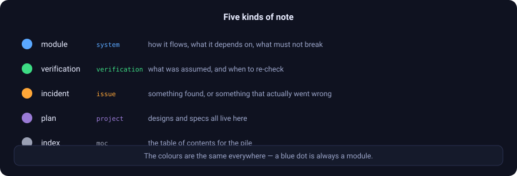
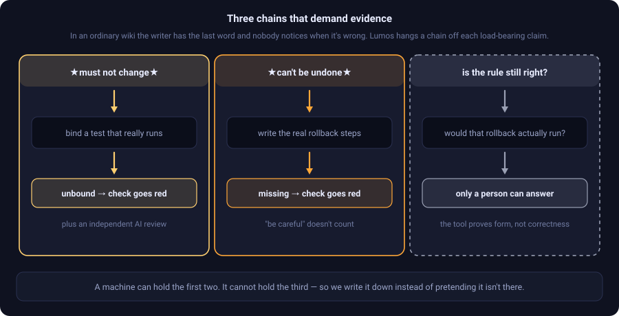
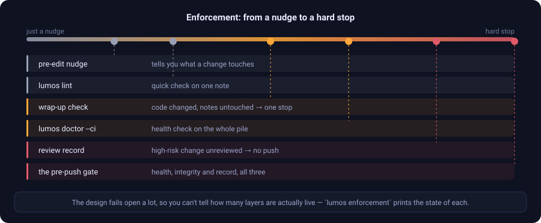
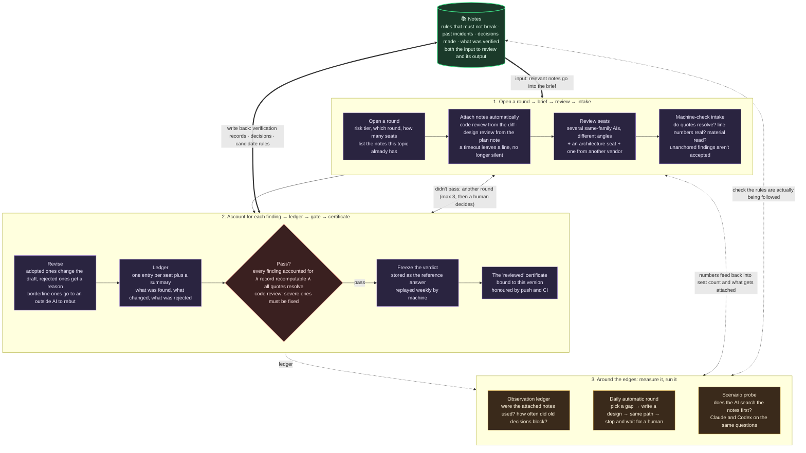

# The mental model and the machinery

[← back to the README](../README.en.md) · [繁體中文](心智模型.md)

This is for people who have decided to use it and want to know how it actually works. The README covers why; this covers what's inside, what each check stops, what a tool can prove — and what only a person can answer.

---

## 1. The whole idea, in four sentences

1. **The notes are the source of truth for *why*.**
   But for *what it actually does right now*, the authority is the tests and production. When the two disagree, **the notes don't automatically win** — work out which side is wrong, then write up the incident.

2. **Read before you touch.**
   To change an existing system, your first move is to search the notes, not grep. The notes give you the boundaries and the landmines; the code confirms the details.

3. **Write back on the way out.**
   Put the decisions and the verification results back while you're still the witness — don't leave the next person doing archaeology.

4. **Enforce it at commit time.**
   The three above rot if they rely on discipline. So the pre-commit check hard-stops "code changed, notes untouched". Two more hard stops sit alongside it: a new source file with no note owning it, and a write-back that landed somewhere other than the owning notes of the files actually changed.

---

## 2. Five kinds of note

<p align="center">
  
</p>

Every note opens with a few prefixed summary lines: `FLOW:` (how it flows), `KEY:` (the load-bearing facts), `DEP:` (what it depends on), `TEST:` (test state), `DECISION:` (decisions).

**They're designed so the opening lines alone give you the whole shape** — you shouldn't have to read the body. For a big note, start with the compressed view (`lumos context <node> --brief`, contracts still pinned to the top) and only expand if you need to.

---

## 3. Three chains that demand evidence

The problem with an ordinary wiki is simple: **the writer has the last word, and nobody notices when it's wrong.**

Lumos hangs a chain off every load-bearing claim — the heavier the claim, the harder the evidence it has to carry.

<p align="center">
  
</p>

Written out, they look like this:

```
KEY:★INVARIANT★ <a business rule that breaks things if changed>  [test:test_method_name] [audit:model/date]
KEY:★IRREVERSIBLE★ <can't be undone: a production migration, say>  [rollback:decisions]
KEY:★CHECKPOINT★   <hard to recover: deploying to staging, say>
KEY:★DEBT★         <known to be incidental; safe to change>
```

Three things to hold on to:

- **Not sure it's a contract? Don't mark it.** Never reverse-engineer rules from what the code happens to do — that turns the status quo into a rule, and it's the easiest way to mislead the next person.
- **Unmarked means reversible.** Go ahead and change it.
- **The third chain carries no machine evidence, and that's by design, not an oversight.** Whether a rule still matches the business, whether that rollback would actually run — a tool can't answer either. So it's written down plainly instead of quietly ignored.

---

## 4. Enforcement: from a nudge to a hard stop

<p align="center">
  
</p>

**Further right stops more — and happens later.** The layers on the left exist so you find the problem while it's still cheap.

The design **fails open** a lot: if the environment isn't complete, it lets you through and leans on CI. That means one broken governance tool never blocks the whole company — but it also means **you can't tell how many layers are actually live**.

```bash
lumos enforcement
```

It checks each layer and prints how many are wired up. **Note that it checks the wiring, not whether the judgement is right.** Remote settings it can't see from your machine (a required GitHub check, say) are listed honestly as unknown rather than assumed present.

---

## 5. Those opening fields: use commands, don't hand-edit

The structured fields at the top of a note (status, links, decisions) are written by command — the command formats them and verifies its own write:

```bash
lumos set <node> <field> <value>
lumos append <node> related "[[X]]"
lumos decision-add <node> "<content>" --decided DATE
```

**The most common hand-editing trap is putting several links on one line.** That grows a "ghost node" — something in the graph that doesn't exist, and isn't easy to spot.

---

## 6. What the review loop actually runs

The README covers the loop's four stages; this is what happens inside each one.



Claude Code and Codex CLI follow the same path. One install wires up both, and the wrap-up behaviour matches.

---

## 7. Reading the detailed diagrams

### Dispatch: the same material, separate angles

<p align="center">
  
</p>

Dispatch is not copying one prompt to several reviewers. It packages the change, relevant notes, load-bearing rules, and linter results into the same brief, then gives each seat a separate angle. Seats cannot see one another's reports, so copying a conclusion cannot masquerade as agreement.

At intake, the machinery checks that quotes, line numbers, and cited material resolve. Adopted, rejected, and unresolved findings must each have a destination. The next round therefore receives material that has been accounted for, rather than a pile of opinions with no conclusion.

### Three review layers: each has a blind spot

<p align="center">
  
</p>

**1. Linters** are declared by the project. Lumos reads their output, filters it to lines this change touched, and folds it into the reviewer brief. Their coverage depends on the configured rules; design and context-dependent mistakes also need questions and review seats.

**2. Questions** surface only the performance and reliability prompts triggered by the stack you touched. Before push, each needs a position: done (with evidence), not applicable (with a reason), or not yet (with a linked issue). The tool can establish that an answer exists; review seats have to challenge whether it is right.

**3. Tests** actually run the affected contract tests. If the first two layers said the right thing but the implementation is wrong, this is the backstop. Where no test guards a behaviour, only the review seats and human judgement remain.

### The stack gate: ask only what this change triggered

<p align="center">
  
</p>

The file extension and project configuration determine which stack applies; only its triggered questions appear. A language outside the question table does not activate the second layer. This is not a quality guarantee: it stops "no answer," not "a careless answer" — the latter still needs review and tests.

<a id="7-four-design-principles"></a>

## 8. Four design principles

- **Zero dependencies** — pure Python standard library. CI runs it directly; nothing to install.
- **Don't over-govern** — only load-bearing claims get a chain. Soft reminders stay soft. No ceremony without matching value.
- **An honest ceiling** — the tool proves form, not business correctness. What it can't say, it says it can't say.
- **The author doesn't get to judge** — where there's no right answer, the call goes to an independent AI that wasn't told the backstory.

## 9. Visual reference

The README keeps the overview and first-use flow. These illustrations provide additional detail; conversations and outputs are explanatory examples, not results from this run.

### From a request to tool operations

Requests map to retrieval and write-back operations. You do not need to memorize the CLI first.

<p align="center">
  
</p>

### How a note carries rules and evidence

Structured fields support retrieval; the body preserves reasoning and limits. A contract marker and a test link do not guarantee business correctness.

<p align="center">
  
</p>

### From a file to related notes

The query returns registered associations as a starting point for investigation. Dependencies absent from the results may still exist.

<p align="center">
  
</p>
