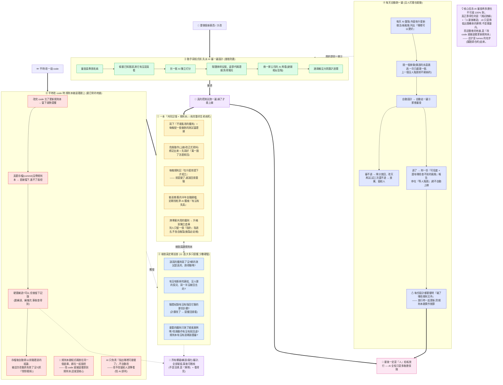

# lumos 全景圖(白話總覽)

> 面向第一次聽到 lumos 的人。技術細節見 [圖譜即合約.md](圖譜即合約.md);設計脈絡見 [圖譜即合約-對外論述.md](圖譜即合約-對外論述.md)。

**lumos 是什麼(一句話)**:一套幫你「跟 AI 一起開發時,不會亂來、規則有據可查、出錯能及早發現」的工具。

下面這張圖,是它怎麼幫你把關——從**平時改一段 code**,到**進實作前審一份新設計**,到**每天沒人盯著也能自己跑**。

## 怎麼讀這張圖

lumos 有**三條線**,由近到遠:

### ⓪ 最日常的地基:平時改 code,規則本被逼著跟上
這是 lumos 的本體,也是它叫「圖譜即合約」的原因。規則本(知識圖譜)跟程式碼**放在同一個倉庫、綁在一起版控**——你改了 code 忘了更新規則本,當下軟提醒;真要存檔(commit)會被擋;硬要繞過會留下記錄;存檔後還會自動掃「以前驗證過的結論,被這次改動弄失效了沒」。重點:**讓「不更新規則本」變成比「更新」還麻煩的事。** 而 AI 在這裡只負責「指出哪裡可能壞了」,不自動改——改不改留給人,因為 AI 會誤判。

### ① 那本「共同記憶 + 規則本」有完整的生老病死
不只是「寫下鐵則」:每條鐵則配一個**真的會跑的測試**當證據(嘴上說重要不算);危險動作先寫好「萬一錯了怎麼收回」;每條規則記「在什麼前提下成立」(前提變了要重驗);舊的半年自動歸檔、定期找乾淨 AI 體檢有沒有失真;跨專案共用的鐵則升格到獨立倉庫、別人**只留指針不複製**(複製必走樣)。

### ② 檢查員定期巡查(共 11 道,大多只提醒、少數硬擋)
不跑測試,只看「形式上齊不齊」:鐵則寫了沒、綁的測試真的跑得動嗎、有沒有斷鏈/孤兒/寫一半沒接回去的、驗證紀錄有沒有指回它驗的計劃、最重的鐵則是不是只測了順風案例、危險動作有沒有寫回退、規則本有沒有過期。

### ③ 進實作前,派 AI 審一遍設計(進階防護)
真正動手寫程式之前,先派 AI 審設計草稿。但 AI 會偷懶、會冤枉人,所以疊好幾道:**偷塞已知錯誤**測它有沒認真看、找另一個 AI **獨立打分**、派**辯護律師**反駁逼它拿代碼證據(免得冤枉好設計)、再**換一家公司的 AI** 看(避開相似盲點)、**連兩輪**沒大問題才過關。

### ④ 整套③可以每天沒人盯著、自己跑
每天 AI 盤點外界 + 列改進清單,挑一個來做(做過的永遠跳過、一次只處理一個)、自動設計、自動走③、審不過就降分改天再試(三次還不過就放棄留給人),過了就附「可信度 + 還有哪些查不到的風險」報告,**停在等人點頭、絕不自動上線**。每份設計還要聲明碰了哪些規則文件,放行時一起更新——防規則本跟實作脫節。

### 橫切兩條底線
1. **🧾 全部留痕**:所有攔截、繞過、腐化、審計都記錄下來,事後可稽核——不是法律約束,是「摩擦 + 看得見」。
2. **🎯 真錨點**:不管 AI 審了幾層,真正算數的只有兩件——**把測試真的跑綠**、**最後由人拍板**。

## 一句話收束

**AI 審查再多層,也不可能 100% 對。真正靠得住的是「測試跑綠」+「人最後確認」;所有 AI 把關都只是降低出錯機率的摩擦,不是萬靈丹。** 這也是為什麼 ③④ 那些聰明的 AI 審查,在圖上永遠是「進階層」,而 ⓪ 那條「改 code 就被逼著更新規則本」的笨地基,才是 lumos 的根。
