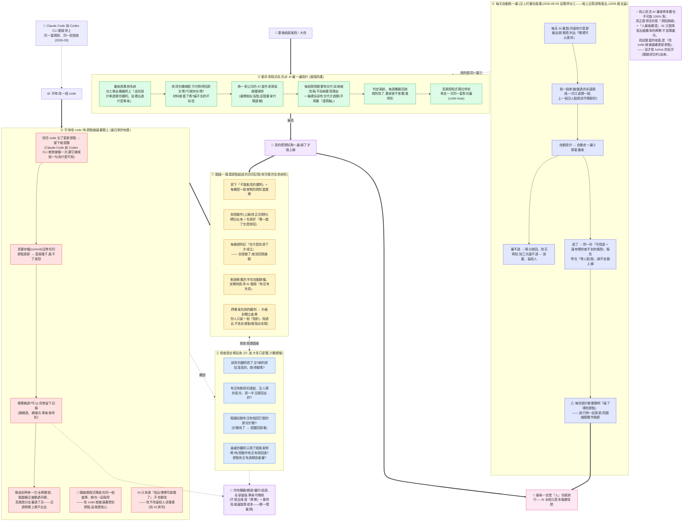

# lumos 全景圖(白話總覽)

> 面向第一次聽到 lumos 的人。技術細節見 [圖譜即合約.md](圖譜即合約.md);設計脈絡見 [圖譜即合約-對外論述.md](圖譜即合約-對外論述.md)。
> **這份文件現在算什麼**(2026-09-07 全 repo 審視 #10 補):現行機制的白話總覽,跟著機制改;圖上的道數與名稱以 [README](../../README.md) 與 `lumos --help` 為準,對不上時以那兩處為真、回來修這張圖。

**一句話**:程式碼只告訴你現在長怎樣;為什麼會長這樣,只有筆記記得。lumos 就是逼大家把那些筆記留下來的工具。

**只有一個詞要記**:**筆記**——一篇記一件事(為什麼這樣設計、邊界在哪、哪些不能改、驗過沒)。所有筆記互相連起來,就是這份文件說的「圖譜」。

下面這張圖是它怎麼把關,由近到遠三層:**平時改一段程式** → **動手前先審設計** → **每天沒人盯著也能自己跑**。

> 2026-09-05 更新:③ 那條線改成現行做法——不再偷塞假錯、不再數「連兩輪」;改成機器把相關鐵則附給審查員、機器收貨驗引句、每個發現都要有去向、判定凍結每週回放。② 的檢查數更新為 22 道。⓪ 補上 Codex CLI 也接得上;收工檢查兩家一致(改了 code 沒動節點就擋一次)。④ 標明自主迴圈 2026-09-05 起暫停派工。舊版怎麼講、為什麼改,見 [圖譜即合約.md](圖譜即合約.md) 的沿革表。

```mermaid
flowchart TD
    classDef base fill:#fee2e2,stroke:#dc2626
    classDef book fill:#fef3c7,stroke:#d97706
    classDef check fill:#dbeafe,stroke:#2563eb
    classDef ai fill:#dcfce7,stroke:#16a34a
    classDef loop fill:#e0e7ff,stroke:#4f46e5
    classDef human fill:#fce7f3,stroke:#db2777
    classDef anchor fill:#f3e8ff,stroke:#9333ea

    subgraph Z["⓪ 平時改 code 時:節點被逼著跟上 (最日常的地基)"]
        Z1["改完 code 忘了更新節點 → 當下就提醒<br/>(Claude Code 與 Codex CLI 都會被擋一次,要它補或說一句為什麼不用)"]
        Z2["真要存檔(commit)沒帶任何節點更新 → 直接擋下,進不了版控"]
        Z3["硬要繞過?可以,但會留下記錄<br/>(誰繞過、繞幾次,事後查得到)"]
        Z4["推送前再掃一次:全庫健檢、驗證器沒被動過手腳、<br/>高風險分支審過了沒——沒過物理上推不出去"]
        Z5["📌 圖譜跟程式碼放在同一個倉庫、綁在一起版控<br/>—— 改 code 就被逼著想到節點,這就是核心"]
        Z6["AI 只負責『指出哪裡可能壞了』,不自動改<br/>—— 改不改留給人逐筆看(怕 AI 誤判)"]
        Z1 --> Z2 --> Z3 --> Z4
    end

    subgraph A["① 圖譜:一篇篇節點組成的共同記憶(有完整的生老病死)"]
        A1["寫下『不能亂改的鐵則』+ 每條配一個會跑的測試當證據"]
        A2["危險動作(上線/改正式資料)標記出來 + 先寫好『萬一錯了怎麼收回』"]
        A3["每條規則記『在什麼前提下才成立』<br/>—— 前提變了,就該回頭重驗"]
        A4["會過期:舊的半年自動歸檔、定期找乾淨 AI 體檢『有沒有失真』"]
        A5["跨專案共用的鐵則 → 升格到獨立倉庫<br/>別人只留一個『指針』指過去,不各自複製(複製必走樣)"]
    end

    subgraph B["② 檢查員定期巡查 (22 道;大多只提醒,少數硬擋)"]
        B1["該寫的鐵則寫了沒?綁的測試是真的、跑得動嗎?"]
        B2["有沒有斷掉的連結、沒人理的孤兒、寫一半沒接回去的?"]
        B3["驗證紀錄有沒有指回它驗的那份計劃?<br/>(計劃改了 → 提醒回頭看)"]
        B4["最重的鐵則只測了順風案例嗎?危險動作有沒有寫回退?<br/>節點有沒有過期該重審?"]
    end

    subgraph C["③ 動手寫程式前,先派 AI 審一遍設計 (進階防護)"]
        C1["審查員專挑毛病<br/>派工單由機器附上『這份設計牽連哪些鐵則、這裡出過什麼事故』"] --> C2["收貨先機械驗:引句對得回原文嗎?行號存在嗎?<br/>材料都看了嗎?錨不到的不採信"]
        C2 --> C3["換一家公司的 AI 當外家席與辯護律師<br/>(避開相似盲點;反駁要拿代碼證據)"] --> C4["每個發現都要有交代:採納就改稿,不採納要寫理由<br/>一輪裡全部有交代才過關(不再數『連兩輪』)"]
        C4 --> C5["判定凍結、每週機器回放<br/>規則改了,舊案會不會翻,看得到"] --> C6["高風險程式碼合併前<br/>再走一次同一套對抗審(code-loop)"]
    end

    subgraph D["④ 每天自動跑一遍 (沒人盯著也能動;2026-09-05 起暫停派工——帳上近兩週零產出,10/05 裁去留)"]
        D1["每天 AI 盤點:外面有什麼新做法/新風險,列出『哪裡可以更好』"]
        D2["挑一個來做(做過的永遠跳過;一次只處理一個,<br/>上一個沒人點頭前不開新的)"]
        D3["自動設計 → 自動走一遍③那套審查"]
        D4["審不過 → 降分放回、改天再試;試三次還不過 → 放棄、留給人"]
        D5["過了 → 附一份『可信度 + 還有哪些查不到的風險』報告<br/>停在『等人點頭』,絕不自動上線"]
        D6["⚠ 每份設計都要聲明『碰了哪些節點』<br/>—— 放行時一起更新,防圖譜跟實作脫節"]
        D1 --> D2 --> D3 --> D4
        D3 --> D5 --> D6
    end

    EDIT["✏️ 平時:改一段 code"] ==> Z
    TOOLS["🤖 Claude Code 與 Codex CLI 都接得上<br/>同一套規矩、同一批檢查(2026-09)"] -.-> EDIT
    Z -.觸發.-> B
    Z ==> A
    START["💭 要做個新東西 / 大改"] ==> C
    A <-->|檢查員讀圖譜| B
    C ==>|審過| CI["🎯 真的把測試跑一遍,綠了才能上線"]
    CI ==> A
    D -. 用的是同一套③ .-> C

    LEDGER["🧾 所有攔截/繞過/審計/逃逸,全部留痕,事後可稽核<br/>(不是法律,是『摩擦』+ 看得見;帳還能算成本——哪一環最燒)"]
    Z3 -.-> LEDGER
    B -.-> LEDGER

    HUMAN["👤 最後一定是『人』拍板放行 — AI 全程只是多幾層保險"]
    D6 ==> HUMAN
    CI ==> HUMAN

    NOTE["💡 核心信念:AI 審查再多層也不可能 100% 對。<br/>真正靠得住的是『測試跑綠』+『人最後確認』;AI 只是降低出錯機率的摩擦,不是萬靈丹。<br/>而這整套的地基,是『改 code 就被逼著更新節點』—— 這才是 lumos 的名字(圖譜即合約)由來。"]

    class Z1,Z2,Z3,Z4,Z5,Z6 base
    class A1,A2,A3,A4,A5 book
    class B1,B2,B3,B4 check
    class C1,C2,C3,C4,C5,C6 ai
    class D1,D2,D3,D4,D5,D6 loop
    class HUMAN human
    class NOTE,CI,LEDGER anchor
```

## 怎麼讀這張圖

lumos 有**三條線**,由近到遠:

### ⓪ 地基:改了程式,筆記被逼著跟上

**這是本體,其他都是加值。** 筆記跟程式碼放在同一個倉庫、一起版控,所以它們不會走散。

改了程式卻沒動筆記,會依序碰到三次阻力:

- **收工時**擋一次,要你補一句或說明為什麼不用
- **要提交時**擋住,不補就過不去
- **要推送時**再掃一遍:整疊筆記健檢、把關的檔案有沒有被動過、高風險改動審過沒

**重點是讓「不寫」比「寫」還麻煩。** 另外 AI 在這裡只負責指出哪裡可能壞了，**不會自己改**——改不改留給人，因為 AI 會誤判。

### ① 這疊筆記有生老病死,不是寫完就擺著

- 寫「這條不能改」，就要配**一支真的會跑的測試**當證據——嘴上說重要不算
- 危險的動作，先寫好「萬一錯了怎麼收回」
- 每條規則記下「在什麼前提下成立」——前提變了就要重驗
- 舊的半年自動歸檔；定期找一個不知情的 AI 體檢，看內容有沒有跟現實脫節
- 幾個專案共用的規則升格到獨立倉庫，別人**只留指標不複製**（複製一定走樣）

### ② 二十二道檢查定期巡一遍(大多只提醒,少數硬擋)

**它們不跑測試,只看「形式上齊不齊」**：規則寫了沒、綁的測試真的跑得動嗎、有沒有連到一半斷掉的、驗證紀錄有沒有指回它驗的那份計劃、最重要的規則是不是只測了順風案例、危險動作有沒有寫回退、有沒有哪篇已經過期了。

### ③ 動手寫程式之前,先派 AI 審一遍設計

**問題是 AI 自己也會出錯**——會偷懶、會冤枉人、會編造引用。所以這一層疊了好幾道防護：

- **要審什麼,機器自己附上去** — 這份設計牽連到哪些規則、出過哪些事故，機器算好塞進去。審查員不用自己翻，也就翻不漏。
- **報告收進來時先機器驗** — 引用的句子對不對得回原文？行號真的存在嗎？該看的材料看了嗎？**對不回原文的一律不採信。**
- **找換一家公司的 AI 來反駁** — 它專門唱反調，但反駁要拿程式碼當證據，光說「沒問題」不算。
- **每個發現都要有交代** — 採納就回頭改稿，不採納要寫下理由。一輪裡全部有交代才算過。
- **過關的判定凍結起來,每週回放一次** — 規則改了之後，舊案會不會翻案，看得到。

高風險的程式碼在合併前，再走一次同一套。

### ④ 整套③可以每天沒人盯著自己跑

> **現況（2026-09-05 起暫停）**：這條線最近兩週的紀錄都是產出 0 份可放行的設計，所以先停了（便宜的日報與週檢照跑）。10/05 決定給它一條真的有產出的路，或是收掉。

設計上它該這樣跑：每天 AI 盤點外界、列一張改進清單，挑一個來做（做過的永遠跳過，一次只處理一個），自動寫設計、自動走 ③、審不過就改天再試（三次都不過就放棄，留給人）。

過了會附一份「可信度 + 還有哪些查不到的風險」的報告，然後**停在等人點頭——絕不自動上線**。

### 橫切的兩條底線

**1. 全部留下紀錄。** 誰被擋過、誰繞過去了、哪裡在腐化、審過什麼，都寫進本機的流水帳。它不是法律約束，是**「多一道摩擦，而且看得見」**。

**2. 真正算數的只有兩件事。** 不管 AI 審了幾層——**測試真的跑綠**，以及**最後由人拍板**。

而「測試真的跑綠」本身有個前提：**改考卷的那支程式沒被人動過。** 所以工具會替把關用的檔案留指紋，推送前比對一次。這把「我相信測試沒被動手腳」從盲信，變成一句可以機械核對的話。

## 一句話收束

**AI 審查再多層,也不可能 100% 對。真正靠得住的是「測試跑綠」+「人最後確認」;所有 AI 把關都只是降低出錯機率的摩擦,不是萬靈丹。** 這也是為什麼 ③④ 那些聰明的 AI 審查,在圖上永遠是「進階層」,而 ⓪ 那條「改 code 就被逼著更新節點」的笨地基,才是 lumos 的根。
