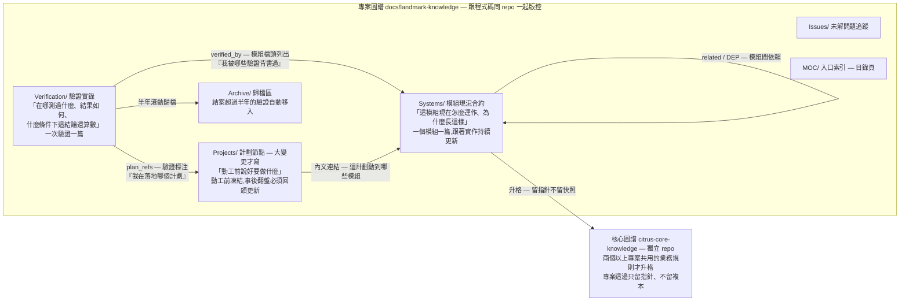
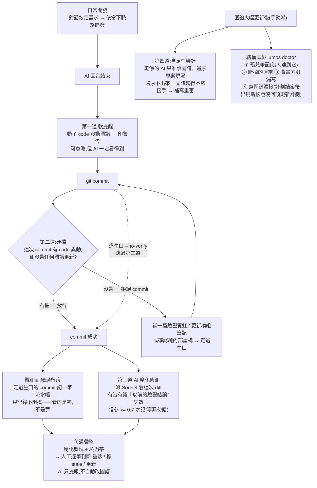
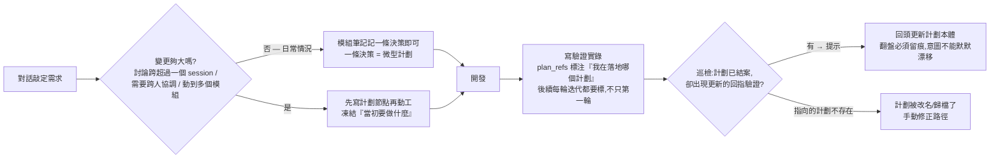

# 圖譜即合約 (Graph as Contract)

> **One-liner**: 把工程知識當 code 版控、用 hook 機械式強制同步、用 LLM 偵測語意漂移 —— 取代「人類自律」的軟限制。

本文件描述 LandmarkMember 專案的圖譜與 hook 配套的整體架構與方法論。給新進 team 成員 / 未來的 Claude session 看一篇就懂整套設計。

---

## 一、Why — 解決什麼問題

傳統工程知識管理會遇到的痛點:

1. **文件 vs code 漂移**:code 改了,文件沒人跟新
2. **驗證紀錄堆積成廢紙**:跑過的測試紀錄沒人 review、不確定還有效嗎
3. **AI session 缺乏上下文**:每次 AI 重來都要重新解釋「為什麼這樣設計」
4. **團隊隱性知識散佚**:某個決策當時的 trade-off 三個月後沒人記得
5. **「該寫沒寫」永遠輸給「該做沒做」**:文件總是 backlog 最底端

本範式的核心:**讓「不更新圖譜」變成比「更新圖譜」更難的事**。

---

## 二、What — 圖譜結構與四道強制力

### 知識層:筆記物種與連結



**圖例:檔頭欄位與標記**

| 標籤 | 放在哪 | 白話含義 |
|------|--------|----------|
| `summary` | 每篇檔頭 | 結構化摘要,AI 掃一眼懂全貌。`FLOW:`流程、`KEY:`關鍵事實、`DEP:`依賴誰、`TEST:`測試狀態 |
| `★INVARIANT★` | Systems 的 KEY 行前綴 | **業務合約**:改這個行為 = breaking change,動之前必須翻決策紀錄 |
| `★DEBT★` | 同上 | **已知偶然**:暫定值、寫死的常數,改了不算 breaking |
| (未標的 KEY 行) | — | 合約性未聲明,動之前自行判斷。紀律:不確定就不標,嚴禁從現況反推「應該是合約」 |
| `[test:測試名]` | ★INVARIANT★ 行尾 | **合約即測試**(2026-06-14):鐵則綁一個真實會跑的測試當可執行證據；doctor Check T 偵測裸合約/偽證據/懸空——**預設軟提醒(doctor 仍 exit 0)、pre-push `--ci` 才硬擋**(非無條件擋)。驗「綁了沒、綁的存不存在」這層形式,不驗測試跑得動 |
| `★COMBO★` | ★INVARIANT★ 行尾(marker 之後) | **組合覆蓋**(2026-06-23):最重的 money-path 鐵則標這個=該有組合情境測試兜底、別只測 happy-path；doctor Check K **軟提醒**(只綁 1 個 [test:] → 建議補,不擋)。天花板:只數標記個數、`[test:a,b]` 算 1 個免逗號繞過、CI 跑才是錨點（錨點自身完整性由 anchor baseline 守,2026-07-02） |
| `[audit:模型/日期]` | 同上 | **獨立合法性審計**留痕(2026-06-18）：「是不是真合約 / 綁的測試夠不夠格」這種沒標準答案的判斷，經無脈絡的乾淨 agent 判過（maker≠checker，別讓提鐵則的人自己認證）；缺=doctor 報未審 |
| `★IRREVERSIBLE★` / `★CHECKPOINT★` | Systems KEY 行前綴 | **可逆性**(2026-06-19）：收不回的動作（prod 遷移/上架）標 `★IRREVERSIBLE★`、改了難救標 `★CHECKPOINT★`；未標=可逆 |
| `[rollback:decisions]` | ★IRREVERSIBLE★ 行尾 | **回退路徑指針**（事後補償）→ decisions 的回退 SQL/補償步驟；doctor Check R 強制（★IRREVERSIBLE★ 沒帶實質回退=擋）。天花板：證「有寫下 undo」≠「驗過能跑」 |
| `[guard:decisions]` | ★IRREVERSIBLE★ 行尾 | **事前預防路徑指針**（2026-06-24）→ decisions 的冪等鍵/核可閘。外部真不可逆（信已送出/下游已消費）回退沒用，改驗事前守衛。Check R **兩軌任一合規**：`[rollback:]`（事後補償）**或** `[guard:]`（事前預防）；`[guard:]` 僅 ★IRREVERSIBLE★，屬可逆性軸（與 ★INVARIANT★ 的 `lumos guard bind` 同名但正交） |
| `decisions[]` | Systems 檔頭 | ADR 決策紀錄:當時背景/考慮過哪些方案/為何選這個/犧牲了什麼;被推翻的標 `valid: false` 留作學習資產 |
| `verified_by` | Systems 檔頭 | 反向索引:這模組被哪些驗證背書過 |
| `valid_under` | Verification 檔頭 | 條件式有效期:這份結論在什麼前提下才算數(前提變了才需重驗,比「過期 N 天」精準) |
| `revalidate_when` | Verification 檔頭 | 什麼條件改變時要重新驗證 |
| `plan_refs` | Verification 檔頭 | 意圖鏈:這份驗證在落地/迭代哪個計劃(單向指針,計劃側不留鏡像欄位) |
| `status` | 全部 | 生命狀態:`doing` 進行中 / `done`、`pass` 結案 / `stale` 已腐需重驗 / `superseded` 被取代 |

### 強制力層:一次 commit 經過的關卡



**圖例:四道強制力守什麼**

| 關卡 | 時機 | 性質 | 守的失敗模式 |
|------|------|------|--------------|
| 第一道 軟提醒(L1 Stop hook) | 每個 AI 回合結束 | 警告,可忽略 | 「改了 code 忘了圖譜」當下就提 |
| 第二道 硬擋(L2 git pre-commit) | commit 當下 | 擋下,需補救或走逃生口 | 沒帶圖譜的 commit 進不了版控;圖譜 frontmatter 污染指紋(日期加引號,docs-only 也攔) |
| 第二·五道 push 把關(pre-push,2026-06-13) | push 當下 | 擋下,可 --no-verify | 完整 lumos doctor(斷連結/orphan/verified_by/plan_refs/同名/lint)——**同步可見**,壞圖譜出不了本機;補 CI push 觸發「非同步看不見」的洞 |
| 觀測面 留痕(post-commit) | commit 之後 | 只記錄 | 逃生口被濫用時,繞過率會說話 |
| 第三道 腐化偵測(L3 PostToolUse) | commit 之後 | 提報不阻擋 | 「以前驗過的結論,今天的改動讓它失效了」 |
| 第四道 自足性審計(L4) | 圖譜大改後 | 手動派、補寫到一致 | 「都有寫,但寫的不夠讓新人接手」「兩篇筆記互相矛盾」 |
| Check T 合約即測試（2026-06-14/18，doctor） | doctor / pre-push | 擋 | 「鐵則沒綁可執行證據（裸合約）/ 綁了同源假測試 / 沒經獨立審計（`[audit:]`）」——驗「寫的是不是真」 |
| Check K ★COMBO★ 組合覆蓋（2026-06-23，doctor） | doctor / pre-push | 軟提醒（不擋） | 「最重鐵則只綁 1 個 happy-path [test:]，建議補組合情境測試」——**驗證正確性 > AI 審計**:CI 跑測試是錨點，Check K 只軟提醒補組合、不保證 |
| Check R 可逆性（2026-06-19，doctor） | doctor / pre-push | 擋（IRREVERSIBLE）/ 軟提醒（CHECKPOINT） | 「不可逆動作沒寫回退/守衛」——**兩軌任一**：`[rollback:]`（事後收回）或 `[guard:]`（事前冪等鍵/核可閘，2026-06-24）；外部真不可逆者回退沒用、改逼事前預防 |
| Check H 漏標可逆性提醒（2026-06-25，doctor `--ci`） | doctor `--ci` | 軟提醒（不擋） | 「diff 碰 prod/外部 API/寄送/破壞性 DB 卻可能沒標 ★IRREVERSIBLE★」——把漏標從「全靠人想到」變「機器提醒人」；與 Check R 互補（R 守「有標要合規」、H 提醒「沒標但可能需要」）。維持人手標、不把判可逆性自動化交 LLM |
| 錨點完整性 anchor verify（2026-07-02，vault-free） | pre-push / 自主 loop 每輪入口 | 擋 | 「驗證器本身（測試 runner／把關 hooks）被悄悄改成一律通過」——5 錨點 sha256 baseline 比對，改錨點須 `lumos anchor approve --note` 留痕（治理帳 anchor-approve 事件）；「測試綠」的前提（批改程式沒被動過）變成可機械核對的宣稱。天花板：同 repo 守衛悖論——買到的是無痕篡改被封死（必留 baseline diff／缺 approve 事件／bypass 軌跡其一），非不可繞 |
| 治理事件帳 `lumos gov`（2026-06-19） | 查詢時 | 只彙整 | 「四道閘的訊號散落各 hook，無法一次查某節點歷來被哪幾道攔過」——可觀測性 |
| 設計前審計 loop（2026-06-19，`lumos-design-loop` skill） | spec 進實作**前** | 硬閘（紀律強制、非技術鎖；收斂才放行）+ 自我檢查 | 「設計沒打磨就實作」「審計員放水（canary 抓，防假陰性）」「審計員認真但判錯（辯方 refute 殺假陽性，2026-06-24）」「收斂靠人眼判（`lumos loop status` 機械算）」 |
| 實務隱患提問閘 `pitfalls`（2026-07-04） | spec 進實作前 / 分支終審前 | 提問(spec `--check` 缺「實務隱患」節即擋)+ 提示器(`--diff` 攤代碼形態風險位置給審查者)+ **lint 整合器(SARIF，2026-07-04)——專案配 `.lumos/lint.json` 則 `--diff` 吃社群 linter、不自建規則** | 「AI 只顧通過測試、不主動想效能/冪等/併發/資源隱患」——機械逼答設計決策級隱患、把代碼級風險位置導到審查者眼前；規則庫讓給社群 linter(composition over invention、AST 級更準、免腐化) |
| 代碼對抗審計 `lumos-code-loop`（2026-07-04） | 分支終審（`pitfalls --diff` tier high 觸發） | 對抗審(bug canary 驗 reviewer 醒著+辯方殺假陽性+K-streak∧G2 收斂)+ 三道防污染 | 「最該層層審的代碼反而只有兩道普通眼睛」——把 design-loop 對抗紀律搬到終審,補審計火力頭重腳輕;天花板:pattern 提示器非偵測器、canary 溯源排除靠自律(偏多排) |

每一道守不同的失敗模式,**任一道放過,下一道接住**。前三道與 L4 驗「有沒有寫 / 寫的夠不夠」,Check T/R 進一步驗「寫的是不是真、危險的能不能收回」;設計前審計 loop 則把「AI 當審計員」這條本身變得**可信(canary 驗放水)、可機械終止(loop status 算收斂)**。機器只負責擋和提報,**判斷永遠留給人**——而這些工具的天花板都一致:它們是**可觀測 + 摩擦 + 地板**,不是「絕對正確」的神諭(形式可驗、validation 仍需現實接觸)。

**辯方 refute(2026-06-24)= canary 的對稱補位**:canary 驗「審計員放水/沒讀」(假陰性、漏抓),防不了「認真但判錯」(假陽性、誤抓——6/23 cross-family qwen 引了行號卻誤判已處理好的 `__SCRATCH__`)。辯方對每條 major+ finding 派獨立審查、**逼 file:line 證據**反駁,殺 code 層假陽性,severity 取存活 max。檢察官(對設計 refute→findings)/辯方(對 finding refute→殺假陽性)雙向對抗,補齊「只有檢察官會放行爛指控」的缺口。天花板同上:只買 code 層、業務層留人。

### 意圖鏈:「說好要做的」對上「實際做完的」



> **第四道強制力(2026-06-10 新增):自足性審計**——不在 commit 流水線上,而是「圖譜實質更新後」觸發:派乾淨的 Sonnet agent(無主對話脈絡、只准讀圖譜)還原現況,主對話比對還原結果與自身脈絡,有出入 = 圖譜不健全 → 補寫重審直到一致。hooks 驗「有沒有寫」(同步性/有效性),這道驗「寫的夠不夠接手」(自足性)——能抓到「流程文字沒跟上同篇較新決策」這類 hooks 全部抓不到的內部矛盾。機制定義在 lumos-project-notes skill「圖譜更新後:Sonnet agent 自足性審計」章節。

---

## 三、設計原則 (6 條)

### 1. Knowledge as code
vault 跟 codebase 同 repo 版控,圖譜變更跟 commit 綁定。Team 拉同一個 repo 就同步圖譜,不需另外架 wiki。

### 2. Mechanical not motivational
不靠紀律,靠 hook。每個原則都有對應的自動化執行機制 —— 「應該更新圖譜」不是建議,是 commit 前的硬擋。

### 3. Three-layer defense
- **Layer 1**:soft reminder(可忽略,但 surface 給 Claude 看到)
- **Layer 2**:hard gate(直接擋下 commit,bypass 用業界標準 `git commit --no-verify`,2026-05-25 起;自創 marker `[no-graph]` 已淘汰)
- **Layer 3**:semantic check(LLM 後驗,不擋,但累積到 queue)

三層獨立,任一層失效不影響其他。

### 4. Honest decay
- frontmatter 有 `valid_under` / `revalidate_when` 條件式 TTL；自 2026-06-29 起於 `lumos context` 進場主動提示(非僅寫入標記)，>90 天未更新加紅標
- Verification 半年滾動歸檔(`lumos archive`,2026-06-13 起取代依賴 Obsidian 的 archive-old-verifications.sh)
- LLM 偵測 staleness 累積到 `.rot-queue.jsonl`
- 不假裝文件永恆有效

### 5. AI as auditor, not author
- LLM 偵測 rot,但**不自動改 frontmatter**(paper recall 52%,自動 stale 風險高)
- 累積到 queue 讓人逐筆 review
- AI 提速人類判斷,不取代人類決策
- 對 AI 審計員自身也不盲信(2026-07-03):跨家族複核的 ≥major 否決要**經機械驗證存活才計票**(全數被反證 → endorsed-after-refute 放行)——自信但無證據的複核意見不消耗放行預算;「複核同意」也從不是綠燈鐵證

### 6. Composition over invention(起步如此,後來誠實長出 lumos)
- **lumos**(零依賴 python CLI):機器面讀/寫/巡檢(doctor)/歸檔/合約強制的權威工具
- Obsidian(**選用**):人類視覺編輯 / 權威 lint;機器面已不依賴
- `claude -p`(Max 訂閱,無 API key)
- 標準 Unix shell + Python
- 誠實補:起步真的「不另造輪、直接用 Obsidian」,但有些檢查 Obsidian 做不到 → 長出 lumos(仍零依賴、隨時可丟重來)

---

## 四、組件清單

### Layer 0: Graph 結構 (lumos + Obsidian 選用 + 慣例)

| 元素 | 描述 |
|------|------|
| Vault 路徑 | `docs/landmark-knowledge/`(跟 repo 同版控) |
| Skill 規範 | `lumos-project-notes`(定義 schema 與行為慣例) |
| 資料夾 | `Systems/` / `Verification/` (含 `Archive/YYYY-MM/`) / `Issues/` / `Projects/` / `MOC/` |
| Frontmatter | `status`, `summary`, `decisions[]`(ADR 四欄位), `verified_by[]`, `plan_refs[]`, `valid_under`, `revalidate_when`, `tags` |
| Typed edges | `verified_by`(Systems → Verifications)、`superseded_by`、`related` |

### Layer 1: Stop hook (turn 結束軟提醒)

| 屬性 | 值 |
|------|-----|
| 檔 | `~/.claude/hooks/check-graph-sync.py` |
| 註冊於 | `~/.claude/settings.json` 的 `hooks.Stop` |
| Trigger | 每個 Claude turn 結束 |
| 動作 | 印 stderr 警告(不擋) |
| 增強 | 收緊 obsidian CLI 偵測 + 反查 enrichment + 補抓 Bash 檔案異動 |
| Verification | [[2026-05-24_graph-sync-hook-install]]、[[2026-05-25_hook-enhancements-2-5-6]] |

### Layer 2: git 原生 pre-commit hook (commit 硬擋)

> 2026-05-25 從 Claude Code PreToolUse 翻盤搬到 git 原生 hook——PreToolUse 階段暫存區是空的,`git commit -am` / `git commit <path>` 會繞過;git 程序內部攔截才擋得住所有形態。詳 [[2026-05-25_l2-migration-git-pre-commit]]。

| 屬性 | 值 |
|------|-----|
| 檔 | `scripts/hooks/pre-commit`(隨 repo 版控) |
| 註冊於 | `git config core.hooksPath scripts/hooks` |
| Trigger | git 程序內部,所有形態的 commit |
| 動作 | code 改了沒 graph .md staged → 拒絕 commit(提示兩條路);Gate 1(2026-06-13):圖譜 frontmatter 污染指紋(日期加引號)→ 拒絕,docs-only commit 也攔 |
| Bypass | `git commit --no-verify`(業界標準,code review 看得到;自創 marker 已淘汰) |
| Verification | [[2026-05-25_l2-migration-git-pre-commit]]、初版 [[2026-05-25_commit-gate-and-graph-doctor]] |

### L2 觀測面:bypass 留痕(post-commit,2026-06-10)

> 來源:AI 治理調研 gap「逃生口與警告忽略皆無留痕」。bypass 率是「不更新圖譜比更新圖譜更難」這個核心宣稱唯一沒被量測的數字;偵測點原理是 `--no-verify` 只跳過 pre-commit/commit-msg,**post-commit 永遠會跑**。L1 警告被忽略的最終結果就是一筆 bypass commit——同一訊號,不另外追蹤。

| 屬性 | 值 |
|------|-----|
| 檔 | `scripts/hooks/post-commit`(隨 repo 版控,判定規則與 pre-commit 完全對齊) |
| Trigger | 每次 commit 後(merge commit 跳過) |
| 判定 | 有 code 異動但無圖譜 .md = 必然繞過 L2 → append `docs/.bypass-log.jsonl`(gitignored 本機觀測) |
| 動作 | **只記錄、不阻擋、不問理由**——要的是「率」不是「罪」,問理由等於把硬擋偷渡回逃生口 |
| 報表 | `scripts/rot-queue-digest.sh` 同場印 bypass 率(對照同期 commit 總數;--clear 不清 bypass log) |
| Verification | [[2026-06-10_L2-bypass留痕post-commit]] |

已知侷限與刻意取捨(2026-06-10 自足性審計收束):
- **兩 hook 判定對齊無機械保障**——靠 Verification 的 revalidate_when 紀律(改 pre-commit 規則=必須同步改 post-commit 並重驗),不另寫對齊檢查腳本;真漂移時症狀明顯(幽靈 bypass/漏記),修法單純
- **bypass 率行動門檻刻意未定**——先累積數週基線再定;暫行判讀:「連續數週走高」=合約從側門腐爛訊號,單週突波先逐筆看 digest
- **bypass log 本機限定**——「審計軌跡」目前=單人本機工作流的軌跡;團隊化/CI 後本機 post-commit 必然漏記,屆時改 CI 端掃描(已列 revalidate_when)
- **bypass log 不接 L1 提醒是刻意的**——bypass 率是慢性指標,review 路徑是 weekly digest;接 L1 變成即時嘮叨,違反「只記錄不阻擋」的設計

### Layer 3: PostToolUse hook (LLM rot 偵測)

| 屬性 | 值 |
|------|-----|
| 檔 | `~/.claude/hooks/verification-rot-check.py` |
| 註冊於 | `~/.claude/settings.json` 的 `hooks.PostToolUse`(matcher=Bash, timeout=60s) |
| Trigger | commit 完成後 |
| 動作 | `claude -p --model sonnet` 平行判斷 max 5 候選 → stderr + append `docs/.rot-queue.jsonl` |
| 設計依據 | arxiv 2603.00489 README rot detection paper (ICSE 2026; Spec 99% / Recall 52%) |
| Threshold | `invalidates=true AND confidence >= 0.7` |
| Verification | [[2026-05-25_llm-rot-check-hook]] |

### 第四道:自足性審計(Sonnet 還原測試,2026-06-10)

| 屬性 | 值 |
|------|-----|
| 定義於 | lumos-project-notes skill「圖譜更新後:Sonnet agent 自足性審計」章節 |
| Trigger | 圖譜實質內容更新後(非 hook,由主對話依 skill 規則執行) |
| 動作 | Agent tool 派 `model: sonnet` 乾淨 agent,只准讀圖譜還原現況 → 主對話比對 → 缺漏/誤讀/模糊 → 補寫重審直到一致 |
| 紀律 | 不餵主對話脈絡(污染測試);用 Sonnet 是刻意——太強的模型會用推理補上圖譜沒寫的洞,測不出缺漏 |
| 留痕(2026-06-23) | 審過補到一致後 `lumos self-audit <node>` 蓋 `self_audit: <model>/<date>`(節點級戳記,有別於 ★INVARIANT★ 軸行級 [audit:])。**doctor Check S** 軟提醒(warn_soft、不計 issues、`doctor --ci` 仍 exit 0):type=system 無 self_audit=從未審 / self_audit 日期<updated=過期。把 L4 從「零留痕、純靠記得」→「有戳記可查 + 過期軟提醒」,仍是摩擦地板非 gate(工具只記留痕,不證明審計真乾淨) |
| 首輪戰果 | 2026-06-10 圖譜健康度修復後首跑:還原 PASS 但抓出 6 個記載模糊/內部矛盾(含「點數商城流程文字 vs 同篇 6/2 決策」自相矛盾),全數收束 |
| 變體 B | **圖譜×程式碼交叉審計**(無主對話脈絡時,以 code 為真值):還原 agent 只讀單篇筆記萃取可證偽主張 → 實證 agent 只讀 code(禁讀 docs/)逐條判定。首跑四大節點 60 主張 85% 一致、修 9 處腐爛,詳 [[2026-06-10_圖譜程式碼交叉審計_四大節點]];最高頻腐爛型態=「決策在別篇被推翻、本篇沒跟上」(L1~L3 全抓不到) |

### 巡檢腳本

| 檔 | 用途 | 跑頻率 |
|----|------|--------|
| `lumos doctor`(self-contained python,2026-06-13 起取代依賴 Obsidian app 的 graph-doctor.sh) | orphans + unresolved + verified_by 同步 + plan_refs 意圖鏈 + 同名守衛 + Check T/R + Check P 失效檔案認領 + lint | 動 graph 後立即跑 / pre-push / CI |
| `lumos archive`(2026-06-13 起取代 Obsidian 依賴的 archive-old-verifications.sh) | 半年滾動歸檔(`--days N --apply`,dry-run by default,單遍移檔+連結正規化) | 季度 / 半年 |
| `scripts/rot-queue-digest.sh` | weekly review LLM 累積的 rot finding + L2 bypass 率 | weekly |

### 合約即測試 / 獨立審計 / 可逆性(doctor Check T + Check R)

| 屬性 | 值 |
|------|-----|
| 定義/實作 | `lumos doctor` 的 Check T（★INVARIANT★→`[test:]`→`[audit:]`）與 Check R（★IRREVERSIBLE★/★CHECKPOINT★→`[rollback:]`）；單檔快檢走 `lumos lint <節點>` |
| Check T | 每條 ★INVARIANT★ 必綁存在於 code 的 `[test:]`（裸/偽證據/懸空皆擋）→ 再經無脈絡乾淨 agent 蓋 `[audit:]`（maker≠checker，缺=未審擋） |
| Check R | ★IRREVERSIBLE★ **兩軌任一合規**（2026-06-24）：`[rollback:decisions]`（事後補償）**或** `[guard:decisions]`（事前冪等鍵/核可閘，給寄信/已消費遷移這類回退沒用的）——decisions 須有對應非空內容，兩者皆無才擋；★CHECKPOINT★ 缺回退=軟提醒（不讀 guard、行為不變）。v1 手寫進 KEY 行、`lumos lint` 檢查。注意：此 `[guard:]` 屬**可逆性軸**，與 ★INVARIANT★ 合約軸的 `lumos guard bind` 同名但正交（兩層 namespace 不相交，是既有命名範式） |
| Check H（2026-06-25） | doctor `--ci` 掃 git diff 的 `+` 行（staged 優先、fallback `HEAD~1..HEAD`），碰 prod/外部 API/寄送/破壞性 DB pattern → `warn_soft` 提示「是否漏標 ★IRREVERSIBLE★」。純加法、不擋、不計 issues；pattern 是 syntactic（有 false positive，軟提示成本近零）。與 Check R 互補：R 守「標了要合規」、H 提醒「沒標但可能需要」 |
| 天花板 | 證「形式」(測試存在、回退有寫、乾淨 agent 審過)，不證「validation」(規則對不對業務、回退跑不跑得動)——後者留給人 |
| 綁定指令 | `lumos guard list/scaffold/bind/audit/trace`（對談驅動，斷言由人確認意圖後填，非 code 反推） |

### 治理事件帳(`lumos gov`)

| 屬性 | 值 |
|------|-----|
| 用途 | 唯讀彙整 `.bypass-log`(L2 繞過)/`.rot-queue`(L3 腐化)/`.governance-log`(doctor --ci 的 **Check R**,Check T 只進 stdout 不進帳)/`.canary-log`(canary 審計可靠度史)→ 查「某節點歷來被哪幾道閘攔過、硬擋 vs 軟」 |
| 寫入 | doctor --ci 單一寫者寫 governance-log；gov 只讀不合併寫入路徑（避多寫者搶檔） |
| 性質 | **本機開發可見性**，非合規物（log 皆 gitignore）；補日報 gap「四道閘訊號散、無法一次查」 |

### 設計前審計 loop(canary + 辯方 + 收斂留痕 + `lumos-design-loop` skill)

| 屬性 | 值 |
|------|-----|
| 角色 | 把「AI 當審計員」這條本身變可信、可機械終止——spec 進實作**前**的硬閘（紀律強制、非技術鎖，trivial 可跳） |
| canary（test-the-tester） | 每輪審計偷植一個已知瑕疵；審計員漏抓=放水→該輪作廢。`lumos canary record caught\|missed` 留痕、`gov` 看可靠度史。**只防假陰性（放水/漏抓）** |
| 辯方 refute（2026-06-24） | **canary 的對稱補位、防假陽性**：對每條 ≥major finding 派獨立辯方（乾淨脈絡、預設它假）、**逼 file:line 證據**反駁，殺 code 層假陽性；該輪 severity 取存活 findings max。檢察官（對設計 refute→findings）/辯方（對 finding refute→殺假陽性）雙向對抗。效力來源是「方向相反」非 code 證據本身；脈絡在 code 外（業務）則辯方一樣判不了、留人 |
| 機械 refcheck(2026-07-02) | **確定性 > AI 判斷的落地例**:審計最吃重的「地面事實查證」恰是 LLM 最弱的能力(<55%)——`lumos refcheck` 把「檔在不在、行號在不在範圍」這片機械化(manifest+excerpt 餵 auditor/judge/cross_audit),LLM 只判 grep 查不到的語意。只驗 spec→repo 指涉、不驗 spec 內部一致性(canary 保留地)。放行時 qwen disputed 被 python/sed 秒級反證的現場,即此 gap 的實證 |
| 收斂留痕(A)+ 證據閘(2026-07-03) | `lumos canary record --loop/--severity/--findings` 記每輪 + `lumos loop status <id> --need 2 --gate --spec …` **機械算收斂**——輪次紀律（連 K 輪 caught+乾淨）保留為必要條件，合取 G1（spec 引用座標 refcheck 全 ok）與 G2（發現枯竭：findings 單調不增、末輪 ≤1 且末步下降）；「連 K 輪各挖 5 條 minor」不再算收斂。天花板：findings 數的源頭仍是 LLM 裁決，gate 機械化的是算術非數字正確性 |
| 編排(B) | `lumos-design-loop` skill：產 spec→派乾淨 agent 逐輪對抗審計→植 canary→修→問 loop status→收斂才交 writing-plans。護欄:連 2 漏抓升 opus、cap 6 輪 |
| 天花板 | 三重自判(canary 抓到沒/severity/誤判)都由植入者自評、無外部檢查——是可觀測+地板，非 tamper-proof oracle |

### 自主迭代 loop(autonomous-iteration-loop,2026-06-20)

把上面「設計前審計 loop」整條**自動化**:每天治理日報產出後,一個 cron(`claude -p` headless orchestrator,$0 OAuth 可巢狀 spawn 子 agent)自動——抽當日最高價值 gap → brainstorm 成 spec → 跑上述 canary-護 design-loop 審到收斂 → 收斂的開成 PR、停,等人放行。**人從「每天發起這條鏈」變成「每天 review 一個 PR」。**

**放行前跨家族複核(cross-family-audit,2026-06-22)= 對抗同門偏心的具體機制**:design-loop 的 auditor/judge 都是 Claude(opus),同門有相似盲點(2026-06-22 實戰 opus canary missed 2/6、把真 blocker 低估成 minor)。解法是在收斂、放行前多一道 **qwen3-max(跨模型家族)複核**:opus 把 spec 引用的真實代碼 grep 出來餵料(qwen 走 API 無 grep)、qwen 跨家族判;異議(major+)退回 opus 驗證、API 掛則 degrade 回 opus 並標註。跨家族**降低**共同盲點、不消滅「AI 評 AI」回歸(兩家族都漏才漏),仍是地板非神諭。這破了先前「換家族 $0 OAuth 做不到」的前提(qwen DashScope API 便宜可調)。

| 屬性 | 值 |
|------|-----|
| 定位 | loop engineering 落地——不是「無人迭代」,是「**自動備料 + 自審 + 停在放行閘**」;人退到最高槓桿的放行點 |
| 機制 | gap 抽取(排已落地)→ 自動 brainstorm(替你做方案決策)→ design-loop(opus auditor、canary 限 a/b/c、獨立 judge 判 canary+評 severity、辯方 refute 殺假陽性、強制地面事實查證)→ 放行閘(PR + 可信度報告)。實作 `governance/autonomous-loop.sh`,N=1 同時只 1 個待放行、餘進 backlog |
| 自我改進首例 | severity 原由 orchestrator(被審者)自填=收斂最弱環 → **日報 AI 點出此弱環、loop 選到後**設計 `judge-severity-gate`、審到收斂、實作:severity 改獨立 judge 評。但只把最弱環推進一層(judge 集中化),未消滅;且 **gap 由外部日報發現、非 loop 自診代碼**(自主度在「執行」、不在「診斷」) |
| 風險分級審查(2026-07-04) | 審查強度跟風險面走:difficulty.py 四類關鍵詞(金流/對外寄送/prod 不可逆/守衛面)零參數二值分級——high 級 K=3/cap≥8/關 fail-open(複核缺席不放行、endorsed-after-refute 不算綠燈);**收檔由 wrapper 自算 tier 機械重驗 gate,不信 orchestrator 自報 converged**。分級是 proxy 非難度量測,假陽性偏嚴方向;RHB 病灶(難題放水)只買到更多次揮棒,縱深非解藥 |
| 防 drift | spec 必填「知識同步影響」(列此改動影響哪些論述/skills),人放行時一併更新知識——圖譜即合約(知識跟實作走)套在 loop 自己身上 |
| 天花板 | 全自動判收斂仍是沒閉合的迴歸;放行的人是最後也是唯一真兜底。先 dry-run 觀察品質達標,才轉真 PR |

---

## 五、典型生命週期

### Scenario A:寫新 code + 對應驗證

```
1. 寫 PointService.cs 改動
2. 寫 Verification/2026-XX-XX_XXX.md 紀錄改動 + 測試結果
3. 更新 Systems/點數系統.md 的 verified_by + summary
4. git add 三者 + git commit
   → pre-commit hook:有 graph .md staged ✓ 放行
   → commit 成功(post-commit:有帶圖譜,不留 bypass 痕)
   → PostToolUse:跑 LLM 判斷 → 新 Verification 對 diff 一致 → 沉默
5. lumos doctor 跑 → 0 issue
```

### Scenario B:refactor 沒帶 Verification

```
1. refactor PointService.TransferPointsAsync 內部結構
2. 沒動圖譜,git add + git commit
   → pre-commit hook:有 .cs 改但無 graph .md → exit 1 BLOCK
   → 印警告 + 提示 --no-verify 逃生口
3. 開發者三選一:
   (a) 寫 Verification 紀錄 refactor 細節 + 重 commit
   (b) 確認純 internal refactor 不影響合約 → git commit --no-verify
       (post-commit 會留 bypass 痕,weekly digest 看得到)
   (c) 更新既有 Systems/點數系統.md 的 summary
```

### Scenario C:不知情的 silent rot

```
1. refactor PointService 把舊 SQL 換新算法
2. 開發者覺得「沒改合約」,git commit --no-verify 過
   → pre-commit 被跳過
   → post-commit:有 code 無圖譜 → bypass 留痕 .bypass-log.jsonl
3. PostToolUse 跑:
   - 找 candidate 含 `2026-04-XX_點數轉贈SQL_lab驗證`(grep stem 命中)
   - Sonnet 看 diff,發現「SQL 從 CTE 改 cursor,Verification 寫的 5 case 已失效」
   - 回 invalidates=true confidence=0.88
   → stderr 警告 + append .rot-queue.jsonl
4. 開發者 weekly 跑 rot-queue-digest.sh 看到
   → 跑驗證 + 更新 Verification status / valid_under,或標 stale
```

### Scenario D:Verification 過期歸檔

```
1. Quarterly 跑 `lumos archive --days 180 --apply`
2. status=pass/done/superseded + created < cutoff 的 → 自動移到 Archive/YYYY-MM/
3. lumos archive 單遍移檔 + 路徑式 wikilink 正規化(不依賴 Obsidian app)
4. lumos doctor 跑 → 確認沒破連結
```

---

## 六、跟業界主流的對比

| 維度 | 業界主流 | 本範式 |
|------|---------|---------|
| 路線 | semantic RAG + chat<br>(Smart Connections / Copilot for Obsidian) | **structural graph + CI gate** |
| 強制度 | soft suggestion | **commit-blocking** |
| Decay 處理 | 沒做,或純 vector(過期不感知) | **明確 valid_under + LLM 主動偵測** |
| Doc-code 同步 | 推給人類 reviewer | **hook 機械驗證** |
| 衰退結構 | Verification 無限堆積 | **半年滾動歸檔分子資料夾** |
| LLM 角色 | 對話助手 | **post-hoc 審計員** |

**罕見組合**:CI hard gate + 三層 enforcement + LLM post-hoc audit + 滾動歸檔,社群幾乎沒人同時做這 4 件事。

---

## 七、限制與選擇權衡

### 不適用情境
- **單人 throw-away 專案** — overhead 高於收益
- **純研究 / 探索性 codebase** — frontmatter 規範會卡死靈活度
- **沒接受 LLM 在 dev loop 的 team** — Layer 3 (Sonnet rot detection) 派不上用場

### 已知 trade-offs
- **學習曲線**:新人要熟 frontmatter + skill + 三層 hook 行為,~1 小時 onboarding
- **commit 多 ~1-3 秒**(Layer 2 hook)
- **commit 後 ~16-20 秒**(Layer 3 LLM,async 不擋你工作)
- **Max 配額消耗**:Layer 3 每 commit 5 候選約 $0.65 等值,密集 refactor 期間要留意
- **Recall 52%**(Layer 3):LLM 會漏掉一半該偵測的,所以三層互補必要

### 故意不做的事
- ❌ **Confidence-based decay**(F0-F3 + R_eff cascade):分析後認為對個人/小團隊 scale overhead 過高,不如 valid_under 簡單夠用 —— 詳 [[2026-05-25_llm-rot-check-hook]] 註腳
- ❌ **Auto-PR 改 Verification frontmatter**:paper recall 52%,自動誤判風險高
- ❌ **Embedding fuzzy discovery**:Smart Connections 路線,單人 scale ROI 低
- ❌ **MOC 自動分群(GraphRAG Leiden)**:目前 1 個 MOC 未到痛點
- ❌ **plan 物種(fulfilled_by/superseded_by + 四態生命週期)**:2026-06-12 Sonnet 對抗審計否決——fulfilled_by 與 verified_by 雙軌雙寫必 drift、四態對單人+AI 過重、全 vault 僅 1 篇計劃節點;改用 Verification.plan_refs 單向指針 + doctor Check 4(詳 [[2026-06-12_計劃意圖鏈_plan_refs落地]])
- ❌ **模板化盤問協議(計劃必備 section 檢查)**:開發者否決——enforcement 只管「鏈的存在與一致」,不管「思考的品質」;規格釐清模板化會扼殺對話式思考,弱操作者地板問題等真實 case 再議
- ❌ **Systems 節點「需求與邊界」H2 段**:2026-06-12 Sonnet 對抗審計否決——會是繼 KEY 行/decisions[]/DECISION: 行後第四個放不變量的位置(多軌必漂移),且 lazy backfill 從現況反推「必須是什麼」會把偶然行為合約化(停車折抵 D13「暫定」、RetentionDays=7 常數即反例),鎖死重構比沒規格更糟;改用 KEY 行 ★INVARIANT★/★DEBT★ 前綴標記(單一位置、未標=未聲明、不確定不標的 default-safe 設計)

---

## 八、演進歷史

| 日期 | Milestone | Verification |
|------|-----------|--------------|
| 2026-05-24 | Layer 1 Stop hook 上線(初版) | [[2026-05-24_graph-sync-hook-install]] |
| 2026-05-25 | Layer 2 PreToolUse hook + graph-doctor.sh | [[2026-05-25_commit-gate-and-graph-doctor]] |
| 2026-05-25 | Stop hook 精度提升(#2 obsidian CLI 收緊 + #5 反查 enrichment + #6 Bash 抓取) | [[2026-05-25_hook-enhancements-2-5-6]] |
| 2026-05-25 | archive-old-verifications.sh + 首批歸檔 | [[2026-05-25_verification-archive-rolling]] |
| 2026-05-25 | 4 月 / 5 月歸檔大掃除(主目錄 64→0)| (在 commit log 中) |
| 2026-05-25 | Layer 3 PostToolUse LLM rot-check | [[2026-05-25_llm-rot-check-hook]] |
| 2026-05-25 | **L2 翻盤**:PreToolUse → git 原生 pre-commit(`-am` 繞過問題),bypass 改 `--no-verify` | [[2026-05-25_l2-migration-git-pre-commit]] |
| 2026-06-10 | **第四道強制力:自足性審計**上線(skill 規則 + 首輪實戰於圖譜健康度修復,commit 84af3fd/21f2136) | (本筆記 + skill 章節) |
| 2026-06-10 | **Part 2 核心圖譜 v1 試點**:citrus-core-knowledge repo + 首條核心(CustTransfer 語意表,DB 實證)+ LandmarkMember facet + 指針紀律(core_refs,不留快照)+ requires_core 旗標 + L1 掛載警告 + lumos-core-knowledge skill | (核心 repo 86c4388/883dc7f + 核心 Verification) |
| 2026-06-10 | **自足性審計變體 B(圖譜×程式碼交叉審計)**:四大節點 60 主張實證 85% 一致,修 9 處腐爛(3 高嚴重度);方法入 skill | [[2026-06-10_圖譜程式碼交叉審計_四大節點]] |
| 2026-06-10 | **L2 觀測面:bypass 留痕**:post-commit hook 偵測繞過 L2 的 commit 寫 `.bypass-log.jsonl`,digest 加印 bypass 率;AI 治理調研 gap 首條落地 | [[2026-06-10_L2-bypass留痕post-commit]] |
| 2026-06-12 | **協作場景澄清**:確認團隊多人各自 Claude Code 共維護(非單人)→ 重啟 L4 否決案前提(§11),共通節點(跨 feature)會共編;劃清「共通節點≠核心知識」兩層 | (本筆記 §11 + summary) |
| 2026-06-12 | **計劃意圖鏈機械化**:Verification.plan_refs 單向指針 + graph-doctor Check 4;初版「plan 物種四件套」經 Sonnet 對抗審計砍半(否決雙寫欄位/四態/模板化盤問);E2E=豁免計劃 3 斷鏈→補鏈→0 issues | [[2026-06-12_計劃意圖鏈_plan_refs落地]] |
| 2026-06-12 | **合約性標記 + Plan 觸發判準**:KEY 行 ★INVARIANT★(合約,改=breaking)/★DEBT★(偶然,可改)前綴入 skill,codify 滿額贈自發慣例;「需求與邊界」H2 段提案經第二輪 Sonnet 審計否決(§7);計劃節點觸發判準改客觀三條(跨 session 預設寫/跨人共識/跨多節點);審計數據=24 Systems 中 3 篇已有等效標記、10-12 篇缺「必須是什麼」宣告,lazy 補標 | (skill 章節 + 本筆記 §7) |
| 2026-06-13 | **L2 Gate 1 污染指紋**:notesmd-cli frontmatter 污染(日期加引號型別損傷)防線經對抗審計判定局部失效(docs-only commit 對 L2/L3 全隱形)→ P0 補強:pre-commit 加 Gate 1(置 Gate 2 前,docs-only 也攔)+ CLAUDE.md repo 層禁令(解 skill 單機覆蓋缺口) | [[2026-06-13_T2污染防線_Gate1]] |
| 2026-06-13 | **lumos 階段一+二**:self-contained doctor(parity 並跑首日即抓到 frontmatter 整值連結規則 bug)+ 讀側 9 指令;讀圖譜的 Obsidian app 依賴實質拔除 | [[2026-06-13_lumos階段一_doctor]]、[[2026-06-13_lumos階段二_讀側]] |
| 2026-06-13 | **規範書隨 repo**:lumos-project-notes + lumos-core-knowledge skill 搬進 repo `.claude/skills/`(個人 `~/.claude` 改 symlink)——團隊 clone 即得、skill 變更過 L2 可審,解掉「方法論規範書單機」的共享缺口;§十 onboarding 更新至 lumos 時代 + degrade 說明 | [[2026-06-13_skill隨repo共享]] |
| 2026-06-13 | **lumos 階段三 + CI**:寫側 T1(set/append/new 構造性最小 diff)+ archive 自做(單遍移檔+連結正規化)+ doctor 上 CI PR check(§11 收斂方向實現);日常讀/寫/巡檢/歸檔全脫離 Obsidian app,obsidian CLI 縮至僅權威 lint + 巢狀寫入 | [[2026-06-13_lumos階段三_T1寫側]]、[[2026-06-13_lumos階段三_archive自做]]、[[2026-06-13_lumos_CI_PR_check]] |
| 2026-06-13 | **lumos 合約讀取 + CI push**:`contracts` 合約登記簿(★INVARIANT★/★DEBT★)+ context 頭部突顯;reader 暴露並修誤報+滿額贈裝飾格式;CI 加 push 觸發補本機直推盲區 | [[2026-06-13_lumos_contracts_合約讀取]] |
| 2026-06-13 | **pre-push doctor 把關**:push 前同步跑完整 doctor,壞圖譜出不了本機;補「CI push 觸發非同步、終端看不見、擋不了」的洞(來自「Claude Code 直推看得到告警嗎=看不到」提問) | [[2026-06-13_pre-push_doctor把關]] |
| 2026-06-13 | **Check C 跨 repo core_refs 指針**:CLI 化解鎖的核心層守門(一次讀兩 repo 驗指針不懸空,Obsidian 時代不可能);首跑即抓 CustTransfer 懸空指針(漏 member/,三處副本全修);CI 缺核心 repo 優雅跳過;T1 首次真 vault dogfood | [[2026-06-13_lumos_core-refs跨repo指針檢查]] |
| 2026-06-13 | **lumos 全域安裝**:`install` symlink 到 ~/.local/bin(單一真值)+ find_vault 往上走(支援專案子目錄 + 核心 repo standalone);單一 stdlib 腳本上 PATH 即全域,免打包 | [[2026-06-13_lumos_全域安裝]] |
| 2026-06-13 | **lumos 對抗審計 + 測試套件**:Sonnet 審計揪 6 bug(2 高危=append/Check3 子字串誤判,真 vault 觸發),全修;建 15 案 stdlib 測試 + 掛 CI(承重件改壞即擋);defer 4 個附理由 | [[2026-06-13_lumos審計與測試套件]] |
| 2026-06-13 | **lumos 第二輪審計**:抓到第一輪修正的過度矯正(basename-only → NEW-A 跨資料夾 append rc=2 / NEW-B Check3 假通過);正解=resolve 到同篇(path 式 vs basename 式等價、跨資料夾不同);+修 3 GAP,測試 15→23;方法論=對抗審計要迭代,修正本身會引入新 bug | [[2026-06-13_lumos審計第二輪]] |
| 2026-06-13 | **lumos 第三輪審計(收斂)**:判定 (a) 可收;只剩 1 低危 latent(export 引號逸出,已修)+ 2 nitpick,R2 修正全乾淨;測試 23→25。完整曲線=找 bug(R1)→抓修正副作用(R2)→確認收斂(R3),嚴重度遞減=明確收斂訊號 | [[2026-06-13_lumos審計第三輪_收斂]] |
| 2026-06-13 | **lumos search**:全文搜尋(fm+body,substring/regex/--path),補讀側最後一個 Obsidian 依賴 → 讀側完全脫離 Obsidian app;測試 25→29 | [[2026-06-13_lumos_search_讀側脫離Obsidian]] |
| 2026-06-13 | **lumos T3 巢狀決策編輯**:decision-supersede/add,surgical line-based 推翻 ruamel 計畫(查證 ruamel reflow 破壞最小 diff)→ 寫側 T1-T3 統一 surgical 哲學、零依賴、構造性最小 diff;測試 33→43;Sonnet 審計修 4 bug(block scalar/重複 supersede/0-indent/日期驗證)→ 57 | [[2026-06-13_lumos_T3巢狀決策編輯]] |
| 2026-06-13 | **跨平台行尾守衛**:.gitattributes 強制 vault+scripts LF,解 Windows autocrlf 致 lumos 拒寫/bash 壞;範圍只含圖譜系統(零 churn,不拖 199 個既有 CRLF);拔 Obsidian≠跨平台,真瓶頸是 CRLF | [[2026-06-13_跨平台行尾守衛]] |
| 2026-06-13 | **lumos export --html 語意視圖原型**:自包含單檔(cytoscape+marked)瀏覽器即看無 App;合約金環/stale 暗化/plan_refs 意圖鏈可視化——超越 Obsidian graph(啞點線)正因吃 lumos 語意模型;Kiln 純看夠用、自造只為語意軸 | [[2026-06-13_lumos_html語意視圖原型]] |
| 2026-06-13 | **圖譜視圖內部 endpoint**:團隊內部 live URL /api/admin/graph(獨立頁,非儀表板分頁)。刻意放 /api/admin/* 讓 AdminKeyMiddleware 守——graph.html 全內容 inline 在殼裡、殼本身即機密(異於 /admin/logs 殼無祕密);CI build 產 standalone 覆寫 placeholder 嵌成 admin-graph.html,每次發版更新 | [[2026-06-13_圖譜視圖內部endpoint]] |
| 2026-06-14 | **攻語意真值 ①:lumos doctor Check T**:三層防護只保證「內部一致」非「為真」(閉環不碰外部神諭)→ 強制每條 ★INVARIANT★ 綁 inline `[test:名]` 且該測試存在於程式碼,杜絕「裸合約/懸空 test_ref」。doctor 不執行測試只驗綁定存在=「形式→真」第一步;骨架接 CI 跑綠是下一哩 | [[2026-06-14_lumos_合約測試綁定_CheckT]] |
| 2026-06-14 | **攻語意真值 ②:可執行守衛全鏈打通**:建 xUnit 專案 LandmarkMember.Tests + dotnet-test.yml CI 閘;首條全鏈守衛 SqlDateBoundary ★INVARIANT★ ↔ 測試。實證「故意打破不變式 → CI 紅(原 overflow bug)→ 還原綠」。verification(我做得對不對)可機械化,validation(做的是不是對的東西)仍需現實接觸 | [[2026-06-14_lumos_invariant可執行守衛_xUnit_CI]] |
| 2026-06-14 | **攻語意真值 ③:money-path 行為守衛(重的 B)**:滿額贈「自動型只派 V」接成跑真 DispatchAsync 的整合測試(LandmarkMember.IntegrationTests,僅 lab、交易 rollback、只走 skip 路徑避逸出寫入、sentinel store 隔離、skip-log 證非假性綠)。現實先驗:guard 後 25/25 全 V。選 B 不選抽純函式 A=行為宣稱須觀察真實輸出,非測同源 proxy。**lab CI 真機 PASS**(run 27484164002,Passed:1 Skipped:0,真 DispatchAsync 對 lab DB 跑) | [[2026-06-14_lumos_自動型V行為守衛_整合測試]] |
| 2026-06-14 | **主要節點 invariant 推廣啟動(Tier 1 #1):POS-API HMAC 驗章**:純函式守衛 HmacSignatureRejectsTampering(round-trip + 逐元件竄改 + 錯 secret 全拒),順帶釘住 ComputeSignature/BuildStringToSign 兩段重複的分岔風險。本機 5/5 綠、gate dev+prod+PR。分流:Tier1 money 關鍵才塞、流程/UI 不塞(避模板儀式);invariant 由開發者確認真規則,Check T 節流(加 invariant=加真測試) | [[2026-06-14_lumos_POS_HMAC驗章守衛]] |
| 2026-06-14 | **Tier 1 #2:認證 SMS Token 身份綁定**:純函式守衛 SmsTokenBoundToIdentityRejectsTampering——OTP token 綁 phone+lineUserId,換手機/換 LINE 身份/竄改/錯 secret/過期全拒(擋帳號接管)。本機 6/6 綠。停車折抵跳過(後台規劃中、此 repo 無實作=驗不到) | [[2026-06-14_lumos_SMS_Token身份綁定守衛]] |
| 2026-06-14 | **Tier 1 #3:消費累點計算**:把 PointService inline 累點行抽成純函式 PointAccrual.Earned(行為一致),守 floor(amount/DollarPerPoint)×(int)PointPerDollar、未達門檻=0。MCP 先驗現行倍率皆整數→(int) 截斷非 bug,但記 latent(未來小數倍率須改)。本機 13/13 綠 | [[2026-06-14_lumos_消費累點計算守衛]] |
| 2026-06-14 | **Tier 1 #4:發票補登冪等**:重複補登(同 OrderNO)→ 409 DUPLICATE_INVOICE,在進交易前擋下(零重複給點)。lab 整合測試(lab2=測試庫,種子+finally 清、只走拒絕路徑零寫入)。順帶發現累點公式在 Server 有第二份 copy(記 latent)。**lab CI PASS**(run 27485661408,Passed:2 Skipped:0)| [[2026-06-14_lumos_發票補登冪等守衛]] |
| 2026-06-14 | **Tier 1 #5:票券單次使用**:抽純函式 VoucherRedeemPolicy.SingleUseAllows(行為一致),守 IsPlural='N' 一次核銷 > 1 張即擋(VOUCHER_SINGLE_USE_ONLY)。本機 18/18 綠 | [[2026-06-14_lumos_票券單次使用守衛]] |
| 2026-06-14 | **Tier 1 評估:CustTransfer 不塞 invariant**(誠實)**:帳本表(多 service 寫入的聚合),無單一載重程式碼規則可機械守;其「一致性」是資料屬性(轉帳和=餘額)=data-conformance,會被歷史遺產干擾。硬塞=儀式。明確記錄「此節點不適用」而非遺漏 | — |
| 2026-06-14 | **狀態驗證落地(回應「純測=同義反覆」)**:發票補登 accrual 狀態驗證——跑真 SubmitAsync 寫 lab2 → 讀回 E_Wallet/Orders/CustTransfer 斷言實際落地正確(純函式測不到、讀 code 看不出的整條 service→SQL→DB)。手動建真實依賴樹(無 WAF)。坐實 latent:兩份累點公式 copy 連型別都不同(Server decimal / Pos double) | [[2026-06-14_lumos_發票累點狀態驗證]] |
| 2026-06-14 | **Tier 1 #7 點數商城:超賣守衛**:兌換選量>庫存→拒(庫存不足),在扣點/扣庫存/寫單前擋(不超賣/不扣點)。lab 整合,用真實商品+fresh 會員購物車 PickQty=999,只走拒絕路徑零寫入。lab CI 真機 PASS(整合 Passed:4 Skipped:0)| [[2026-06-14_lumos_點數商城超賣守衛]] |
| 2026-06-14 | **皇冠守衛:Complete↔Void 淨零 + Pos DI harness**:最複雜 money-path(動會員餘額)的「Void 須完全反轉 Complete」皇冠不變式。建 PosTestHost(鏡像 Pos DI 的 ServiceProvider,解 14-深協調者 PointService;非 WAF 避 Program 撞名)→ 跑真 Complete→Void 讀回餘額斷言淨零。harness 一次建好,日後複雜 service 整合測通用。lab CI 真機 PASS(整合 Passed:5 Skipped:0,首跑即過)| [[2026-06-14_lumos_CompleteVoid淨零守衛]] |
| 2026-06-14 | **Tier 1 收尾:活動報名點數不足守衛**(原緩列已解):種開放活動+0點會員,跑真 SubmitRegistrationAsync→點數不足 INSUFFICIENT_POINTS 在扣點/寫 Registration 前擋(零寫入)。ActivityService 依賴淺→手動建構即可(無需 ServerTestHost)。lab CI 真機 PASS(整合 Passed:6 Skipped:0)→ Tier 1 全收口 11 守衛 | [[2026-06-14_lumos_活動報名點數不足守衛]] |
| 2026-06-14 | **Tier 1 #7 消費紀錄:不塞 invariant**(誠實):會員端是唯讀查詢層(POS 寫 Orders 由 POS Complete 守,member 端只查摘要/列表/明細),無自有寫入不變式。同 CustTransfer 判斷:記錄「不適用」非遺漏 | — |
| 2026-06-17 | **`[audit:]` 獨立合法性審計**:Check T 升級——★INVARIANT★ 綁了 `[test:]` 還要經「無脈絡乾淨 agent」判「是不是真合約 / 測試夠不夠格」(maker≠checker),缺=doctor 報未審擋。依據日報 6/17 maker/checker 共識 | (lumos repo;skill §[audit:]) |
| 2026-06-18 | **`lumos lint` 單檔快檢 + 標籤規範前移**:寫完一個節點立刻自驗(裸合約/未審/格式/ghost trap),不必等全圖 doctor；`lumos new` stdout 教符號行+合約鏈、`graph-discipline.md` 頂部加標籤速查——把規範前移到「寫入當下」 | (lumos repo) |
| 2026-06-19 | **可逆性 Check R**:★IRREVERSIBLE★/★CHECKPOINT★ + `[rollback:decisions]`(僅 Systems);不可逆動作沒帶實質回退=擋。依據日報 6/19 reversibility 軸;刻意收斂(只綁了 test 的鐵則才要、防治理過頭) | (lumos repo;design doc) |
| 2026-06-19 | **治理事件帳 `lumos gov`**:唯讀彙整 bypass/rot/governance-log → 查某節點被哪幾道閘攔過;doctor --ci 單一寫者、不合併寫入路徑。補日報 gap「四道閘訊號散」(降為本機可見性、非合規物) | (lumos repo;design doc) |
| 2026-06-19 | **canary 審計(test-the-tester)**:每輪對抗審計偷植已知瑕疵驗審計員有沒有放水,漏抓=該輪作廢;`lumos canary record` 留痕、gov 看可靠度史。依據日報 6/18「驗收要比迴圈本身可靠」 | (lumos repo;design doc) |
| 2026-06-19 | **收斂留痕(A)+ design-loop skill(B)**:`lumos loop status` 機械算收斂(連 2 輪 caught 且無 blocker/major=綠燈進實作)；`lumos-design-loop` skill 編排「spec→canary-護審計到收斂→才實作」。A/B 各自跑了它要建的那個 canary-護 loop 才落地(A 7 輪、B 5 輪,severity 單調下降才收斂) | (lumos repo;design docs) |
| 2026-06-20 | **自主迭代 loop**:把設計前審計 loop 整條自動化(日報→抽 gap→brainstorm→design-loop 審到收斂→PR 等人放行);`claude -p` $0 OAuth 巢狀 spawn 子 agent。**首個自我改進(誠實版)**:日報 AI 點出「severity 自填=最弱環」、loop 選到後設計 `judge-severity-gate`(severity 改獨立 judge 評、斷被審者自填)、審到收斂、實作——**gap 由外部日報發現、非 loop 自診代碼**。spec 必填「知識同步影響」防 loop 改實作卻 drift 知識(但此宣告靠人放行時手動更新、無機械守衛) | (lumos repo;`governance/autonomous-loop.sh` + design docs) |

> **方向旗標(2026-06-19)**:治理朝 **loop engineering** 前進——目標是讓 AI 的 loop 自己會檢查、會自我終止、可觀測(無人看顧也跑得住),而非每步都人把關。上述 canary/收斂留痕/design-loop 即此方向的落地;**自主迭代 loop(2026-06-20)是此方向的最終落地**——loop 自己跑、從日報抽 gap、自己審到收斂、並補強被日報點出的最弱環(judge-severity-gate;gap 由外部日報發現、loop 執行,**自主度在「執行」不在「診斷」**),人退到放行那一格。機制價值由此尺衡量:對「自動/無人看顧的 loop」有沒有用。

---

## 九、學術參考

| 參考 | 用在哪 |
|------|--------|
| arxiv 2603.00489 *Does My README File Need To Be Updated* (ICSE 2026) | Layer 3 的設計藍本(Spec 99% / Recall 52% 對應 confidence threshold) |
| arxiv 2512.19883 *CARL-CCI* | 證明 explicit diff structure > 大模型,影響 prompt 設計 |
| arxiv 2601.21116 *Epistemic Status* | 評估過 F-G-R 信心模型,**故意不採用**(scale 不符,留筆記) |
| Microsoft GraphRAG | 評估過 community summary 自動分群,**deferred**(量未到) |
| Andy Matuschak Evergreen notes | Systems/Verification/Issues 分層的概念來源 |
| MADR 4.0 | ADR `decisions[]` 四欄位 frontmatter 的格式參考 |

---

## 十、給未來看到這份文件的人

如果你是:

- **新進開發者(本專案 team)** →
  ```bash
  git clone <this repo> && cd LandmarkMember
  scripts/install-hooks.sh                                  # ★必做: 激活 pre-commit/post-commit/pre-push + L1/L3
  python3 scripts/lumos doctor                           # 綠基線 / 環境自檢(零依賴,不需 Obsidian)
  python3 scripts/lumos context LandmarkMember --brief   # 進場地圖
  # 重啟 Claude Code session(L1/L3 session start 才載入)
  ```
  > **為什麼 install-hooks 非做不可**:`core.hooksPath` 是**本機 git config,不隨 clone**。
  > clone 只給 hook **檔案**(`scripts/hooks/`),git 不會用它們直到 install-hooks 設定 hooksPath。
  > **不跑這步,pre-commit/post-commit/pre-push 全部不 fire**——唯一硬陷阱。

  **選做(看需求,不做也能跑)**:
  - `python3 scripts/lumos install` — 全域 `lumos` 指令(否則一律 `python3 scripts/lumos`)
  - `scripts/fetch-notesmd.sh` — 只在要 rename/移檔時(抓 9MB binary,不隨 clone)
  - clone `citrus-core-knowledge` 為 sibling / 設 `CORE_KNOWLEDGE_ROOT` — 只為讓 Check C 跨 repo 指針真驗,否則優雅跳過
  - 裝 Obsidian app + 註冊 vault — 只為人類視覺編輯 / 權威 lint;讀圖譜一律 lumos,不需要

  skill 規範書(lumos-project-notes / lumos-core-knowledge / lumos-design-loop)**為 user-scope**
  (唯一源在 lumos-toolchain repo 的 `skills/`,symlink 進 `~/.claude/skills/`,所有專案共用;
  2026-06-13 起;早期曾隨 repo `.claude/skills/`,後升格 user-scope)。然後讀 [[LandmarkMember]] 了解專案。
  寫第一個 commit 時,L2 會提醒;push 前 pre-push 跑完整 doctor;commit 後 L3 會審。聽 stderr 的話即可。
  **Degrade**:沒有 Claude 訂閱 → L3 不 fire(L1/L2/pre-push 照常,digest + 他人 L3 兜底);
  無 Obsidian → 讀走 lumos,只少視覺圖譜 / 權威 lint。

  **裝完之後怎麼保持最新(更新傳播)**:

  | 元件 | `git pull` 夠嗎 | 說明 |
  |------|:---:|------|
  | lumos(`scripts/lumos` / 全域 `lumos`) | ✅ | 全域版是 symlink→repo source,pull 即新,**不用重跑 install** |
  | git hooks(pre-commit/post-commit/pre-push) | ✅ | `core.hooksPath` 是活指標指向 `scripts/hooks/`,非 copy |
  | CLAUDE.md / skills / workflow | ✅ | 純檔案 |
  | **L1/L3 Claude hooks**(`~/.claude/hooks/*.py`) | ❌ | install-hooks 預設 **copy** 到 ~/.claude;這兩 .py 更新時**重跑 `install-hooks.sh`**(或當初用 `--symlink` 裝則 pull 即新,但硬綁 repo 路徑) |
  | settings.json hook 註冊 | ❌ | 在 ~/.claude;註冊結構變動時重跑 install-hooks(罕見) |
  | notesmd binary | ❌ | `fetch-notesmd.sh` pin 版本;PINNED_VER 升版時重跑 fetch |

  **實務習慣**:pull 後若 commit log 動到 `scripts/hooks/claude/*.py` 或 `merge-claude-settings.py`,重跑一次 `install-hooks.sh`;其餘 pull 全自動。**信號缺口**:沒東西主動提醒「該重跑」——同「clone 後要記得 install-hooks」一類靠紀律的洞,團隊化後再評估機械化。

- **下次的 Claude session** → 動 code 前先讀本文件 + skill。commit 前確認有對應 Verification。三層 hook 會自動引導你,聽 stderr 的話。

- **想複用這套範式到別的專案** → 兩條路:
  - **快路徑**: 把 `scripts/hooks/` + `scripts/install-hooks.sh` + `scripts/merge-claude-settings.py` 整套 copy 到新 repo,改 vault 名跟需要的 frontmatter 規範即可
  - **手裝最小可用**:
    1. 建 `docs/{slug}-knowledge/` vault + 學 Obsidian 寫 frontmatter
    2. copy `scripts/hooks/pre-commit` (Layer 2 硬擋) + 跑 `git config core.hooksPath scripts/hooks`
    3. copy `scripts/lumos`(健檢:`python3 scripts/lumos doctor`,零依賴)
    Layer 1 + 3 可後續加上,不是 day-1 必須。

- **想質疑這套範式是否值得** → 看 §7 限制與選擇權衡。最大成本是「frontmatter 規範卡死靈活度」,最大收益是「半年後 onboard 新人時不用解釋設計理由,圖譜自帶完整脈絡」。


---

## 十一、已否決的擴充提案

§7「故意不做的事」的詳版,記錄評估過但拒絕的擴充提案連同論證脈絡。
未來若再有人提類似想法,先讀這裡再決定要不要重新討論。

### Proposal: L4 cross-branch rot-check (2026-05-26 已否決)

**提案動機**

多 branch / 多 session 並行協作情境下,擔心 merge 時撞到「語義衝突」(不是 git merge conflict,是合約矛盾):
- A 改了系統 X 的合約,B 寫新功能 backlink 到 X 但用了 X 的舊行為描述
- A refactor 把節點拆解,B 的圖譜還 backlink 舊節點名
- A 寫 verification 說「X 行為是 P」,B 改了 X 變 P' 但沒清掉 A 的舊 verification

**設計初稿**

擴充 `~/.claude/hooks/verification-rot-check.py` 加 CLI mode `--cross-branch <base> <head>`:抓兩個 branch 對 graph 的 diff,找「同檔交叉」+「backlink 交叉」,LLM 判斷是否矛盾,warn + 寫 `.rot-queue.jsonl`。

**Audit 找到的痛點**(architect agent)

1. **手段順序錯**:LLM first 而非 last resort。broken backlink / frontmatter `related:` diff / verification `subjects:` 引用,這三類靜態檢查 100% 抓得到,零 LLM 成本
2. **位置錯**:git hook 本機跑,team 成員 rebase push 繞過。協作衝突偵測該掛 GitHub Actions PR check
3. **檔案組織錯**:L3 是時間軸(過去 verification vs 現在 code),cross-branch 是空間軸(branch A graph vs branch B graph),input shape 不對稱。塞同檔加 `if --cross-branch` 分流是 god function 起點
4. **漏 edge case**:檔案 rename 沒開 `-M` 會誤判 delete+add、archive batch 撞 MAX_DIFF_LINES 2000、frontmatter `related:` / MOC 單向引用沒抓

**最終否決理由**

1. L1/L2/L3 確保「單分支內 graph ↔ code 一致」,每個 branch merge 前都自洽
2. merge 後不自洽需要兩個前提同時成立:(a) feature 之間有共享節點 (b) 兩人同時動該共享節點
3. 共享節點(基礎資料節點 / 全域規則 / MOC)改動頻率極低:基礎資料節點一季一次、全域規則半年一次
4. ROI 算盤:工具成本(寫 + 維護 + CI + 誤報)>> 不做的代價(估一年 2-3 次手動 untangle,每次 30 分鐘)
5. 紀律替代:對「動共享節點時先 ping」有共識就 0 成本

**結論**

L1/L2/L3 + 分工紀律 + 「動共享節點先通氣」軟規則就夠。等真撞到第一次「事後才發現合約矛盾且花時間 untangle」時,再以真實 case 為設計依據。

**未來若要做的最小可用版**(備案,不主動推進)

照 architect audit 建議:先做 `scripts/graph-merge-check.py`(純靜態,零 LLM,broken backlink + frontmatter diff + verification subjects 三件套),掛 GitHub Actions PR check,跑一段時間看抓到多少真衝突,**確認真有 LLM 才能抓的語義矛盾**再加 LLM 層。

> ⚠️ **前提變更待重新評估 (2026-06-12)** — 否決理由的前提是**單人**(尤其第 4 點「一年 2-3 次 untangle」是單人估的)。現已確認實際是**團隊多人、各自 Claude Code、push 同一專案 repo 共維護**;分工上各自 feature 節點天然分片不會撞,但**專案層共通節點(跨 feature、被多 feature 依賴者,如點數系統 / POS-API / MOC)會多人共編**。前提 (a)(b) 兩條現皆成立,「兩人同時動共享節點」頻率上升 → 否決的 ROI 算盤前提改變。
>
> **待重新評估**,但不直接翻案(保留原決策為學習資產)。重評時的收斂方向:衝突域已被劃定在「一小撮已知共通節點」(非任意節點),故不需完整 L4(LLM 跨分支語意比對,仍重),而是先啟用上方備案的**最便宜版**——把既有 `scripts/graph-doctor.sh`(已驗 broken backlink + verified_by 同步)從本機搬上 **CI PR check**,抓共通節點並行編輯的結構性衝突(斷連結、兩人各自往同一 `decisions[]`/`verified_by` 陣列加項的 merge 殘渣);跑一段時間再判斷要不要加 LLM 語意層。
>
> ✅ **2026-06-13 收斂方向已實現**:不是搬 bash 版(需 Obsidian app,CI 跑不了),而是 lumos doctor(self-contained python,階段一成果)上 `.github/workflows/graph-doctor.yml`——`pull_request` to develop/master 跑在 **merge 結果**上,抓斷連結/verified_by 殘渣/path 式斷鏈/污染指紋。性質=響亮勸阻(free plan 無 branch protection),即「非完整 L4」。是否加 LLM 語意層待並跑期後依真實衝突頻率再判。詳 [[2026-06-13_lumos_CI_PR_check]]。
>
> **範圍界定(勿混淆兩層)**:此議題只在**專案圖譜層**(共通節點=跨 feature,同專案 repo)。**核心圖譜層**(核心知識=跨專案,citrus-core-knowledge 獨立 repo)的多人同步是另一個獨立問題,目前為「純手動同步 v1」試點期,不在此議題內,也不因此議題連帶加並行機制。共通節點(跨 feature、單專案視角)≠ 核心知識(跨專案、引用密度≥2 專案才升格),兩者不可混為一談。


---

## 十二、對外論述版

本文件偏內部技術細節 (Scenarios / 安裝指引 / 學術參考)。對外白話論述版見 [[圖譜即合約-對外論述]]——標題「AI 時代的開發,拼的不是心流,是注意力能不能自由轉移」,適合分享給外部讀者、客戶、跨部門。