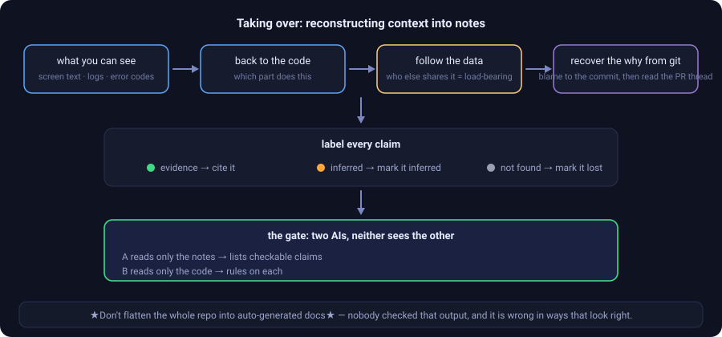

# Taking over a project with no notes

[← back to the README](../README.en.md) · [繁體中文](接手舊專案.md)

You've inherited a project that's **already running and has not one note** — an old company system, or something you vibe-coded for a month.

**First, what not to do: don't flatten the whole repo into a batch of auto-generated docs.** Nobody checked that output, and when it's wrong it looks exactly like it's right — which is worse than having nothing, because the next person will believe it.

The right way is a path with a check at the exit:

  

---

## The three things that actually matter

**1. Don't fill it all in at once.**

Search first — **use what's there; complete what's partial; only write a new note when there isn't one.**

The notes grow along the parts you actually touch. You don't need a document covering the whole system. You need the few areas this change touches to have clear context.

**2. Label the source of every claim.**

That's the middle row of the diagram. There's a mechanical check on it, and **inventing a story from the current state is forbidden** — a note that sounds plausible but nobody verified is worse than a blank.

**3. Don't skip the gate at the exit.**

Reconstruction isn't finished when you stop writing. Send in two AIs that can't see each other's work: one reads **only the notes** and lists every checkable claim; the other reads **only the code** and rules on each one. **You're done when those two agree.**

---

## When it pays off most

**Don't reconstruct for its own sake.** The best moment is **when you're adding a feature that will touch the old parts**.

Reconstruct the areas that feature will touch, then build on top of those notes. What the reconstruction produces — who else shares this code, and which behaviours look like contracts — becomes the guard rail for the new work. You don't break the architecture and you don't rebuild what's already there.

---

## Where the step-by-step lives

- **The full seven steps**: `skills/lumos-project-notes`, `reference.md`, the "node reconstruction (brownfield cold start)" section
- **Quick lookup**: `commands/09-節點還原.md`
- **Design context and audit history**: `docs/lumos-toolchain-knowledge/Projects/節點還原SOP_計劃.md`
