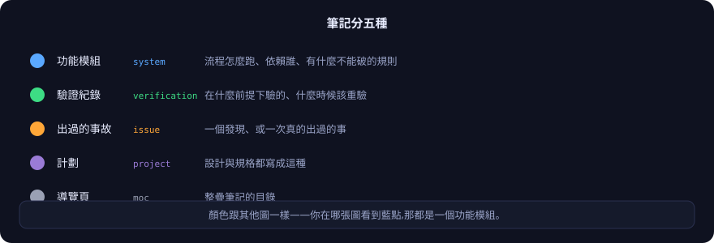
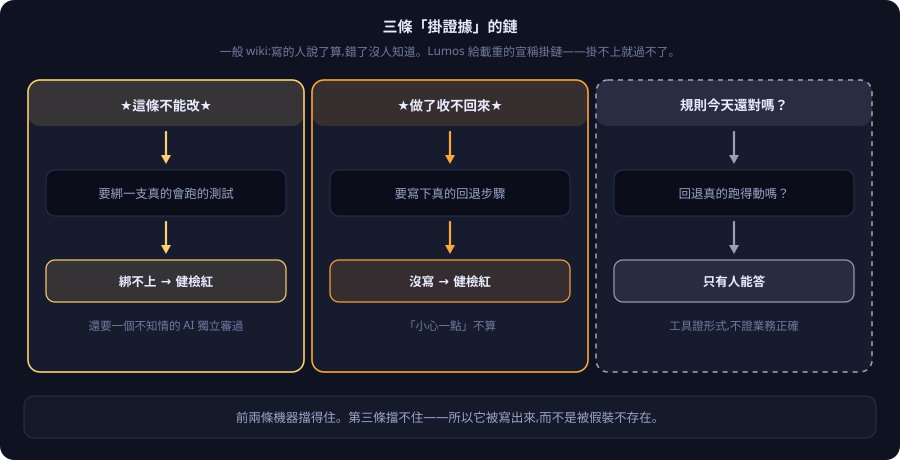
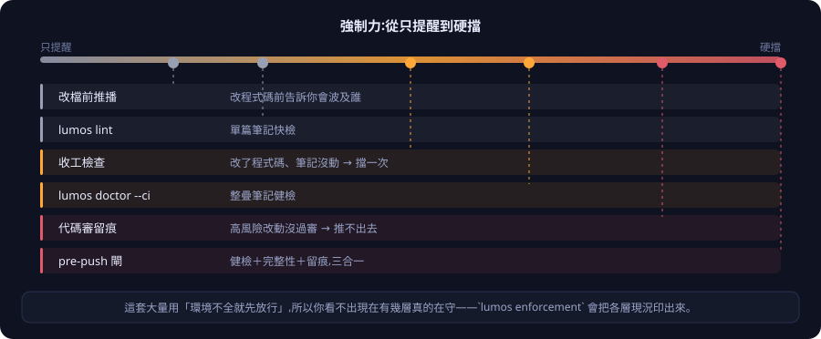
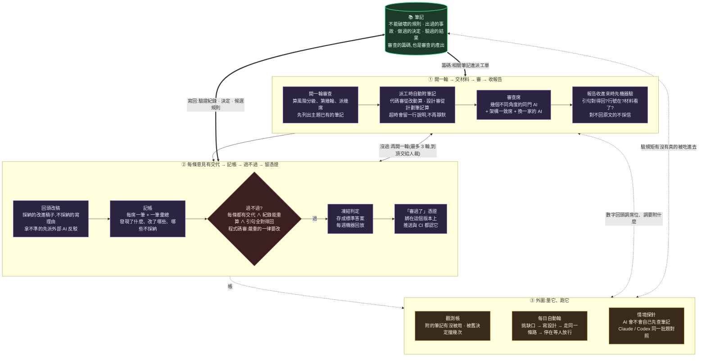

# 心智模型與機制

[← 回 README](../README.md) · [English](mental-model.md)

這份寫給「已經決定要用、想知道它到底怎麼運作」的人。README 講了為什麼；這裡講內部長什麼樣、哪一道檢查擋什麼、哪些事工具證得了、哪些只有人能答。

---

## 一、整套想法，四句話

1. **筆記是「當初為什麼」的真相來源。**
   但「現在實際跑成什麼樣」的權威是測試和正式環境。兩邊打架時**不自動信筆記**——查清哪邊錯了，然後記一筆事故。

2. **先讀再動。**
   要動既有系統，第一個動作是查筆記，不是 grep。筆記先給你邊界和地雷，程式碼拿來印證細節。

3. **退場寫回。**
   做完當場把決策和驗證結果寫回去。趁你還是目擊者的時候寫——別留給日後的人當考古學家。

4. **提交時強制。**
   上面三條靠自覺一定會爛。所以提交前的檢查硬擋「改了程式碼卻沒動筆記」。

---

## 二、筆記分五種

<p align="center">
  
</p>

每篇開頭有幾行帶前綴的摘要：`FLOW:`（流程）`KEY:`（關鍵事實）`DEP:`（依賴誰）`TEST:`（測試狀態）`DECISION:`（決策）。

**設計目的是只讀開頭就能掌握全貌**，不用讀完整篇。大的節點先看壓縮視圖（`lumos context <節點> --brief`，合約行照樣放在最上面），要全文再展開。

---

## 三、三條「掛證據」的鏈

一般 wiki 的問題很簡單：**寫的人說了算，錯了沒人知道。**

Lumos 的做法是給「重話」掛上鏈——你講得越重，要掛的證據越硬。

<p align="center">
  
</p>

寫出來長這樣：

```
KEY:★INVARIANT★ <改了會壞的業務規則>  [test:測試方法名] [audit:模型/日期]
KEY:★IRREVERSIBLE★ <收不回:例如正式環境的資料庫遷移>  [rollback:decisions]
KEY:★CHECKPOINT★   <改了難救:例如部署到測試機>
KEY:★DEBT★         <已知只是剛好長這樣,可以改>
```

三件事要記住：

- **拿不準是不是合約？就不要標。** 嚴禁看著程式碼反推「這應該是規則吧」——那是把現狀寫成規則，最容易騙到下一個人。
- **沒標「不可逆」就等於可逆**，放手改。
- **第三條鏈掛不上證據，這是設計，不是疏漏。** 「這條規則今天還符不符合業務」「那個回退步驟真的跑得動嗎」——工具答不了，所以它被明白寫出來，而不是被假裝不存在。

---

## 四、強制力：從只提醒到硬擋

<p align="center">
  
</p>

**越往右擋得越死，但也發生得越晚。** 左邊那幾層是為了讓你在還便宜的時候就發現問題。

這套大量用 **fail-open**——環境不全就先放行，CI 當後盾。好處是治理工具一壞不會全公司卡住；副作用是**你看不出現在到底有幾層真的在守**。

```bash
lumos enforcement
```

它把各層現況查一遍、印一行「幾層生效」。**注意它查的是接線，不是判得對不對。** 本機測不到的遠端設定（例如 GitHub 的必過檢查）誠實列 unknown，不假裝有。

---

## 五、開頭那幾行欄位，用指令改別手打

筆記開頭的結構化欄位（狀態、連結、決策）一律用指令寫——指令會自動排版，而且寫完會自己檢查一遍：

```bash
lumos set <節點> <欄位> <值>
lumos append <節點> related "[[X]]"
lumos decision-add <節點> "<內容>" --decided 日期
```

**手改最常見的坑：多個連結擠在同一行。** 那會長出「幽靈節點」——圖上多一個不存在的東西，而且不容易發現。

---

## 六、審查迴圈實際跑什麼

README 講了循環的四個階段；這張圖是每個階段底下實際發生的事。



Claude Code 與 Codex CLI 走同一條路。裝一次接兩家，收工行為一致。

---

## 七、四條設計原則

- **零依賴** — 純 python 標準庫，CI 直接跑，不帶任何套件。
- **別治理過頭** — 只給重話掛鏈；軟提醒維持軟；不疊沒有對等價值的儀式。
- **誠實的天花板** — 工具證形式，不證業務正確。講不出的就明說講不出。
- **寫的人不能自己當裁判** — 沒有標準答案的判斷，交給不知情的獨立 AI。
