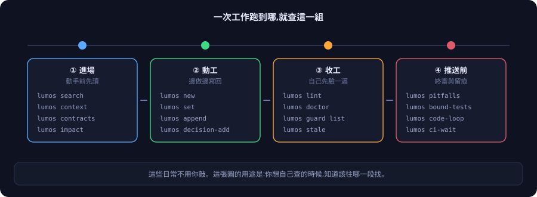

# 指令參考

[← 回 README](../README.md) · [English](command-reference.md)

> **先講一件事：這些指令你日常不用敲。**
>
> Lumos 的用法是**自然對話**——你照平常的方式跟 Claude Code 或 Codex 講話，它會自己決定什麼時候該查、什麼時候該寫回。安裝時已經把這張路由表注入 `CLAUDE.md` / `AGENTS.md`，另外掛了五個自動觸發的檢查。
>
> 這份文件的用途只有兩個：**你想自己查的時候查得到；你想知道 AI 在背後做了什麼。**

<p align="center">
  
</p>

零依賴的 python 指令，67 個頂層命令。**權威清單以 `lumos --help` 為準**，這裡只列日常會碰到的。

---

## ① 進場：動手前先讀

```bash
lumos search <關鍵字>             # 全文搜尋,相關性排序
lumos context <節點> [--brief]    # 這篇＋鄰居的壓縮視圖,合約放最上面
lumos contracts [<節點>]          # 合約總表:哪些不能改、綁了什麼測試
lumos impact --file <檔>          # 改這個檔會波及哪些筆記、踩過什麼雷
```

> **中文查詢：概念之間加空白。**
> `lumos search "作廢 收回 點數"` ✅
> `lumos search "作廢訂單點數怎麼收回"` ❌ ——整串會被當片語比對，黏成一串幾乎必定 0 筆。

**0 筆不代表沒記。** 看「逐詞覆蓋」裡哪個詞是 0，換同義詞再查；換三次還不到再問人。

其他讀的指令：

```bash
lumos decisions <節點>            # 這裡做過哪些決策、翻案了沒
lumos map <節點>                  # 鄰域樹
lumos links / backlinks / recent / stats
lumos query --tag <家族/值> [--active] [--linked <節點>]
lumos stale --candidate --match <關鍵字>   # 哪些驗證該重驗了
```

---

## ② 動工：邊做邊寫回

```bash
lumos new system|issue|project|verification <名稱>   # 建新筆記骨架
lumos set <節點> <欄位> <值>                          # 改狀態等單值欄位
lumos append <節點> related|verified_by|... "[[X]]"   # 加連結(一次一項)
lumos decision-add <節點> "<內容>" --decided 日期      # 記決策
```

**每一支都會寫完自驗。** 別手改開頭的結構化欄位——最常見的坑是多個連結擠在同一行，會長出「幽靈節點」。

合約與驗證那組：

```bash
lumos guard list [--unbound]     # 哪些合約還沒綁測試
lumos guard scaffold / bind / audit    # 產測試骨架 → 綁定 → 獨立審計
lumos guard kill <節點>          # 殺傷力驗證:沙盒裡真的弄壞它,看測試會不會翻紅
lumos signoff <節點> --note ".." # 業務簽核留痕(工具答不了的那一半)
lumos spec-trace <計劃節點>       # 計劃裡的條款,哪些還沒被驗證紀錄認領
```

---

## ③ 收工：自己先驗一遍

```bash
lumos lint <節點>                # 單篇快檢
lumos doctor [--ci]              # 整疊筆記健檢(--ci 會擋)
lumos enforcement                # 每一層防護有沒有接上(查接線,不判對錯)
lumos gov [<節點>]               # 本機流水帳:誰被哪道關卡攔過
```

**治理事件帳**：每道關卡攔了誰、誰繞過了什麼，都落在**本機**的流水帳裡——不進 git、不上傳。

```bash
lumos gov                # 全部關卡事件的時間軸
lumos gov OrderService   # 這個節點被哪幾道關攔過、硬擋還是提醒
```

用途是**開發時的可見性**（哪裡一直在響＝哪裡該處理），不是稽核合規文件。

---

## ④ 推送前：終審與留痕

```bash
lumos pitfalls --diff <範圍>     # 算這批改動的風險級(standard / high)
lumos bound-tests --diff <範圍>  # 這次碰到的硬合約,把它們綁的測試真跑一次
                                 # 紅了是要修測試,不是補審查留痕
lumos code-loop check|pass|skip  # 高風險改動的代碼審留痕(push 前會查)
lumos loop status <編號>         # 設計/代碼審迴圈的收斂判定
lumos testmap affected --diff .. # 依改動推薦該跑哪些測試(建議性質)
lumos anchor verify|approve      # 測試/檢查檔的防篡改指紋
lumos ci-wait / ci-status        # push 後等 CI 結果 / 查上次結果
```

CI 狀態用 `lumos ci-wait`，不要用 `gh run list`——結果要進治理帳。

---

## 裝與卸：一一對稱

```bash
lumos bootstrap   # 一鍵全裝        ↔  lumos teardown   # 一鍵全拆
lumos install     # 只裝機器層      ↔  lumos uninstall
lumos init        # 只建專案層      ↔  lumos deinit [--keep-graph] [--dry-run]
lumos update      # 刷新本專案內的工具組
```

**拆哪一層記這句：** 整台機器一次拆＝`teardown`；只拆這個 repo＝`deinit`；只移全域指令＝`uninstall`。

**筆記永遠保留。** `teardown` 不碰筆記檔案；`deinit` 預設互動確認，可以 `--dry-run` 先預演。

**更新**：給 AI 看的手冊和全域指令，對 Lumos 目錄 `git pull` 就即時生效（那是捷徑連結）；某個專案裡的工具組，在那個專案跑 `lumos update`——筆記資料不會被動到。
