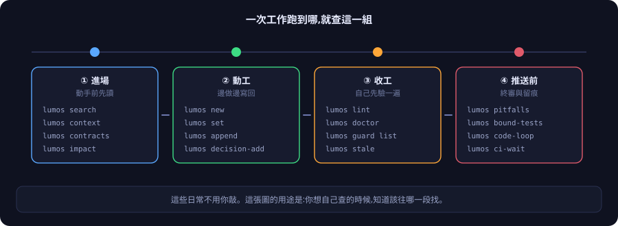

# 指令參考

[← 回 README](../README.md) · [English](command-reference.md)

> **先講一件事：這些指令你日常不用敲。**
>
> Lumos 的用法是**自然對話**——你照平常的方式跟 Claude Code 或 Codex 講話，它會自己決定什麼時候該查、什麼時候該寫回。安裝時已經把這張路由表注入 `CLAUDE.md` / `AGENTS.md`，另外掛了五個自動觸發的檢查。
>
> 這份文件的用途只有兩個：**你想自己查的時候查得到；你想知道 AI 在背後做了什麼。**

<p align="center">
  
</p>

零依賴的 python 指令，八十多個頂層命令。**權威清單以 `lumos --help` 為準**，這裡只列日常會碰到的。

---

## ① 進場：動手前先讀

```bash
lumos search <關鍵字>             # 全文搜尋,相關性排序
lumos context <節點> [--brief]    # 這篇＋鄰居的壓縮視圖,合約放最上面
lumos contracts [<節點>]          # 合約總表:哪些不能改、綁了什麼測試
lumos impact --file <檔>          # 改這個檔會波及哪些筆記、踩過什麼雷
```

> **中文查詢：概念之間加空白。**
> `lumos search "作廢 收回 點數"` ✅
> `lumos search "作廢訂單點數怎麼收回"` ❌ ——整串會被當片語比對，黏成一串幾乎必定 0 筆。

**0 筆不代表沒記。** 看「逐詞覆蓋」裡哪個詞是 0，換同義詞再查；換三次還不到再問人。

其他讀的指令：

```bash
lumos decisions <節點>            # 這裡做過哪些決策、後來有沒有被推翻
lumos map <節點>                  # 鄰域樹
lumos links / backlinks / recent / stats
lumos query --tag <家族/值> [--active] [--linked <節點>]
lumos stale --candidate --match <關鍵字>   # 哪些驗證該重驗了
```

---

## ② 動工：邊做邊寫回

```bash
lumos new system|issue|project|verification <名稱>   # 建新筆記骨架
lumos set <節點> <欄位> <值>                          # 改狀態等單值欄位
lumos append <節點> related|verified_by|... "[[X]]"   # 加連結(一次一項)
lumos decision-add <節點> "<內容>" --decided 日期      # 記決策
lumos summary-line <節點> "<舊片段>" "<新片段>"        # 改摘要裡的一行,不用手改開頭欄位
```

**每一支寫完都會自己檢查一遍。** 別手改開頭的結構化欄位——最常見的坑是多個連結擠在同一行，會長出「幽靈節點」。

合約與驗證那組：

```bash
lumos guard list [--unbound]     # 哪些合約還沒綁測試
lumos guard scaffold / bind / audit    # 產測試骨架 → 綁定 → 獨立審計
lumos guard kill <節點>          # 殺傷力驗證:沙盒裡真的弄壞它,看測試會不會翻紅
lumos signoff <節點> --note ".." # 業務簽核留下紀錄(工具答不了的那一半)
lumos spec-trace <計劃節點>       # 計劃裡的條款,每條綁了測試沒(綁了/靠人/未標/懸空;舊制認領欄照印)
lumos spec-gate <計劃節點>        # 設計寫完先過:條款句式、綁定、回退節(擋);綁的測試真跑一次:風險低時紅綠是放行條件(不符就擋),風險高只印不擋;相依功能的合約測試紅一律擋
```

測試品質那組(唯讀掃描與收證,不裁決業務答案):

```bash
lumos test-quality capabilities                 # 先看實際接入了哪些語言與證據格式
lumos test-quality scan <測試檔或目錄> [--json]  # 找自己比自己、重抄實作這類可疑寫法;零候選不代表測試有用
lumos test-quality capture …                    # 明示執行可信本機測試,保存 JUnit 與來源快照(不提供沙盒)
lumos test-quality check <原版> <故障版> <還原版> --target <類別::測試名>   # 核對三份 capture 收據:原版綠、故障版目標斷言紅、還原後綠
```

---

## ③ 收工：自己先驗一遍

```bash
lumos lint <節點>                # 單篇快檢
lumos doctor [--ci]              # 整疊筆記健檢(--ci 會擋)
lumos enforcement                # 每一層防護有沒有接上(查接線,不判對錯)
lumos gov [<節點>]               # 本機流水帳:誰被哪道關卡攔過
lumos updated-sync --stale [--dry-run]   # doctor 說開頭 updated 落後時,一次改成今天(先 --dry-run 看)
lumos events [--session <編號>]          # 這幾場 Claude 會談做了什麼(事件帳,唯讀)
```

筆記跟狀態對不上(漂移)那組:

```bash
lumos drift scan [--json]        # 健檢整份圖譜跟狀態對不上的地方,產待修清單(不擋、不寫帳)
lumos drift fix <節點> <行號> --kind <種類> [--dry-run]    # 照 scan 清單用工具改掉一筆(c1–c6、count);改完跟修復帳一起提交
lumos drift fix <Issue> <行號> --kind c2 --close --status <結案值> --reason "…"   # 結 Issue;摘要還有待定決策或沒處理的回頭條件會先擋
lumos drift ack <節點> <行號> --kind <種類> --reason "…"   # 確定照留就表態(要提交才算);--kind reread 給回頭重讀點出的規則行
```

**這幾個只列出、不擋，看到時順手處理：**

```bash
lumos set <節點> revalidate_when …    # 改了什麼時候要重驗:列出別篇連到這篇、講到它的句子,附改完的清單對照
lumos set <Issue> status <結案值>      # 列出摘要裡還寫待定的決策行、還沒處理的回頭條件(用 drift fix --kind c2 --close 結案才擋)
lumos note-shape --staged             # 提交前掛鉤跑的那道(新寫程式行號、沒來源的現況描述它會擋);這幾項只提醒:一行綁多支測試要拆開;數量句要掛標記;更正括號別用「第 N 項」
```

**`lumos doctor` 也會順帶列出**：指向別篇、但那篇已經沒有那條回頭條件的句子；列撤除候選時，只掛 `[manual:]` 條款的計劃也看。

**派審查員時**：會談開在另一個專案、範圍裡的提交在這邊找不到這類算不出影響範圍的情況，Claude 的派工掛鉤會在派工詞尾端講一聲；範圍格式寫錯不在此列。

**治理事件帳**：每道關卡攔了誰、誰繞過了什麼，都落在**本機**的流水帳裡——不進 git、不上傳。

```bash
lumos gov                # 全部關卡事件的時間軸
lumos gov OrderService   # 這個節點被哪幾道關攔過、硬擋還是提醒
```

用途是**開發時的可見性**（哪裡一直在響＝哪裡該處理），不是稽核合規文件。

---

## ④ 推送前：終審與留下紀錄

```bash
lumos pitfalls --diff <範圍>     # 算這批改動的風險級(standard / high)
lumos bound-tests --diff <範圍>  # 這次碰到的硬合約,把它們綁的測試真跑一次
                                 # 紅了是要修測試,不是補審查留下紀錄
lumos code-loop check|pass|skip  # 高風險改動的代碼審留下紀錄;check 同時跑表態閘(push 前會查)
lumos code-loop dispositions <檔> [--branch <名>]  # 推送前對觸發到的棧別效能檢核題逐題表態(樣板:lumos pitfalls --diff <範圍> --dispositions-template --carry)
lumos code-loop recall-miss <id> --note "…"  # 審查席抓到「對得上某未觸發題」的問題時登記一筆
lumos loop status <編號>         # 設計/代碼審迴圈的收斂判定
lumos loop fix-check <編號> --round rN   # 代碼審修完、派下一輪前:驗修正紀錄與修後測試(只提醒;約 5 分鐘,背景跑)
lumos loop cap-decision <編號> --decision extra-round|accept-risk --note "…"   # 跑滿上限沒過:記人裁(破例再開一輪或接受風險)
lumos loop retro <編號> --template --write | --check | --record | --skip --note "…"   # 記了人裁、繼續之前寫跑滿回顧
lumos loop escape <編號> --stage … --severity … --desc "…"   # 放行後下游抓到可歸因的缺陷,記一筆逃逸帳(--list 看全帳)
lumos lint-waive <指紋> --note "…"   # 新增告警閘擋下的是誤報:附理由放行、留痕(--list 看放行過什麼)
lumos note-audit reread-prepare --diff A..B --orchestrator claude|codex   # 回頭重讀:每篇要重讀的守檔筆記出一份給判定者的項目檔
lumos note-audit reread-record --prepared <項目檔> --report <報告>        # 判定者交回後記成對照紀錄(要提交才算)
lumos note-audit reread-check --diff A..B [--gate]   # 推送前掛鉤帶 --gate 照 note_reread.gate 擋;CI 與手動不帶,只印
lumos testmap affected --diff .. # 依改動推薦該跑哪些測試(建議性質)
lumos anchor verify|approve      # 測試/檢查檔的防篡改指紋
lumos ci-wait / ci-status        # push 後等 CI 結果 / 查上次結果
```

CI 狀態用 `lumos ci-wait`，不要用 `gh run list`——結果要進治理帳。

---

## 專案開關

寫在專案的 `.lumos/config.json`。這張表是各開關的彙整，預設與值以這裡為準；有幾個開關的使用情境另寫在 skill 手冊的對應章節。改了記得提交：多數檢查讀的是被推那個提交裡的版本，但 `lint_new`、`stack_questions` 讀工作目錄那份（只改沒提交時，本機照新值、CI 照提交裡的舊值），提交時跑的 `note_lint` 也讀工作目錄。沒寫就用下表的預設；寫壞了（讀不成 JSON、值看不懂）會講一句，多半退回預設，`note_lint.gate` 看不懂時改用 on。

| 開關 | 管什麼 | 值 | 沒寫時 |
| --- | --- | --- | --- |
| `drift_check.gate` | 推送前的舊說法與漂移檢查（`drift check`） | block / warn / off | block |
| `drift_check.old_sentence` | 其中「名稱或路徑消失了、筆記還在提」那項 | block / warn / off | 照 `drift_check.gate` |
| `drift_check.retire` | 其中「RULE 的撤除條件成立了」那項 | block / warn / off | 照 `drift_check.gate` |
| `note_reread.gate` | 回頭重讀（只有本機推送前會擋，CI 只提醒） | block / warn / off | block |
| `note_shape.gate` | 筆記寫法：新寫的程式行號、沒寫來源的現況描述 | block / warn / off | block |
| `note_shape.test_refs` | 碰到的筆記綁的測試要指得到真測試 | block / warn / off | warn |
| `note_shape.slots` | 摘要行前綴的必有格子（要專案先在提交掛鉤啟用 `--slots` 才檢查，見 [07 安裝維運](../skills/lumos-project-notes/commands/07-安裝維運.md)；也受 `note_shape.gate` 管） | block / warn / off | block（啟用後） |
| `node_home.gate` | 每支程式檔要有管它的筆記（檔案歸屬） | on / warn / off | on |
| `lint_new.gate` | 新增的 linter 告警 | block / warn / off | block |
| `stack_questions.gate` | 推送前對技術棧效能題逐題表態 | all / high-only / off | all |
| `note_shape.negation` | 提交時提醒新寫的否定現況句改成回頭條件（也受 `note_shape.gate` 管，總開關 off 時一起關） | warn / off | warn |
| `note_shape.tag_hints` | 提交時提醒摘要行前綴的寫法（也受 `note_shape.gate` 管） | warn / off | warn |
| `note_shape.close_summary` | 筆記狀態改成收尾值、摘要卻一字沒動時提醒（也受 `note_shape.gate` 管） | warn / off | warn |
| `note_shape.wording` | 提交時提醒新寫句子的寫法：一行綁多支測試、數量句等（也受 `note_shape.gate` 管） | warn / off | warn |
| `note_audit.gate` | 筆記內容審（`note-audit check`；推送前掛鉤要接上這個指令才會擋，本工具鏈自己的掛鉤沒接） | block / warn / off | block |
| `note_lint.gate` | 筆記欄位的新規則（提交時的單篇快檢） | on / warn / off | warn |

改程式沒動筆記、連結斷掉、高風險改動沒有審查紀錄、測試或掛鉤檔被改過卻沒重新核可（`lumos anchor`）、找不到 Python 3.14，這些沒有開關。

---

## 裝與卸：一一對稱

```bash
lumos bootstrap   # 一鍵全裝        ↔  lumos teardown   # 一鍵全拆
lumos install     # 只裝機器層      ↔  lumos uninstall
lumos init        # 只建專案層      ↔  lumos deinit [--keep-graph] [--dry-run]
lumos update      # 刷新本專案內的工具組
lumos update --dry-run   # 先預覽會改哪些規範檔與工具檔(不拉來源、不改動)
```

**拆哪一層記這句：** 整台機器一次拆＝`teardown`；只拆這個 repo＝`deinit`；只移全域指令＝`uninstall`。

**筆記永遠保留。** `teardown` 不碰筆記檔案；`deinit` 預設互動確認，可以 `--dry-run` 先預演。

**更新**：給 AI 看的手冊和全域指令，對 Lumos 目錄 `git pull` 就即時生效（那是捷徑連結）；某個專案裡的工具組，在那個專案跑 `lumos update`——筆記資料不會被動到。
