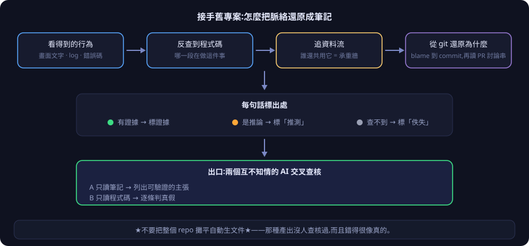

# 接手一個沒有筆記的舊專案

[← 回 README](../README.md) · [English](taking-over.md)

你接手一個**已經在跑、但一篇筆記都沒有**的專案——公司的舊系統，或是自己 vibe 了一個月的東西。

**先講不要做什麼：不要把整個 repo 攤平、自動生一批文件。** 那種產出沒有人查核過，而且它錯的時候看起來很像對的——比沒有筆記更危險，因為下一個人會信它。

正確的做法是照著一條有出口檢查的路走：

  

---

## 三件真正重要的事

**① 不要一次補完。**

進場先查——**有就照著用；殘缺就補；沒有才產一篇。**

筆記沿著「實際被動過的地方」慢慢長。你不需要一份涵蓋整個系統的完整文件，你需要的是「這次要動的那幾塊，脈絡是清楚的」。

**② 每句話都要標出處。**

上圖中間那一排就是這件事。有機械檢查在把關，**嚴禁看著現狀編故事**——「聽起來很合理但沒人驗過」的筆記，比空白還糟。

**③ 出口那道閘不能省。**

還原完不算完成。要派兩個互不知情的 AI：一個只讀筆記、列出裡面所有可以驗證的主張；另一個只讀程式碼、逐條判真假。**對完才算還原完成。**

---

## 什麼時候做最划算

**不要為了還原而還原。** 最好的時機是**你要加新功能、而它會碰到舊東西的時候**。

先還原會碰到的那幾個關聯面，新功能踩在這些筆記上開發。還原產出的「誰還共用這塊」和「哪些看起來是合約」，直接變成新功能的護欄——不破壞架構、不重造輪子。

---

## 逐步操作在哪

- **七步全文**：`skills/lumos-project-notes` 的 `reference.md`，〈節點還原（brownfield 冷啟動）〉那一節
- **快查表**：`commands/09-節點還原.md`
- **設計脈絡與審計史**：`docs/lumos-toolchain-knowledge/Projects/節點還原SOP_計劃.md`
